# Front Matter {#book-front-matter}

## README.md {#book-readmemd}

# Podman Zero-to-Expert Course {#readme-podman-zero-to-expert-course}

This is a course-in-a-repo for taking a learner from zero container knowledge to running rootless Podman services with systemd (Quadlet), with strong security and troubleshooting fundamentals.

[](LICENSE.md)
[](https://access.redhat.com/products/red-hat-enterprise-linux)
[](https://podman.io)


## Table of Contents {#readme-table-of-contents}

- [How To Use This Repo](#readme-how-to-use-this-repo)
- [Structure](#readme-structure)
- [Safety](#readme-safety)
- [Conventions](#readme-conventions)
- [Suggested Pacing](#readme-suggested-pacing)
- [License](#readme-license)

## How To Use This Repo {#readme-how-to-use-this-repo}

- Read the modules in `modules/` in order.
- Do the labs as you go; each module includes a small checklist.
- Keep everything rootless unless the module explicitly says otherwise.

[^ Go to TOC](#readme-table-of-contents)

## Structure {#readme-structure}

- `COURSE_OUTLINE.md`: the full syllabus and learning goals
- `MODULES.md`: reading order
- `modules/`: lesson content (Markdown)
- `cheatsheets/`: quick references (see below)
- `examples/`: example YAML and unit files
- `ASSESSMENTS.md`: practical exams and rubrics (Exam A after Module 10, Exam B after the capstone)
- `GLOSSARY.md`: terms used across the modules
- `FAQ.md`: common gotchas and fast fixes

Module numbering:

- `00`–`14`: the core sequence, read in order.
- `11a`: an add-on to Module 11 (secrets with Quadlet + systemd).
- `80`: the capstone project; `90`: an optional elective/survey. The gaps are intentional — they separate the core sequence from the capstone and electives.

Suggested path:

- Start with `modules/00-setup.md`
- Continue in numeric order
- After Module 10, sit Exam A in `ASSESSMENTS.md`
- After Module 80, sit Exam B
- Keep `GLOSSARY.md` open when a term is new

Cheatsheets (use alongside the modules, and as a post-course reference):

- [`cheatsheets/podman-cli.md`](cheatsheets/podman-cli.md): everyday `podman` commands (pairs with Modules 02–03)
- [`cheatsheets/rootless.md`](cheatsheets/rootless.md): rootless-specific paths, ranges, and gotchas (Modules 00–01, 05–06)
- [`cheatsheets/quadlet.md`](cheatsheets/quadlet.md): Quadlet unit keys and systemd workflow (Modules 11/11a, 14)
- [`cheatsheets/security.md`](cheatsheets/security.md): hardening flags and SELinux labels (Module 12)
- [`cheatsheets/troubleshooting.md`](cheatsheets/troubleshooting.md): symptom -> diagnosis -> fix tables (Module 13)

[^ Go to TOC](#readme-table-of-contents)

## Safety {#readme-safety}

- Prefer rootless Podman.
- Never put secret material in images, unit files, or logs.
- If you are on a shared system, treat this repo's lab values as examples only.

[^ Go to TOC](#readme-table-of-contents)

## Conventions {#readme-conventions}

- Secrets are delivered as files mounted at runtime (not environment variables).
- Production baseline uses rootless Podman + systemd user services (Quadlet-first).

[^ Go to TOC](#readme-table-of-contents)

## Suggested Pacing {#readme-suggested-pacing}

See `COURSE_OUTLINE.md` for rough time estimates per module.

[^ Go to TOC](#readme-table-of-contents)


# License {#readme-license}

This project is licensed under the
Creative Commons Attribution-NonCommercial-ShareAlike 4.0 International (CC BY-NC-SA 4.0).

https://creativecommons.org/licenses/by-nc-sa/4.0/

[^ Go to TOC](#readme-table-of-contents)

© 2026 UncleJS — Licensed under CC BY-NC-SA 4.0

\newpage

## COURSE_OUTLINE.md {#book-course_outlinemd}

# Course Outline {#outline-course-outline}
[](./LICENSE.md)
[](https://access.redhat.com/products/red-hat-enterprise-linux)
[](https://podman.io)

Goal: take an absolute beginner to an operator who can build, run, secure, and troubleshoot rootless Podman workloads, including systemd (Quadlet) production patterns.


## Table of Contents {#outline-table-of-contents}

- [Modules](#outline-modules)
- [Suggested Pacing (Rough Estimates)](#outline-suggested-pacing-rough-estimates)

Assumptions:

- Learners have basic command line familiarity by the end of Module 2.
- Labs target Fedora/RHEL-like systems with systemd. Where commands differ across distros, modules call it out.

[^ Go to TOC](#outline-table-of-contents)

## Modules {#outline-modules}

0. Setup (install, rootless prerequisites, verification)
1. Containers 101 (images vs containers, OCI, rootless)
2. Everyday Podman commands (`run`, `exec`, `logs`, lifecycle)
3. Images and registries (tags vs digests, inspect, provenance basics)
4. Secrets (local-first with Podman secrets; rotation patterns)
5. Storage basics (volumes, bind mounts, permissions, SELinux notes)
6. Networking (ports, DNS, user-defined networks)
7. Pods and sidecars (Podman pods, shared network namespace)
8. Building images (Containerfiles, multi-stage, non-root)
9. Multi-service workflows (scripted, compose-ish patterns, `play kube` preview)
10. `podman play kube` (Kubernetes YAML locally, parity concepts; YAML secrets caveats)
11. Production baseline: systemd + Quadlet (rootless services, restart, upgrades; secrets add-on)
11a. Quadlet secrets add-on (runtime file secrets + rotation)
12. Security deep dive (capabilities, seccomp/SELinux, read-only FS)
13. Troubleshooting and ops (events, logs, journald, failure drills)
14. Maintenance and auto-updates (policy, `podman auto-update`, safe rollouts)
80. Capstone (Quadlet stack with secrets, backups, upgrades, rollback)
90. External secrets survey (thorough intro; optional implementation paths)

[^ Go to TOC](#outline-table-of-contents)

## Suggested Pacing (Rough Estimates) {#outline-suggested-pacing-rough-estimates}

These are rough time boxes for a first pass (reading + doing the labs).

- Module 0: 30-60 min
- Module 1: 30-45 min
- Module 2: 60-90 min
- Module 3: 60-90 min
- Module 4: 60-90 min
- Module 5: 60-90 min
- Module 6: 2-3 hours
- Module 7: 45-60 min
- Module 8: 2-3 hours
- Module 9: 60-90 min
- Module 10: 45-75 min, then Practical Exam A (`ASSESSMENTS.md`)
- Module 11: 2-3 hours
- Module 11a: 45-75 min
- Module 12: 60-120 min
- Module 13: 60-120 min
- Module 14: 45-75 min
- Module 80 (Capstone): 3-6 hours, then Practical Exam B (`ASSESSMENTS.md`)
- Module 90 (Survey): 45-90 min

[^ Go to TOC](#outline-table-of-contents)

© 2026 UncleJS — Licensed under CC BY-NC-SA 4.0

\newpage

## MODULES.md {#book-modulesmd}

# Modules (Reading Order) {#modules-modules-reading-order}
[](./LICENSE.md)
[](https://access.redhat.com/products/red-hat-enterprise-linux)
[](https://podman.io)


## Table of Contents {#modules-table-of-contents}

- [Reading Order](#modules-reading-order)
- [Quick References](#modules-quick-references)
- [Glossary and exams](#modules-glossary-and-exams)

## Reading Order {#modules-reading-order}

Numbering: `00`–`14` form the core sequence; `11a` is an add-on to Module 11; `80` is the capstone and `90` an optional elective — the gaps before them are intentional.

- `modules/00-setup.md`
- `modules/01-containers-101.md`
- `modules/02-everyday-commands.md`
- `modules/03-images-registries.md`
- `modules/04-secrets.md`
- `modules/05-storage.md`
- `modules/06-networking.md`
- `modules/07-pods.md`
- `modules/08-building-images.md`
- `modules/09-multiservice-workflows.md`
- `modules/10-play-kube.md`
- `modules/11-quadlet.md`
- `modules/11a-quadlet-secrets.md`
- `modules/12-security.md`
- `modules/13-troubleshooting.md`
- `modules/14-autoupdate.md`
- `modules/80-capstone.md`
- `modules/90-external-secrets-survey.md`

[^ Go to TOC](#modules-table-of-contents)

## Quick References {#modules-quick-references}

Cheatsheets to keep open while doing the labs:

- `cheatsheets/podman-cli.md` — everyday `podman` commands
- `cheatsheets/rootless.md` — rootless paths, ID ranges, gotchas
- `cheatsheets/quadlet.md` — Quadlet unit keys and systemd workflow
- `cheatsheets/security.md` — hardening flags and SELinux labels
- `cheatsheets/troubleshooting.md` — symptom -> diagnosis -> fix

[^ Go to TOC](#modules-table-of-contents)

## Glossary and exams {#modules-glossary-and-exams}

- `GLOSSARY.md` — terms (pasta, Quadlet, seccomp, AutoUpdate, and the rest)
- `ASSESSMENTS.md` — Exam A after Module 10, Exam B after Module 80. Checkpoints in each module stay ungraded.

[^ Go to TOC](#modules-table-of-contents)

© 2026 UncleJS — Licensed under CC BY-NC-SA 4.0

\newpage

# Modules {#book-modules}

\newpage

# Module 0: Setup (Fedora/RHEL + systemd) {#m00-module-0-setup-fedorarhel--systemd}
[](../LICENSE.md)
[](https://access.redhat.com/products/red-hat-enterprise-linux)
[](https://podman.io)


## Table of Contents {#m00-table-of-contents}

- [Learning Goals](#m00-learning-goals)
- [Why Fedora/RHEL and Why Rootless](#m00-why-fedorarhel-and-why-rootless)
- [Install](#m00-install)
- [cgroups v2 Check (Required)](#m00-cgroups-v2-check-required)
- [Rootless Prereqs](#m00-rootless-prereqs)
- [Understanding the User Namespace Setup](#m00-understanding-the-user-namespace-setup)
- [SELinux Quick Check (Fedora/RHEL)](#m00-selinux-quick-check-fedorarhel)
- [First Container](#m00-first-container)
- [Where Things Live (Rootless)](#m00-where-things-live-rootless)
- [Create a Course Workspace](#m00-create-a-course-workspace)
- [Recommended Shell Safety](#m00-recommended-shell-safety)
- [Linger — Boot Safety for User Services](#m00-linger--boot-safety-for-user-services)
- [Version Matrix and Compatibility Notes](#m00-version-matrix-and-compatibility-notes)
- [Checkpoint](#m00-checkpoint)
- [Quick Quiz](#m00-quick-quiz)
- [Further Reading](#m00-further-reading)

This course targets Fedora/RHEL-like systems with systemd, using rootless Podman.


[^ Go to TOC](#m00-table-of-contents)

## Learning Goals {#m00-learning-goals}

- Install Podman and verify basic functionality.
- Confirm your system supports rootless containers (subuid/subgid).
- Know where logs and state live for rootless Podman.
- Confirm cgroups v2 is enabled (required for Quadlet).
- Set up a lab workspace and a few safety defaults.
- Enable lingering for boot-safe user services.


[^ Go to TOC](#m00-table-of-contents)

## Why Fedora/RHEL and Why Rootless {#m00-why-fedorarhel-and-why-rootless}

This course makes three deliberate choices:

1. **Fedora/RHEL** — because they ship a production-grade Podman, cgroups v2 by default, and SELinux enforcement. The security model is coherent out of the box.

2. **Rootless Podman** — because running containers as an unprivileged user means a container escape does not give the attacker root on the host. It is the right default for servers and developer machines alike.

3. **systemd (Quadlet)** — because systemd is already the init system on RHEL/Fedora. Using it for container lifecycle means you get restart policies, log aggregation, and boot integration for free, without a container daemon running as root.

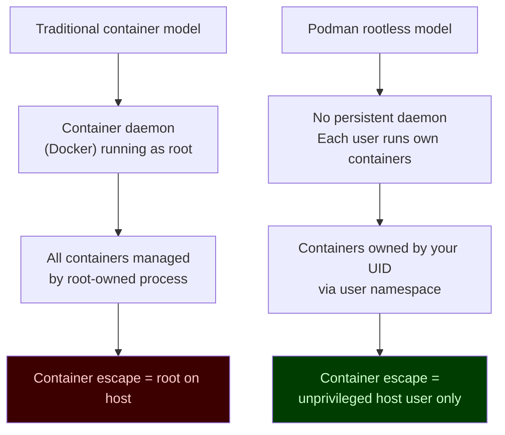


[^ Go to TOC](#m00-table-of-contents)

## Install {#m00-install}

**Fedora:**

```bash
sudo dnf install -y podman  # install Podman package
```

**RHEL 10 (package availability depends on subscription/repos):**

```bash
sudo dnf install -y podman  # install Podman package
```

**Verify the installation:**

```bash
podman --version  # print Podman version
podman info       # print Podman host configuration (storage, runtime, cgroups)
```

**Record your exact versions** — useful for debugging and for searching release notes:

```bash
podman --version                        # Podman version string
rpm -q podman 2>/dev/null || true       # RPM package version
rpm -q crun 2>/dev/null || true         # OCI runtime version
uname -r                                # kernel version
```

This course assumes **Podman 5** on RHEL 10 or current Fedora, with cgroups v2 (kernel >= 5.2). Podman 4.4 introduced Quadlet, but a 4.4 host still defaults rootless networking to slirp4netns. Podman 5 defaults to pasta. The version table later in this module is feature history, not the course baseline.


[^ Go to TOC](#m00-table-of-contents)

## cgroups v2 Check (Required) {#m00-cgroups-v2-check-required}

**Quadlet requires cgroups v2.** Without it, `systemctl --user daemon-reload` generates units that may fail to enforce resource limits.

**Check:**

```bash
podman info --format '{{.Host.CgroupsVersion}}'  # expected: v2
```

Expected output: `v2`

If you see `v1`:
- On RHEL 8 or older kernels, cgroups v2 may not be the default.
- You can enable it: add `systemd.unified_cgroup_hierarchy=1` to the kernel command line in GRUB and reboot.
- For this course, upgrading to RHEL 9/10 or Fedora >= 31 is the easier path.

**Verify at the kernel level:**

```bash
stat -fc %T /sys/fs/cgroup  # should print: cgroup2fs
```


[^ Go to TOC](#m00-table-of-contents)

## Rootless Prereqs {#m00-rootless-prereqs}

Rootless Podman uses Linux **user namespaces** to map UIDs inside containers to unprivileged UIDs on the host. This requires `/etc/subuid` and `/etc/subgid` entries for your user.

**Check your subuids/subgids:**

```bash
grep "^$USER:" /etc/subuid /etc/subgid  # show subuid and subgid entries for current user
```

Expected output (example):

```
/etc/subuid:myuser:100000:65536
/etc/subgid:myuser:100000:65536
```

If those are missing, create them (coordinate the range with your admin policy):

```bash
sudo usermod --add-subuids 100000-165535 --add-subgids 100000-165535 "$USER"  # grant subuid/subgid range
```

**Log out and back in** after updating subuids/subgids so the systemd user session picks up the new ranges. `newuidmap` reads `/etc/subuid` when a user namespace is created. If Podman storage was already initialized before those entries existed, also run:

```bash
podman system migrate  # rebuild storage mappings after a late subuid change
```

Verify the mapping is active:

```bash
podman unshare cat /proc/self/uid_map  # show UID mapping inside user namespace
```

A typical rootless map looks like this (your UID and subuid start will differ):

```
         0       1000          1
         1     100000      65536
```

Line 1: container UID 0 is your own UID. Line 2: container UID 1 and up come from `/etc/subuid`. Compare this to the diagram in the next section.


[^ Go to TOC](#m00-table-of-contents)

## Understanding the User Namespace Setup {#m00-understanding-the-user-namespace-setup}

When you run `podman run` as a non-root user:

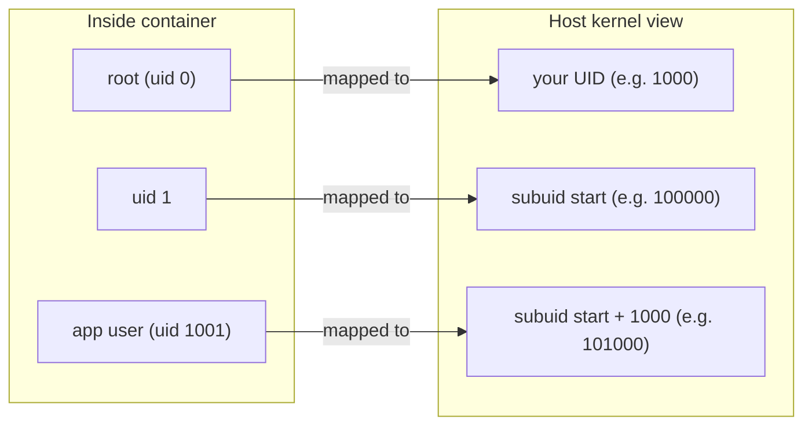

The container's `root (uid 0)` is mapped to **your** UID, not to the first subuid. Container UID 1 maps to the start of `/etc/subuid` (100000 in the example). Container UID 1001 maps to `subuid_start + 1000` (101000), because container UID 0 used the single slot for your own UID. This means:

- The container process has "root" privileges inside its namespace.
- On the host, that process runs as your unprivileged UID.
- Processes that are not UID 0 inside the container run as subordinate UIDs from `/etc/subuid`.
- Even if the container escapes, the attacker is still an unprivileged host user — not real root.

This is why `/etc/subuid` and `/etc/subgid` are security-critical configuration, not just administrative overhead.


[^ Go to TOC](#m00-table-of-contents)

## SELinux Quick Check (Fedora/RHEL) {#m00-selinux-quick-check-fedorarhel}

SELinux is usually enforcing on RHEL/Fedora. You do not need to understand the full policy model now, but you should be able to recognize when it affects your containers.

**Check SELinux mode:**

```bash
getenforce  # print SELinux mode: Enforcing, Permissive, or Disabled
```

**What this means for containers:**

| Mode | Effect on containers |
|---|---|
| Enforcing | SELinux labels are checked. Bind mounts need `:Z` or `:z`. |
| Permissive | SELinux denials are logged but not enforced. Containers work but you miss real denials. |
| Disabled | No SELinux. Not recommended in production. |

**Golden rules for this course:**

- Prefer **named volumes** over bind mounts — volumes are automatically labelled correctly.
- If you must use a bind mount, always add `:Z` (private) or `:z` (shared).
- Never disable SELinux to fix a container issue.

If you see `permission denied` errors that seem wrong, check for SELinux denials:

```bash
sudo ausearch -m avc -ts recent 2>/dev/null || sudo journalctl -b -t audit -g denied  # audit log is not readable rootless
```

An empty result means no recent AVC denials (or the audit daemon is not recording them). A rootless user cannot read the audit log, so `ausearch` without `sudo` fails even when denials exist.


[^ Go to TOC](#m00-table-of-contents)

## First Container {#m00-first-container}

Run a simple container to verify everything is working:

```bash
podman run --rm docker.io/library/alpine:latest uname -a  # run container, print kernel info
```

If this works, you have:

- Network access to pull images from Docker Hub.
- A working storage backend (`overlay` or `vfs`).
- A working OCI runtime (`crun` on RHEL/Fedora).
- A working user namespace setup.

**Verify the storage driver in use:**

```bash
podman info --format '{{.Store.GraphDriverName}}'  # should print: overlay
```

`overlay` is the preferred driver. `vfs` works but is slower and uses more disk space.

**Verify the OCI runtime:**

```bash
podman info --format '{{.Host.OCIRuntime.Name}}'  # should print: crun
```


[^ Go to TOC](#m00-table-of-contents)

## Where Things Live (Rootless) {#m00-where-things-live-rootless}

Understanding the directory layout helps you debug storage problems and know what to back up.

| Purpose | Path |
|---|---|
| Container image storage | `~/.local/share/containers/storage/` |
| Container runtime files | `/run/user/<uid>/containers/` |
| Quadlet unit files | `~/.config/containers/systemd/` |
| Podman secrets store | `~/.local/share/containers/storage/secrets/` |
| Podman config | `~/.config/containers/` |
| Registry auth (default) | `${XDG_RUNTIME_DIR}/containers/auth.json` |

The default auth file lives under `/run` and **does not survive reboot**. For a login that should persist, pass an explicit file:

```bash
podman login --authfile "$HOME/.config/containers/auth.json" docker.io  # persist credentials across reboot
```

**Logs:**

```bash
podman logs <name>                           # container stdout/stderr logs
journalctl --user -u <service>.service       # Quadlet/systemd-managed container logs
journalctl --user -b -n 100 --no-pager       # all user-session log entries this boot
```

**Check disk usage for container storage:**

```bash
podman system df  # show disk usage: images, containers, volumes
```


[^ Go to TOC](#m00-table-of-contents)

## Create a Course Workspace {#m00-create-a-course-workspace}

Pick a stable working directory for lab files:

```bash
mkdir -p ~/podman-labs  # create lab workspace
```

Set up a simple alias for the course repo (if cloned locally):

```bash
# Optional: keep a reference to your course repo
COURSE_REPO=~/course_podman   # path to the course git repo
```

You'll run most labs from this directory. Keep it tidy — label or prefix experiment containers so you can clean them up easily.


[^ Go to TOC](#m00-table-of-contents)

## Recommended Shell Safety {#m00-recommended-shell-safety}

These reduce accidents in lab environments:

```bash
set -o noclobber   # prevent overwriting existing files with > redirect
```

Use `set -euo pipefail` in lab scripts:

```bash
#!/usr/bin/env bash
set -euo pipefail  # exit on error, unset variable, or pipe failure
```

- `-e`: exit immediately on error (prevents silently continuing after a failure).
- `-u`: treat unset variables as errors.
- `-o pipefail`: catch failures inside pipelines (e.g., `cmd1 | cmd2`).

Do not apply `set -e` interactively — it can cause confusing session exits.


[^ Go to TOC](#m00-table-of-contents)

## Linger — Boot Safety for User Services {#m00-linger--boot-safety-for-user-services}

Systemd user sessions normally only run while a user is logged in. For a server that should run containers at boot (before login), enable **lingering**:

```bash
sudo loginctl enable-linger "$USER"  # allow user services to start at boot, without login
```

**Verify linger is enabled:**

```bash
loginctl show-user "$USER" | grep Linger  # expected: Linger=yes
```

Without linger: your Quadlet services start only when you SSH in.
With linger: your Quadlet services start at boot, before any login.

This is a one-time setup per user on each machine.


[^ Go to TOC](#m00-table-of-contents)

## Version Matrix and Compatibility Notes {#m00-version-matrix-and-compatibility-notes}

Different RHEL/Fedora versions shipped these features at different Podman releases. This table is **history**. This course assumes Podman 5, where all of them are present and rootless networking defaults to pasta:

| Feature | Minimum Podman version |
|---|---|
| Quadlet (`.container` units) | 4.4 |
| `podman secret` | 3.1 |
| `podman play kube` | 3.0 |
| `podman auto-update` | 3.2 |
| `podman pod` | 1.0 |
| Build secrets (`--secret`) | 3.0 (via Buildah) |
| Health checks in Quadlet | 4.5 |

Check your version:

```bash
podman --version  # print Podman version
```

If a lab step fails unexpectedly, check whether your version supports the feature before debugging further.


[^ Go to TOC](#m00-table-of-contents)

## Checkpoint {#m00-checkpoint}

- `podman info` runs without errors.
- `podman run --rm docker.io/library/alpine:latest uname -a` works rootless.
- `podman info --format '{{.Host.CgroupsVersion}}'` prints `v2`.
- `/etc/subuid` and `/etc/subgid` have entries for your user.
- `podman unshare cat /proc/self/uid_map` shows container UID 0 mapped to your UID.
- `getenforce` prints `Enforcing` or `Permissive` (not Disabled).
- You know where container images are stored (`~/.local/share/containers/storage/`).
- `loginctl show-user "$USER"` shows `Linger=yes` if this machine should start Quadlet services at boot.


[^ Go to TOC](#m00-table-of-contents)

## Quick Quiz {#m00-quick-quiz}

1) What does `podman unshare` do, and when would you use it?

2) You run `podman run --rm alpine echo hello` and get `permission denied` on a bind-mounted directory. What is the first thing to check on an RHEL system?

3) What two things must be true for Quadlet services to start at boot without a login?

4) Why is cgroups v2 required for Quadlet? What breaks with cgroups v1?

5) Your colleague says "I disabled SELinux so my containers work". What security risk did they introduce?


[^ Go to TOC](#m00-table-of-contents)

## Further Reading {#m00-further-reading}

- Podman install docs: https://podman.io/docs/installation
- Rootless Podman tutorial: https://github.com/containers/podman/blob/main/docs/tutorials/rootless_tutorial.md
- cgroups v2 (kernel docs): https://www.kernel.org/doc/html/latest/admin-guide/cgroup-v2.html
- `loginctl` (linger for user services): https://www.freedesktop.org/software/systemd/man/latest/loginctl.html
- SELinux with containers (RHEL docs): https://docs.redhat.com/en/documentation/red_hat_enterprise_linux/9/html/using_selinux/assembly_using-selinux-with-containers_using-selinux
- `subuid(5)` man page: https://man7.org/linux/man-pages/man5/subuid.5.html


[^ Go to TOC](#m00-table-of-contents)

© 2026 UncleJS — Licensed under CC BY-NC-SA 4.0

\newpage

# Module 1: Containers 101 {#m01-module-1-containers-101}
[](../LICENSE.md)
[](https://access.redhat.com/products/red-hat-enterprise-linux)
[](https://podman.io)


## Table of Contents {#m01-table-of-contents}

- [Learning Goals](#m01-learning-goals)
- [What Is a Container, Really?](#m01-what-is-a-container-really)
- [The Three Things To Get Right](#m01-the-three-things-to-get-right)
- [How `podman run` Works — Step by Step](#m01-how-podman-run-works--step-by-step)
- [Containers Are Not VMs](#m01-containers-are-not-vms)
- [Linux Namespaces — The Isolation Mechanism](#m01-linux-namespaces--the-isolation-mechanism)
- [cgroups — The Resource Accounting Mechanism](#m01-cgroups--the-resource-accounting-mechanism)
- [The OCI Standards](#m01-the-oci-standards)
- [Rootless vs Rootful](#m01-rootless-vs-rootful)
- [Terminology You Will See](#m01-terminology-you-will-see)
- [Lab: Compare Host vs Container](#m01-lab-compare-host-vs-container)
- [Lab: Namespace Exploration](#m01-lab-namespace-exploration)
- [Checkpoint](#m01-checkpoint)
- [Quick Quiz (Answer Without Running Commands)](#m01-quick-quiz-answer-without-running-commands)
- [Further Reading](#m01-further-reading)

---

## Learning Goals {#m01-learning-goals}

By the end of this module you will be able to:

- Explain what a container is in terms of kernel mechanisms (namespaces + cgroups), not just analogy.
- Distinguish an **image** from a **container**.
- Trace the lifecycle of `podman run` from CLI invocation to PID 1 inside the container.
- Articulate why containers are not VMs and what that means for security.
- Choose rootless Podman by default and explain the tradeoff.
- Use correct OCI terminology in conversation.

[^ Go to TOC](#m01-table-of-contents)

---

## What Is a Container, Really? {#m01-what-is-a-container-really}

A container is **a normal Linux process (or process tree) with extra kernel-enforced restrictions applied at launch time**.

That is all it is. There is no container hypervisor. There is no container kernel. Your container's PID 1 is just a process on the same Linux kernel as everything else on the machine — it simply has a restricted view of the world.

Those restrictions come from two kernel features:

1. **Namespaces** — limit what the process can *see* (other processes, network interfaces, filesystem mounts, hostnames, user IDs).
2. **cgroups** — limit what the process can *use* (CPU, memory, disk I/O, number of PIDs).

An image is the read-only recipe: a stack of filesystem layers plus metadata (entrypoint, environment variables, exposed ports, labels). A container is a *running instance* of an image — the image layers are used read-only, and a thin writable layer is placed on top for the lifetime of the container.

> **Analogy:** An image is a class definition. A container is an object instance. You can spin up a hundred containers from the same image, each with its own writable state, without modifying the image.

[^ Go to TOC](#m01-table-of-contents)

---

## The Three Things To Get Right {#m01-the-three-things-to-get-right}

### 1. Image — the immutable template {#m01-1-image--the-immutable-template}

- Built from a `Containerfile` (or pulled from a registry).
- Composed of ordered, read-only layers.
- Identified by a **tag** (mutable pointer) or a **digest** (immutable SHA256 hash).
- Never changes when you run it — all writes go to the container's writable layer.

### 2. Container — the running (or stopped) instance {#m01-2-container--the-running-or-stopped-instance}

A container adds to the image:

- A **process** (PID 1 and its children).
- A thin **writable layer** on top of the image layers (copy-on-write).
- **Mounts** — volumes, bind mounts, tmpfs, or secret files layered in.
- **Network settings** — IP address, DNS, published ports.
- **Environment variables** and runtime configuration.
- A **state machine**: `created -> running -> paused -> exited -> removed`.

### 3. Runtime boundaries {#m01-3-runtime-boundaries}

The container runtime (in Podman's case: `crun` by default) sets up:

- **Namespaces** — isolates the process's view of PIDs, network, mounts, UTS, IPC, users.
- **cgroups** — enforces resource limits.
- **seccomp** — filters which kernel syscalls are allowed (optional but recommended).
- **capabilities** — drops Linux capabilities the process does not need.
- **SELinux/AppArmor labels** — mandatory access control on Fedora/RHEL.

> **Critical mental model:** The kernel is always shared. A kernel exploit inside a container is a host exploit. Container security is about *reducing blast radius*, not achieving VM-grade isolation.

[^ Go to TOC](#m01-table-of-contents)

---

## How `podman run` Works — Step by Step {#m01-how-podman-run-works--step-by-step}

Understanding the lifecycle from CLI to PID 1 prevents a huge class of "why is my container doing this?" confusion.

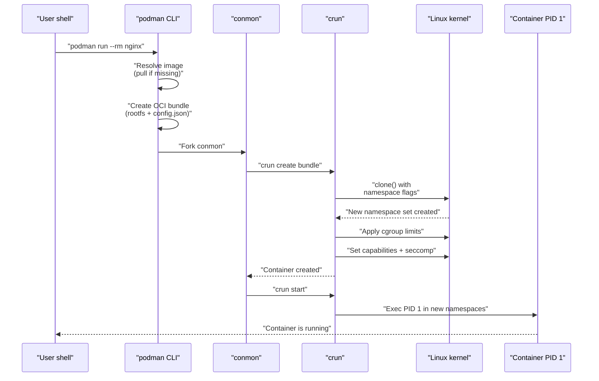

**Key insight:** `podman` itself does not stay running while your container runs. It forks `conmon` (container monitor) and exits. `conmon` is the long-lived process that holds the container's stdio and watches for exit. This is why Podman is daemonless — unlike Docker, there is no central `dockerd` that must stay healthy for your containers to keep running.

If `dockerd` crashes, all Docker containers lose their stdio management. If `podman` exits (which it does immediately after launch), your containers are completely unaffected.

[^ Go to TOC](#m01-table-of-contents)

---

## Containers Are Not VMs {#m01-containers-are-not-vms}

This is the most important conceptual distinction in this course. Getting it wrong leads to both operational mistakes and security blind spots.

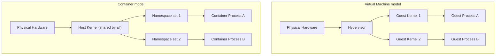

| Property | VM | Container |
|---|---|---|
| Kernel | Each VM has its own | Shared host kernel |
| Boot time | Seconds to minutes | Milliseconds |
| Memory overhead | Hundreds of MB per VM | Tens of MB per container |
| Isolation level | Strong (hypervisor boundary) | Moderate (namespace boundary) |
| Kernel CVE impact | Guest kernel only | All containers on host |
| File system | Full virtual disk | Layered image + thin writable layer |
| Portability | Image includes kernel | Image includes only userspace |

**What this means practically:**

- You cannot run a Windows container on a Linux kernel (the container shares the host kernel).
- A kernel vulnerability that lets a process escape a namespace affects all containers on that host.
- Containers start in milliseconds because there is no kernel to boot.
- Containers are small because they do not need to ship a kernel.

[^ Go to TOC](#m01-table-of-contents)

---

## Linux Namespaces — The Isolation Mechanism {#m01-linux-namespaces--the-isolation-mechanism}

A **namespace** wraps a global system resource so that processes inside the namespace see their own isolated copy. The kernel tracks which namespace each process belongs to.

Podman uses these isolation namespaces by default. A `/proc/<pid>/ns` listing also shows `cgroup` (the cgroup namespace). That one is real, and this chapter treats it as out of scope beyond "resource limits live there":

| Namespace | Kernel flag | What it isolates | Effect in container |
|---|---|---|---|
| **PID** | `CLONE_NEWPID` | Process IDs | Container sees its own PID 1; cannot see host PIDs |
| **Network** | `CLONE_NEWNET` | Network interfaces, routing, ports | Container gets its own `eth0`; cannot see host `eth0` |
| **Mount** | `CLONE_NEWNS` | Filesystem mount points | Container sees its own root filesystem |
| **UTS** | `CLONE_NEWUTS` | Hostname, domain name | Container can have a different hostname |
| **IPC** | `CLONE_NEWIPC` | SysV IPC, POSIX message queues | Containers cannot IPC with each other by default |
| **User** | `CLONE_NEWUSER` | User and group IDs | Container's root (UID 0) maps to an unprivileged UID on the host |

The **User namespace** is the one that makes rootless containers secure. When you run Podman without `sudo`, your container's UID 0 (root) is mapped to your own unprivileged UID on the host. If the container process escapes every other namespace, it is still just your unprivileged user on the host.

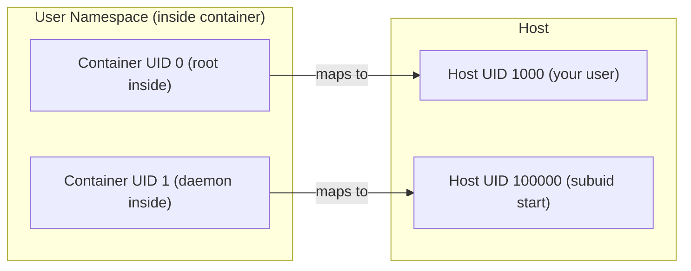

Container UID 0 is your UID. Container UID 1 is the first subordinate UID from `/etc/subuid` (100000 in this example), not 100001. Container UID N (for N >= 1) maps to `subuid_start + N - 1`. The same numbers are in Module 0's `uid_map` example.

> **Why this matters:** Without user namespaces, a container running as root would be running as root on the host too. User namespaces are why rootless Podman is meaningfully more secure than rootful Docker for most workloads.

[^ Go to TOC](#m01-table-of-contents)

---

## cgroups — The Resource Accounting Mechanism {#m01-cgroups--the-resource-accounting-mechanism}

**Control groups (cgroups)** let the kernel track and limit the resources a process tree can consume. Without cgroups, a single runaway container could OOM the entire host.

Podman uses **cgroups v2** (the unified hierarchy) on modern RHEL 10 / Fedora systems.

Key cgroup controllers used by containers:

| Controller | What it limits |
|---|---|
| `memory` | Maximum RAM + swap; triggers OOM kill when exceeded |
| `cpu` | CPU share / quota (e.g., "max 0.5 cores") |
| `pids` | Maximum number of processes/threads (prevents fork bombs) |
| `io` | Block device I/O bandwidth and IOPS |
| `cpuset` | Which CPU cores and NUMA nodes are allowed |

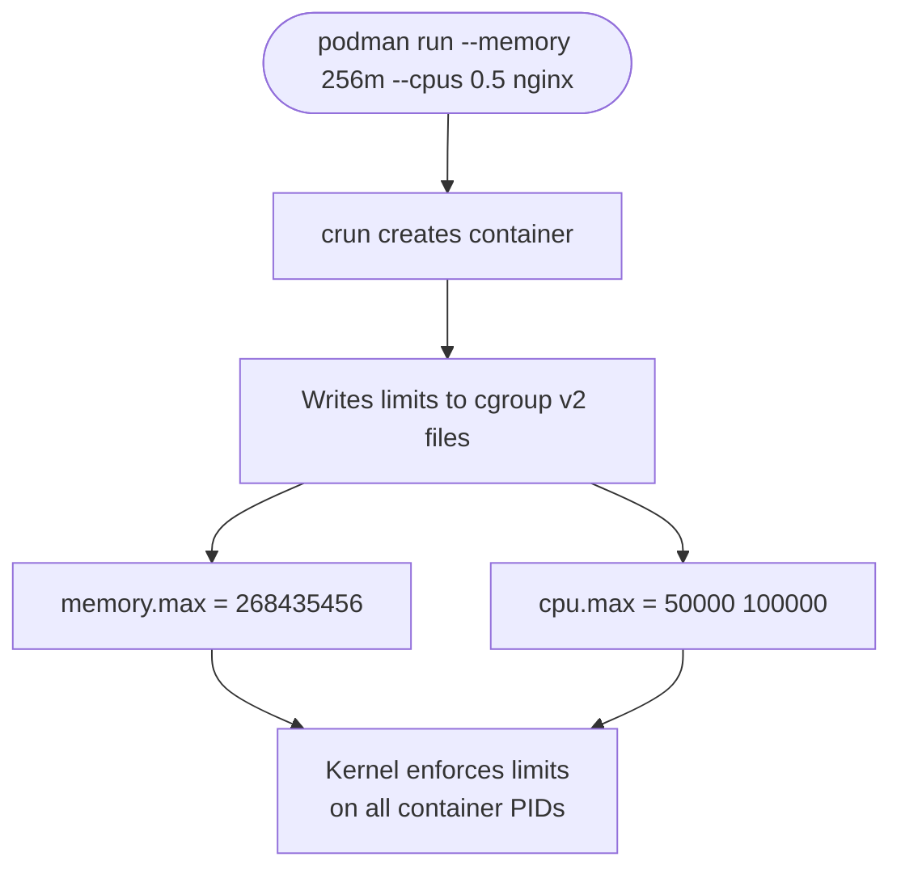

`--memory 256m` writes `memory.max`. `--cpus 0.5` writes `cpu.max`. Neither flag sets `pids.max`. The default process limit comes from `containers.conf` (`pids_limit`, often 1024) unless you pass `--pids-limit`.

> **Practical note:** cgroups v2 requires a systemd user session when running rootless. This is why the course targets RHEL 10 / Fedora with `loginctl enable-linger` — it keeps your user session and cgroup hierarchy alive even when you are logged out.

[^ Go to TOC](#m01-table-of-contents)

---

## The OCI Standards {#m01-the-oci-standards}

**OCI** stands for the Open Container Initiative. It defines three standards that make container tooling interoperable:

| Standard | What it specifies | Why it matters |
|---|---|---|
| **Image Spec** | How image layers and manifests are structured | You can build with Podman, push to a registry, pull with containerd |
| **Runtime Spec** | The `config.json` format that runtimes consume | `crun`, `runc`, `kata-containers` all accept the same bundle |
| **Distribution Spec** | The HTTP API for pushing/pulling images | Every major registry (quay.io, ghcr.io, docker.io) speaks the same protocol |

This is why the course uses `Containerfile` rather than `Dockerfile` — both produce OCI images, but `Containerfile` is the name used by Podman/Buildah and makes the OCI-first intent explicit.

> **Practical implication:** Any image you build with Podman will run on Kubernetes, containerd, or any other OCI-compliant runtime. The ecosystem is genuinely interoperable at the image and distribution layers.

[^ Go to TOC](#m01-table-of-contents)

---

## Rootless vs Rootful {#m01-rootless-vs-rootful}

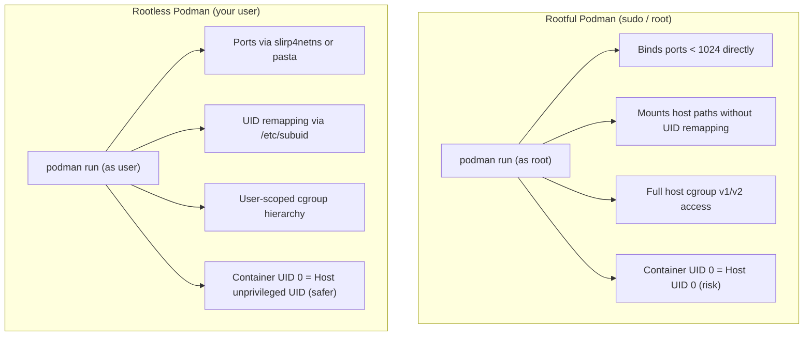

**When to use rootful:**
- You genuinely need to bind a port < 1024 without OS-level workarounds.
- You need `macvlan` or `ipvlan` network drivers.
- You are running a CI agent that itself orchestrates containers.
- You are explicitly told by an ops team that rootful is required for the workload.

**Default choice: rootless.** This course uses rootless Podman throughout. Every lab assumes you are running as an ordinary user, not root.

> **Warning:** Running containers rootful on a multi-user system means a container escape is a root escape. Always question whether you truly need it.

[^ Go to TOC](#m01-table-of-contents)

---

## Terminology You Will See {#m01-terminology-you-will-see}

| Term | Definition |
|---|---|
| **Image** | Read-only layer stack + metadata. The "recipe". |
| **Container** | Running (or stopped) instance of an image. Has state. |
| **Registry** | HTTP server that stores and serves images (quay.io, ghcr.io, docker.io). |
| **Tag** | Mutable human-readable pointer to an image (e.g. `nginx:1.27`). Can be moved. |
| **Digest** | Immutable SHA256 content hash of an image manifest (e.g. `sha256:abc123…`). |
| **OCI** | Open Container Initiative — the standards body for image/runtime/distribution specs. |
| **Containerfile** | The build recipe (Podman's name for what Docker calls a Dockerfile). |
| **Layer** | A diff of filesystem changes. Layers are stacked to form the image rootfs. |
| **crun** | The default OCI runtime used by Podman (written in C; faster and smaller than runc). |
| **conmon** | Container monitor process — manages stdio and exit detection per container. |
| **rootless** | Running Podman (and containers) as an unprivileged user, using user namespaces. |
| **rootful** | Running Podman as root. Required for some advanced networking and capabilities. |
| **pasta** | Default rootless network helper on Podman 5 / RHEL 10. Connects the rootless network namespace to the host. |
| **slirp4netns** | Previous default rootless network helper. Still used when `default_rootless_network_cmd` is set to it. |

[^ Go to TOC](#m01-table-of-contents)

---

## Lab: Compare Host vs Container {#m01-lab-compare-host-vs-container}

This lab makes the namespace isolation concrete. You will run the same commands on the host and inside a container and compare the output.

**Step 1 — Check process isolation (PID namespace)**

On the host, list processes:

```bash
ps aux | head -20  # list running processes on the host
```

You will see dozens of processes with various PIDs. Now run the same command inside a container:

```bash
podman run --rm docker.io/library/alpine:latest ps aux  # run a container and list its processes
```

You should see one process line: `ps` itself. There is no shell. The container has a completely separate PID namespace — it cannot see the host's processes.

**Step 2 — Check network isolation (network namespace)**

On the host:

```bash
ip addr show  # show network interfaces on the host
```

You will see your real `eth0` or `enpXs0`. Inside a container:

```bash
podman run --rm registry.fedoraproject.org/fedora:latest ip addr show  # alpine has no ip; fedora does
```

The container sees only `lo` (loopback) and `eth0` inside its own network namespace. The `eth0` inside is a virtual ethernet device — not the host's real interface.

**Step 3 — Check hostname isolation (UTS namespace)**

```bash
hostname  # show current hostname on the host
podman run --rm docker.io/library/alpine:latest hostname  # run a container and show its hostname
```

The container gets an auto-generated hostname (the container ID prefix) by default.

**Step 4 — Observe the UID mapping (user namespace)**

```bash
id  # show your user and group IDs on the host
podman run --rm docker.io/library/alpine:latest id  # run a container and show its uid/gid
```

Inside the container you are `uid=0(root)`. But from the host's perspective:

```bash
podman run -d --name uid-check docker.io/library/alpine:latest sleep 60  # run a container in background
sleep 1
ps aux | grep "sleep 60"  # check what UID the sleep process has on the host
podman rm -f uid-check  # clean up
```

You will see it running as your own UID on the host — not as root. This is the user namespace mapping in action.

**What just happened?**

Each `podman run` call set up a fresh set of namespaces. The container got its own PID tree, its own network stack, its own hostname, and a user namespace that remapped root to your unprivileged UID. All of these are kernel features — no special container software was needed beyond the runtime that called `clone()` with the right flags.

[^ Go to TOC](#m01-table-of-contents)

---

## Lab: Namespace Exploration {#m01-lab-namespace-exploration}

This lab looks directly at the namespace file descriptors to make the abstraction tangible.

**Step 1 — Start a long-running container**

```bash
podman run -d --name ns-demo docker.io/library/alpine:latest sleep 300  # run a detached container
```

**Step 2 — Find the PID of the container's main process on the host**

```bash
CPID=$(podman inspect ns-demo --format '{{.State.Pid}}')  # get the container's host PID
echo "Container PID on host: $CPID"
```

**Step 3 — List the namespace symlinks**

```bash
ls -la /proc/$CPID/ns/  # list the namespace file descriptors for this PID
```

You will see entries like:

```
lrwxrwxrwx ... cgroup -> cgroup:[4026531835]
lrwxrwxrwx ... ipc    -> ipc:[4026532768]
lrwxrwxrwx ... mnt    -> mnt:[4026532766]
lrwxrwxrwx ... net    -> net:[4026532771]
lrwxrwxrwx ... pid    -> pid:[4026532769]
lrwxrwxrwx ... user   -> user:[4026532765]
lrwxrwxrwx ... uts    -> uts:[4026532767]
```

`cgroup` is in the listing too. The table earlier in this module covers the six isolation namespaces; the cgroup namespace is where resource limits attach, and Module 0 already required cgroups v2.

Each inode number (the number after the colon) is the unique identity of that namespace. Compare these to your shell's namespaces:

```bash
ls -la /proc/self/ns/  # list your own shell's namespace file descriptors
```

The inode numbers for `net`, `pid`, `mnt`, and `user` will be different — confirming the container is truly in separate namespaces.

**Step 4 — Clean up**

```bash
podman stop ns-demo && podman rm ns-demo  # stop and remove the container
```

[^ Go to TOC](#m01-table-of-contents)

---

## Checkpoint {#m01-checkpoint}

Before moving on, confirm you can answer these without referring to notes:

- [ ] I can explain the difference between an image and a container.
- [ ] I know that containers share the host kernel and why that matters for security.
- [ ] I can name the isolation namespaces Podman uses and what each one isolates.
- [ ] I understand that rootless Podman maps container UID 0 to an unprivileged host UID.
- [ ] I can explain what cgroups do and why they matter.
- [ ] I know what OCI stands for and why the standard matters for portability.
- [ ] I have run the host vs container comparison lab and seen namespace isolation with my own eyes.

[^ Go to TOC](#m01-table-of-contents)

---

## Quick Quiz (Answer Without Running Commands) {#m01-quick-quiz-answer-without-running-commands}

1. You run `podman run --rm docker.io/library/alpine:latest ps aux` and see only one process line (`ps` itself). Why does the container not see the hundreds of processes running on the host?

2. A coworker says "just run it as root, it's fine, it's in a container." What is the specific risk they are dismissing?

3. What is the difference between a tag like `nginx:1.27` and a digest like `sha256:abc123…`? When would you prefer each?

4. Why does Podman not have a daemon that must keep running for your containers to stay alive?

5. A container is using 512 MB of RAM but you set `--memory 256m`. What does the kernel do?

[^ Go to TOC](#m01-table-of-contents)

---

## Further Reading {#m01-further-reading}

- OCI image spec: https://github.com/opencontainers/image-spec
- OCI runtime spec: https://github.com/opencontainers/runtime-spec
- Linux namespaces man page: https://man7.org/linux/man-pages/man7/namespaces.7.html
- Linux cgroups man page: https://man7.org/linux/man-pages/man7/cgroups.7.html
- User namespaces man page: https://man7.org/linux/man-pages/man7/user_namespaces.7.html
- crun (OCI runtime): https://github.com/containers/crun
- conmon (container monitor): https://github.com/containers/conmon
- Podman rootless overview: https://github.com/containers/podman/blob/main/docs/tutorials/rootless_tutorial.md
- pasta (network tool): https://passt.top
- Podman overview docs: https://podman.io/docs

[^ Go to TOC](#m01-table-of-contents)

© 2026 UncleJS — Licensed under CC BY-NC-SA 4.0

\newpage

# Module 2: Everyday Podman Commands {#m02-module-2-everyday-podman-commands}
[](../LICENSE.md)
[](https://access.redhat.com/products/red-hat-enterprise-linux)
[](https://podman.io)


## Table of Contents {#m02-table-of-contents}

- [Learning Goals](#m02-learning-goals)
- [The Container Lifecycle](#m02-the-container-lifecycle)
- [Core Commands](#m02-core-commands)
- [Useful Flags (Learn These Early)](#m02-useful-flags-learn-these-early)
- [Inspecting and Debugging](#m02-inspecting-and-debugging)
- [Lab: The Writable Layer Is Not Persistence](#m02-lab-the-writable-layer-is-not-persistence)
- [Lab: Name Your Containers](#m02-lab-name-your-containers)
- [Lab: Exit Codes and Restart Behavior](#m02-lab-exit-codes-and-restart-behavior)
- [Formatting Output](#m02-formatting-output)
- [Cleaning Up Without Nuking Your System](#m02-cleaning-up-without-nuking-your-system)
- [Checkpoint](#m02-checkpoint)
- [Quick Quiz](#m02-quick-quiz)
- [Further Reading](#m02-further-reading)


[^ Go to TOC](#m02-table-of-contents)

## Learning Goals {#m02-learning-goals}

- Run containers interactively and in the background.
- Use `logs` and `exec` to debug running containers.
- Understand the container lifecycle (create -> start -> running -> stopped -> removed).
- Clean up containers and images safely.
- Understand naming, exit codes, and restart behavior.
- Format `podman ps` and `podman inspect` output for scripts.


[^ Go to TOC](#m02-table-of-contents)

## The Container Lifecycle {#m02-the-container-lifecycle}

Understanding the lifecycle prevents a common confusion: the difference between a container that "exists" and one that is "running".

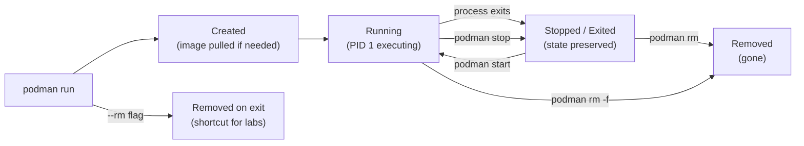

Key states:

| State | `podman ps` shows it | Container data exists | Process running |
|---|---|---|---|
| Running | Yes (default) | Yes | Yes |
| Stopped/Exited | Only with `-a` | Yes | No |
| Removed | Never | No | No |

This is why `podman ps` without `-a` shows nothing after a container exits — the state still exists, just stopped. Use `podman ps -a` to see all containers.


[^ Go to TOC](#m02-table-of-contents)

## Core Commands {#m02-core-commands}

**Run and remove when done** (good default for experiments):

```bash
podman run --rm docker.io/library/alpine:latest echo hello  # run, then auto-remove on exit
```

**Run a long-lived container in the background:**

```bash
podman run -d --name sleep1 docker.io/library/alpine:latest sleep 600  # detached, named container
podman ps                                                                # list running containers
```

**List all containers** (including stopped):

```bash
podman ps -a  # list all containers regardless of state
```

**View container logs:**

```bash
podman logs sleep1           # print all logs since container start
podman logs -f sleep1        # follow/tail logs in real time
podman logs --tail 20 sleep1 # show only last 20 lines
```

**Execute a command in a running container:**

```bash
podman exec -it sleep1 sh  # interactive shell inside running container
```

Tip: if the image doesn't have `sh`, try `bash`. For minimal images (Alpine uses `ash`), `sh` works. For distroless images, you may need an ephemeral debug container.

**Stop, start, and remove:**

```bash
podman stop sleep1    # graceful stop (SIGTERM, then SIGKILL after timeout)
podman start sleep1   # restart a stopped container (reuses same writable layer)
podman rm sleep1      # remove a stopped container
podman rm -f sleep1   # force-remove (stops if running, then removes)
```

**Wait for a container to exit:**

```bash
podman wait sleep1   # blocks until container exits, prints exit code
```

**Inspect exit code:**

```bash
podman inspect sleep1 --format '{{.State.ExitCode}}'  # get last exit code
```


[^ Go to TOC](#m02-table-of-contents)

## Useful Flags (Learn These Early) {#m02-useful-flags-learn-these-early}

| Flag | Purpose | Example |
|---|---|---|
| `--name <name>` | Stable name for scripts and `exec` | `--name mydb` |
| `-d` | Detached (background) | `podman run -d ...` |
| `--rm` | Auto-remove on exit | For experiments only |
| `-it` | Interactive + TTY | `podman run -it alpine sh` |
| `-e KEY=VALUE` | Environment variable | Avoid for secrets |
| `-v name:/path` | Mount named volume | `-v dbdata:/var/lib/mysql` |
| `-p host:container` | Publish port | `-p 8080:80` |
| `--network <net>` | Join a network | `--network mynet` |
| `--user <uid[:gid]>` | Run as specific user | `--user 1001:1001` |
| `--secret <name>` | Mount a Podman secret | `--secret db_password` |
| `--read-only` | Read-only root FS | Security hardening |
| `--tmpfs /path` | In-memory writable directory | `--tmpfs /tmp` |
| `--memory 256m` | Memory limit | Resource limiting |
| `--restart on-failure` | Restart policy | For `podman run`, not Quadlet |

Mnemonic: **"D-NAME-IT: Detach, Name, Interactive, Env, Volume, Publish, Network, User, Secret"**


[^ Go to TOC](#m02-table-of-contents)

## Inspecting and Debugging {#m02-inspecting-and-debugging}

**Quick status overview:**

```bash
podman ps -a --format 'table {{.Names}}\t{{.Status}}\t{{.Ports}}'  # formatted container list
```

**Inspect all metadata as JSON:**

```bash
podman inspect sleep1  # full JSON metadata: config, state, mounts, network, etc.
```

**Extract a specific field:**

```bash
podman inspect sleep1 --format '{{.State.Status}}'         # running / exited
podman inspect sleep1 --format '{{.State.ExitCode}}'       # exit code
podman inspect sleep1 --format '{{.NetworkSettings.IPAddress}}'  # empty on the default rootless network
podman inspect sleep1 --format '{{json .HostConfig}}'      # host config as JSON
```

On the default rootless network, `.NetworkSettings.IPAddress` is empty. An address appears under `.NetworkSettings.Networks` only after the container joins a user-defined bridge. Module 6 covers that. Do not treat the empty field as "the container has no IP."

**Check what ports are published:**

```bash
podman port sleep1  # list all port mappings for a container
```

**Inspect a running process list inside the container:**

```bash
podman top sleep1  # show running processes inside container
```

**View resource usage:**

```bash
podman stats --no-stream  # single snapshot of CPU/memory/IO usage for all running containers
```

**Debug a minimal image without a shell:**

Podman has no `debug` subcommand. Share the target container's network namespace (and PID namespace if you need a process list) from a small image that does have tools:

```bash
podman run --rm --network container:sleep1 docker.io/library/busybox:latest netstat -tlnp  # share network namespace
podman run --rm --pid container:sleep1 docker.io/library/busybox:latest ps  # share PID namespace
```


[^ Go to TOC](#m02-table-of-contents)

## Lab: The Writable Layer Is Not Persistence {#m02-lab-the-writable-layer-is-not-persistence}

Every container has a **writable layer** on top of its image. Writes go there, not into the image. When the container is removed, the writable layer is gone.

**Step 1: Create a file inside a container:**

```bash
podman run -it --name scratch docker.io/library/alpine:latest sh  # run interactive container
```

Inside the container:

```sh
echo "I was here" > /tmp/hello.txt  # write a file to the writable layer
cat /tmp/hello.txt                   # confirm it's there
exit
```

**Step 2: The container stopped. The file still exists in the stopped container:**

```bash
podman ps -a                         # scratch is stopped but exists
podman start scratch                 # restart the same container
podman exec scratch cat /tmp/hello.txt  # file is still there (same writable layer)
podman stop scratch
```

**Step 3: Remove the container and recreate it — file is gone:**

```bash
podman rm scratch                                                     # destroy the writable layer
podman run -it --name scratch docker.io/library/alpine:latest sh     # fresh writable layer
```

Inside:

```sh
ls /tmp/hello.txt  # file is gone — expected!
exit
```

**Cleanup:**

```bash
podman rm scratch  # clean up
```

**The lesson**: `podman stop` preserves state; `podman rm` destroys it. To persist data across container replacements, use **named volumes** (Module 5).


[^ Go to TOC](#m02-table-of-contents)

## Lab: Name Your Containers {#m02-lab-name-your-containers}

Unnamed containers get random two-word names (`romantic_currie`, `busy_wozniak`). These are fine for experiments but break automation.

**Step 1: Run two containers with explicit names:**

```bash
podman run -d --name worker-a docker.io/library/alpine:latest sleep 300  # named container A
podman run -d --name worker-b docker.io/library/alpine:latest sleep 300  # named container B
podman ps  # both should be listed
```

**Step 2: Reference by name in exec:**

```bash
podman exec worker-a hostname  # prints worker-a (container hostname defaults to container name)
podman exec worker-b hostname  # prints worker-b
```

**Step 3: Try to reuse a name and observe the error:**

```bash
podman run -d --name worker-a docker.io/library/alpine:latest sleep 300  # should fail
```

Expected: an error that the name `worker-a` is already in use by a container ID, and that mentions `--replace`.

Recover with `podman rm -f worker-a` before re-running, or pass `--replace` on the second `podman run`.

**Cleanup:**

```bash
podman rm -f worker-a worker-b  # stop and remove both
```


[^ Go to TOC](#m02-table-of-contents)

## Lab: Exit Codes and Restart Behavior {#m02-lab-exit-codes-and-restart-behavior}

Exit codes tell you why a container stopped. Knowing them speeds up debugging.

| Exit code | Meaning |
|---|---|
| 0 | Clean exit (process finished normally) |
| 1 | General error (check logs) |
| 125 | Podman itself errored (not the container) |
| 126 | Command found but not executable |
| 127 | Command not found |
| 130 | Killed by Ctrl+C (SIGINT) |
| 137 | Killed by SIGKILL (OOM killer, or `podman kill`) |
| 143 | Killed by SIGTERM (`podman stop`) |

**Step 1: Observe a clean exit (code 0):**

```bash
podman run --name exit0 docker.io/library/alpine:latest echo hello  # exits with code 0
podman inspect exit0 --format '{{.State.ExitCode}}'                  # should print: 0
podman rm exit0
```

**Step 2: Observe an error exit (code 1):**

```bash
podman run --name exit1 docker.io/library/alpine:latest sh -c 'exit 1'  # exits with code 1
podman inspect exit1 --format '{{.State.ExitCode}}'                      # should print: 1
podman rm exit1
```

**Step 3: Observe command-not-found (code 127):**

```bash
podman run --rm docker.io/library/alpine:latest notacommand  # should fail with 127
echo "Exit code: $?"  # print the exit code
```

**Step 4: Observe OOM kill (code 137) — safe with a memory limit:**

```bash
podman run --rm --memory 32m --memory-swap 32m docker.io/library/alpine:latest \
  sh -c 'x=a; while true; do x=$x$x; done'  # grow a string until the cgroup kills it
echo "Exit code: $?"  # expected: 137
```

Writing a file under `/tmp` uses the writable layer, not anonymous memory, so it often does not trip `memory.max`. Doubling a shell string does.


[^ Go to TOC](#m02-table-of-contents)

## Formatting Output {#m02-formatting-output}

`podman ps`, `podman images`, and `podman inspect` all support Go template formatting.

**Common ps formats:**

```bash
podman ps --format '{{.Names}}'                                          # just names
podman ps --format '{{.Names}}\t{{.Status}}'                             # names and status
podman ps --format 'table {{.Names}}\t{{.Status}}\t{{.Ports}}'          # table with headers
podman ps -a --format json                                                # full JSON output
```

**Inspect with templates:**

```bash
podman inspect mycontainer --format '{{.State.Status}}'                  # status string
podman inspect mycontainer --format '{{.Config.Image}}'                  # image used
podman inspect mycontainer --format '{{range .Mounts}}{{.Destination}} {{end}}'  # list mount paths
```

**Images:**

```bash
podman images --format '{{.Repository}}:{{.Tag}}\t{{.Size}}'            # name:tag and size
podman images --digests --format '{{.Repository}}\t{{.Digest}}'         # show digests
```


[^ Go to TOC](#m02-table-of-contents)

## Cleaning Up Without Nuking Your System {#m02-cleaning-up-without-nuking-your-system}

**See what you have:**

```bash
podman ps -a                  # all containers (running and stopped)
podman images                 # all images
podman volume ls              # all named volumes
podman network ls             # all networks
```

**Safe cleanup — stopped containers only:**

```bash
podman container prune -f     # remove all stopped containers (leaves running ones alone)
```

**Safe cleanup — dangling images (untagged, not used by any container):**

```bash
podman image prune -f         # remove dangling images only
```

**More aggressive — all unused images (not used by any container, running or stopped):**

```bash
podman image prune -a -f      # removes ALL images not referenced by a container
```

(!) This will force a re-pull next time you run a container. On slow connections, be selective.

**System-wide prune (containers + networks + images, no volumes):**

```bash
podman system prune -f        # remove stopped containers, unused networks, dangling images
```

**Check disk usage before pruning:**

```bash
podman system df              # show disk usage breakdown: images, containers, volumes
```

Rule of thumb: `container prune` is safe to run daily. `image prune -a` should be deliberate.


[^ Go to TOC](#m02-table-of-contents)

## Checkpoint {#m02-checkpoint}

- You can use `podman logs` and `podman exec` without guessing.
- You understand why `podman ps` vs `podman ps -a` give different results.
- You understand why volumes exist — the writable layer is not persistence.
- You can read a container exit code and know what it means.
- You can format `podman ps` output for scripts.


[^ Go to TOC](#m02-table-of-contents)

## Quick Quiz {#m02-quick-quiz}

1) What is the difference between `podman run` and `podman start`?

2) A container exits immediately after you start it. Where do you look first?

3) `podman ps` shows nothing. Does that mean no containers exist? How do you check?

4) You run the same `podman run --name myapp ...` command twice. The second run fails. Why, and how do you fix it?

5) Exit code 137 — what likely happened?

6) A container is on a user-defined network. How do you print its IP without `podman exec`? Why is `.NetworkSettings.IPAddress` the wrong field on the default rootless network?


[^ Go to TOC](#m02-table-of-contents)

## Further Reading {#m02-further-reading}

- `podman-run(1)`: https://docs.podman.io/en/latest/markdown/podman-run.1.html
- `podman-ps(1)`: https://docs.podman.io/en/latest/markdown/podman-ps.1.html
- `podman-logs(1)`: https://docs.podman.io/en/latest/markdown/podman-logs.1.html
- `podman-exec(1)`: https://docs.podman.io/en/latest/markdown/podman-exec.1.html
- `podman-inspect(1)`: https://docs.podman.io/en/latest/markdown/podman-inspect.1.html
- Go template formatting: https://pkg.go.dev/text/template


[^ Go to TOC](#m02-table-of-contents)

© 2026 UncleJS — Licensed under CC BY-NC-SA 4.0

\newpage

# Module 3: Images and Registries {#m03-module-3-images-and-registries}
[](../LICENSE.md)
[](https://access.redhat.com/products/red-hat-enterprise-linux)
[](https://podman.io)


## Table of Contents {#m03-table-of-contents}

- [Learning Goals](#m03-learning-goals)
- [What Is an Image](#m03-what-is-an-image)
- [Tags vs Digests](#m03-tags-vs-digests)
- [Fully Qualified Image Names](#m03-fully-qualified-image-names)
- [Short-Name Resolution and registries.conf](#m03-short-name-resolution-and-registriesconf)
- [Lab: Pull by Tag, Record Digest](#m03-lab-pull-by-tag-record-digest)
- [Registry Authentication](#m03-registry-authentication)
- [Image Metadata: ENTRYPOINT vs CMD](#m03-image-metadata-entrypoint-vs-cmd)
- [Inspecting Image Layers](#m03-inspecting-image-layers)
- [Lab: Local Tagging](#m03-lab-local-tagging)
- [Lab (Optional): Push to a Local Registry](#m03-lab-optional-push-to-a-local-registry)
- [Lab (Optional): Save and Load](#m03-lab-optional-save-and-load)
- [Image Storage on Disk](#m03-image-storage-on-disk)
- [Checkpoint](#m03-checkpoint)
- [Quick Quiz](#m03-quick-quiz)
- [Further Reading](#m03-further-reading)


[^ Go to TOC](#m03-table-of-contents)

## Learning Goals {#m03-learning-goals}

- Understand what a container image is and how it is structured in layers.
- Pull images by tag and by digest.
- Explain why digests are safer than tags for production.
- Inspect image metadata (entrypoint, CMD, exposed ports, labels).
- Understand short-name resolution and why fully qualified names matter.
- Authenticate to a registry without leaking credentials to shell history.


[^ Go to TOC](#m03-table-of-contents)

## What Is an Image {#m03-what-is-an-image}

A container image is a **stack of read-only filesystem layers** plus metadata. Each layer represents a filesystem diff from the layer below it.

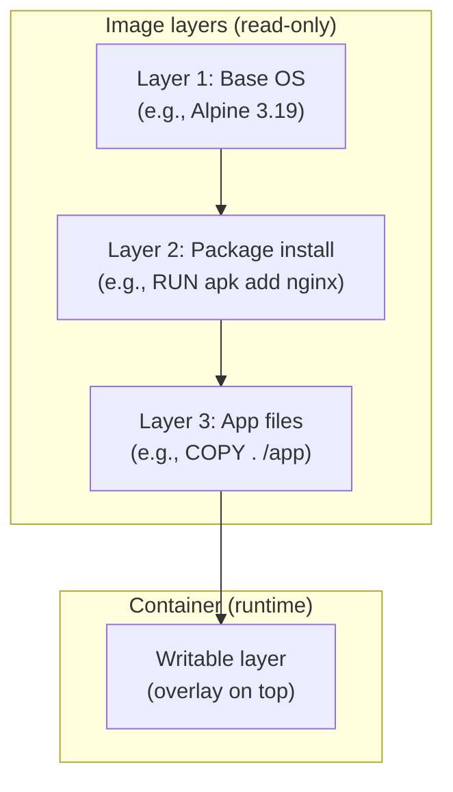

Key properties:

- **Layers are content-addressed** by SHA256 digest. Two images sharing a layer share the same data on disk.
- **Layers are immutable** — once built, they never change. A new `podman build` creates new layers.
- **The writable layer** is added per-container at runtime. It is discarded on `podman rm`.
- **The image digest** is a SHA256 of the image manifest (which includes all layer digests). It is globally unique and immutable.


[^ Go to TOC](#m03-table-of-contents)

## Tags vs Digests {#m03-tags-vs-digests}

A **tag** (like `:latest`, `:stable`, `:3.19`) is a mutable human-readable pointer. The registry can move a tag to point to a different image at any time.

A **digest** (like `@sha256:abc123...`) is a content-addressed, immutable identifier. It always refers to the exact same bytes.

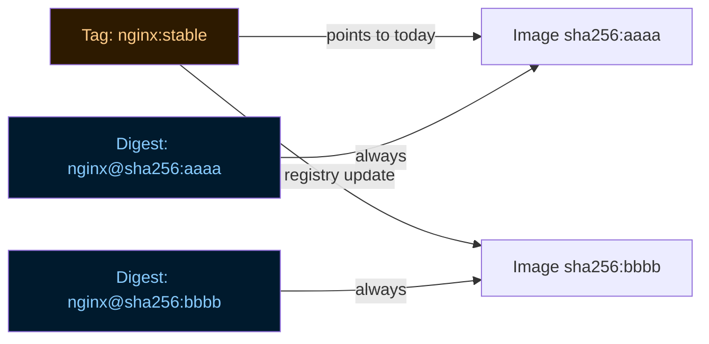

**Practical consequences:**

| Scenario | Tag | Digest |
|---|---|---|
| Reproduce a bug | [X] Tag may have moved | [OK] Exact bytes |
| Audit what ran in production | [X] Tag is ambiguous | [OK] Exact bytes |
| Auto-update to latest patch | [OK] Tag moves forward | [X] Must update manually |
| Incident response: "what version is running?" | [X] Need to check digest at time of deploy | [OK] Digest is the version |

**For production**: pin by digest. Record it. Upgrade by explicitly choosing a new digest.


[^ Go to TOC](#m03-table-of-contents)

## Fully Qualified Image Names {#m03-fully-qualified-image-names}

Always use the full registry + namespace + image + tag/digest form:

```
docker.io/library/nginx:stable
^^^^^^^   ^^^^^^^  ^^^^^  ^^^^^^
registry  namespace image  tag
```

Avoid relying on short names:

```
nginx:stable        # short name — Podman must guess the registry
alpine              # even shorter — registry AND tag are guessed
```

**Why it matters**: short-name resolution depends on `/etc/containers/registries.conf` and the alias files under `registries.conf.d/`. Search registries look up the **same** short name; they do not rename `alpine` to a UBI repository. On Fedora and RHEL, `short-name-mode` is often `enforcing`, and `alpine` is already aliased to `docker.io/library/alpine`, so that name never walks the search list. A name that is **not** in the alias file is what triggers the prompt.

Short names in labs are fine for exploration. Short names in scripts, Containerfiles, and Quadlet units should be replaced with fully qualified names.


[^ Go to TOC](#m03-table-of-contents)

## Short-Name Resolution and registries.conf {#m03-short-name-resolution-and-registriesconf}

Podman's short-name resolution is configured in `/etc/containers/registries.conf` (system-wide) and `~/.config/containers/registries.conf` (per-user).

**View system config:**

```bash
cat /etc/containers/registries.conf  # show registry search order and aliases
```

**Common settings:**

```toml
# /etc/containers/registries.conf — search list (Fedora/RHEL put Fedora and Red Hat before docker.io)
unqualified-search-registries = ["registry.fedoraproject.org", "registry.access.redhat.com", "docker.io"]

# /etc/containers/registries.conf.d/000-shortnames.conf — aliases win before the search list
[aliases]
"alpine" = "docker.io/library/alpine"
"fedora" = "registry.fedoraproject.org/fedora"
```

`[[registry.aliases]]` is not valid `registries.conf` syntax. The table is `[aliases]`. `[[registry]]` and `[[registry.mirror]]` are the array tables that do exist.

On RHEL and Fedora, `short-name-mode = "enforcing"` prompts when a short name has no alias. That prompt is intentional — it prevents silently pulling from the wrong registry. Aliases are checked first, so stock `alpine` does not prompt.

In automation (scripts, CIs, Containerfiles), always use fully qualified names to avoid this prompt.


[^ Go to TOC](#m03-table-of-contents)

## Lab: Pull by Tag, Record Digest {#m03-lab-pull-by-tag-record-digest}

**Step 1: Pull by tag:**

```bash
podman pull docker.io/library/alpine:latest  # pull Alpine latest tag
podman images | grep alpine                  # confirm image is stored locally
```

**Step 2: Inspect the image to get the digest:**

```bash
podman images --digests | grep alpine                                           # show digest column
DIGEST=$(podman image inspect docker.io/library/alpine:latest --format '{{.Digest}}')  # includes the sha256: prefix
echo "$DIGEST"  # looks like sha256:abc123...
```

**Step 3: Pull the exact same image by digest:**

Paste the entire `{{.Digest}}` value after `@`. Do not add a second `sha256:` prefix — `alpine@sha256:sha256:...` fails.

```bash
podman pull "docker.io/library/alpine@${DIGEST}"  # pull by immutable digest
podman images --digests | grep alpine              # same layers, tag ref and digest ref
```

**Step 4: Run by digest:**

```bash
podman run --rm "docker.io/library/alpine@${DIGEST}" uname -a  # run pinned image
```

**Step 5: Verify layer sharing:**

```bash
podman system df  # images section — pinned and tag-based share the same layers
```


[^ Go to TOC](#m03-table-of-contents)

## Registry Authentication {#m03-registry-authentication}

**Login to a registry:**

```bash
podman login docker.io         # prompts for username and password interactively
podman login registry.example.com  # login to a private registry
```

By default, credentials are stored in `${XDG_RUNTIME_DIR}/containers/auth.json`. That directory is under `/run` and **does not survive reboot**. To keep a login, use `--authfile "$HOME/.config/containers/auth.json"`.

**Logout:**

```bash
podman logout docker.io  # remove stored credentials for this registry
```

**Do not put credentials in shell history.** Always let `podman login` prompt interactively, or use a credentials file:

```bash
podman login --username myuser --password-stdin docker.io < /run/secrets/registry_password  # read password from file
```

For CI environments, use environment variables supported by your registry or pass a pre-created `auth.json` via `--authfile`.


[^ Go to TOC](#m03-table-of-contents)

## Image Metadata: ENTRYPOINT vs CMD {#m03-image-metadata-entrypoint-vs-cmd}

Every image has two pieces of default execution config:

- **ENTRYPOINT**: the program that always runs. Cannot be overridden by arguments.
- **CMD**: the default arguments to pass to ENTRYPOINT (or the default command if ENTRYPOINT is not set).

**How they combine:**

| ENTRYPOINT | CMD | `podman run myimage` runs | `podman run myimage foo` runs |
|---|---|---|---|
| `["/app"]` | `["--help"]` | `/app --help` | `/app foo` |
| (none) | `["sh"]` | `sh` | `foo` |
| `["sh", "-c"]` | `["echo hi"]` | `sh -c 'echo hi'` | `sh -c 'foo'` |

**Inspect these fields:**

```bash
podman image inspect docker.io/library/nginx:stable \
  --format '{{.Config.Entrypoint}} | {{.Config.Cmd}}'  # show ENTRYPOINT and CMD
```

**Override CMD at runtime:**

```bash
podman run --rm docker.io/library/nginx:stable nginx -v  # override CMD: run nginx -v instead of default
```

**Override ENTRYPOINT at runtime:**

```bash
podman run --rm --entrypoint sh docker.io/library/nginx:stable -c 'echo hello'  # replace ENTRYPOINT entirely
```

**Inspect exposed ports:**

```bash
podman image inspect docker.io/library/nginx:stable --format '{{.Config.ExposedPorts}}'  # what ports the image documents
```

Note: `ExposedPorts` is documentation — it does not automatically publish ports. You must use `-p host:container` to publish.


[^ Go to TOC](#m03-table-of-contents)

## Inspecting Image Layers {#m03-inspecting-image-layers}

**List layers (history):**

```bash
podman history docker.io/library/nginx:stable  # show image layer history with sizes and commands
```

This shows each layer, when it was created, what command produced it, and how large it is.

**Why this matters for security**: if a `RUN` step accidentally includes a secret (even if a later step tries to "delete" it), the secret is still in the intermediate layer and visible via `podman history`.

**Inspect image manifest:**

```bash
podman manifest inspect docker.io/library/nginx:stable  # show OCI manifest (multi-arch info)
```

**Diff two containers' filesystems:**

```bash
podman diff mycontainer  # show what changed in the writable layer vs the image
```

This is useful after running a container to see what it wrote.


[^ Go to TOC](#m03-table-of-contents)

## Lab: Local Tagging {#m03-lab-local-tagging}

Tags are just aliases. You can create local aliases for any image.

**Step 1: Pull an image:**

```bash
podman pull docker.io/library/nginx:stable  # pull nginx stable
```

**Step 2: Tag it with a local alias:**

```bash
podman tag docker.io/library/nginx:stable localhost/nginx:course  # create a local alias
podman images | grep nginx                                          # both entries exist, same image ID
```

**Step 3: Run using the local alias:**

```bash
podman run --rm localhost/nginx:course nginx -v  # run using the local tag
```

**Step 4: Remove the local alias (does not remove the original):**

```bash
podman rmi localhost/nginx:course  # untag (removes the alias, not the image if other tags exist)
podman images | grep nginx         # original docker.io tag still exists
```


[^ Go to TOC](#m03-table-of-contents)

## Lab (Optional): Push to a Local Registry {#m03-lab-optional-push-to-a-local-registry}

This teaches the full pull -> build -> tag -> push flow without needing a real external registry.

**Step 1: Start a local registry:**

```bash
podman run -d --name registry -p 5000:5000 docker.io/library/registry:2  # start local registry
```

**Step 2: Tag and push to the local registry:**

```bash
podman pull docker.io/library/alpine:latest                          # pull base image
podman tag docker.io/library/alpine:latest localhost:5000/alpine:course  # tag for local registry
podman push --tls-verify=false localhost:5000/alpine:course          # push to local registry (HTTP, lab only)
```

Note: `--tls-verify=false` is acceptable for a local lab registry on loopback. Never use it for production.

**Step 3: Pull from the local registry:**

```bash
podman rmi localhost:5000/alpine:course                     # remove local copy
podman pull --tls-verify=false localhost:5000/alpine:course # pull from local registry
```

**Step 4: Cleanup:**

```bash
podman rm -f registry  # stop and remove the local registry container
```

For a production-grade local registry with TLS, use certificates and a proper configuration. The Registry v2 API documentation in Further Reading explains how.


[^ Go to TOC](#m03-table-of-contents)

## Lab (Optional): Save and Load {#m03-lab-optional-save-and-load}

`podman save` and `podman load` transfer images as tar archives — useful for air-gapped environments.

```bash
podman save -o nginx.tar docker.io/library/nginx:stable   # export image to tar file
ls -lh nginx.tar                                           # check file size
podman rmi docker.io/library/nginx:stable                  # remove local image
podman load -i nginx.tar                                   # import from tar file
podman images | grep nginx                                 # confirm restored
```

Note:
- `save/load` are file-based transport, not a registry.
- The default format is `docker-archive`. After `load`, the image ID is still there. `podman images --digests` commonly shows `<none>` for the registry digest (`RepoDigest`). Content identity survived; the registry reference did not.
- Multiple images can be saved in one tar: `podman save -o multi.tar image1 image2`.


[^ Go to TOC](#m03-table-of-contents)

## Image Storage on Disk {#m03-image-storage-on-disk}

Rootless Podman stores images at:

```
~/.local/share/containers/storage/overlay/
```

Each layer is a directory of filesystem diffs. The overlay driver stacks them at runtime.

**Disk usage:**

```bash
podman system df  # summarized view: images, containers, volumes
du -sh ~/.local/share/containers/storage/  # raw disk usage of the storage root
```

**Remove all locally cached images** (aggressive — forces re-pull everything):

```bash
podman image prune -a -f  # remove all images not used by any container
```

**Remove a specific image:**

```bash
podman rmi docker.io/library/nginx:stable  # remove by tag
podman rmi sha256:<digest>                  # remove by digest
```


[^ Go to TOC](#m03-table-of-contents)

## Checkpoint {#m03-checkpoint}

- You can explain the difference between a tag and a digest.
- You can explain why `:latest` is risky in production.
- You can find and record an image digest.
- You can explain what ENTRYPOINT and CMD do and how to override them.
- You understand why fully qualified image names matter in automation.


[^ Go to TOC](#m03-table-of-contents)

## Quick Quiz {#m03-quick-quiz}

1) If you deploy by tag (e.g., `:stable`), what can change without you changing your config?

2) What is the advantage of a digest during incident response?

3) You run `podman run myimage mycommand`. The image has ENTRYPOINT `["/app"]` and CMD `["--help"]`. What actually runs?

4) A colleague says `alpine` and `docker.io/library/alpine:latest` are the same. When might they not be?

5) You run `podman history myimage` and see that a `RUN` step near the bottom has a very large size and a secret-looking value in the command. What is the security implication?


[^ Go to TOC](#m03-table-of-contents)

## Further Reading {#m03-further-reading}

- OCI image spec (tags vs digests context): https://github.com/opencontainers/image-spec
- `podman-pull(1)`: https://docs.podman.io/en/latest/markdown/podman-pull.1.html
- `podman-image(1)`: https://docs.podman.io/en/latest/markdown/podman-image.1.html
- Registries config (`registries.conf`): https://github.com/containers/image/blob/main/docs/containers-registries.conf.5.md
- Docker Registry HTTP API V2: https://distribution.github.io/distribution/spec/api/


[^ Go to TOC](#m03-table-of-contents)

© 2026 UncleJS — Licensed under CC BY-NC-SA 4.0

\newpage

# Module 4: Secrets (Local-First) {#m04-module-4-secrets-local-first}
[](../LICENSE.md)
[](https://access.redhat.com/products/red-hat-enterprise-linux)
[](https://podman.io)


## Table of Contents {#m04-table-of-contents}

- [Learning Goals](#m04-learning-goals)
- [Why Secrets Matter — The Threat Model](#m04-why-secrets-matter--the-threat-model)
- [Mental Model: Secret as a Mounted File](#m04-mental-model-secret-as-a-mounted-file)
- [How Podman Secrets Work Internally](#m04-how-podman-secrets-work-internally)
- [Common Anti-Patterns](#m04-common-anti-patterns)
- [Commands Reference](#m04-commands-reference)
- [Lab A: Create and Mount a Secret](#m04-lab-a-create-and-mount-a-secret)
- [Lab A2: Prove It Is Not an Env Var](#m04-lab-a2-prove-it-is-not-an-env-var)
- [Lab B: Rotation Pattern (Versioned Secrets)](#m04-lab-b-rotation-pattern-versioned-secrets)
- [Lab C: Custom Mount Target](#m04-lab-c-custom-mount-target)
- [Advanced: Build-Time Secrets (Optional)](#m04-advanced-build-time-secrets-optional)
- [File Permissions and App Compatibility](#m04-file-permissions-and-app-compatibility)
- [What Podman Secrets Do NOT Solve](#m04-what-podman-secrets-do-not-solve)
- [Common Failure Modes](#m04-common-failure-modes)
- [Checkpoint](#m04-checkpoint)
- [Quick Quiz](#m04-quick-quiz)
- [Further Reading](#m04-further-reading)

This module replaces the common beginner pattern of putting passwords in `.env` files and environment variables.


[^ Go to TOC](#m04-table-of-contents)

## Learning Goals {#m04-learning-goals}

- Explain why environment variables are not a good secret transport.
- Create and use Podman secrets in rootless mode.
- Mount secrets as files and consume them safely.
- Rotate a secret with minimal downtime.
- Build a "no-secrets-in-logs" habit.


[^ Go to TOC](#m04-table-of-contents)

## Why Secrets Matter — The Threat Model {#m04-why-secrets-matter--the-threat-model}

Before choosing a mechanism, you need to understand what you are actually protecting against. Secrets are credentials — database passwords, API keys, TLS private keys, OAuth tokens. The risk is **accidental disclosure** through these vectors:

| Exposure vector | How it happens |
|---|---|
| Shell history | `export DB_PASSWORD=hunter2` is stored in `~/.bash_history` |
| Process listing | `ps auxeww` shows env vars of running processes on many Linux systems |
| Container inspect | `podman inspect <container>` reveals all env vars in plain text |
| Image layers | `ARG`/`ENV` instructions bake values into image layers permanently |
| Log aggregation | App or framework logs the full env at startup (Spring Boot, Next.js, etc.) |
| Committed `.env` files | `.env` accidentally committed, pushed, and publicly indexed |
| Core dumps | A crashing process can dump env vars into a core file |

The goal of **secrets as files** is to reduce the surface area of every row in that table.

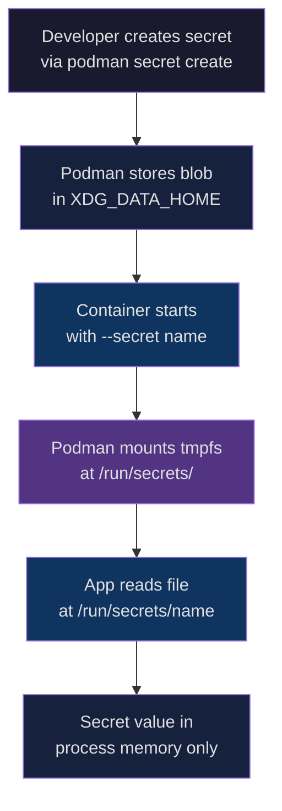

The secret value never appears in:
- The image layer
- `podman inspect` env output
- `ps auxeww`
- Shell history (if the value was never typed as a literal argument — see the `read -rs` pattern below)


[^ Go to TOC](#m04-table-of-contents)

## Mental Model: Secret as a Mounted File {#m04-mental-model-secret-as-a-mounted-file}

Think of a Podman secret as a **named slot** that holds an opaque blob. When a container starts with `--secret name`, Podman:

1. Looks up the blob by name in the local secrets store.
2. Writes it to an in-memory `tmpfs` mount at `/run/secrets/` inside the container.
3. The file disappears when the container stops — it is never written to the writable container layer.

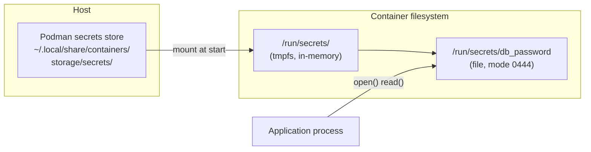

Key insight: the secret exists as a file for the lifetime of the container process and is gone when the container exits. It is never persisted in the container's writable layer.


[^ Go to TOC](#m04-table-of-contents)

## How Podman Secrets Work Internally {#m04-how-podman-secrets-work-internally}

Podman's local secrets driver stores blobs at:

```
~/.local/share/containers/storage/secrets/
```

Each secret is a JSON metadata record plus the encrypted (or plain, depending on driver) blob. The default driver is `file`, which stores blobs base64-encoded on disk. This means:

- Secrets are local to the machine.
- They are only as secure as the filesystem permissions on `~/.local/share/containers/`.
- There is no built-in encryption at rest with the default driver (though you can add one via a custom driver).

The `podman secret inspect` command shows metadata (name, ID, driver, timestamps) but never the value.

```bash
podman secret inspect db_password  # shows metadata, not value
```

For multi-host or encrypted-at-rest requirements, see Module 90 (External Secrets Survey).


[^ Go to TOC](#m04-table-of-contents)

## Common Anti-Patterns {#m04-common-anti-patterns}

These patterns are common in tutorials and dangerous in real environments:

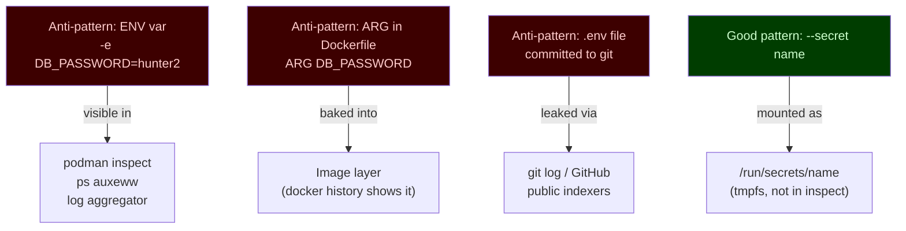

Summary of what to avoid:

- `export DB_PASSWORD=...` in your shell
- putting passwords in `.env` and committing it
- `podman run -e DB_PASSWORD=...` for anything beyond a throwaway lab
- `--secret name,type=env` — that option copies the value into the container environment and undoes the file-mount default (`type=mount`)
- `ARG`/`ENV` in a `Containerfile` for secret material
- logging connection strings that contain credentials


[^ Go to TOC](#m04-table-of-contents)

## Commands Reference {#m04-commands-reference}

**Create a secret without putting the value in shell history.** `printf '%s' 'literal' | podman secret create` avoids a trailing newline, but Bash still records the whole command line, password included. `printf` keeps the value out of `podman`'s argv. It does not keep it out of history.

```bash
umask 077
read -rs PASSWORD  # type the value; it is not echoed and not stored as a command argument
printf '%s' "$PASSWORD" > ./db_password.txt  # no trailing newline
unset PASSWORD
podman secret create db_password ./db_password.txt
rm -f ./db_password.txt
```

`printf '%s'` is still the right way to avoid the newline that `echo` adds. Use it on a variable or a file, not on a quoted password in the command you type.

**Create a secret from a file** you already wrote with an editor (`umask 077` first):

```bash
chmod 600 ./db_password.txt                          # restrict read to owner only
podman secret create db_password ./db_password.txt   # create secret from file
```

**List secrets** (metadata only, no values):

```bash
podman secret ls  # list all secrets with metadata
```

**Inspect a secret** (shows driver, creation time — never the value):

```bash
podman secret inspect db_password  # inspect secret metadata
```

**Remove a secret**:

```bash
podman secret rm db_password  # delete the secret by name
```

**Use a secret at runtime** (default mount path `/run/secrets/<name>`):

```bash
podman run --rm --secret db_password docker.io/library/busybox:latest \
  sh -lc 'test -f /run/secrets/db_password && echo "secret file present"'  # verify secret is mounted
```

**Override the mount target** inside the container:

```bash
podman run --rm --secret db_password,target=/etc/myapp/db.pass \
  docker.io/library/busybox:latest \
  sh -lc 'test -f /etc/myapp/db.pass && echo OK'  # custom mount path
```

**Change uid/gid/mode** on the mounted file:

```bash
podman run --rm --secret db_password,uid=1000,gid=1000,mode=0400 \
  docker.io/library/busybox:latest \
  sh -lc 'ls -la /run/secrets/db_password'  # inspect ownership and permissions
```

Notes:

- Keep the secret value out of your shell history. Use `read -rs` into a variable, or a mode `0600` file. `printf '%s'` only fixes the trailing newline.
- Never print secret contents in logs.
- Do not pass `--secret name,type=env`. The default is `type=mount`. `type=env` puts the value in the container environment.


[^ Go to TOC](#m04-table-of-contents)

## Lab A: Create and Mount a Secret {#m04-lab-a-create-and-mount-a-secret}

1) Create a secret (example password — do not use in production). When prompted, type `correct-horse-battery-staple` so the inspect check in step 4 can search for that value. The password is not part of the command line:

```bash
umask 077
read -rs PASSWORD
printf '%s' "$PASSWORD" > ./db_password.txt
unset PASSWORD
podman secret create db_password ./db_password.txt
rm -f ./db_password.txt
```

2) Confirm the secret appears in the list:

```bash
podman secret ls  # list secrets, expect db_password
```

3) Run a container that confirms the secret file exists (without printing the value):

```bash
podman run --rm --secret db_password docker.io/library/busybox:latest \
  sh -lc 'test -f /run/secrets/db_password && echo OK'  # run a container, secret as file
```

4) Confirm the secret is NOT visible via `podman inspect`:

```bash
podman run -d --name secret-demo --secret db_password docker.io/library/busybox:latest sleep 600  # run container
podman inspect secret-demo --format '{{.Config.Env}}'  # environment only; the value is not here
podman inspect secret-demo | grep -F 'correct-horse-battery-staple' || echo "value not in inspect output"  # expected: value not in inspect output
podman rm -f secret-demo  # cleanup
```

Checkpoint:

- Secret appears as a file at `/run/secrets/db_password`.
- You never printed the secret value.
- `podman inspect` does not expose the value.


[^ Go to TOC](#m04-table-of-contents)

## Lab A2: Prove It Is Not an Env Var {#m04-lab-a2-prove-it-is-not-an-env-var}

This lab builds the "prove it" habit — always verify your security assumptions experimentally.

1) Start a long-lived container with the secret:

```bash
podman run -d --name secret-demo --secret db_password docker.io/library/busybox:latest sleep 600  # run a container
```

2) Check environment does not contain the secret:

```bash
podman exec secret-demo sh -lc 'env | grep -i password || echo "no password in env"'  # verify secret not in environment
```

Expected output: `no password in env`

3) Confirm the file exists with restricted permissions:

```bash
podman exec secret-demo sh -lc 'ls -la /run/secrets'  # list secret files
```

Expected: file owned by root (uid 0) inside the container, mode `0444` by default.

4) Read the file (confirm you can):

```bash
podman exec secret-demo sh -lc 'wc -c /run/secrets/db_password'  # count bytes, don't print value
```

5) Cleanup:

```bash
podman rm -f secret-demo  # stop and remove the demo container
podman secret rm db_password  # Lab C creates this name again
```


[^ Go to TOC](#m04-table-of-contents)

## Lab B: Rotation Pattern (Versioned Secrets) {#m04-lab-b-rotation-pattern-versioned-secrets}

Use versioned names so you can run old and new versions in parallel during a deploy window.

1) Create two versions of the secret:

```bash
umask 077
read -rs PASSWORD   # type v1-value
printf '%s' "$PASSWORD" > ./v1.txt
read -rs PASSWORD   # type v2-value
printf '%s' "$PASSWORD" > ./v2.txt
unset PASSWORD
podman secret create db_password_v1 ./v1.txt
podman secret create db_password_v2 ./v2.txt
rm -f ./v1.txt ./v2.txt
```

2) Start v1 service:

```bash
podman run -d --name app-v1 \
  --secret db_password_v1,target=db_password \
  docker.io/library/busybox:latest \
  sh -lc 'echo started-v1; sleep 3600'  # run v1 with secret mounted as db_password
```

3) Verify v1 is using its secret:

```bash
podman exec app-v1 sh -lc 'test -f /run/secrets/db_password && echo v1-secret-present'  # verify
```

4) Roll out v2 (new container, new secret name, same mount target):

```bash
podman run -d --name app-v2 \
  --secret db_password_v2,target=db_password \
  docker.io/library/busybox:latest \
  sh -lc 'echo started-v2; sleep 3600'  # run v2 with new secret mounted at same path
```

5) Verify v2 is healthy, then stop v1:

```bash
podman logs app-v2          # confirm started
podman rm -f app-v1         # stop old version
```

6) Only now remove the old secret:

```bash
podman secret rm db_password_v1  # delete old secret after rollback window has passed
```

7) Cleanup:

```bash
podman rm -f app-v2
podman secret rm db_password_v2
```

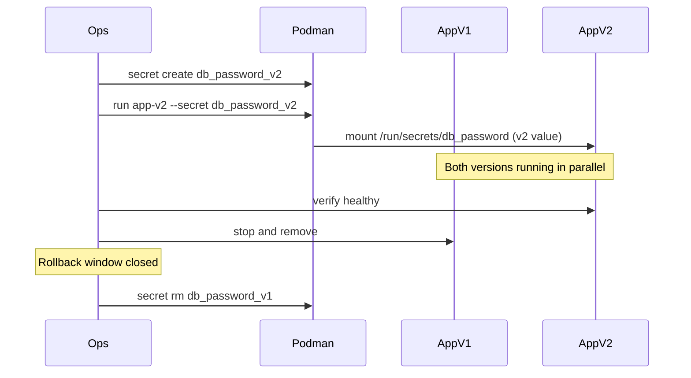

Guideline:

- Keep the old secret around until rollback is no longer needed.
- Many apps only read secrets on startup — rotation means deploying a new container.
- In Quadlet-managed services, this means updating `Secret=` in the unit file and restarting.


[^ Go to TOC](#m04-table-of-contents)

## Lab C: Custom Mount Target {#m04-lab-c-custom-mount-target}

Some apps expect credentials at a specific path (e.g., `/etc/app/config/db.pass`). Use the `target=` option.

1) Create the secret:

```bash
podman secret rm -f db_password  # Lab A may have left this name
umask 077
read -rs PASSWORD  # type mydbpass
printf '%s' "$PASSWORD" > ./db_password.txt
unset PASSWORD
podman secret create db_password ./db_password.txt
rm -f ./db_password.txt
```

2) Mount at a custom path:

```bash
podman run --rm \
  --secret db_password,target=/etc/myapp/db.pass \
  docker.io/library/busybox:latest \
  sh -lc 'ls -la /etc/myapp/db.pass && echo mounted'  # verify custom path
```

3) Mount with specific ownership (for apps running as non-root UID inside container):

```bash
podman run --rm \
  --secret db_password,target=/etc/myapp/db.pass,uid=1001,mode=0400 \
  docker.io/library/busybox:latest \
  sh -lc 'ls -la /etc/myapp/db.pass'  # verify ownership and mode
```

Cleanup:

```bash
podman secret rm db_password  # remove secret
```


[^ Go to TOC](#m04-table-of-contents)

## Advanced: Build-Time Secrets (Optional) {#m04-advanced-build-time-secrets-optional}

**Goal**: authenticate to a private resource during image build without leaking tokens into image layers.

The key rule: **never use `ARG` or `ENV` for secret material** — both are baked into image layers and visible via `podman history`.

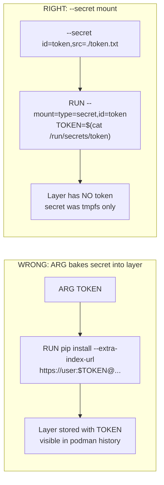

If your Podman/Buildah supports build secrets, use `--mount=type=secret`:

```dockerfile
# In your Containerfile:
RUN --mount=type=secret,id=pip_token \
    pip install --extra-index-url \
    "https://user:$(cat /run/secrets/pip_token)@pypi.internal/" \
    my-private-package
```

Build command:

```bash
podman build --secret id=pip_token,src=./pip_token.txt -t myapp .  # build with secret, token not in layer
```

If your version does not support build secrets:

- Do NOT work around it by embedding secrets with `ARG`.
- Fetch private dependencies in CI and copy artifacts into the build context instead.
- Use a multi-stage build to discard intermediate layers.

Check your Podman version supports it:

```bash
podman build --help | grep secret  # check if --secret flag is available
```


[^ Go to TOC](#m04-table-of-contents)

## File Permissions and App Compatibility {#m04-file-permissions-and-app-compatibility}

The default secret mount is:
- Path: `/run/secrets/<name>`
- Owner: `root:root` (uid 0, gid 0) inside the container
- Mode: `0444` (world-readable)

**If your app runs as a non-root user**, it can still read a `0444` file. But if it needs `0400` (only owner can read), you must explicitly set uid and mode:

```bash
podman run --secret db_password,uid=1001,mode=0400 ...  # restrict to uid 1001 only
```

**If your app expects an env var** (legacy app you cannot modify), you can read the file in your entrypoint:

```bash
#!/bin/sh
# entrypoint.sh — bridge from file to env var (last resort)
export DB_PASSWORD=$(cat /run/secrets/db_password)
exec "$@"
```

This is a last resort. If you control the app, prefer native file reads.

**Common app secret file conventions:**

| Stack | How to read a secret file |
|---|---|
| Node.js | `fs.readFileSync('/run/secrets/db_password', 'utf8').trim()` |
| Python | `open('/run/secrets/db_password').read().strip()` |
| Go | `os.ReadFile("/run/secrets/db_password")` |
| Shell script | Read the file in the process that needs it. `DB_PASS=$(cat /run/secrets/db_password)` puts the value in that process's environment. |
| Java / Spring | `spring.config.import=configtree:/run/secrets/` (or read the file in code). `spring.datasource.password=file:...` is not Spring syntax. |


[^ Go to TOC](#m04-table-of-contents)

## What Podman Secrets Do NOT Solve {#m04-what-podman-secrets-do-not-solve}

Be honest about the limitations to avoid false confidence:

| Problem | Does Podman secrets help? |
|---|---|
| Accidental env var exposure | [OK] Yes — keeps secret out of env |
| Leaking to image layers | [OK] Yes — secrets are runtime-only |
| Shell history exposure | [OK] Yes — if the value is read with `read -rs` or from a file, not typed as a command argument |
| Encryption at rest on disk | [X] No — default driver stores base64 on disk |
| Multi-host secret distribution | [X] No — secrets are per-machine |
| Automatic rotation | [X] No — you must manually rotate |
| Access control between users | [X] No — relies on filesystem permissions |
| Audit logging of secret reads | [X] No — no built-in audit trail |

For the [X] rows, see Module 90 (External Secrets Survey) for HashiCorp Vault, AWS SSM, and systemd credentials patterns.


[^ Go to TOC](#m04-table-of-contents)

## Common Failure Modes {#m04-common-failure-modes}

**App expects an env var but you mounted a file.**
- Fix: update the app to read from a file, or use an entrypoint bridge script.

**File permissions don't match what the app's UID needs.**
- Symptom: `Permission denied` reading `/run/secrets/name`.
- Fix: add `uid=<UID>,mode=0400` to the `--secret` flag.

**Trailing newline in the secret value breaks passwords.**
- Symptom: authentication fails with correct-looking password.
- Cause: `echo 'value' | podman secret create ...` adds a newline.
- Fix: `printf '%s' "$VALUE"` (no newline). `echo` adds one. Do not put `$VALUE` in the command as a quoted literal if you care about shell history.

**Secret not available because name was misspelled.**
- Symptom: container fails to start with "secret not found".
- Fix: `podman secret ls` to verify the name, check `Secret=` spelling in Quadlet unit.

**You accidentally log the secret during debugging.**
- Habit: never `cat /run/secrets/...` in a script that runs in production. Use `wc -c` to verify presence/size without printing.

**Build-time secret leaked into image layer via ARG.**
- Fix: switch to `--mount=type=secret` in the `RUN` step, never `ARG` for secrets.


[^ Go to TOC](#m04-table-of-contents)

## Checkpoint {#m04-checkpoint}

- You can create a secret without the value appearing in shell history.
- You can mount a secret as a file and verify it is present without printing it.
- You can explain why `--secret` is safer than `-e`.
- You can describe a versioned rotation plan with rollback.
- You understand what Podman secrets do and do not protect against.


[^ Go to TOC](#m04-table-of-contents)

## Quick Quiz {#m04-quick-quiz}

1) A colleague runs `podman run -e DB_PASSWORD=hunter2 myapp`. What are three ways this value could be exposed accidentally?

2) You have an app that only reads credentials on startup. You rotate `db_password_v1` -> `db_password_v2`. What must you do to the running container?

3) You run `echo 'mypass' | podman secret create db_password -`. Later the app fails to authenticate even though the password looks correct. What is the likely cause?

4) What does `podman secret inspect db_password` show, and what does it NOT show?

5) Your app runs as UID 1001 inside the container and needs to read the secret. The default mount uses UID 0 / mode 0444. Can the app read it? Why?


[^ Go to TOC](#m04-table-of-contents)

## Further Reading {#m04-further-reading}

- `podman-secret(1)`: https://docs.podman.io/en/latest/markdown/podman-secret.1.html
- OWASP Secrets Management Cheat Sheet: https://cheatsheetseries.owasp.org/cheatsheets/Secrets_Management_Cheat_Sheet.html
- systemd credentials (service-provisioned files): https://www.freedesktop.org/software/systemd/man/latest/systemd.exec.html#Credentials
- Kubernetes Secrets (base64 caveat context): https://kubernetes.io/docs/concepts/configuration/secret/
- Buildah build secrets: https://buildah.io/blogs/2018/09/14/new-stream-builds.html
- Module 90: External Secrets Survey (HashiCorp Vault, AWS SSM)


[^ Go to TOC](#m04-table-of-contents)

© 2026 UncleJS — Licensed under CC BY-NC-SA 4.0

\newpage

# Module 5: Storage (Volumes, Bind Mounts, Permissions) {#m05-module-5-storage-volumes-bind-mounts-permissions}
[](../LICENSE.md)
[](https://access.redhat.com/products/red-hat-enterprise-linux)
[](https://podman.io)


## Table of Contents {#m05-table-of-contents}

- [Learning Goals](#m05-learning-goals)
- [The Three Storage Types](#m05-the-three-storage-types)
- [Volumes](#m05-volumes)
- [Bind Mounts](#m05-bind-mounts)
- [tmpfs Mounts](#m05-tmpfs-mounts)
- [Inspect Mounts](#m05-inspect-mounts)
- [Rootless Permission Pitfalls](#m05-rootless-permission-pitfalls)
- [podman unshare — Your Permission Debugging Tool](#m05-podman-unshare--your-permission-debugging-tool)
- [SELinux Drill (Fedora/RHEL)](#m05-selinux-drill-fedorarhel)
- [Lab: Persistent DB Data](#m05-lab-persistent-db-data)
- [Volume Backup and Restore Pattern](#m05-volume-backup-and-restore-pattern)
- [Checkpoint](#m05-checkpoint)
- [Quick Quiz](#m05-quick-quiz)
- [Further Reading](#m05-further-reading)


[^ Go to TOC](#m05-table-of-contents)

## Learning Goals {#m05-learning-goals}

- Choose between volumes, bind mounts, and tmpfs for the right use case.
- Use volumes for persistent state across container replacements.
- Debug rootless permission issues using `podman unshare`.
- Understand SELinux labeling (`:Z` vs `:z`) on Fedora/RHEL.
- Back up and restore named volumes.


[^ Go to TOC](#m05-table-of-contents)

## The Three Storage Types {#m05-the-three-storage-types}

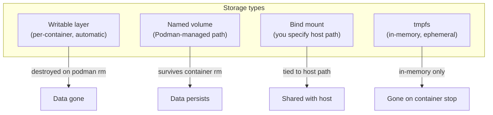

**Decision guide:**

| Need | Use |
|---|---|
| Database data, state that must survive container replacement | Named volume |
| Config file, certificate, source code (dev) | Bind mount |
| Scratch space that must not persist (tmp, cache, PID files) | `--tmpfs` |
| Read-only root FS with writable exceptions | `--read-only --tmpfs /path` |
| Quick experiment, throwaway data | Writable layer (accept data loss) |

**The core rule**: Never store important data in the writable layer. Use a volume.


[^ Go to TOC](#m05-table-of-contents)

## Volumes {#m05-volumes}

Named volumes are managed by Podman. You do not need to know or care where they live on disk. Podman handles permissions correctly for rootless use.

**Create and inspect:**

```bash
podman volume create dbdata             # create a named volume
podman volume ls                        # list all volumes
podman volume inspect dbdata            # show metadata: mountpoint, driver, labels
```

**Use a volume:**

```bash
podman run --rm -v dbdata:/data docker.io/library/alpine:latest \
  sh -lc 'echo hi > /data/x && echo wrote'  # write to volume
podman run --rm -v dbdata:/data docker.io/library/alpine:latest \
  sh -lc 'cat /data/x'                       # read from same volume
```

**Volume survives container removal:**

```bash
podman run --name writer -v dbdata:/data docker.io/library/alpine:latest \
  sh -lc 'echo persistent > /data/hello'   # write
podman rm writer                            # remove container
podman run --rm -v dbdata:/data docker.io/library/alpine:latest \
  cat /data/hello                           # data is still there
```

**Remove a volume ((!) DATA LOSS):**

```bash
podman volume rm dbdata   # delete the volume and all its data
```

**Where volumes live on disk** (rootless):

```bash
podman volume inspect dbdata --format '{{.Mountpoint}}'  # typically ~/.local/share/containers/storage/volumes/dbdata/_data
```


[^ Go to TOC](#m05-table-of-contents)

## Bind Mounts {#m05-bind-mounts}

A bind mount maps a **host filesystem path** into the container. The container sees and modifies real host files.

**When to use:**

- Passing configuration files into a container.
- Development mode — mounting source code so the container sees changes live.
- Passing certificates or read-only data that lives in a known host location.

**Basic bind mount:**

```bash
mkdir -p ./mnt-demo                         # create host directory
echo "hello from host" > ./mnt-demo/hi.txt  # create a test file
podman run --rm -v ./mnt-demo:/mnt:Z \
  docker.io/library/alpine:latest cat /mnt/hi.txt  # :Z required on SELinux systems
```

**Read-only bind mount:**

```bash
podman run --rm -v ./mnt-demo:/mnt:Z,ro \
  docker.io/library/alpine:latest \
  sh -lc 'cat /mnt/hi.txt; echo nope > /mnt/x || echo "write blocked"'  # write attempt fails
```

**SELinux mount options (Fedora/RHEL):**

| Option | Meaning | Use when |
|---|---|---|
| `:Z` | Relabel for private use (this container only) | Single container accessing the path |
| `:z` | Relabel for shared use (multiple containers) | Multiple containers sharing the same path |
| (none) | No relabelling | Volume mounts (handled automatically) |

`:Z` and `:z` relabel the host directory and everything under it. Never use them on `$HOME`, `/`, or a path other confined services need. `podman-run(1)` warns that relabeling system content can break those services.

**When NOT to use bind mounts:**

- Long-running services in production (use volumes instead).
- When you need Podman to manage permissions (volumes handle rootless UID mapping).
- When portability matters — bind mounts require the host path to exist.

See Module 11 for the rule: **always ask before using bind mounts in production Quadlet units**.


[^ Go to TOC](#m05-table-of-contents)

## tmpfs Mounts {#m05-tmpfs-mounts}

`tmpfs` mounts provide in-memory, ephemeral writable directories inside a container. They are gone when the container stops — no data persists.

**Use cases:**

- `/tmp` for scratch space (prevents writing to read-only root FS).
- `/var/run` for PID files (nginx, databases write here at startup).
- `/var/cache/nginx` for nginx's cache directory.
- Any directory an app writes to transiently, that you do not want persisted.

```bash
podman run --rm \
  --read-only \
  --tmpfs /tmp \
  --tmpfs /var/run \
  docker.io/library/alpine:latest \
  sh -lc 'touch /tmp/scratch && echo ok'  # /tmp is writable, root FS is not
```

**Size limit on tmpfs:**

```bash
podman run --rm --tmpfs /tmp:size=64m \
  docker.io/library/alpine:latest \
  sh -lc 'df -h /tmp'  # tmpfs with 64 MB limit
```


[^ Go to TOC](#m05-table-of-contents)

## Inspect Mounts {#m05-inspect-mounts}

**View mounts on a running container:**

```bash
podman run -d --name mount1 \
  -v dbdata:/data \
  -v ./mnt-demo:/mnt:Z \
  --tmpfs /tmp \
  docker.io/library/alpine:latest sleep 300  # start container with multiple mounts
```

```bash
podman inspect mount1 --format '{{json .Mounts}}'  # show all mount definitions as JSON
```

**Simpler view:**

```bash
podman inspect mount1 \
  --format '{{range .Mounts}}Type={{.Type}} Source={{.Source}} Dest={{.Destination}} Mode={{.Mode}}{{"\n"}}{{end}}'
```

**Cleanup:**

```bash
podman rm -f mount1  # remove the container
```


[^ Go to TOC](#m05-table-of-contents)

## Rootless Permission Pitfalls {#m05-rootless-permission-pitfalls}

The most common storage problem in rootless Podman is **permission denied** when a container tries to write to a mounted path.

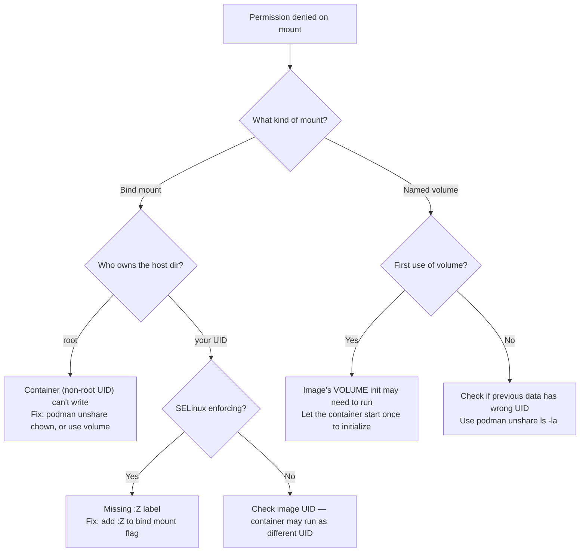

**Check what UID the container process runs as:**

```bash
podman run --rm docker.io/library/alpine:latest id  # show UID inside container
```

**See the container-side identity, then the host mapping:**

```bash
podman unshare id  # prints uid=0(root) — the container-side view, not your host UID
podman unshare cat /proc/self/uid_map  # host mapping: container UID 0 is your UID
```


[^ Go to TOC](#m05-table-of-contents)

## podman unshare — Your Permission Debugging Tool {#m05-podman-unshare--your-permission-debugging-tool}

`podman unshare` runs a command inside your **user namespace** — the same UID mapping that container processes use. This lets you see and fix filesystem ownership from the container's perspective.

**See UID mapping:**

```bash
podman unshare id             # shows uid/gid as rootless container sees it
podman unshare cat /proc/self/uid_map  # full UID map table
```

**Inspect a directory as the container sees it:**

```bash
podman unshare ls -la ~/.local/share/containers/storage/volumes/dbdata/_data  # check volume ownership
```

**Fix ownership for a bind-mounted path:**

```bash
podman unshare chown -R 1000:1000 ./mnt-demo  # set ownership inside user namespace
```

Warning: `chown -R` on a large directory takes time. And the numbers `1000:1000` are container UIDs, not host UIDs. Use `podman unshare` to run the command in the correct namespace.

**Do not blindly `chmod 777`** — this grants access to everyone on the host. Fix the ownership instead.


[^ Go to TOC](#m05-table-of-contents)

## SELinux Drill (Fedora/RHEL) {#m05-selinux-drill-fedorarhel}

SELinux enforces label-based access control independent of Unix permissions. A container process has label `container_t`. Podman labels content it is allowed to read as `container_file_t` (the current default). The older type `svirt_sandbox_file_t` is also allowed by policy. A private `:Z` label is `container_file_t` plus an MCS category pair such as `s0:c123,c456`.

Named volumes are automatically labelled correctly. Bind mounts are not — you must tell Podman to relabel them.

**Step 1: Try a bind mount WITHOUT labels (expected: fail on SELinux enforcing):**

```bash
mkdir -p ./selinux-test
echo "test" > ./selinux-test/data.txt
getenforce  # Enforcing: the next command is denied. Permissive or Disabled: it succeeds.
podman run --rm -v ./selinux-test:/mnt \
  docker.io/library/alpine:latest cat /mnt/data.txt
```

**Step 2: Fix it with `:Z`:**

```bash
podman run --rm -v ./selinux-test:/mnt:Z \
  docker.io/library/alpine:latest cat /mnt/data.txt  # should work now
```

**Step 3: Check what `:Z` did to the host path's label:**

```bash
ls -laZ ./selinux-test/  # show SELinux context (requires `ls` with -Z flag)
```

The type should now be `container_file_t`, with an MCS category pair (`s0:c…,c…`). That category is what makes `:Z` private to this container. If you still see `svirt_sandbox_file_t`, the policy allows it, but current Podman writes `container_file_t`.

**Step 4: Check for SELinux denial messages:**

```bash
sudo ausearch -m avc -ts recent 2>/dev/null | head -20  # audit log needs root
```

**Cleanup:**

```bash
rm -rf ./selinux-test  # remove test directory
```


[^ Go to TOC](#m05-table-of-contents)

## Lab: Persistent DB Data {#m05-lab-persistent-db-data}

**Goal**: demonstrate that container data survives container replacement when using a named volume.

**Step 1: Create a named volume:**

```bash
podman volume create mariadb-lab  # create persistent volume
```

**Step 2: Start MariaDB with the volume:**

`mariadb:11` is a moving tag. For a lab that is fine. After Module 3, production units pin the digest.

```bash
umask 077
read -rs PASSWORD  # type labpass123 for this lab
printf '%s' "$PASSWORD" > ./lab_db_pass.txt
unset PASSWORD
podman secret create lab_db_pass ./lab_db_pass.txt
rm -f ./lab_db_pass.txt
podman run -d \
  --name mariadb-lab \
  -v mariadb-lab:/var/lib/mysql \
  --secret lab_db_pass \
  -e MARIADB_ROOT_PASSWORD_FILE="/run/secrets/lab_db_pass" \
  docker.io/library/mariadb:11  # start MariaDB with persistent volume
```

**Step 3: Wait for the DB to initialise (watch logs):**

```bash
podman logs -f mariadb-lab  # watch logs; wait for "ready for connections"
```

Press Ctrl+C when ready.

**Step 4: Create a test record:**

The server reads the password from the secret file. Do not pass `-p"labpass123"`: that lands in shell history and in the process list. Build a client defaults file inside the container from the mounted secret:

```bash
podman exec mariadb-lab sh -lc 'umask 077; printf "[client]\nuser=root\npassword=%s\n" "$(cat /run/secrets/lab_db_pass)" > /tmp/client.cnf; mariadb --defaults-extra-file=/tmp/client.cnf -e "CREATE DATABASE lab; USE lab; CREATE TABLE test (id INT PRIMARY KEY, name VARCHAR(50)); INSERT INTO test VALUES (1, '\''persistent'\'');"'
```

**Step 5: Remove the container:**

```bash
podman rm -f mariadb-lab  # destroy the container (writable layer gone)
podman volume ls | grep mariadb-lab  # volume still exists!
```

**Step 6: Start a NEW container with the same volume:**

```bash
podman run -d \
  --name mariadb-lab2 \
  -v mariadb-lab:/var/lib/mysql \
  --secret lab_db_pass \
  -e MARIADB_ROOT_PASSWORD_FILE="/run/secrets/lab_db_pass" \
  docker.io/library/mariadb:11  # start fresh container with the same volume
podman logs -f mariadb-lab2  # wait for ready
```

**Step 7: Verify the data is still there:**

```bash
podman exec mariadb-lab2 sh -lc 'umask 077; printf "[client]\nuser=root\npassword=%s\n" "$(cat /run/secrets/lab_db_pass)" > /tmp/client.cnf; mariadb --defaults-extra-file=/tmp/client.cnf -e "SELECT * FROM lab.test;"'  # expected: 1 | persistent
```

**Cleanup:**

```bash
podman rm -f mariadb-lab2
podman volume rm mariadb-lab   # DATA LOSS — remove the volume
podman secret rm lab_db_pass
```


[^ Go to TOC](#m05-table-of-contents)

## Volume Backup and Restore Pattern {#m05-volume-backup-and-restore-pattern}

Named volumes can be backed up by running a helper container that reads from the volume and writes a tar file.

The previous lab's cleanup already removed `mariadb-lab`. This pattern uses its own volume so you can run it immediately after that lab.

**Backup:**

```bash
podman volume create backup-demo
mkdir -p ./backups
STAMP=$(date +%Y%m%d)
podman run --rm \
  -v backup-demo:/data \
  docker.io/library/alpine:latest \
  sh -lc 'echo course-backup > /data/marker.txt'
podman run --rm \
  -v backup-demo:/data:ro \
  -v ./backups:/backup:Z \
  docker.io/library/alpine:latest \
  tar czf /backup/backup-demo-${STAMP}.tar.gz -C /data .  # :Z so enforcing SELinux allows the write
```

**Restore** (to a fresh volume), using the same date stamp:

```bash
podman volume create backup-demo-restore
podman run --rm \
  -v backup-demo-restore:/data \
  -v ./backups:/backup:Z,ro \
  docker.io/library/alpine:latest \
  tar xzf /backup/backup-demo-${STAMP}.tar.gz -C /data
podman run --rm -v backup-demo-restore:/data:ro docker.io/library/alpine:latest cat /data/marker.txt  # expected: course-backup
podman volume rm backup-demo backup-demo-restore
```

This is a **logical backup** at the filesystem level. For database-consistent backups, prefer `mysqldump` / `mariadb-dump` over raw volume backups — they handle transactions correctly.


[^ Go to TOC](#m05-table-of-contents)

## Checkpoint {#m05-checkpoint}

- You can choose volume vs bind mount vs tmpfs intentionally.
- You can explain when `:Z` is required on Fedora/RHEL.
- You can use `podman unshare` to inspect and fix permission issues.
- You can demonstrate that volume data survives `podman rm`.
- You know the basic backup/restore pattern for volumes.


[^ Go to TOC](#m05-table-of-contents)

## Quick Quiz {#m05-quick-quiz}

1) Your container writes to `/var/lib/myapp` but you want the data to survive `podman rm`. What do you do?

2) You get `permission denied` reading a bind-mounted directory even though the host permissions look correct. You are on RHEL. What is the likely cause?

3) What does `podman unshare ls -la /path` tell you that a plain `ls -la /path` does not?

4) You use a named volume for your database and later need to move to a new server. Describe the volume backup/restore workflow.

5) `--tmpfs /tmp` and `-v tmpdata:/tmp` both make `/tmp` writable inside the container. What is the key difference?

6) You want a config file to be read-only inside the container and the bind mount path must not be modified. What mount option do you add?


[^ Go to TOC](#m05-table-of-contents)

## Further Reading {#m05-further-reading}

- `podman-volume(1)`: https://docs.podman.io/en/latest/markdown/podman-volume.1.html
- Rootless storage and UID mapping: https://github.com/containers/podman/blob/main/docs/tutorials/rootless_tutorial.md
- SELinux mount labeling for containers (RHEL docs): https://docs.redhat.com/en/documentation/red_hat_enterprise_linux/9/html/using_selinux/assembly_using-selinux-with-containers_using-selinux
- `subuid(5)` and `subgid(5)` (man7): https://man7.org/linux/man-pages/man5/subuid.5.html
- `podman-unshare(1)`: https://docs.podman.io/en/latest/markdown/podman-unshare.1.html


[^ Go to TOC](#m05-table-of-contents)

© 2026 UncleJS — Licensed under CC BY-NC-SA 4.0

\newpage

# Module 6: Networking (Ports, DNS, User-Defined Networks) {#m06-module-6-networking-ports-dns-user-defined-networks}
[](../LICENSE.md)
[](https://access.redhat.com/products/red-hat-enterprise-linux)
[](https://podman.io)


## Table of Contents {#m06-table-of-contents}

- [Learning Goals](#m06-learning-goals)
- [Minimum Path (If You Are Short on Time)](#m06-minimum-path-if-you-are-short-on-time)
- [1  How Container Networking Works (Mental Model)](#m06-1-how-container-networking-works-mental-model)
- [2  Rootless Networking In Depth](#m06-2-rootless-networking-in-depth)
- [3  Port Publishing](#m06-3-port-publishing)
- [4  The Default Network vs User-Defined Networks](#m06-4-the-default-network-vs-user-defined-networks)
- [5  Container DNS and Service Discovery](#m06-5-container-dns-and-service-discovery)
- [6  Connecting Containers to Multiple Networks](#m06-6-connecting-containers-to-multiple-networks)
- [7  Inspecting Network State](#m06-7-inspecting-network-state)
- [8  Network Drivers — Deeper Look](#m06-8-network-drivers--deeper-look)
- [9  Network Security Patterns](#m06-9-network-security-patterns)
- [10  Full Lab: Three-Tier Isolated Stack](#m06-10-full-lab-three-tier-isolated-stack)
- [11  Connecting Containers to Pods on a Network](#m06-11-connecting-containers-to-pods-on-a-network)
- [12  Networking in Quadlet (systemd) Deployments](#m06-12-networking-in-quadlet-systemd-deployments)
- [13  Troubleshooting Networking](#m06-13-troubleshooting-networking)
- [14  Common Patterns Reference](#m06-14-common-patterns-reference)
- [Checkpoint](#m06-checkpoint)
- [Quick Quiz](#m06-quick-quiz)
- [Further Reading](#m06-further-reading)


[^ Go to TOC](#m06-table-of-contents)

## Learning Goals {#m06-learning-goals}

By the end of this module you will be able to:

- Explain how rootless networking differs from rootful networking and why it matters.
- Publish container ports to the host and verify them.
- Create, inspect, and remove user-defined networks.
- Connect containers to multiple networks simultaneously.
- Use container DNS names for reliable inter-container service discovery.
- Choose the right network driver (bridge, host, none, macvlan) for a given scenario.
- Configure network-level security: isolate backends, expose only what you need.
- Troubleshoot DNS, port, routing, and firewall problems methodically.
- Connect containers across pods and across user-defined networks.
- Understand how networking interacts with Quadlet (systemd) deployments.


[^ Go to TOC](#m06-table-of-contents)

## Minimum Path (If You Are Short on Time) {#m06-minimum-path-if-you-are-short-on-time}

If you only do a small slice of this module, do these:

- Publish a port and verify with `podman port` (Section 3).
- Create a user-defined network and verify DNS name resolution (Sections 4-5).
- Practice the multi-network isolation pattern (Section 6).
- Run the troubleshooting checklist once (Section 13).

---


[^ Go to TOC](#m06-table-of-contents)

## 1 How Container Networking Works (Mental Model) {#m06-1-how-container-networking-works-mental-model}

Before running commands, build the mental model. Every container gets:

1. **A network namespace** — an isolated network stack with its own interfaces, routes, and firewall rules.
2. **A virtual Ethernet pair (veth)** — one end lives inside the container, the other end connects to a virtual bridge (or the host).
3. **An IP address** assigned from the network's subnet.

When two containers are on the **same user-defined network**, the bridge lets them talk to each other by IP. Podman's embedded DNS resolver makes them also reachable **by name**.

When a container is only on the **default network** (Podman's built-in `podman` bridge), DNS-based discovery is disabled. This is a deliberate design choice — it motivates you to create explicit named networks.

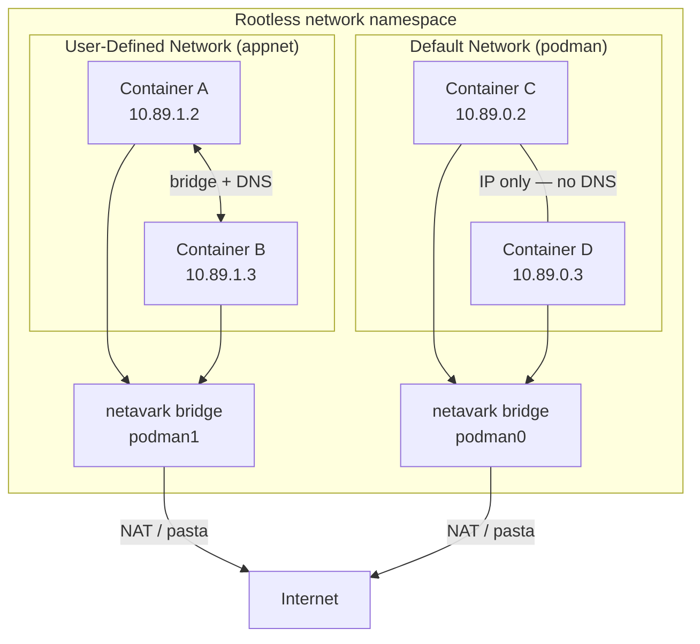

### 1.1 The Four Network Drivers {#m06-11-the-four-network-drivers}

| Driver | What it does | When to use it |
|--------|-------------|----------------|
| `bridge` | Virtual L2 bridge; default for user-defined networks | Almost everything |
| `host` | Container joins the host network namespace | Low-level tools. Rootless can use it; ports below 1024 still fail without extra config |
| `none` | No network interface except loopback | Batch jobs, maximum isolation |
| `macvlan` | Container appears as a separate MAC on your LAN | IoT, legacy apps that need a real LAN address |

> **Rootless note:** `--network=host` does join the host network namespace, including for a rootless user. The container process still cannot bind ports below 1024 unless you lower `net.ipv4.ip_unprivileged_port_start` or grant `CAP_NET_BIND_SERVICE`. `macvlan` requires root on most kernels. Stick to `bridge` unless you have a specific reason.

The bridges in the diagram live in the **rootless network namespace**, not in the host's network namespace. `ip link` on the host does not show them. Section 7.6 has the command that does.

---


[^ Go to TOC](#m06-table-of-contents)

## 2 Rootless Networking In Depth {#m06-2-rootless-networking-in-depth}

### 2.1 User-Mode Networking Helpers {#m06-21-user-mode-networking-helpers}

Rootless Podman uses two different pictures. Do not mix them.

**Picture 1 — normal and user-defined networks (what the labs use).** Podman creates a rootless network namespace. Inside it, netavark builds bridges (`podman0` for the default network, another bridge per user-defined network) and aardvark-dns answers names. pasta (the Podman 5 default) connects that namespace to the host. Container addresses look like `10.89.0.0/24`, not `10.0.2.0/24`.

**Picture 2 — slirp4netns, or an explicit `--network=pasta`.** That is a per-container stack. `podman-run(1)` documents `10.0.2.0/24` for that mode. It is not the address plan of a rootless bridge network.

| Helper | When you see it |
|--------|-----------------|
| **pasta** | Podman 5 / RHEL 10 default (`default_rootless_network_cmd`) |
| **slirp4netns** | Previous default, or when `containers.conf` still sets it |

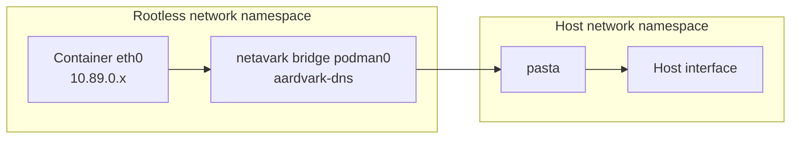

`{{.Host.NetworkBackend}}` is `netavark` or `cni`. It is not pasta vs slirp4netns. The helper is `RootlessNetworkCmd`. `Slirp4NetnsOptions` and `PastaOptions` are both filled in even when only one helper is active.

```bash
podman info --format '{{.Host.NetworkBackend}}'       # netavark or cni
podman info --format '{{.Host.RootlessNetworkCmd}}'   # pasta on Podman 5
```

You can switch the rootless backend in `~/.config/containers/containers.conf`:

```ini
[network]
default_rootless_network_cmd = "pasta"
```

### 2.2 What Rootless Networking Cannot Do (by default) {#m06-22-what-rootless-networking-cannot-do-by-default}

- Bind ports < 1024 without extra OS configuration. On this platform `net.ipv4.ip_unprivileged_port_start` is typically 1024, and `/usr/bin/pasta` has no file capabilities, so those binds fail until you lower the sysctl or add `CAP_NET_BIND_SERVICE`.
- Create `macvlan` / `ipvlan` adapters (kernel requires `CAP_NET_ADMIN`).
- Skip the rootless network namespace. `--network=host` joins the host network namespace. The limit that remains is privileged ports, not "the interfaces are invisible."

### 2.3 Allowing Privileged Ports for Rootless (When Needed) {#m06-23-allowing-privileged-ports-for-rootless-when-needed}

Option A — lower the unprivileged port minimum (system-wide, only if you own the machine):

```bash
sudo sysctl -w net.ipv4.ip_unprivileged_port_start=80  # allow low ports for rootless (system-wide)
# make permanent
echo "net.ipv4.ip_unprivileged_port_start=80" | sudo tee /etc/sysctl.d/99-lowport.conf  # persist across reboots
sudo sysctl -p /etc/sysctl.d/99-lowport.conf  # apply the persistent config
```

Option B — use a high port and put a reverse proxy (nginx, Caddy) in front. Strongly preferred in production.

Prefer a high port. This course does not use systemd socket activation for published ports.

---


[^ Go to TOC](#m06-table-of-contents)

## 3 Port Publishing {#m06-3-port-publishing}

### 3.1 Basic Port Mapping {#m06-31-basic-port-mapping}

Syntax: `-p <host-port>:<container-port>`

```bash
podman run -d --name web1 -p 8080:80 docker.io/library/nginx:stable  # run a container
curl -sS http://127.0.0.1:8080/ | head  # verify HTTP endpoint
```

### 3.2 Bind to a Specific Host Address {#m06-32-bind-to-a-specific-host-address}

By default `-p 8080:80` listens on all host interfaces (`0.0.0.0`).
To restrict to loopback only:

```bash
podman run -d --name web-lo -p 127.0.0.1:8081:80 docker.io/library/nginx:stable  # loopback, different host port from web1
```

To listen on a specific network interface IP, use an address this host actually has (`ip -4 -br addr`). Pasta refuses an address that is not on the host.

```bash
podman run -d --name web-iface -p <host-address>:8082:80 docker.io/library/nginx:stable  # replace <host-address>
```

This is important for security: a backend service should never be published to `0.0.0.0` when it only needs to be reachable by a local proxy.

### 3.3 Multiple Port Mappings {#m06-33-multiple-port-mappings}

```bash
podman run -d --name multi -p 8083:80 -p 8443:443 docker.io/library/nginx:stable  # run a container
```

### 3.4 UDP Port Mapping {#m06-34-udp-port-mapping}

```bash
podman run -d --name dns-demo -p 5053:53/udp -p 5053:53/tcp docker.io/library/alpine:latest sleep 600  # run a container
```

### 3.5 Random Host Port (Ephemeral) {#m06-35-random-host-port-ephemeral}

```bash
podman run -d --name rand-port -p 80 docker.io/library/nginx:stable  # run a container
podman port rand-port          # see what port was assigned
```

### 3.6 Inspect Published Ports {#m06-36-inspect-published-ports}

```bash
# Quick view
podman port web1  # show published ports

# Full JSON (useful in scripts)
podman inspect web1 --format '{{json .NetworkSettings.Ports}}'  # inspect container/image metadata

# Everything in one JSON dump
podman inspect web1 | python3 -m json.tool | grep -A10 '"Ports"'  # inspect container/image metadata
```

Cleanup:

```bash
podman rm -f web1 web-lo web-iface multi rand-port dns-demo  # cleanup containers
```

---


[^ Go to TOC](#m06-table-of-contents)

## 4 The Default Network vs User-Defined Networks {#m06-4-the-default-network-vs-user-defined-networks}

### 4.1 Why the Default Network Is Not Enough {#m06-41-why-the-default-network-is-not-enough}

When you run `podman run` without `--network`, the container joins the default `podman` bridge.

Problems with the default network:

1. **No automatic DNS.** Containers cannot find each other by name.
2. **Shared blast radius.** All containers on the default network can reach each other at the IP level.
3. **No isolation.** A compromised container can attempt connections to any other container on the same bridge.

### 4.2 Creating a User-Defined Network {#m06-42-creating-a-user-defined-network}

```bash
podman network create appnet  # create a network
```

List networks:

```bash
podman network ls  # list networks
```

Expected output includes your new `appnet` plus built-in networks.

Inspect the network (shows subnet, gateway, driver):

```bash
podman network inspect appnet  # inspect a network
```

Key fields to understand:

```
"driver": "bridge"
"subnets": [{ "subnet": "10.89.x.0/24", "gateway": "10.89.x.1" }]
"dns_enabled": true
```

Notice `dns_enabled: true` — this is the key difference from the default network.

### 4.3 Custom Subnet and Gateway {#m06-43-custom-subnet-and-gateway}

```bash
podman network create --subnet 172.28.0.0/24 --gateway 172.28.0.1 myapp-net  # create a network
```

Use custom subnets when:
- You need deterministic IPs (rare; prefer DNS names instead).
- You need to avoid subnet collisions with your VPN or office network.

### 4.4 Internal Networks (No External Access) {#m06-44-internal-networks-no-external-access}

An internal network has no route to the outside world. Containers on it cannot reach the internet.

```bash
podman network create --internal db-internal  # create a network
```

Use this for databases, caches, and any service that has no business reaching the internet.

Verify:

```bash
podman run --rm --network db-internal docker.io/library/alpine:latest sh -lc 'wget -qO- --timeout=3 http://example.com || echo BLOCKED'  # run a container
```

Expected: connection times out or is refused. That is the intended behavior.

### 4.5 Remove a Network {#m06-45-remove-a-network}

```bash
podman network rm appnet  # remove the network
```

You cannot remove a network that has active containers attached. Stop and remove containers first:

```bash
podman network rm appnet           # may fail if containers are running
podman ps --filter network=appnet  # find connected containers
podman rm -f $(podman ps -q --filter network=appnet)  # force remove connected containers
podman network rm appnet  # remove a network
```

---


[^ Go to TOC](#m06-table-of-contents)

## 5 Container DNS and Service Discovery {#m06-5-container-dns-and-service-discovery}

### 5.1 How It Works {#m06-51-how-it-works}

Podman runs an embedded DNS resolver (backed by **aardvark-dns** on modern versions). When `dns_enabled: true` on a network:

- Every container on that network is registered with its **container name** and any **network aliases**.
- DNS queries inside containers are answered by the Podman DNS resolver.
- The resolver is reachable at the network gateway address (usually the first usable IP on the subnet).

### 5.2 Basic DNS Lab {#m06-52-basic-dns-lab}

```bash
podman network create testdns  # create a network

# Start a named container
podman run -d --name server-a --network testdns docker.io/library/alpine:latest sleep 600  # run a container

# From another container, resolve the name
podman run --rm --network testdns docker.io/library/alpine:latest sh -lc 'getent hosts server-a'  # run a container
```

Expected output: an IP address followed by `server-a`.

Test TCP connectivity:

```bash
podman run --rm --network testdns docker.io/library/alpine:latest sh -lc 'nc -w 1 server-a 80 || echo "port not open (expected)"'  # BusyBox nc has no -z

podman rm -f server-a
podman network rm testdns
```

### 5.3 Network Aliases {#m06-53-network-aliases}

An alias lets you give a container an **additional DNS name** on a specific network. This is useful for:

- Running multiple containers that all answer as `db` (blue/green rotation).
- Giving a container a short service name regardless of its actual container name.

```bash
podman network create alias-demo  # create a network

podman run -d --name primary-db --network alias-demo --network-alias db docker.io/library/alpine:latest sleep 600  # run a container

# Resolve by alias
podman run --rm --network alias-demo docker.io/library/alpine:latest sh -lc 'getent hosts db'  # run a container

podman rm -f primary-db
podman network rm alias-demo
```

Both the container name (`primary-db`) and the alias (`db`) resolve to the same IP.

### 5.4 Multiple Containers Sharing an Alias (Load-Balancing Pattern) {#m06-54-multiple-containers-sharing-an-alias-load-balancing-pattern}

When multiple containers share the same alias on a network, DNS returns **all IPs** (round-robin).

```bash
podman network create lb-demo  # create a network

podman run -d --name app-1 --network lb-demo --network-alias app docker.io/library/alpine:latest sleep 600  # run a container
podman run -d --name app-2 --network lb-demo --network-alias app docker.io/library/alpine:latest sleep 600  # run a container

# Resolve - you may see both IPs
podman run --rm --network lb-demo docker.io/library/alpine:latest sh -lc 'for i in 1 2 3 4; do getent hosts app; done'  # run a container

# Cleanup
podman rm -f app-1 app-2  # cleanup containers
podman network rm lb-demo # remove the network
```

> This is primitive load balancing. For production you want a real load balancer in front. But the DNS pattern is real.

### 5.5 Custom DNS Servers {#m06-55-custom-dns-servers}

Override the DNS server used inside a container (useful on corporate networks or when using a split-horizon DNS):

```bash
podman run --rm --dns 1.1.1.1 docker.io/library/alpine:latest sh -lc 'cat /etc/resolv.conf'  # run a container
```

Add DNS search domains:

```bash
podman run --rm --dns-search corp.example.com docker.io/library/alpine:latest sh -lc 'cat /etc/resolv.conf'  # run a container
```

Set a custom `/etc/hosts` entry:

```bash
podman run --rm --add-host myservice:10.0.1.50 docker.io/library/alpine:latest sh -lc 'getent hosts myservice'  # run a container
```

---


[^ Go to TOC](#m06-table-of-contents)

## 6 Connecting Containers to Multiple Networks {#m06-6-connecting-containers-to-multiple-networks}

A container can be a member of more than one network simultaneously. This is the correct way to build a tiered architecture:

```
[internet] -> [frontend-net] -> [app] -> [backend-net] -> [db]
```

- `app` is on both `frontend-net` and `backend-net`.
- `db` is only on `backend-net`.
- `frontend` is only on `frontend-net`.

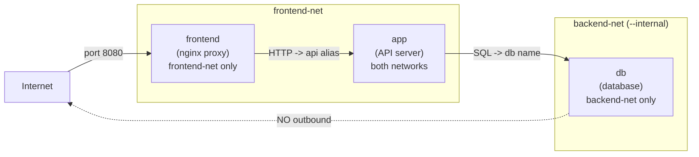

### 6.1 Multi-Network Example {#m06-61-multi-network-example}

```bash
podman network create frontend-net  # create a network
podman network create backend-net  # create a network

# DB: only on backend
podman run -d --name db --network backend-net docker.io/library/alpine:latest sleep 600  # run a container

# App: on both networks
podman run -d --name app --network frontend-net docker.io/library/alpine:latest sleep 600  # run a container

# Connect app to backend AFTER it is running
podman network connect backend-net app  # attach a container to a network

# Frontend: only on frontend
podman run -d --name frontend --network frontend-net docker.io/library/alpine:latest sleep 600  # run a container

# Verify: frontend can reach app
podman exec frontend sh -lc 'getent hosts app'  # run a command in a running container

# Verify: frontend CANNOT reach db (different network)
podman exec frontend sh -lc 'getent hosts db || echo "NOT REACHABLE"'  # run a command in a running container

# Verify: app CAN reach db
podman exec app sh -lc 'getent hosts db'  # run a command in a running container
```

### 6.2 Disconnect from a Network Without Stopping {#m06-62-disconnect-from-a-network-without-stopping}

Do this while `app` and `backend-net` from section 6.1 are still running.

```bash
podman network disconnect backend-net app  # detach a container from a network
```

Verify the container no longer has the interface:

```bash
podman exec app cat /proc/net/dev  # alpine has no ip; this lists interfaces
```

Reconnect:

```bash
podman network connect backend-net app  # attach a container to a network
```

Cleanup from section 6.1:

```bash
podman rm -f db app frontend               # stop and remove containers
podman network rm frontend-net backend-net # remove networks
```

---


[^ Go to TOC](#m06-table-of-contents)

## 7 Inspecting Network State {#m06-7-inspecting-network-state}

### 7.1 List All Networks {#m06-71-list-all-networks}

```bash
podman network ls  # list networks
```

### 7.2 Detailed Network Info {#m06-72-detailed-network-info}

```bash
podman network inspect appnet  # inspect a network
```

Shows: driver, subnets, gateways, connected containers, DNS state.

### 7.3 Which Network Is a Container On? {#m06-73-which-network-is-a-container-on}

```bash
podman inspect <name> --format '{{json .NetworkSettings.Networks}}'  # inspect container/image metadata
```

Or see all networks and their connected containers:

```bash
podman network inspect appnet --format '{{json .Containers}}'  # inspect a network
```

### 7.4 Show Container IP Address {#m06-74-show-container-ip-address}

```bash
podman inspect <name> --format '{{range .NetworkSettings.Networks}}{{.IPAddress}}{{end}}'  # inspect container/image metadata
```

For multi-network containers:

```bash
podman inspect app --format '{{range $name, $net := .NetworkSettings.Networks}}{{$name}}: {{$net.IPAddress}}{{"\n"}}{{end}}'  # inspect container/image metadata
```

### 7.5 View Interfaces Inside a Running Container {#m06-75-view-interfaces-inside-a-running-container}

`ip` is not in Alpine or the official nginx image. Use an image that has iproute2, or read `/proc/net/dev`.

```bash
podman exec <name> cat /proc/net/dev  # interfaces without the ip command
podman exec <name> cat /proc/net/route  # routes without the ip command
podman exec <name> cat /etc/resolv.conf  # run a command in a running container
```

### 7.6 Host-Side View {#m06-76-host-side-view}

Rootless bridges are not in the host network namespace. `ip link` on the host shows nothing for them. Look inside the rootless netns:

```bash
podman unshare --rootless-netns ip link show type bridge  # podman0 and user-defined bridges
```

---


[^ Go to TOC](#m06-table-of-contents)

## 8 Network Drivers — Deeper Look {#m06-8-network-drivers--deeper-look}

### 8.1 Bridge (Default) {#m06-81-bridge-default}

```bash
podman network create --driver bridge mybridge  # create a network
```

Characteristics:
- Creates a Linux bridge in the rootless network namespace (netavark's default bridge is `podman0`). It is not visible to `ip link` in the host netns.
- Uses NAT (masquerade) for outbound traffic, with pasta carrying packets to the host.
- Containers get private IPs (often `10.89.0.0/24`). The host reaches published ports through pasta, not by routing onto that bridge.

### 8.2 None (No Networking) {#m06-82-none-no-networking}

```bash
podman run --rm --network none registry.fedoraproject.org/fedora:latest ip addr  # alpine has no ip
```

Only `lo` (loopback) is present. Useful for:
- Batch jobs that need complete network isolation.
- Security-sensitive workloads that must never dial out.

### 8.3 Host {#m06-83-host}

```bash
podman run --rm --network host registry.fedoraproject.org/fedora:latest ip addr  # joins the host netns
```

The container sees the host's network interfaces. There is no NAT and no port mapping. Rootless processes still cannot bind ports below 1024. Avoid `--network=host` for production services in this course.

### 8.4 macvlan (Requires Root or Capabilities) {#m06-84-macvlan-requires-root-or-capabilities}

```bash
# rootful or with NET_ADMIN capability only
podman network create --driver macvlan --opt parent=eth0 --subnet 192.168.1.0/24 --gateway 192.168.1.1 macvlan-net  # create a network
```

The container appears as a distinct host on your physical LAN. Useful for legacy protocols (DHCP from upstream, mDNS, etc.).

---


[^ Go to TOC](#m06-table-of-contents)

## 9 Network Security Patterns {#m06-9-network-security-patterns}

### 9.1 The Principle: Expose Nothing You Don't Need To {#m06-91-the-principle-expose-nothing-you-dont-need-to}

Every port you publish is an attack surface. Every network link you create is a potential pivot point.

Default stance:

- **Databases** -> no port published, internal network only.
- **Caches** -> no port published, internal network only.
- **APIs** -> port published to loopback or internal network, reverse proxy in front.
- **Reverse proxy** -> the only container with a public port.

```mermaid
flowchart TD
    USER["External User"] -->|"TCP 80/443"| PROXY["Reverse Proxy<br/>public-tier only<br/>port 80:80 published"]
    subgraph "public-tier"
        PROXY
    end
    PROXY -->|"HTTP -> api"| API["API Server<br/>app-tier only<br/>no published port"]
    subgraph "app-tier"
        API
    end
    API -->|"SQL -> db"| DB["Database<br/>data-tier (--internal)<br/>no published port"]
    subgraph "data-tier (--internal)"
        DB
        CACHE["Cache<br/>data-tier (--internal)<br/>no published port"]
    end
    API -->|"Redis -> cache"| CACHE
    DB -. "blocked" .-> INET["Internet"]
    CACHE -. "blocked" .-> INET
```

### 9.2 Segment Networks by Trust Zone {#m06-92-segment-networks-by-trust-zone}

```
[public-net]   web / proxy containers only
[app-net]      app containers + proxy
[db-net]       db containers + app
```

The DB is never on `public-net`. The proxy is never on `db-net`.

### 9.3 Combine with `--internal` Flag {#m06-93-combine-with---internal-flag}

```bash
podman network create --internal private-db  # create a network
umask 077
read -rs PASSWORD
printf '%s' "$PASSWORD" > ./pgpass.txt
unset PASSWORD
podman secret create pg_password ./pgpass.txt
rm -f ./pgpass.txt
podman run -d --name postgres --network private-db \
  --secret pg_password \
  -e POSTGRES_PASSWORD_FILE=/run/secrets/pg_password \
  docker.io/library/postgres:16-alpine  # password from a file, not -e POSTGRES_PASSWORD
```

This DB can never initiate outbound connections. It cannot call home, exfiltrate data to an external server, or participate in an outbound botnet.

```bash
podman rm -f postgres
podman network rm private-db
podman secret rm pg_password
```

### 9.4 Use `--network-alias` for Service Contracts {#m06-94-use---network-alias-for-service-contracts}

Name your services after their role, not their implementation:

```bash
--network-alias db         # not "postgres-16-container-prod"
--network-alias cache      # not "redis-7.2"
--network-alias api        # not "my-app-v3"
```

When you upgrade a service, you swap the container and preserve the alias. Nothing else needs to change.

### 9.5 Avoid Publishing to 0.0.0.0 Unnecessarily {#m06-95-avoid-publishing-to-0000-unnecessarily}

```bash
# Bad for an internal API
-p 8080:8080              # listens on all interfaces

# Better
-p 127.0.0.1:8080:8080   # loopback only
```

---


[^ Go to TOC](#m06-table-of-contents)

## 10 Full Lab: Three-Tier Isolated Stack {#m06-10-full-lab-three-tier-isolated-stack}

Build a realistic, isolated three-tier stack:

- **reverse proxy** (nginx): published to host on 8080, on `frontend-net`
- **app** (alpine with netcat): on `frontend-net` and `app-net`
- **db** (alpine simulating a database): on `app-net` only, no published port

### Step 1 — Create Networks {#m06-step-1--create-networks}

```bash
podman network create frontend-net  # create a network
podman network create --internal app-net  # create a network
```

### Step 2 — Start the "DB" {#m06-step-2--start-the-db}

```bash
podman run -d --name db --network app-net docker.io/library/alpine:latest sh -lc 'while true; do echo "DB OK" | nc -l -p 5432; done'  # run a container
```

### Step 3 — Start the "App" {#m06-step-3--start-the-app}

```bash
podman run -d --name app --network app-net --network-alias api docker.io/library/alpine:latest sleep 600  # run a container
```

Connect app to the frontend network as well:

```bash
podman network connect frontend-net app  # attach a container to a network
```

### Step 4 — Start the Reverse Proxy {#m06-step-4--start-the-reverse-proxy}

```bash
podman run -d --name proxy --network frontend-net -p 127.0.0.1:8080:80 docker.io/library/nginx:stable  # run a container
```

### Step 5 — Verify Connectivity {#m06-step-5--verify-connectivity}

App can reach DB:

```bash
podman exec app sh -lc 'getent hosts db && echo DNS OK'  # run a command in a running container
```

Proxy can reach app:

```bash
podman exec proxy sh -lc 'getent hosts api && echo DNS OK'  # run a command in a running container
```

Proxy CANNOT reach DB (different network):

```bash
podman exec proxy sh -lc 'getent hosts db 2>&1 || echo "ISOLATED: expected"'  # run a command in a running container
```

DB CANNOT reach the internet (internal network):

```bash
podman exec db sh -lc 'wget -qO- --timeout=3 http://example.com 2>&1 || echo "BLOCKED: expected"'  # run a command in a running container
```

Host can reach proxy via published port:

```bash
curl -sSI http://127.0.0.1:8080/  # verify HTTP endpoint
```

### Step 6 — Cleanup {#m06-step-6--cleanup}

```bash
podman rm -f db app proxy              # stop and remove containers
podman network rm frontend-net app-net # remove networks
```

---


[^ Go to TOC](#m06-table-of-contents)

## 11 Connecting Containers to Pods on a Network {#m06-11-connecting-containers-to-pods-on-a-network}

Pods (covered in Module 7) and user-defined networks interact naturally. You can place an entire pod on a named network:

```bash
podman network create podnet  # create a network

podman pod create --name mypod --network podnet -p 8090:80  # create a pod

podman run -d --pod mypod --name pod-nginx docker.io/library/nginx:stable  # run a container

# A container outside the pod resolves the pod by its infra container's IP
# or by any container name inside:
podman run --rm --network podnet docker.io/library/alpine:latest sh -lc 'getent hosts pod-nginx'  # run a container

podman pod rm -f mypod  # stop and remove the pod and its containers
podman network rm podnet  # remove the network
```

---


[^ Go to TOC](#m06-table-of-contents)

## 12 Networking in Quadlet (systemd) Deployments {#m06-12-networking-in-quadlet-systemd-deployments}

Quadlet `.network` unit files let you declare Podman networks as systemd-managed resources. This ensures networks exist before containers start.

### 12.1 Declare a Network Unit {#m06-121-declare-a-network-unit}

Create `~/.config/containers/systemd/appnet.network`:

```ini
[Unit]
Description=Application private network

[Network]
Driver=bridge
Internal=true
```

### 12.2 Reference the Network in a Container Unit {#m06-122-reference-the-network-in-a-container-unit}

In your `.container` unit file:

```ini
[Container]
Image=docker.io/library/nginx:stable
Network=appnet.network
```

Systemd will automatically create `appnet` before starting your container and the dependency chain is managed for you.

Full Quadlet networking is covered in Module 11.

---


[^ Go to TOC](#m06-table-of-contents)

## 13 Troubleshooting Networking {#m06-13-troubleshooting-networking}

### 13.1 Symptom: Container Cannot Reach Another Container by Name {#m06-131-symptom-container-cannot-reach-another-container-by-name}

Checklist:

1. Are both containers on the **same user-defined network**? (Not the default `podman` network.)
2. Is `dns_enabled: true` on that network?
3. Are both containers **running** (not exited)?
4. Are you using the **container name** (or an alias), not the hostname?

```mermaid
flowchart TD
    S(["DNS resolution fails"]) --> Q1{"Same user-defined<br/>network?"}
    Q1 -->|"No"| F1["Fix: podman network connect<br/>OR restart on correct network"]
    Q1 -->|"Yes"| Q2{"dns_enabled: true<br/>on network?"}
    Q2 -->|"No"| F2["Fix: recreate network<br/>(default networks have dns disabled)"]
    Q2 -->|"Yes"| Q3{"Both containers<br/>running?"}
    Q3 -->|"No"| F3["Fix: podman start <name>"]
    Q3 -->|"Yes"| Q4{"Using container name<br/>or alias?"}
    Q4 -->|"No — using hostname"| F4["Fix: use --name, not --hostname<br/>for DNS registration"]
    Q4 -->|"Yes"| F5["Run debug sidecar:<br/>podman run --rm --network <net><br/>alpine getent hosts <target>"]
```

```bash
# Check network membership
podman inspect <name> --format '{{json .NetworkSettings.Networks}}'  # inspect container/image metadata

# Verify DNS is enabled on the network
podman network inspect <net> --format '{{.DNSEnabled}}'  # inspect a network

# Try a live DNS lookup from a debug container
podman run --rm --network <net> docker.io/library/alpine:latest sh -lc 'getent hosts <target-name>'  # run a container
```

### 13.2 Symptom: Cannot Connect Even Though DNS Resolves {#m06-132-symptom-cannot-connect-even-though-dns-resolves}

DNS working but TCP failing means the service is not listening, is on the wrong port, or there is a firewall rule.

```bash
# Check if the port is open
podman run --rm --network <net> docker.io/library/alpine:latest sh -lc 'nc -zv <target> <port>'  # run a container

# Check what the container is actually listening on
podman exec <target> ss -tlnp  # run a command in a running container
# or
podman exec <target> netstat -tlnp  # run a command in a running container
```

### 13.3 Symptom: Port Published But Cannot Reach from Host {#m06-133-symptom-port-published-but-cannot-reach-from-host}

```bash
# Confirm the port mapping
podman port <name>  # show published ports

# Confirm the process is listening inside the container.
# ss is not in Alpine or the official nginx image; /proc/net/tcp is.
podman exec <name> cat /proc/net/tcp

# Check host firewall (firewalld is the RHEL/Fedora tool)
sudo firewall-cmd --list-all

# Check the container's host binding
podman inspect <name> --format '{{json .NetworkSettings.Ports}}'  # inspect container/image metadata
# Look for "HostIp" - if it's 127.0.0.1, you can only reach from localhost
```

### 13.4 Symptom: `nc` or `wget` Not Available in Container {#m06-134-symptom-nc-or-wget-not-available-in-container}

Use a debug sidecar with networking tools:

```bash
podman run --rm --network <net> docker.io/library/nicolaka/netshoot:latest curl -v http://<target>:<port>/  # verify HTTP endpoint
```

Or use a minimal alpine with a one-liner install:

```bash
podman run --rm --network <net> docker.io/library/alpine:latest sh -lc 'apk add -q curl && curl -v http://<target>:<port>/'  # run a container
```

### 13.5 Symptom: Container Cannot Reach the Internet {#m06-135-symptom-container-cannot-reach-the-internet}

```bash
# Verify DNS
podman exec <name> sh -lc 'cat /etc/resolv.conf'  # run a command in a running container

# Try pinging a well-known IP (not DNS-dependent)
podman exec <name> ping -c3 8.8.8.8  # run a command in a running container

# Try DNS resolution
podman exec <name> sh -lc 'getent hosts example.com'  # run a command in a running container

# Check if the network is internal
podman network inspect <net> --format '{{.Internal}}'  # inspect a network
```

If the network is `internal: true`, outbound traffic is intentionally blocked.

If DNS fails but the IP works, the problem is your DNS resolver configuration.

### 13.6 Symptom: Sporadic Connection Failures (Rootless) {#m06-136-symptom-sporadic-connection-failures-rootless}

This is often a pasta/slirp4netns quirk with UDP under high load, or a port exhaustion issue.

```bash
# pasta errors show up on the container, not on the Podman API socket
podman logs <name>
journalctl --user -u <name>.service -n 50 --no-pager   # when the container is a Quadlet unit
```

`podman.socket` is the API socket. It does not log pasta failures.

### 13.7 Useful Debugging One-Liners {#m06-137-useful-debugging-one-liners}

```bash
# All running container IPs
podman ps -q | xargs -I{} podman inspect {} --format '{{.Name}}: {{range .NetworkSettings.Networks}}{{.IPAddress}} {{end}}'  # list containers

# All networks and their subnets
podman network ls -q | xargs -I{} podman network inspect {} --format '{{.Name}}: {{range .Subnets}}{{.Subnet}}{{end}}'  # list networks

# Which containers are on a given network
podman network inspect <net> --format '{{range $id, $c := .Containers}}{{$c.Name}} {{end}}'  # inspect a network

# Container's effective DNS config
podman exec <name> cat /etc/resolv.conf  # run a command in a running container
```

---


[^ Go to TOC](#m06-table-of-contents)

## 14 Common Patterns Reference {#m06-14-common-patterns-reference}

These are **sketches**, not labs. `myapp:latest` is not an image in this course. The ports and image names below follow the course rules (high ports, fully qualified names, no password in the environment) so you can adapt them. Do not publish host port 80 from a rootless user.

### Pattern A — Single Shared App Network (Simple Stack) {#m06-pattern-a--single-shared-app-network-simple-stack}

```bash
podman network create app
podman run -d --name db    --network app docker.io/library/alpine:latest sleep infinity  # stand-in; a real Postgres needs a secret file
podman run -d --name cache --network app docker.io/library/redis:7-alpine
podman run -d --name api   --network app -p 127.0.0.1:8000:8000 myapp:latest
podman run -d --name proxy --network app -p 127.0.0.1:8080:80 docker.io/library/nginx:stable
```

### Pattern B — Segmented Networks (Recommended for Production) {#m06-pattern-b--segmented-networks-recommended-for-production}

```bash
podman network create --internal data-tier
podman network create app-tier
podman network create public-tier

podman run -d --name db     --network data-tier   docker.io/library/alpine:latest sleep infinity
podman run -d --name cache  --network data-tier   docker.io/library/redis:7-alpine
podman run -d --name api    --network app-tier    myapp:latest
podman network connect data-tier api              # api reaches db and cache

podman run -d --name proxy  --network public-tier -p 127.0.0.1:8080:80 docker.io/library/nginx:stable
podman network connect app-tier proxy             # proxy reaches api
```

### Pattern C — Debug Sidecar (Ephemeral) {#m06-pattern-c--debug-sidecar-ephemeral}

```bash
podman run --rm -it --network <same-net> docker.io/library/alpine:latest sh  # run a container
# Now you have a shell inside the network with tools
```

### Pattern D — One-Time Migration Container {#m06-pattern-d--one-time-migration-container}

```bash
podman run --rm --network app-tier myapp:latest ./migrate.sh  # do not pass secrets with --env-file
```

---


[^ Go to TOC](#m06-table-of-contents)

## Checkpoint {#m06-checkpoint}

You should be able to answer the following without looking at commands:

- What is the fundamental difference between the default `podman` network and a user-defined network?
- Why does `--internal` improve security for a database network?
- How do containers find each other by name (what Podman feature enables this)?
- When would you use a network alias instead of a container name?
- What flag restricts a port binding to loopback only?
- How do you connect a running container to a second network without restarting it?
- What is the first tool you reach for when a container cannot be found by DNS?

---


[^ Go to TOC](#m06-table-of-contents)

## Quick Quiz {#m06-quick-quiz}

1. You have two containers on the default `podman` network. Container A tries to `curl http://container-b/`. It fails with "could not resolve host". What is the most likely cause and fix?

2. You start a database with `-p 5432:5432`. A security reviewer flags this as a problem. Why, and how do you fix it?

3. You have an `app` container that needs to talk to both a `frontend` network and a `backend` network. What is the cleanest way to set this up, and what command do you use to add the second network connection after the container is running?

4. Two containers share the network alias `api`. A third container queries `getent hosts api`. What does it get back? What does this enable?

5. A container can ping `8.8.8.8` but cannot resolve `example.com`. What is the most likely problem?

6. You check `podman port mycontainer` and it shows port 8080 mapped. But `curl http://127.0.0.1:8080/` fails. Name three things to check next.

---


[^ Go to TOC](#m06-table-of-contents)

## Further Reading {#m06-further-reading}

- Podman networking documentation: `man podman-network`
- aardvark-dns project (embedded DNS): https://github.com/containers/aardvark-dns
- pasta (rootless networking helper): https://passt.top/
- slirp4netns: https://github.com/rootless-containers/slirp4netns
- CNI vs Netavark: https://podman.io/blogs/2022/05/05/podman-rootful-rootless.html
- nftables and container networking: see Module 13 (Troubleshooting)


[^ Go to TOC](#m06-table-of-contents)

© 2026 UncleJS — Licensed under CC BY-NC-SA 4.0

\newpage

# Module 7: Pods and Sidecars {#m07-module-7-pods-and-sidecars}
[](../LICENSE.md)
[](https://access.redhat.com/products/red-hat-enterprise-linux)
[](https://podman.io)


## Table of Contents {#m07-table-of-contents}

- [Learning Goals](#m07-learning-goals)
- [What Is a Pod?](#m07-what-is-a-pod)
- [Why Pods — The Use Cases](#m07-why-pods--the-use-cases)
- [The Infra Container](#m07-the-infra-container)
- [Pod vs User-Defined Network — When To Use Each](#m07-pod-vs-user-defined-network--when-to-use-each)
- [The Sidecar Pattern](#m07-the-sidecar-pattern)
- [Pod Lifecycle and Commands](#m07-pod-lifecycle-and-commands)
- [Lab: Two Containers, One Pod](#m07-lab-two-containers-one-pod)
- [Lab: Log-Shipping Sidecar Pattern](#m07-lab-log-shipping-sidecar-pattern)
- [Pods and Quadlet](#m07-pods-and-quadlet)
- [Pods vs Kubernetes Pods](#m07-pods-vs-kubernetes-pods)
- [Pod Lifecycle Notes](#m07-pod-lifecycle-notes)
- [Checkpoint](#m07-checkpoint)
- [Quick Quiz](#m07-quick-quiz)
- [Further Reading](#m07-further-reading)

---

Podman pods group multiple containers so they share certain namespaces — most importantly the **network namespace**. Understanding pods unlocks the sidecar pattern and is the conceptual bridge to Kubernetes.

[^ Go to TOC](#m07-table-of-contents)

---

## Learning Goals {#m07-learning-goals}

By the end of this module you will be able to:

- Explain what a Podman pod is and how it differs from a user-defined network.
- Describe what the infra container is and why it exists.
- Run a pod with multiple containers sharing localhost.
- Implement a basic sidecar pattern.
- Decide when to use a pod vs when to use a shared network.
- Know how Podman pods relate to Kubernetes pods.

[^ Go to TOC](#m07-table-of-contents)

---

## What Is a Pod? {#m07-what-is-a-pod}

A **pod** is a group of containers that share a set of namespaces. In Podman's implementation, the most important shared namespace is the **network namespace**: every container in the pod sees the same network interfaces, the same IP address, and can reach each other on `localhost`.

```mermaid
graph TD
    subgraph "Pod: webpod"
        INF["Infra container<br/>(pause process)<br/>holds namespaces"]
        NGX["nginx container<br/>listens on :80"]
        SID["sidecar container<br/>reads logs on localhost"]
        INF -->|"shares net namespace"| NGX
        INF -->|"shares net namespace"| SID
        NGX <-->|"communicate via 127.0.0.1"| SID
    end
    HOST["Host"] -->|"port 8080 -> :80"| INF
```

The key insight: **port publishing is attached to the pod, not to individual containers**. When you publish `-p 8080:80`, that binding lives on the infra container. Any container in the pod that listens on port 80 is reachable at `127.0.0.1:8080` from outside.

[^ Go to TOC](#m07-table-of-contents)

---

## Why Pods — The Use Cases {#m07-why-pods--the-use-cases}

Pods are useful when:

1. **Sidecar agents need to reach the main process on localhost** — log shippers (Filebeat, Fluent Bit), service mesh proxies (Envoy), metrics exporters, and TLS terminators all benefit from localhost access. They do not need their own published port; they just connect to `127.0.0.1:<service-port>`.

2. **You want a single unit of deployment for a tightly-coupled pair** — if two containers are always deployed together, always stopped together, and always communicate on localhost, a pod models that relationship explicitly.

3. **You are bridging to Kubernetes YAML** — Podman's pod model is intentionally similar to Kubernetes pods. If you plan to export your workload to a cluster, designing with pods now makes the `podman generate kube` output meaningful.

They are **not required** for most workloads. If two services just need to talk to each other over a network and are independently scaled/deployed, a user-defined network is simpler and more flexible.

[^ Go to TOC](#m07-table-of-contents)

---

## The Infra Container {#m07-the-infra-container}

Every Podman pod contains an **infra container** — a minimal container that does almost nothing (runs a `pause` equivalent process) but exists solely to **hold the shared namespaces**.

Why is this necessary? Linux namespaces are owned by processes. If all containers in a pod shared namespaces directly, the first container to exit would destroy the namespace, killing the network for all other containers. The infra container solves this: it holds the namespace open for the lifetime of the pod, regardless of which application containers start or stop.

```bash
podman pod create --name webpod -p 8080:80  # create a pod
podman pod ps  # list pods — shows 1 container (the infra container)
podman ps --pod  # show all containers including the infra container
```

You will see a container named something like `webpod-infra`. It is always present and should be left alone. When you `podman pod rm`, the infra container is removed automatically.

> **Note:** The infra container uses a very small image (`k8s.gcr.io/pause` or a Podman equivalent). It consumes almost no resources. Do not be alarmed by seeing it.

[^ Go to TOC](#m07-table-of-contents)

---

## Pod vs User-Defined Network — When To Use Each {#m07-pod-vs-user-defined-network--when-to-use-each}

This is a common confusion point. Here is the mental model:

```mermaid
flowchart TD
    Q1{"Do containers need<br/>to communicate on localhost<br/>(127.0.0.1)?"}
    Q1 -->|"Yes"| POD["Use a Pod"]
    Q1 -->|"No"| Q2{"Are they<br/>always deployed/stopped<br/>together?"}
    Q2 -->|"Yes, tightly coupled"| POD
    Q2 -->|"No, independent lifecycle"| NET["Use a user-defined network"]
    NET --> DNS["Containers reach each other<br/>by container name via DNS"]
    POD --> LOC["Containers reach each other<br/>via 127.0.0.1"]
```

**User-defined network is better when:**
- Services have independent scaling or lifecycle.
- Services are run by different teams or deployed at different times.
- You need more than a handful of containers (pods with 10 containers get unwieldy).
- Service-to-service communication by DNS name is cleaner than localhost.

**Pod is better when:**
- A sidecar needs to proxy, observe, or augment the main process with localhost access.
- You are targeting Kubernetes and want YAML that maps cleanly.
- You want a single `podman pod rm` to clean up everything atomically.

[^ Go to TOC](#m07-table-of-contents)

---

## The Sidecar Pattern {#m07-the-sidecar-pattern}

A **sidecar** is an auxiliary container that runs alongside a main application container inside the same pod. Because they share a network namespace, the sidecar can:

- Read the main app's logs from a shared volume.
- Proxy traffic to/from the main app on localhost.
- Scrape metrics from the main app's internal port without publishing it externally.
- Perform health checks or certificate rotation.

```mermaid
graph LR
    subgraph "Pod"
        APP["Main app<br/>port :8080 (internal only)"]
        PROXY["Envoy/nginx sidecar<br/>port :80 (published)"]
        PROXY -->|"localhost:8080"| APP
    end
    INTERNET["External traffic"] -->|"host:80"| PROXY
```

Common sidecar examples:

| Sidecar type | What it does |
|---|---|
| Log forwarder | Reads log files written by the main app, ships to a central log store |
| Service mesh proxy | Intercepts all network traffic in/out of the pod |
| Metrics exporter | Scrapes app metrics and exposes them on a Prometheus endpoint |
| TLS terminator | Handles TLS, forwards plain HTTP to the app on localhost |
| Init sidecar | Runs a one-time setup step before the main container starts |

[^ Go to TOC](#m07-table-of-contents)

---

## Pod Lifecycle and Commands {#m07-pod-lifecycle-and-commands}

```bash
# Create a pod with a published port
podman pod create --name mypod -p 8080:80  # create a pod

# Add containers to an existing pod
podman run -d --pod mypod --name web docker.io/library/nginx:stable  # run a container in a pod
podman run -d --pod mypod --name sidecar docker.io/library/alpine:latest sleep 3600  # run a sidecar container

# Inspect the pod
podman pod ps  # list pods with container counts
podman pod inspect mypod  # detailed pod info including all containers
podman ps --pod  # list all containers showing their pod membership

# Control the pod
podman pod stop mypod  # stop all containers in the pod
podman pod start mypod  # start all containers in the pod
podman pod restart mypod  # restart all containers in the pod

# Remove the pod (stops and removes all containers including infra)
podman pod rm -f mypod  # force stop and remove pod and all its containers
```

> **Key lifecycle rule:** Stopping a pod stops all containers. Removing a pod removes all containers including the infra container. You cannot remove a pod's infra container independently.

[^ Go to TOC](#m07-table-of-contents)

---

## Lab: Two Containers, One Pod {#m07-lab-two-containers-one-pod}

In this lab you will see localhost networking between two containers inside a pod.

**Step 1 — Create a pod and publish a port**

```bash
podman pod create --name webpod -p 8080:80  # create a pod
```

Confirm the infra container was created:

```bash
podman ps --pod  # list containers showing pod membership
```

You will see the infra container already running even though you have not added application containers yet.

**Step 2 — Run an HTTP server inside the pod**

```bash
podman run -d --pod webpod --name nginx docker.io/library/nginx:stable  # run nginx inside the pod
```

Verify it is reachable from the host:

```bash
podman port webpod-infra  # podman port takes a container; the infra container owns the publish
```

From the host (or inside a debug shell):

```bash
podman run --rm --pod webpod docker.io/library/alpine:latest sh -lc 'wget -qO- http://127.0.0.1:80/ | head -5'  # verify nginx is reachable on localhost
```

**What just happened?** The Alpine container ran inside the same pod as nginx. Because they share a network namespace, `127.0.0.1:80` inside the Alpine container is nginx's port — exactly as if both processes were running on the same machine.

**Step 3 — Add a persistent sidecar for debugging**

```bash
podman run -d --pod webpod --name debug docker.io/library/alpine:latest sleep 3600  # run a debug sidecar
```

Exec into the sidecar and probe nginx without publishing any new ports:

```bash
podman exec -it debug sh  # exec into the sidecar
```

Inside:

```sh
# Nginx is accessible via localhost — no new port needed
wget -qO- http://127.0.0.1:80/ | head -5  # fetch nginx on localhost
# Check what is listening on port 80
netstat -tlnp 2>/dev/null || ss -tlnp  # show listening ports
exit  # exit the shell
```

**Step 4 — Inspect the shared network**

```bash
podman inspect nginx --format '{{.NetworkSettings.SandboxKey}}'  # show nginx's network namespace path
podman inspect debug --format '{{.NetworkSettings.SandboxKey}}'  # show sidecar's network namespace path
```

Both containers will show the **same network namespace** — confirming they share it via the infra container.

**Step 5 — Cleanup**

```bash
podman pod rm -f webpod  # stop and remove the pod and all its containers
```

[^ Go to TOC](#m07-table-of-contents)

---

## Lab: Log-Shipping Sidecar Pattern {#m07-lab-log-shipping-sidecar-pattern}

This lab simulates a real-world pattern: the main app writes logs to a shared volume, and a sidecar reads them.

**Step 1 — Create the pod with a shared volume**

```bash
podman volume create logvol  # create a shared log volume
podman pod create --name logpod -p 8081:80  # create the pod
```

**Step 2 — Start the app (nginx writing access logs)**

```bash
podman run -d --pod logpod --name app \
  -v logvol:/var/log/nginx \
  docker.io/library/nginx:stable  # named volume; no :Z (that label is private)
```

The image turns an empty log directory into symlinks to stdout and stderr. Replace them with real files so the sidecar can see access lines:

```bash
podman exec app sh -lc 'rm -f /var/log/nginx/access.log /var/log/nginx/error.log && touch /var/log/nginx/access.log /var/log/nginx/error.log && nginx -s reopen'
```

**Step 3 — Start the "log shipper" sidecar**

```bash
podman run -d --pod logpod --name log-shipper \
  -v logvol:/logs \
  docker.io/library/alpine:latest \
  sh -lc 'while true; do echo "--- log snapshot ---"; ls -la /logs/; sleep 5; done'  # run a log-reading sidecar
```

**Step 4 — Generate some traffic and watch the sidecar**

```bash
# Generate traffic
for i in 1 2 3 4 5; do
  podman run --rm --pod logpod docker.io/library/alpine:latest wget -qO /dev/null http://127.0.0.1:80/ 2>&1
done

# Watch sidecar output
podman logs -f log-shipper  # follow the sidecar's log output
```

Press `Ctrl+C` to stop following logs.

**Step 5 — Cleanup**

```bash
podman pod rm -f logpod  # remove the pod and all containers
podman volume rm logvol  # remove the log volume
```

[^ Go to TOC](#m07-table-of-contents)

---

## Pods and Quadlet {#m07-pods-and-quadlet}

You can manage a pod with Quadlet using a `.pod` unit. Containers in the pod reference it with `Pod=`:

```ini
# ~/.config/containers/systemd/mypod.pod
[Pod]
PodName=mypod
PublishPort=8080:80
```

```ini
# ~/.config/containers/systemd/web.container
[Unit]
Description=Web container in mypod
After=mypod-pod.service

[Container]
Image=docker.io/library/nginx:stable
Pod=mypod.pod

[Service]
Restart=always

[Install]
WantedBy=default.target
```

The generated service for the pod is `mypod-pod.service`. Container units declare `After=` and `Requires=` on it automatically when using `Pod=`.

> See Module 11 for full Quadlet details.

[^ Go to TOC](#m07-table-of-contents)

---

## Pods vs Kubernetes Pods {#m07-pods-vs-kubernetes-pods}

Podman's pod model is deliberately modeled after Kubernetes pods. The key similarities:

| Feature | Podman Pod | Kubernetes Pod |
|---|---|---|
| Shared network namespace | [OK] | [OK] |
| Shared IPC namespace | [OK] (optional) | [OK] |
| Infra/pause container | [OK] | [OK] |
| Sidecar pattern | [OK] | [OK] |
| Port published on pod | [OK] | [OK] |
| Scheduling across nodes | [X] | [OK] |
| Liveness/readiness probes | Limited | [OK] |
| Pod auto-restart policies | Via systemd | Via kubelet |

The critical difference: **Podman pods run on a single machine**. Kubernetes pods can be scheduled to any node in the cluster. But because the interface is similar, a `podman generate kube mypod` can produce YAML that Kubernetes understands — making Podman pods a useful local prototyping tool.

[^ Go to TOC](#m07-table-of-contents)

---

## Pod Lifecycle Notes {#m07-pod-lifecycle-notes}

- **Creating a pod does not start application containers** — only the infra container starts automatically.
- **Stopping a pod stops all containers** — including the infra container.
- **Removing a pod removes the infra container** — you cannot remove the infra container independently.
- **A stopped pod retains its containers** — they can be started again with `podman pod start`.
- **Exiting a container does not stop the pod** — other containers keep running; the pod remains in a degraded but not stopped state.
- **Port conflicts are detected at pod creation time** — not at container start.

[^ Go to TOC](#m07-table-of-contents)

---

## Checkpoint {#m07-checkpoint}

Before moving on, confirm you can answer these:

- [ ] I know that all containers in a pod share the same network namespace.
- [ ] I understand why the infra container exists and what happens if it exits.
- [ ] I can describe the sidecar pattern and give two real-world examples.
- [ ] I know when to prefer a user-defined network over a pod.
- [ ] I have run the two-container pod lab and confirmed localhost access between containers.
- [ ] I understand how Podman pods relate to Kubernetes pods.

[^ Go to TOC](#m07-table-of-contents)

---

## Quick Quiz {#m07-quick-quiz}

1. Why does a pod show an extra container you did not explicitly run?

2. You have nginx running in a pod and want to add a Prometheus metrics exporter sidecar that scrapes nginx's internal `/metrics` endpoint (not published to the host). How does the sidecar reach nginx?

3. When would you prefer a user-defined network over a pod for two communicating services?

4. What happens to the other containers in a pod when one container exits?

[^ Go to TOC](#m07-table-of-contents)

---

## Further Reading {#m07-further-reading}

- `podman-pod(1)`: https://docs.podman.io/en/latest/markdown/podman-pod.1.html
- `podman-generate-kube(1)`: https://docs.podman.io/en/latest/markdown/podman-generate-kube.1.html
- Kubernetes Pods concept: https://kubernetes.io/docs/concepts/workloads/pods/
- Sidecar containers (Kubernetes): https://kubernetes.io/docs/concepts/workloads/pods/sidecar-containers/
- Quadlet pod units: https://docs.podman.io/en/latest/markdown/podman-systemd.unit.5.html

[^ Go to TOC](#m07-table-of-contents)

© 2026 UncleJS — Licensed under CC BY-NC-SA 4.0

\newpage

# Module 8: Building Images (Containerfiles) {#m08-module-8-building-images-containerfiles}
[](../LICENSE.md)
[](https://access.redhat.com/products/red-hat-enterprise-linux)
[](https://podman.io)


## Table of Contents {#m08-table-of-contents}

- [Learning Goals](#m08-learning-goals)
- [Minimum Path (If You Are Short on Time)](#m08-minimum-path-if-you-are-short-on-time)
- [1  Images, Layers, and the Build Mental Model](#m08-1-images-layers-and-the-build-mental-model)
- [2  `podman build` Fundamentals](#m08-2-podman-build-fundamentals)
- [3  Containerfile Instructions: The Practical Subset](#m08-3-containerfile-instructions-the-practical-subset)
- [4  Lab A: Build a Tiny HTTP Image (Warm-Up)](#m08-4-lab-a-build-a-tiny-http-image-warm-up)
- [5  Build Context Hygiene (The Most Common Image Leak)](#m08-5-build-context-hygiene-the-most-common-image-leak)
- [6  Running as Non-Root (Image-Level Least Privilege)](#m08-6-running-as-non-root-image-level-least-privilege)
- [7  Multi-Stage Builds (Small Images, Fast Builds)](#m08-7-multi-stage-builds-small-images-fast-builds)
- [8  Caching: Make Rebuilds Fast](#m08-8-caching-make-rebuilds-fast)
- [9  `ARG`, `ENV`, and Configuration](#m08-9-arg-env-and-configuration)
- [10  Secrets and Private Dependencies (Build-Time)](#m08-10-secrets-and-private-dependencies-build-time)
- [11  Labels, Metadata, and Image Introspection](#m08-11-labels-metadata-and-image-introspection)
- [12  Tagging, Digests, and Promotion](#m08-12-tagging-digests-and-promotion)
- [13  Pushing Images to a Registry](#m08-13-pushing-images-to-a-registry)
- [14  Testing the Image You Built](#m08-14-testing-the-image-you-built)
- [15  Troubleshooting Builds (Common Failures)](#m08-15-troubleshooting-builds-common-failures)
- [16  Cleanup: Keep Your Machine Healthy](#m08-16-cleanup-keep-your-machine-healthy)
- [17  Extended Lab: A Small "Real" Service Image](#m08-17-extended-lab-a-small-real-service-image)
- [Checkpoint](#m08-checkpoint)
- [Quick Quiz](#m08-quick-quiz)
- [Further Reading](#m08-further-reading)

This module teaches you how to build images you can trust in production:

- reproducible enough to debug
- small enough to ship
- least-privilege by default
- free of secrets

The focus is Podman-first: `podman build`, `podman image`, `podman push`.

---


[^ Go to TOC](#m08-table-of-contents)

## Learning Goals {#m08-learning-goals}

By the end of this module you will be able to:

- Explain what an image layer is and why instruction order matters.
- Write a Containerfile that is secure-by-default (non-root, minimal writes).
- Build, tag, inspect, run, and push images with Podman.
- Use multi-stage builds and `--target` to keep runtime images small.
- Keep secrets out of build layers and out of the build context.
- Debug common build and runtime failures (missing files, permissions, wrong arch).


[^ Go to TOC](#m08-table-of-contents)

## Minimum Path (If You Are Short on Time) {#m08-minimum-path-if-you-are-short-on-time}

- Do Lab A (build + run a tiny image).
- Add a `.containerignore` and switch from `COPY . .` to explicit copies.
- Do the non-root lab (Lab B).
- Build a multi-stage image once (Go example or `examples/build/hello-bun`).

---


[^ Go to TOC](#m08-table-of-contents)

## 1 Images, Layers, and the Build Mental Model {#m08-1-images-layers-and-the-build-mental-model}

An image build is a series of filesystem snapshots.

- Each instruction in a `Containerfile` creates a new **layer**.
- A layer is immutable; rebuilding changes layers above the first changed step.
- `COPY` and `RUN` are the two instructions that most often invalidate caching.

Practical implications:

- Put slow-changing steps early (base image selection, OS packages).
- Put fast-changing steps late (your app source code).
- Keep the build context small so `COPY` does not force expensive rebuilds.

```mermaid
flowchart TD
    L0["Layer 0<br/>Base image (FROM)"]
    L1["Layer 1<br/>RUN apt-get install ..."]
    L2["Layer 2<br/>COPY package.json ./"]
    L3["Layer 3<br/>RUN bun install"]
    L4["Layer 4<br/>COPY src/ ./src"]
    L5["Layer 5<br/>USER app / CMD"]

    L0 --> L1 --> L2 --> L3 --> L4 --> L5

    note1["Changes here<br/>-> invalidates L1..L5"]
    note2["Changes here<br/>-> invalidates L4..L5 only"]
    note1 -.-> L0
    note2 -.-> L4
```

Terminology:

- **Containerfile**: the build recipe (Dockerfile-compatible syntax).
- **Build context**: the directory sent to the builder for `COPY`/`ADD`.
- **Tag**: a mutable pointer (`myapp:1`, `myapp:latest`).
- **Digest**: immutable content address (`sha256:...`).

---


[^ Go to TOC](#m08-table-of-contents)

## 2 `podman build` Fundamentals {#m08-2-podman-build-fundamentals}

### 2.1 Basic Build {#m08-21-basic-build}

```bash
podman build -t localhost/myapp:1 .  # build an image
```

Common flags:

```bash
podman build -t localhost/myapp:1 -f Containerfile .  # build an image
podman build --pull=always -t localhost/myapp:1 .  # build an image
podman build --no-cache -t localhost/myapp:1 .  # build an image
podman build --layers -t localhost/myapp:1 .  # build an image
podman build --target runtime -t localhost/myapp:1 .  # build an image
```

Notes:

- `--pull=always` is useful in CI to ensure you build from the newest base.
- `--no-cache` is useful when debugging, but do not make it your default.
- `--target` builds only a named stage from a multi-stage Containerfile.

### 2.2 Naming: Why `localhost/` Is Used in Labs {#m08-22-naming-why-localhost-is-used-in-labs}

Using `localhost/<name>` makes it explicit that the tag is local and not in a remote registry namespace.

```bash
podman images | head  # list images
```

You will see `localhost/myapp:1` locally even if you are not logged into a registry.

### 2.3 What Builds What {#m08-23-what-builds-what}

Podman builds are typically executed by Buildah under the hood.

You do not need to become a Buildah expert, but this matters when you search for docs and flags.

---


[^ Go to TOC](#m08-table-of-contents)

## 3 Containerfile Instructions: The Practical Subset {#m08-3-containerfile-instructions-the-practical-subset}

You can build most real images with these instructions:

- `FROM` choose base image (pin versions; consider digest pinning for prod)
- `WORKDIR` avoid brittle `cd` chains
- `COPY` bring in files (prefer explicit paths)
- `RUN` install/build steps
- `ENV` defaults (not secrets)
- `USER` run as non-root
- `EXPOSE` document ports (does not publish)
- `CMD` default command
- `ENTRYPOINT` fixed entry wrapper (use sparingly)
- `LABEL` attach metadata
- `HEALTHCHECK` basic liveness signal (optional)

### 3.1 `COPY` vs `ADD` {#m08-31-copy-vs-add}

Rule of thumb:

- Use `COPY` almost always.
- Use `ADD` only when you specifically need its extra behaviors (such as extracting a local tar archive).

Do not use `ADD` to fetch URLs.

### 3.2 Shell Form vs Exec Form {#m08-32-shell-form-vs-exec-form}

Exec form (recommended for servers):

```Dockerfile
CMD ["nginx", "-g", "daemon off;"]
```

Shell form:

```Dockerfile
CMD nginx -g 'daemon off;'
```

Why exec form is better:

- Signal handling works as expected.
- Your process becomes PID 1 (no intermediate shell).
- Arguments are not re-parsed by a shell.

### 3.3 `ENTRYPOINT` vs `CMD` {#m08-33-entrypoint-vs-cmd}

- `CMD` is the default that users commonly override.
- `ENTRYPOINT` is for the command you almost never want overridden.

If you use both:

```Dockerfile
ENTRYPOINT ["/app/entrypoint.sh"]
CMD ["/app/server"]
```

### 3.4 `EXPOSE` Does Not Publish Ports {#m08-34-expose-does-not-publish-ports}

`EXPOSE 8080` is documentation inside the image.

Publishing is runtime:

```bash
podman run -p 8080:8080 localhost/myapp:1  # run a container
```

---


[^ Go to TOC](#m08-table-of-contents)

## 4 Lab A: Build a Tiny HTTP Image (Warm-Up) {#m08-4-lab-a-build-a-tiny-http-image-warm-up}

Create a new directory:

```bash
mkdir -p ./image-lab  # create directory
cd ./image-lab  # change directory
```

Create `index.html`:

```bash
printf '%s\n' '<h1>Hello from Podman</h1>' > index.html  # print text without trailing newline
```

Create `Containerfile`:

```Dockerfile
FROM docker.io/library/nginx:stable
COPY index.html /usr/share/nginx/html/index.html
```

Build and run:

```bash
podman build -t localhost/hello-nginx:1 .  # build an image
podman run --rm -p 8080:80 localhost/hello-nginx:1  # run a container
```

Verify in another terminal:

```bash
curl -sS http://127.0.0.1:8080/  # verify HTTP endpoint
```

Inspect the image:

```bash
podman image inspect localhost/hello-nginx:1 | less  # inspect image metadata
podman image history localhost/hello-nginx:1  # show image layer history
```

Cleanup:

```bash
podman rmi localhost/hello-nginx:1  # remove the image from local storage
cd ..  # change directory
rm -rf ./image-lab                 # delete the lab directory
```

---


[^ Go to TOC](#m08-table-of-contents)

## 5 Build Context Hygiene (The Most Common Image Leak) {#m08-5-build-context-hygiene-the-most-common-image-leak}

Your build context is everything in the directory you pass to `podman build`.

If your directory contains:

- `.env`
- SSH keys
- kubeconfigs
- `node_modules`
- build artifacts

...then a sloppy `COPY . .` can accidentally ship them inside your image.

```mermaid
flowchart LR
    subgraph "Build Context (sent to builder)"
        SRC["src/<br/>package.json"]
        ENV[".env  <- DANGER"]
        KEYS["id_rsa  <- DANGER"]
        NM["node_modules/  <- bloat"]
    end
    CI[".containerignore<br/>(blocks bad files)"] -->|"filters out"| ENV
    CI -->|"filters out"| KEYS
    CI -->|"filters out"| NM
    SRC -->|"COPY src/ /app/src"| IMG["Final Image<br/>(clean + small)"]
```

### 5.1 Use `.containerignore` {#m08-51-use-containerignore}

Create `.containerignore` next to your `Containerfile`:

```text
.git
.github
.env
*.key
*.pem
node_modules
dist
build
tmp
*.log
```

Podman commonly supports `.containerignore` and often also `.dockerignore`.

### 5.2 Prefer Explicit Copies {#m08-52-prefer-explicit-copies}

Instead of:

```Dockerfile
COPY . /app
```

Prefer:

```Dockerfile
COPY package.json bun.lockb /app/
COPY src/ /app/src/
```

This prevents accidental inclusion and improves caching.

---


[^ Go to TOC](#m08-table-of-contents)

## 6 Running as Non-Root (Image-Level Least Privilege) {#m08-6-running-as-non-root-image-level-least-privilege}

Rootless Podman protects the host.

Running as non-root inside the container protects you from:

- container escape bugs that still require privileges inside the container
- accidental writes to system locations in the image
- overly-permissive defaults (root can write almost anywhere)

### 6.1 The Three Places You Usually Need Write Access {#m08-61-the-three-places-you-usually-need-write-access}

- `/tmp`
- an app state directory (like `/var/lib/myapp`)
- log directory (often better to log to stdout/stderr)

Best practice:

- treat the root filesystem as read-only when possible (Module 12)
- use a dedicated volume or tmpfs for the few paths that must be writable

### 6.2 Pattern: Create a User and Own the App Directory {#m08-62-pattern-create-a-user-and-own-the-app-directory}

```Dockerfile
FROM docker.io/library/alpine:3.20

RUN addgroup -S app && adduser -S -G app app \
 && mkdir -p /app && chown app:app /app
WORKDIR /app
COPY --chown=app:app . /app
USER app
CMD ["sh", "-lc", "id && ls -la"]
```

Notes:

- `COPY --chown=...` is often cleaner than `RUN chown -R ...`.
- Some minimal images do not include `adduser`/`addgroup` (use their native tools).

### 6.3 Lab B: Verify Non-Root Actually Works {#m08-63-lab-b-verify-non-root-actually-works}

```bash
mkdir -p ./nonroot-lab  # create directory
cd ./nonroot-lab  # change directory

cat > Containerfile <<'EOF'
FROM docker.io/library/alpine:3.20

RUN addgroup -S app && adduser -S -G app app \
 && mkdir -p /app && chown app:app /app
WORKDIR /app
COPY --chown=app:app . /app
USER app
CMD ["sh", "-lc", "echo user=$(id -u) group=$(id -g); touch /app/ok; ls -la /app"]
EOF

podman build -t localhost/nonroot:1 .  # build an image
podman run --rm localhost/nonroot:1  # run a container
podman rmi localhost/nonroot:1  # remove the image from local storage
cd ..  # change directory
rm -rf ./nonroot-lab            # delete the lab directory
```

`COPY --chown` changes the copied files, not the `WORKDIR` directory. `WORKDIR` creates `/app` as root mode 755, so `touch /app/ok` fails unless `mkdir` and `chown` run before `USER`.

---


[^ Go to TOC](#m08-table-of-contents)

## 7 Multi-Stage Builds (Small Images, Fast Builds) {#m08-7-multi-stage-builds-small-images-fast-builds}

Multi-stage builds let you:

- compile/build in a stage that has toolchains
- copy only the runtime artifacts into a final minimal image

Key properties:

- stages have names: `FROM ... AS build`
- later stages can `COPY --from=build ...`
- `podman build --target <stage>` stops early (useful for debugging)

```mermaid
flowchart LR
    subgraph "Stage 1: build"
        B1["FROM golang:1.22 AS build"]
        B2["COPY source code"]
        B3["RUN go build -o /app/server"]
    end
    subgraph "Stage 2: runtime"
        R1["FROM scratch (or alpine)"]
        R2["COPY --from=build /app/server /server"]
        R3["CMD ['/server']"]
    end
    B1 --> B2 --> B3
    B3 -->|"only binary copied<br/>(no compiler, no src)"| R2
    R1 --> R2 --> R3

    SIZE1["Build image<br/>~1 GB (compiler + src)"]
    SIZE2["Runtime image<br/>~10 MB (binary only)"]
    SIZE1 -.-> B1
    SIZE2 -.-> R1
```

### 7.1 Lab C (Optional): Provided Go Multi-Stage Example {#m08-71-lab-c-optional-provided-go-multi-stage-example}

This repository includes:

- `examples/build/hello-go/Containerfile`
- `examples/build/hello-go/main.go`

Build and run:

```bash
podman build -t localhost/hello-go:1 examples/build/hello-go  # build an image
podman run --rm -p 8085:8080 localhost/hello-go:1  # run a container
curl -sS http://127.0.0.1:8085/  # verify HTTP endpoint
```

Inspect size:

```bash
podman images | head  # list images
podman image history localhost/hello-go:1  # show image layer history
```

### 7.2 Pattern: Build Dependencies First, Copy Source Later {#m08-72-pattern-build-dependencies-first-copy-source-later}

This pattern maximizes cache reuse:

1. copy dependency manifests
2. install dependencies
3. copy application source
4. build

Even if you do not use multi-stage, the order still matters.

### 7.3 Example Pattern: Bun App (Build + Runtime) {#m08-73-example-pattern-bun-app-build--runtime}

The snippet below is a **sketch** (it expects `package.json` and `bun.lockb`). The files in this repo are different: `examples/build/hello-bun/` only copies `server.ts` and `healthcheck.ts`. Build that example with `--format docker`, because OCI images drop `HEALTHCHECK`:

```bash
podman build --format docker -t localhost/hello-bun:1 examples/build/hello-bun
```

The `oven/bun` image sets `USER bun`. A `RUN` in the build stage that writes to a root-owned `/app` fails unless that stage switches back to `USER root`. The runtime stage is where `USER bun` belongs. See the Containerfile in the example directory.

Sketch (not the repo file):

```Dockerfile
FROM docker.io/oven/bun:1.2.0 AS build
WORKDIR /app

# Install deps separately for caching
COPY package.json bun.lockb ./
RUN bun install --frozen-lockfile

COPY . ./
RUN bun run build

FROM docker.io/oven/bun:1.2.0 AS runtime
WORKDIR /app
ENV NODE_ENV=production

# Copy only the runtime artifacts you need
COPY --from=build /app/dist ./dist
COPY --from=build /app/package.json ./package.json

USER bun
EXPOSE 3000
CMD ["bun", "dist/server.js"]
```

Notes:

- If your build outputs different paths, adjust `COPY --from=build`.
- If you need native modules, your runtime base must be compatible.

### 7.4 Example Pattern: Static Web Build (Build Stage + nginx) {#m08-74-example-pattern-static-web-build-build-stage--nginx}

```Dockerfile
FROM docker.io/library/node:22-alpine AS build
WORKDIR /src
COPY package.json package-lock.json ./
RUN npm ci
COPY . ./
RUN npm run build

FROM docker.io/library/nginx:stable
COPY --from=build /src/dist/ /usr/share/nginx/html/
```

This keeps Node and build tools out of the runtime image.

---


[^ Go to TOC](#m08-table-of-contents)

## 8 Caching: Make Rebuilds Fast {#m08-8-caching-make-rebuilds-fast}

Most slow builds are slow because caching is accidentally disabled.

### 8.1 Common Cache-Busters {#m08-81-common-cache-busters}

- `COPY . .` early in the file
- including `node_modules/` or `target/` in the context
- running `apt-get update` in a separate layer from `apt-get install`
- using floating package versions

### 8.2 Linux Packages: One Layer, Clean Up {#m08-82-linux-packages-one-layer-clean-up}

For Debian/Ubuntu bases:

```Dockerfile
RUN apt-get update \
  && apt-get install -y --no-install-recommends ca-certificates curl \
  && rm -rf /var/lib/apt/lists/*
```

For Alpine:

```Dockerfile
RUN apk add --no-cache ca-certificates curl
```

### 8.3 Use Stage Targets for Faster Debugging {#m08-83-use-stage-targets-for-faster-debugging}

If a multi-stage build fails late, rebuild only to the stage you care about:

```bash
podman build --target build -t localhost/myapp:build .  # build an image
```

Then you can run that stage as an image to inspect the filesystem:

```bash
podman run --rm -it localhost/myapp:build sh  # run a container
```

---


[^ Go to TOC](#m08-table-of-contents)

## 9 `ARG`, `ENV`, and Configuration {#m08-9-arg-env-and-configuration}

### 9.1 `ARG` Is Build-Time {#m08-91-arg-is-build-time}

`ARG` values exist during build, and can influence caching.

```Dockerfile
ARG APP_VERSION
LABEL org.opencontainers.image.version=$APP_VERSION
```

Build:

```bash
podman build --build-arg APP_VERSION=1.2.3 -t localhost/myapp:1 .  # build an image
```

### 9.2 `ENV` Is Runtime Default {#m08-92-env-is-runtime-default}

```Dockerfile
ENV PORT=3000
EXPOSE 3000
CMD ["/app/server"]
```

Override at runtime:

```bash
podman run --rm -e PORT=8080 localhost/myapp:1  # run a container
```

### 9.3 Do Not Put Secrets in `ARG` or `ENV` {#m08-93-do-not-put-secrets-in-arg-or-env}

If you do this:

```Dockerfile
ARG API_KEY
RUN curl -H "Authorization: Bearer $API_KEY" ...
```

You risk leaking secrets into:

- image history
- build logs
- intermediate layers

Use runtime secrets (Module 4) or build-time secret mechanisms (next section).

---


[^ Go to TOC](#m08-table-of-contents)

## 10 Secrets and Private Dependencies (Build-Time) {#m08-10-secrets-and-private-dependencies-build-time}

Rules you can rely on:

- never `COPY` secret files into the image
- never commit secrets into the build context
- prefer fetching private dependencies outside the build and copying only artifacts

### 10.1 If Your Podman Supports Build Secrets {#m08-101-if-your-podman-supports-build-secrets}

Some Podman/Buildah versions support `podman build --secret ...`.

Example shape (do not assume your version supports it):

```bash
podman build --secret id=npmrc,src=$HOME/.npmrc -t localhost/private-build:1 .  # build an image
```

In a Containerfile, the secret is mounted at build time (not copied into layers).

If your version does not support it, use the safe fallback below.

### 10.2 Safe Fallback: Fetch in CI, Copy Artifacts {#m08-102-safe-fallback-fetch-in-ci-copy-artifacts}

Instead of cloning or downloading private content during image build:

1. fetch private deps in CI with credentials
2. produce a build artifact (binary, bundle, wheel)
3. copy only the artifact into the build context
4. build a runtime image that contains only that artifact

This keeps secrets entirely out of the image build process.

---


[^ Go to TOC](#m08-table-of-contents)

## 11 Labels, Metadata, and Image Introspection {#m08-11-labels-metadata-and-image-introspection}

Labels help you operate images later.

Recommended OCI labels:

- `org.opencontainers.image.title`
- `org.opencontainers.image.description`
- `org.opencontainers.image.source`
- `org.opencontainers.image.revision`
- `org.opencontainers.image.version`
- `org.opencontainers.image.licenses`

Example:

```Dockerfile
LABEL org.opencontainers.image.title="hello"
LABEL org.opencontainers.image.source="https://example.com/repo"
LABEL org.opencontainers.image.version="1.0.0"
```

Inspect labels:

```bash
podman image inspect localhost/myapp:1 --format '{{json .Labels}}'  # inspect image metadata
```

---


[^ Go to TOC](#m08-table-of-contents)

## 12 Tagging, Digests, and Promotion {#m08-12-tagging-digests-and-promotion}

### 12.1 Tags Are Mutable {#m08-121-tags-are-mutable}

`myapp:latest` can point to different content over time.

This is convenient, but it is not auditable.

### 12.2 Digests Are Immutable {#m08-122-digests-are-immutable}

Pull and run by digest:

```bash
podman pull docker.io/library/nginx@sha256:<digest>  # pull an image
podman run --rm docker.io/library/nginx@sha256:<digest>  # run a container
```

For production:

- build from pinned bases when you need repeatability
- promote images by digest (not by tag) when you need audit trails

### 12.3 A Simple Promotion Flow {#m08-123-a-simple-promotion-flow}

1. build locally or in CI as `myapp:git-<sha>`
2. run tests
3. re-tag as `myapp:staging`
4. re-tag as `myapp:prod`

Commands:

```bash
podman tag localhost/myapp:git-abc123 localhost/myapp:staging  # add another tag/name
podman tag localhost/myapp:git-abc123 localhost/myapp:prod  # add another tag/name
```

---


[^ Go to TOC](#m08-table-of-contents)

## 13 Pushing Images to a Registry {#m08-13-pushing-images-to-a-registry}

### 13.1 Login {#m08-131-login}

```bash
podman login <registry>  # log into a container registry
```

### 13.2 Tag for the Registry Namespace {#m08-132-tag-for-the-registry-namespace}

```bash
podman tag localhost/myapp:1 registry.example.com/team/myapp:1  # add another tag/name
```

### 13.3 Push {#m08-133-push}

```bash
podman push registry.example.com/team/myapp:1  # push an image to a registry
```

### 13.4 Pull and Verify {#m08-134-pull-and-verify}

```bash
podman pull registry.example.com/team/myapp:1  # pull an image
podman image inspect registry.example.com/team/myapp:1 | less  # inspect image metadata
```

Production habit:

- record the digest you deployed
- configure your runtime (Quadlet, Kubernetes YAML) to pull by digest

---


[^ Go to TOC](#m08-table-of-contents)

## 14 Testing the Image You Built {#m08-14-testing-the-image-you-built}

Your build is not done when `podman build` finishes.

Minimum checks:

1. container starts
2. correct ports are exposed/published
3. process responds to a health endpoint
4. container runs as non-root (if intended)
5. container writes only to intended paths

### 14.1 Smoke Test {#m08-141-smoke-test}

```bash
podman run --rm -p 8080:8080 localhost/myapp:1  # run a container
```

### 14.2 Confirm Effective User {#m08-142-confirm-effective-user}

```bash
podman run --rm localhost/myapp:1 id  # run a container
```

### 14.3 Healthcheck (If You Define One) {#m08-143-healthcheck-if-you-define-one}

If your Containerfile includes `HEALTHCHECK`:

- You may see warnings that `HEALTHCHECK` is ignored in OCI image format.
- If you need the healthcheck stored in the image, build using docker format:

```bash
podman build --format docker -t localhost/myapp:1 .  # build an image
```

Alternative: define a healthcheck at runtime with `podman run --health-*` flags.

```bash
podman run -d --name hc localhost/myapp:1  # run a container
podman healthcheck run hc  # run the container healthcheck
podman inspect hc --format '{{json .State.Health}}'  # inspect container/image metadata
podman rm -f hc  # stop and remove the container
```

---


[^ Go to TOC](#m08-table-of-contents)

## 15 Troubleshooting Builds (Common Failures) {#m08-15-troubleshooting-builds-common-failures}

### 15.1 `COPY failed: file not found in build context` {#m08-151-copy-failed-file-not-found-in-build-context}

Causes:

- wrong path (relative paths are relative to the build context)
- file excluded by `.containerignore`
- building from the wrong directory

Fix:

- confirm your build context: `podman build ... <context-dir>`
- list files in the context dir

```mermaid
flowchart TD
    S(["Build or runtime failure"]) --> Q1{"COPY file<br/>not found?"}
    Q1 -->|"Yes"| F1["Check .containerignore<br/>Check build context dir<br/>Use explicit paths"]
    Q1 -->|"No"| Q2{"exec format<br/>error?"}
    Q2 -->|"Yes"| F2["Architecture mismatch<br/>Use --platform linux/amd64"]
    Q2 -->|"No"| Q3{"Container exits<br/>immediately?"}
    Q3 -->|"Yes"| F3["Wrong CMD / missing binary<br/>Debug: --entrypoint sh"]
    Q3 -->|"No"| Q4{"Permission<br/>error?"}
    Q4 -->|"Yes"| F4["Check USER order<br/>Use COPY --chown=app:app"]
    Q4 -->|"No"| Q5{"Image very<br/>large?"}
    Q5 -->|"Yes"| F5["Use multi-stage build<br/>Add .containerignore<br/>Check image history"]
    Q5 -->|"No"| F6["Check podman logs<br/>Run interactively: -it --entrypoint sh"]
```

### 15.2 Permission Errors in `RUN` Steps {#m08-152-permission-errors-in-run-steps}

Typical in rootless builds when scripts assume root-only locations.

Fix patterns:

- write into `$HOME` or your work directory, not `/root`
- ensure `WORKDIR` exists
- if you switch to `USER app`, do it after you finish root-only install steps

### 15.3 Container Starts Then Exits Immediately {#m08-153-container-starts-then-exits-immediately}

Causes:

- `CMD` is missing or wrong
- app binary not executable
- wrong working directory

Debug:

```bash
podman run --rm -it --entrypoint sh localhost/myapp:1  # run a container
```

### 15.4 `exec format error` {#m08-154-exec-format-error}

Cause:

- architecture mismatch (built for amd64, running on arm64, or vice versa)

Fix:

- build for the target platform (if your environment supports it):

```bash
podman build --platform linux/amd64 -t localhost/myapp:amd64 .  # build an image
```

Cross-building often requires extra host setup (emulation). Treat it as an advanced topic.

### 15.5 Huge Images {#m08-155-huge-images}

Causes:

- build tools included in the runtime stage
- caches kept (package manager caches, build artifacts)
- copying your entire repo including junk

Fix:

- multi-stage builds
- `.containerignore`
- copy only artifacts into the final stage

Inspect what grew:

```bash
podman image history localhost/myapp:1  # show image layer history
```

---


[^ Go to TOC](#m08-table-of-contents)

## 16 Cleanup: Keep Your Machine Healthy {#m08-16-cleanup-keep-your-machine-healthy}

Image builds create intermediate images and caches.

Useful commands:

```bash
podman images  # list images
podman ps -a  # list containers

podman image prune        # remove unused images (frees disk)
podman container prune    # remove stopped containers
podman system prune       # remove unused objects (be careful)

# builder-specific cache (if supported)
podman builder prune      # remove build cache (if supported)
```

Be careful:

- `podman system prune` can delete data you care about if you store it in unnamed volumes.

---


[^ Go to TOC](#m08-table-of-contents)

## 17 Extended Lab: A Small "Real" Service Image {#m08-17-extended-lab-a-small-real-service-image}

This lab builds a service image with:

- non-root runtime
- explicit copies
- reasonable labels
- a predictable port

It uses only shell + Python standard library so you do not need extra tooling.

### 17.1 Create a Small App {#m08-171-create-a-small-app}

```bash
mkdir -p ./svc-lab  # create directory
cd ./svc-lab  # change directory
```

Create `server.py`:

```bash
cat > server.py <<'EOF'
import os
from http.server import BaseHTTPRequestHandler, HTTPServer

PORT = int(os.environ.get("PORT", "8080"))

class Handler(BaseHTTPRequestHandler):
    def do_GET(self):
        self.send_response(200)
        self.send_header("Content-Type", "text/plain; charset=utf-8")
        self.end_headers()
        self.wfile.write(b"ok\n")

HTTPServer(("0.0.0.0", PORT), Handler).serve_forever()
EOF
```

Create a `.containerignore`:

```bash
cat > .containerignore <<'EOF'
.git
.env
*.log
__pycache__
EOF
```

Create `Containerfile`:

```bash
cat > Containerfile <<'EOF'
FROM docker.io/library/python:3.13-alpine

LABEL org.opencontainers.image.title="svc-lab"
LABEL org.opencontainers.image.description="tiny HTTP server lab"

RUN addgroup -S app && adduser -S -G app app

WORKDIR /app
COPY --chown=app:app server.py /app/server.py

ENV PORT=8080
USER app
EXPOSE 8080

CMD ["python", "/app/server.py"]
EOF
```

Build and run:

```bash
podman build -t localhost/svc-lab:1 .  # build an image
podman run --rm -p 8088:8080 localhost/svc-lab:1  # run a container
```

Verify:

```bash
curl -sS http://127.0.0.1:8088/  # verify HTTP endpoint
```

Cleanup:

```bash
podman rmi localhost/svc-lab:1  # remove the image from local storage
cd ..  # change directory
rm -rf ./svc-lab               # delete the lab directory
```

---


[^ Go to TOC](#m08-table-of-contents)

## Checkpoint {#m08-checkpoint}

- You can explain what a build context is and why `.containerignore` matters.
- You can write a Containerfile that runs as non-root.
- You can explain why multi-stage builds keep runtime images small.
- You can inspect image history to understand what changed.
- You can explain why secrets do not belong in `ARG`, `ENV`, or `COPY`.

---


[^ Go to TOC](#m08-table-of-contents)

## Quick Quiz {#m08-quick-quiz}

1) Your build works, but rebuilds are always slow even when nothing changes. What Containerfile patterns usually cause cache misses?

2) Why is `COPY . .` risky even when you think your repo contains no secrets?

3) You want to build a Go binary and ship it in a small runtime image. What key multi-stage instruction copies the artifact into the final image?

4) You set `EXPOSE 8080` in the image but the service is not reachable from the host. What did you forget?

5) An auditor asks you to prove exactly which base image you shipped. Why does pinning by digest help?

---


[^ Go to TOC](#m08-table-of-contents)

## Further Reading {#m08-further-reading}

- `man podman-build`
- `man podman-image`
- `man Containerfile` (often via Buildah docs)
- OCI image spec labels: https://github.com/opencontainers/image-spec/blob/main/annotations.md


[^ Go to TOC](#m08-table-of-contents)

© 2026 UncleJS — Licensed under CC BY-NC-SA 4.0

\newpage

# Module 9: Multi-Service Workflows {#m09-module-9-multi-service-workflows}
[](../LICENSE.md)
[](https://access.redhat.com/products/red-hat-enterprise-linux)
[](https://podman.io)


## Table of Contents {#m09-table-of-contents}

- [Learning Goals](#m09-learning-goals)
- [The Multi-Service Problem](#m09-the-multi-service-problem)
- [Three Patterns Compared](#m09-three-patterns-compared)
- [Pattern 1: User-Defined Network + Separate Containers](#m09-pattern-1-user-defined-network--separate-containers)
- [Pattern 2: Pod (Shared localhost)](#m09-pattern-2-pod-shared-localhost)
- [Pattern 3: podman play kube](#m09-pattern-3-podman-play-kube)
- [Lab: A Two-Service Stack (MariaDB + Adminer)](#m09-lab-a-two-service-stack-mariadb--adminer)
- [Make It Repeatable (Script)](#m09-make-it-repeatable-script)
- [Idempotency — What It Means and Why It Matters](#m09-idempotency--what-it-means-and-why-it-matters)
- [From Script to Quadlet](#m09-from-script-to-quadlet)
- [Compose-ish Tooling (Context)](#m09-compose-ish-tooling-context)
- [Checkpoint](#m09-checkpoint)
- [Quick Quiz](#m09-quick-quiz)
- [Further Reading](#m09-further-reading)

This module teaches patterns for running a small stack without jumping straight to a full orchestrator.


[^ Go to TOC](#m09-table-of-contents)

## Learning Goals {#m09-learning-goals}

- Choose the right multi-service pattern for your workload.
- Build a repeatable "stack up / stack down" workflow.
- Explain how service discovery works via container names on a user-defined network.
- Understand why database containers should not publish ports.
- Know the tradeoffs of compose-style tooling vs Quadlet.


[^ Go to TOC](#m09-table-of-contents)

## The Multi-Service Problem {#m09-the-multi-service-problem}

A web application typically needs at least two processes: the application server and the database. These must:

1. **Find each other** — service discovery.
2. **Be isolated** from unrelated services.
3. **Have independent lifecycles** — you restart the app without restarting the DB.
4. **Persist data** — the DB volume survives container restarts.
5. **Not expose internal services** — the DB should never have a port published to the host in production.

```mermaid
graph LR
    subgraph "Host network"
        H["Browser / curl<br/>host port 8086"]
    end
    subgraph "stacknet (user-defined bridge)"
        W["stack-web<br/>(Adminer)<br/>port 8080 internal"]
        D["stack-db<br/>(MariaDB)<br/>port 3306 internal<br/>NO host port"]
        V[("dbdata volume<br/>/var/lib/mysql")]
    end
    H -->|"8086:8080"| W
    W -->|"DNS: stack-db:3306"| D
    D --- V
```

Key insight: **containers on the same user-defined network can reach each other by name**. `stack-web` connects to MariaDB via `stack-db:3306` — the container name resolves automatically via Podman's embedded DNS.


[^ Go to TOC](#m09-table-of-contents)

## Three Patterns Compared {#m09-three-patterns-compared}

| Pattern | Service discovery | Use case | Isolation |
|---|---|---|---|
| User-defined network + separate containers | DNS by container name | Default for small stacks | Good |
| Pod (shared localhost) | `127.0.0.1` | Sidecar patterns, tight coupling | Shared network namespace |
| `podman play kube` (Kube YAML) | DNS by container/pod name | Teams that prefer YAML config | Good |

```mermaid
flowchart TD
    A{"Which multi-service<br/>pattern?"}
    A -->|"Independent lifecycles<br/>Separate DNS names"| B["User-defined network<br/>+ separate containers"]
    A -->|"Sidecar needs localhost<br/>or shared /proc"| C["Pod (shared namespace)"]
    A -->|"Team prefers Kubernetes YAML<br/>or testing k8s manifests"| D["podman play kube"]
    A -->|"Team already uses compose"| E["podman-compose<br/>(wrapper over primitives)"]
```


[^ Go to TOC](#m09-table-of-contents)

## Pattern 1: User-Defined Network + Separate Containers {#m09-pattern-1-user-defined-network--separate-containers}

This is the **default choice** for a small multi-service stack. The network provides:

- **DNS-based service discovery**: containers find each other by name.
- **Isolation**: containers on `stacknet` cannot reach containers on other networks.
- **Flexible lifecycle**: start/stop/restart containers independently.

Create network and connect containers:

```bash
podman network create stacknet                     # create isolated bridge network
podman run -d --name db --network stacknet mydb    # DB on stacknet, no published port
podman run -d --name app --network stacknet -p 8080:8080 myapp  # app on stacknet, port published
```

Inside `app`, the DB is reachable at `db:5432` (or whatever port the DB listens on). No IP addresses needed.

```bash
podman network inspect stacknet  # show containers attached and their IPs
```


[^ Go to TOC](#m09-table-of-contents)

## Pattern 2: Pod (Shared localhost) {#m09-pattern-2-pod-shared-localhost}

A Pod groups containers so they share the same **network namespace** — meaning `127.0.0.1` inside any container in the pod reaches any other container in the same pod.

When to use a pod:
- A sidecar proxy (e.g., Envoy, Nginx) fronts the main app and must bind `127.0.0.1`.
- A log shipper must read from a Unix socket shared with the main process.
- You want to run Kubernetes-compatible workloads locally.

When NOT to use a pod:
- You want independent restart policies per container (pod restart restarts all).
- Containers need strong network isolation from each other.

```bash
podman pod create --name mypod -p 8080:8080     # create pod, publish port via infra container
podman run -d --pod mypod --name app myapp       # app joins pod's network namespace
podman run -d --pod mypod --name sidecar mysidecar  # sidecar also on 127.0.0.1
```

See Module 7 (Pods) for a deep-dive on the infra container and sidecar patterns.


[^ Go to TOC](#m09-table-of-contents)

## Pattern 3: podman play kube {#m09-pattern-3-podman-play-kube}

`podman play kube` applies a Kubernetes-flavoured YAML file to create containers, pods, volumes, and secrets. It is useful when:

- Your team wants to maintain infrastructure as YAML (GitOps-friendly).
- You are building something that will eventually run in Kubernetes.
- You want to test Kubernetes manifests locally without a cluster.

```bash
podman play kube stack.yaml   # create resources from Kubernetes YAML
podman kube down stack.yaml  # tear down resources; same idea as Module 10
```

See Module 10 (play kube) for the full lab.


[^ Go to TOC](#m09-table-of-contents)

## Lab: A Two-Service Stack (MariaDB + Adminer) {#m09-lab-a-two-service-stack-mariadb--adminer}

**Goal**: run MariaDB (private, persistent) and Adminer (web UI, published port) on a shared network.

**Stack layout:**

| Container | Image | Role | Ports |
|---|---|---|---|
| `stack-db` | `docker.io/library/mariadb:11` | Database (private) | None published |
| `stack-web` | `docker.io/library/adminer:4` | Web UI (public) | 8086:8080 |

**Step 1: Create infrastructure objects:**

```bash
podman network create stacknet                                    # create isolated network
podman volume create dbdata                                       # create persistent DB volume
```

**Step 2: Create the database password secret:**

```bash
read -rs p   # type the lab password; -s keeps it off the screen and out of shell history
printf '%s' "$p" | podman secret create stack_mariadb_root_password -
unset p
```

**Step 3: Start the database (no published port):**

```bash
podman run -d \
  --name stack-db \
  --network stacknet \
  -v dbdata:/var/lib/mysql \
  --secret stack_mariadb_root_password \
  -e MARIADB_ROOT_PASSWORD_FILE="/run/secrets/stack_mariadb_root_password" \
  docker.io/library/mariadb:11  # start MariaDB with persistent storage, secret password
```

Note: `MARIADB_ROOT_PASSWORD_FILE` tells MariaDB to read its password from a file — this is the correct pattern for secret-as-file.

**Step 4: Start the web UI (published port):**

```bash
podman run -d \
  --name stack-web \
  --network stacknet \
  -p 8086:8080 \
  -e ADMINER_DEFAULT_SERVER="stack-db" \
  docker.io/library/adminer:4  # start Adminer, pointing at stack-db by name
```

**Step 5: Verify both containers are running:**

```bash
podman ps --format 'table {{.Names}}\t{{.Status}}\t{{.Ports}}'  # show running containers with ports
```

**Step 6: Verify network topology:**

```bash
podman network inspect stacknet  # show network details: both containers should appear
```

**Step 7: Verify DB has no host ports:**

```bash
podman port stack-db  # should print nothing — no published ports
podman port stack-web  # should print: 8080/tcp -> 0.0.0.0:8086
```

**Step 8: Verify service discovery (web can reach DB by name):**

```bash
podman exec stack-web sh -lc 'nc -z stack-db 3306 && echo "DB reachable"'  # test name resolution
```

**Step 9: Access the web UI:**

Open `http://127.0.0.1:8086` in a browser, or:

```bash
podman exec stack-web sh -lc 'wget -qO- http://127.0.0.1:8080 | head -5'  # test locally inside container
```

**Cleanup:**

```bash
podman rm -f stack-web stack-db                   # stop and remove containers
podman network rm stacknet                         # remove network
podman volume rm dbdata                            # remove volume (DATA LOSS)
podman secret rm stack_mariadb_root_password       # remove secret
```


[^ Go to TOC](#m09-table-of-contents)

## Make It Repeatable (Script) {#m09-make-it-repeatable-script}

The `examples/stack/stack.sh` script in the course repo implements an idempotent `up / down / status` workflow for exactly this stack.

```bash
bash examples/stack/stack.sh up      # create infra, start containers (idempotent)
bash examples/stack/stack.sh status  # show running containers
bash examples/stack/stack.sh down    # stop and remove containers (leaves volume/network/secret)
```

Key patterns demonstrated in the script:

**Idempotent infrastructure creation:**
```bash
if ! podman network exists "$NET"; then
  podman network create "$NET"
fi
```

**Idempotent container start:**
```bash
if ! podman container exists "$DB_NAME"; then
  podman run -d --name "$DB_NAME" ...
fi
podman start "$DB_NAME"  # no-op if already running
```

**Secure password handling:**
```bash
# If running interactively and secret doesn't exist, prompt for it:
read -r -s -p 'MariaDB root password: ' p
printf '%s' "$p" | podman secret create "$SECRET_NAME" -
```

This is a **learning tool**, not a production deploy mechanism. For production, use Quadlet units (Module 11).


[^ Go to TOC](#m09-table-of-contents)

## Idempotency — What It Means and Why It Matters {#m09-idempotency--what-it-means-and-why-it-matters}

An idempotent operation produces the same result whether you run it once or ten times. For stack management, this means:

- Running `stack.sh up` twice does not create duplicate containers or fail on "network already exists".
- Running `stack.sh up` after a crash picks up where it left off.

```mermaid
flowchart TD
    A["stack.sh up"] --> B{"network exists?"}
    B -->|"No"| C["podman network create stacknet"]
    B -->|"Yes"| D["skip"]
    C --> E{"volume exists?"}
    D --> E
    E -->|"No"| F["podman volume create dbdata"]
    E -->|"Yes"| G["skip"]
    F --> H{"secret exists?"}
    G --> H
    H -->|"No + interactive"| I["prompt for password<br/>podman secret create"]
    H -->|"Yes"| J["skip"]
    I --> K{"container exists?"}
    J --> K
    K -->|"No"| L["podman run -d ..."]
    K -->|"Yes"| M["podman start (no-op)"]
    L --> N["Stack running"]
    M --> N
```

The key primitives:
- `podman network exists $NET` — returns 0 if network exists
- `podman volume exists $VOL` — returns 0 if volume exists
- `podman secret exists $NAME` — returns 0 if secret exists
- `podman container exists $NAME` — returns 0 if container exists


[^ Go to TOC](#m09-table-of-contents)

## From Script to Quadlet {#m09-from-script-to-quadlet}

The stack script is a useful learning tool, but for a long-running server you want systemd managing the containers. The Quadlet equivalent of the stack script is:

- `~/.config/containers/systemd/stacknet.network` — defines the `stacknet` network
- `~/.config/containers/systemd/dbdata.volume` — defines the `dbdata` volume
- `~/.config/containers/systemd/stack-db.container` — MariaDB service
- `~/.config/containers/systemd/stack-web.container` — Adminer service with `After=stack-db.service`

Benefits of Quadlet over the script:

| Feature | Script | Quadlet |
|---|---|---|
| Restart on failure | [X] Manual | [OK] `Restart=on-failure` |
| Boot survival | [X] Need cron/rc | [OK] `WantedBy=default.target` + linger |
| Dependency ordering | Partial (sequential) | [OK] `After=` / `Requires=` |
| Log integration | [X] Container logs only | [OK] journald |
| Upgrade/rollback | Manual | [OK] Digest pin + restart |

See Module 11 for the Quadlet labs.


[^ Go to TOC](#m09-table-of-contents)

## Compose-ish Tooling (Context) {#m09-compose-ish-tooling-context}

If your team already uses Docker Compose files, you may encounter `podman-compose` or `docker-compose` (via the Docker-compatible socket). These are convenience wrappers that translate `compose.yaml` into `podman` commands.

**Key rule for this course**: learn the primitives first (networks, volumes, pods, Quadlet). Compose tools are a thin layer on top of these primitives. If you understand the primitives, you can debug any compose problem.

If your organisation has already standardised on compose files:
- Use compose for developer local environments.
- Use Quadlet for production/server deployments.
- Understand the mapping: `services:` -> containers, `networks:` -> `podman network`, `volumes:` -> `podman volume`, `secrets:` -> `podman secret`.

```mermaid
graph LR
    A["compose.yaml<br/>services, networks,<br/>volumes, secrets"] -->|"podman-compose translates"| B["podman network create<br/>podman volume create<br/>podman run<br/>podman secret create"]
    B --> C["Same Podman primitives<br/>you already know"]
```


[^ Go to TOC](#m09-table-of-contents)

## Checkpoint {#m09-checkpoint}

- You can stand up and tear down a two-service stack (DB + app) predictably.
- You can explain why the DB should not publish a port.
- You can describe how DNS-based service discovery works on a user-defined network.
- You can make a stack script idempotent using `podman network exists` etc.
- You can explain when to use a pod vs a user-defined network.
- You can explain the path from a stack script to Quadlet for production.


[^ Go to TOC](#m09-table-of-contents)

## Quick Quiz {#m09-quick-quiz}

1) Why should your DB container usually not publish a port to the host?

2) Container `stack-web` is on `stacknet`. It tries to connect to `stack-db:3306`. How does `stack-db` resolve to an IP address?

3) What makes a stack script "safe" to run repeatedly? Name two techniques used in `stack.sh`.

4) You run `stack.sh up` twice. The second run should not fail. What prevents duplicate containers?

5) Your app container starts before the DB is ready and crashes. In the `stack.sh` approach, what must the app do? In Quadlet, what can you add?

6) What is one concrete reason to prefer Quadlet over a stack script for a server deployment?


[^ Go to TOC](#m09-table-of-contents)

## Further Reading {#m09-further-reading}

- `podman-network(1)`: https://docs.podman.io/en/latest/markdown/podman-network.1.html
- `podman-pod(1)`: https://docs.podman.io/en/latest/markdown/podman-pod.1.html
- `podman-play-kube(1)`: https://docs.podman.io/en/latest/markdown/podman-play-kube.1.html
- Compose Specification (for mapping concepts): https://compose-spec.io/
- Module 11: Production Baseline (Quadlet) — systemd-managed multi-service stacks


[^ Go to TOC](#m09-table-of-contents)

© 2026 UncleJS — Licensed under CC BY-NC-SA 4.0

\newpage

# Module 10: `podman play kube` {#m10-module-10-podman-play-kube}
[](../LICENSE.md)
[](https://access.redhat.com/products/red-hat-enterprise-linux)
[](https://podman.io)


## Table of Contents {#m10-table-of-contents}

- [Learning Goals](#m10-learning-goals)
- [What Is `podman play kube`?](#m10-what-is-podman-play-kube)
- [What YAML Resources Are Supported?](#m10-what-yaml-resources-are-supported)
- [The YAML-to-Podman Mapping](#m10-the-yaml-to-podman-mapping)
- [Lab: Run a Pod from YAML](#m10-lab-run-a-pod-from-yaml)
- [Examining the Generated Resources](#m10-examining-the-generated-resources)
- [Generating YAML from Existing Containers](#m10-generating-yaml-from-existing-containers)
- [Production Note: Quadlet `.kube` Units](#m10-production-note-quadlet-kube-units)
- [Secrets Note — Base64 Is Not Encryption](#m10-secrets-note--base64-is-not-encryption)
- [Limitations To Know](#m10-limitations-to-know)
- [Teardown — Always Use `podman kube down`](#m10-teardown--always-use-podman-kube-down)
- [Checkpoint](#m10-checkpoint)
- [Quick Quiz](#m10-quick-quiz)
- [Further Reading](#m10-further-reading)

---

`podman play kube` lets you run a subset of Kubernetes YAML locally — without a Kubernetes cluster. It is the bridge between Podman primitives and the Kubernetes resource model.

[^ Go to TOC](#m10-table-of-contents)

---

## Learning Goals {#m10-learning-goals}

By the end of this module you will be able to:

- Explain what `podman play kube` does and what it cannot do.
- Run a Pod from Kubernetes YAML locally.
- Understand the mapping between YAML fields and Podman objects.
- Generate YAML from an existing Podman pod.
- Use a Quadlet `.kube` unit to manage a YAML-defined pod with systemd.
- Explain why base64 in YAML `Secret` objects is not encryption.
- Tear down YAML-created resources cleanly.

[^ Go to TOC](#m10-table-of-contents)

---

## What Is `podman play kube`? {#m10-what-is-podman-play-kube}

`podman play kube` reads a Kubernetes YAML file and creates the corresponding Podman objects:

- A `Pod` YAML spec -> a Podman pod with its containers.
- A `Deployment` YAML spec -> multiple Podman pods (limited support).
- A `PersistentVolumeClaim` YAML spec -> a Podman named volume.
- A `ConfigMap` YAML spec -> environment variables or mounted files.
- A `Secret` YAML spec -> mounted files (with important caveats — see below).

```mermaid
sequenceDiagram
    participant U as "User"
    participant P as "podman play kube"
    participant Y as "webpod.yaml"
    participant PO as "Podman Pod"
    participant C as "Container(s)"

    U->>P: "podman play kube webpod.yaml"
    P->>Y: "Parse YAML"
    Y-->>P: "Pod spec + containers"
    P->>PO: "podman pod create<br/>with published ports"
    P->>C: "podman run --pod ...<br/>for each container"
    C-->>U: "Pod running"

    U->>P: "podman kube down webpod.yaml"
    P->>Y: "Parse resource names"
    P->>C: "stop + remove containers"
    P->>PO: "podman pod rm"
```

The key value proposition: **YAML is a repeatable, reviewable definition**. You can commit it to git, share it with your team, and re-run it identically on any machine with Podman — no `docker-compose.yml` required.

[^ Go to TOC](#m10-table-of-contents)

---

## What YAML Resources Are Supported? {#m10-what-yaml-resources-are-supported}

Podman's `play kube` supports a practical subset of the Kubernetes API, not the full API surface.

| Resource kind | Support level | Notes |
|---|---|---|
| `Pod` | Full | The primary use case |
| `Deployment` | Partial | Creates pods but no rolling update controller |
| `PersistentVolumeClaim` | Yes | Creates a named volume |
| `ConfigMap` | Yes | Env vars or mounted files |
| `Secret` | Yes (with caveats) | See secrets section below |
| `Service` | No | No load balancer or ClusterIP |
| `Ingress` | No | No ingress controller |
| `StatefulSet` | No | Use Quadlet for stateful services |
| `Job` | Created once | No Job controller; the container runs and exits |
| `DaemonSet` | Created once | No per-node controller; one pod, not one per node |

> **Rule of thumb:** Use `play kube` for `Pod` specs. Anything more complex — use Quadlet (Module 11) or your CI/CD tooling.

[^ Go to TOC](#m10-table-of-contents)

---

## The YAML-to-Podman Mapping {#m10-the-yaml-to-podman-mapping}

Understanding the mapping prevents surprises when you inspect resources after `play kube`.

| Kubernetes YAML field | Maps to Podman |
|---|---|
| `metadata.name` of Pod | Pod name and container name prefix |
| `spec.containers[].image` | Image used for `podman run` |
| `spec.containers[].ports[].containerPort` | Not published automatically (use `hostPort`) |
| `spec.containers[].ports[].hostPort` | Published port (`-p hostPort:containerPort`) |
| `spec.volumes[].name` + `persistentVolumeClaim` | Named volume |
| `spec.volumes[].name` + `configMap` | ConfigMap data mounted as files |
| `spec.containers[].env` | Environment variables |
| `spec.containers[].command` + `args` | Override entrypoint/cmd |
| `spec.containers[].resources.limits` | `--memory`, `--cpus` limits |
| `spec.containers[].securityContext.runAsUser` | `--user` |
| `spec.containers[].securityContext.readOnlyRootFilesystem` | `--read-only` |

[^ Go to TOC](#m10-table-of-contents)

---

## Lab: Run a Pod from YAML {#m10-lab-run-a-pod-from-yaml}

Use the example file included in this course:

**File:** `examples/kube/webpod.yaml`

**Step 1 — Examine the YAML first**

```bash
cat examples/kube/webpod.yaml  # read the pod spec before running it
```

Take a moment to understand the structure: the pod name, container name, image, and any published ports.

**Step 2 — Apply the YAML**

```bash
podman play kube examples/kube/webpod.yaml  # create resources from YAML
```

You will see output like:
```
Pod:
webpod
Container:
webpod-nginx
```

**Step 3 — Inspect the created resources**

```bash
podman pod ps  # list pods — should show webpod
podman ps --pod  # list containers showing pod membership
podman pod inspect webpod  # detailed pod info
```

Notice that the resources are named based on the YAML `metadata.name` field.

**Step 4 — Verify the service**

```bash
# Get the published port from the pod
podman port webpod-infra  # published ports are on the infra container
```

Then test it:

```bash
podman run --rm docker.io/library/alpine:latest sh -lc "wget -qO- http://host.containers.internal:8080/ | head -5" 2>/dev/null || \
  echo "Try: curl http://127.0.0.1:8080/ from the host"
```

**Step 5 — Tear down cleanly**

```bash
podman kube down examples/kube/webpod.yaml  # tear down all resources created by this YAML
```

Verify cleanup:

```bash
podman pod ps  # should be empty (or not show webpod)
podman ps -a --pod  # verify containers are gone
```

> **Important:** Always use `podman kube down <yaml>` to tear down resources created by `play kube`. It reads the YAML to determine what to remove and handles cleanup in the correct order. Using `podman pod rm` directly works too, but you risk missing volumes or other resources.

[^ Go to TOC](#m10-table-of-contents)

---

## Examining the Generated Resources {#m10-examining-the-generated-resources}

After `play kube`, you can inspect every generated object:

```bash
# Inspect the pod
podman pod inspect webpod | less  # detailed pod state

# Inspect a specific container (name pattern: podname-containername)
podman inspect webpod-nginx  # container details

# Check logs
podman logs webpod-nginx  # container logs

# Check events for what happened during creation
podman events --filter pod=webpod  # events for this pod
```

[^ Go to TOC](#m10-table-of-contents)

---

## Generating YAML from Existing Containers {#m10-generating-yaml-from-existing-containers}

`podman generate kube` does the reverse: it takes a running pod and produces Kubernetes YAML.

```bash
# Create a pod manually
podman pod create --name demo-pod -p 9090:80  # create a pod to export
podman run -d --pod demo-pod --name demo-nginx docker.io/library/nginx:stable  # add nginx

# Export it to YAML
podman generate kube demo-pod  # generate Kubernetes YAML from the pod
podman generate kube demo-pod > demo-pod.yaml  # save it to a file

# Inspect the generated YAML
cat demo-pod.yaml  # read the generated spec

# Clean up
podman pod rm -f demo-pod  # remove the pod
```

This workflow is useful for:

- Capturing a working local setup as YAML for repeatability.
- Providing a starting point for Kubernetes manifests.
- Documenting your stack in a structured format.

> **Note:** The generated YAML may need some cleanup before using in Kubernetes — generated specs often include Podman-specific annotations or fields that Kubernetes ignores or rejects.

[^ Go to TOC](#m10-table-of-contents)

---

## Production Note: Quadlet `.kube` Units {#m10-production-note-quadlet-kube-units}

For production use on RHEL/Fedora, combine `play kube` with Quadlet using a `.kube` unit. This gives you systemd lifecycle management (auto-restart, boot start, journald logs) over a YAML-defined pod.

**Example `.kube` unit:**

```ini
# ~/.config/containers/systemd/webpod.kube
[Kube]
Yaml=webpod.yaml

[Service]
Restart=always

[Install]
WantedBy=default.target
```

Install and start:

```bash
mkdir -p ~/.config/containers/systemd  # create Quadlet directory
cp examples/quadlet/webpod.kube ~/.config/containers/systemd/  # install the kube unit
cp examples/quadlet/webpod.yaml ~/.config/containers/systemd/  # install the YAML spec
systemctl --user daemon-reload  # regenerate units from Quadlet files
systemctl --user start webpod.service  # start the YAML-defined pod
systemctl --user status webpod.service  # show status
```

> **Note:** `examples/quadlet/webpod.yaml` publishes on host port **8084**, not 8080 like `examples/kube/webpod.yaml` from the earlier lab — intentionally, so you can run both versions side by side without a port conflict.

Verify:

```bash
podman port webpod-infra 2>/dev/null || podman pod ps  # confirm pod is running
```

Stop and clean up:

```bash
systemctl --user stop webpod.service  # stop the service
```

> **When to use this:** If you want the YAML definition workflow but need systemd reliability and reboot persistence. See Module 11 for full Quadlet details.

[^ Go to TOC](#m10-table-of-contents)

---

## Secrets Note — Base64 Is Not Encryption {#m10-secrets-note--base64-is-not-encryption}

Kubernetes `Secret` objects encode their values in base64:

```yaml
apiVersion: v1
kind: Secret
metadata:
  name: my-secret
data:
  password: Y29ycmVjdC1ob3JzZS1iYXR0ZXJ5LXN0YXBsZQ==  # base64 of "correct-horse-battery-staple"
```

**Base64 is encoding, not encryption.** Anyone who can read the YAML file can decode it in seconds:

```bash
echo 'Y29ycmVjdC1ob3JzZS1iYXR0ZXJ5LXN0YXBsZQ==' | base64 -d  # decodes to plaintext instantly
```

```mermaid
flowchart TD
    A["plaintext secret<br/>'correct-horse-battery-staple'"]
    A -->|"base64 encode"| B["Y29ycmVjdC1ob3JzZS1iYXR0ZXJ5LXN0YXBsZQ=="]
    B -->|"anyone can decode"| A
    B -->|"commit to git"| C["Secret is now public [X]"]
```

**Never commit YAML with base64-encoded secrets to a git repository unless:**
- The repository is fully private AND
- You have audited all access AND
- You accept that anyone with repo access can decode the secrets instantly.

**Better alternatives for dev/local use:**

- **Podman secrets** — store via `podman secret create`, reference by name in YAML (not the value).
- **SOPS** — encrypts the values in the YAML file using real cryptography.
- **Out-of-band provisioning** — create Podman secrets ahead of time; the YAML just references names.

[^ Go to TOC](#m10-table-of-contents)

---

## Limitations To Know {#m10-limitations-to-know}

`podman play kube` is not a Kubernetes cluster. The following limitations are important to understand before designing around it:

**Not supported or limited:**
- `Service` resources (no ClusterIP, no load balancer, no service discovery across pods).
- `Ingress` resources (no ingress controller).
- `StatefulSet` and `CronJob` (not created).
- `Job` and `DaemonSet` are created once. There is no Job controller and no per-node DaemonSet controller.
- Rolling updates (no Deployment controller tracking replica state).
- Namespace isolation (Kubernetes namespaces, not Linux namespaces).
- Resource quotas and admission controllers.

**Behavioral differences from Kubernetes:**
- Liveness/readiness probes are honored for the container but have no pod rescheduling effect.
- `hostPort` semantics work but `containerPort` alone does not publish.
- Volume claims create Podman named volumes, not Kubernetes PVs.

> **Practical rule:** Use `podman play kube` for local development and testing of Pod specs. Use a real Kubernetes cluster (or at minimum `minikube`/`kind`) for testing Deployment/Service/Ingress resources.

[^ Go to TOC](#m10-table-of-contents)

---

## Teardown — Always Use `podman kube down` {#m10-teardown--always-use-podman-kube-down}

When you create resources with `podman play kube`, use the matching teardown command:

```bash
podman kube down examples/kube/webpod.yaml  # tear down all resources created by this YAML
```

Why `kube down` instead of `podman pod rm`:

- It reads the YAML to determine the exact resources that were created.
- It removes containers, the pod, and optionally volumes in the correct order.
- It handles ConfigMaps, multiple pods (if the YAML defines several), and associated volumes.

If you want to also remove volumes created by PersistentVolumeClaims in the YAML:

```bash
podman kube down --force examples/kube/webpod.yaml  # tear down and remove associated volumes
```

> **Warning:** `--force` deletes volumes and their data. Only use it in labs or when you have verified the data is not needed.

[^ Go to TOC](#m10-table-of-contents)

---

## Checkpoint {#m10-checkpoint}

Before moving on, confirm you can answer these:

- [ ] I can run a pod from a Kubernetes YAML file and confirm it is working.
- [ ] I know the right command to tear down resources created by `play kube`.
- [ ] I can explain why base64 in a YAML `Secret` is not encryption.
- [ ] I can generate YAML from an existing Podman pod with `podman generate kube`.
- [ ] I understand the key limitations: no Service, no Ingress, no rolling updates.
- [ ] I know how to use a Quadlet `.kube` unit for production YAML-defined services.

[^ Go to TOC](#m10-table-of-contents)

---

## Quick Quiz {#m10-quick-quiz}

1. Why is base64 not a secret storage mechanism?

2. What is the safest teardown command for resources created by `podman play kube`?

3. You have a Kubernetes `Deployment` YAML that you want to run locally with `podman play kube`. It uses a `Service` for internal DNS. What will not work?

4. What is the advantage of using a Quadlet `.kube` unit over running `podman play kube` directly?

[^ Go to TOC](#m10-table-of-contents)

---

## Further Reading {#m10-further-reading}

- `podman-play-kube(1)`: https://docs.podman.io/en/latest/markdown/podman-play-kube.1.html
- `podman-kube-down(1)`: https://docs.podman.io/en/latest/markdown/podman-kube-down.1.html
- `podman-generate-kube(1)`: https://docs.podman.io/en/latest/markdown/podman-generate-kube.1.html
- Quadlet `.kube` units: https://docs.podman.io/en/latest/markdown/podman-systemd.unit.5.html
- Kubernetes objects overview: https://kubernetes.io/docs/concepts/overview/working-with-objects/kubernetes-objects/
- Kubernetes Secrets (base64 caveat): https://kubernetes.io/docs/concepts/configuration/secret/
- SOPS (encrypted secrets in git): https://github.com/getsops/sops

[^ Go to TOC](#m10-table-of-contents)

© 2026 UncleJS — Licensed under CC BY-NC-SA 4.0

\newpage

# Module 11: Production Baseline (systemd + Quadlet) {#m11-module-11-production-baseline-systemd--quadlet}
[](../LICENSE.md)
[](https://access.redhat.com/products/red-hat-enterprise-linux)
[](https://podman.io)


## Table of Contents {#m11-table-of-contents}

- [Learning Goals](#m11-learning-goals)
- [Why Quadlet](#m11-why-quadlet)
- [Mental Model: Quadlet as a Generator](#m11-mental-model-quadlet-as-a-generator)
- [Boot Safety (Rootless)](#m11-boot-safety-rootless)
- [Where Quadlet Files Live](#m11-where-quadlet-files-live)
- [Unit File Types](#m11-unit-file-types)
- [Anatomy of a .container Unit](#m11-anatomy-of-a-container-unit)
- [How "Enable" Works for Quadlet](#m11-how-enable-works-for-quadlet)
- [Helpful Podman Commands](#m11-helpful-podman-commands)
- [Lab: Your First Quadlet Container](#m11-lab-your-first-quadlet-container)
- [Lab: Pre-Create a Network and Volume (Quadlet)](#m11-lab-pre-create-a-network-and-volume-quadlet)
- [Debugging Quadlet Syntax](#m11-debugging-quadlet-syntax)
- [Dependencies Between Quadlets](#m11-dependencies-between-quadlets)
- [Upgrades and Rollback](#m11-upgrades-and-rollback)
- [Restart Policies](#m11-restart-policies)
- [Secrets](#m11-secrets)
- [Checkpoint](#m11-checkpoint)
- [Quick Quiz](#m11-quick-quiz)
- [Further Reading](#m11-further-reading)

Quadlet lets you define containers, pods, networks, and volumes as declarative unit files that systemd manages.


[^ Go to TOC](#m11-table-of-contents)

## Learning Goals {#m11-learning-goals}

- Explain what Quadlet is and how it differs from `podman run` + a shell script.
- Manage containers with systemd user services.
- Use Quadlet `.container`, `.pod`, `.network`, and `.volume` units.
- Make services reboot-safe with predictable restarts.
- Debug generator failures quickly.
- Wire up dependencies so containers start in the right order.


[^ Go to TOC](#m11-table-of-contents)

## Why Quadlet {#m11-why-quadlet}

Before Quadlet, the common approach was `podman generate systemd` — which produced a fragile, auto-generated unit file that embedded the full `podman run` command. It was hard to maintain and broke on container name changes.

Quadlet is a **systemd generator** built into Podman. You write a small, human-readable `.container` file. Quadlet translates it to a `.service` unit at daemon-reload time. Advantages:

| Approach | Maintainability | Restart safety | systemd integration |
|---|---|---|---|
| Shell script | Low | None | None |
| `podman generate systemd` | Low (auto-generated) | [OK] | Partial |
| Quadlet | [OK] High | [OK] | [OK] Full |
| Kubernetes | Very high but heavy | [OK] | [X] Not systemd |

Quadlet gives you:
- **Restart policies** — `on-failure`, `always`, etc.
- **Boot integration** — services survive reboots automatically.
- **Dependency ordering** — `After=` / `Requires=` between units.
- **journald logs** — all container output routed to `journalctl`.
- **No docker-compose dependency** — pure systemd + Podman.


[^ Go to TOC](#m11-table-of-contents)

## Mental Model: Quadlet as a Generator {#m11-mental-model-quadlet-as-a-generator}

```mermaid
sequenceDiagram
    participant You
    participant Quadlet as "Quadlet generator<br/>(podman-system-generator)"
    participant systemd
    participant Podman

    You->>You: Write hello-nginx.container<br/>to ~/.config/containers/systemd/
    You->>systemd: systemctl --user daemon-reload
    systemd->>Quadlet: Run generator (reads .container files)
    Quadlet->>systemd: Emit hello-nginx.service (generated unit)
    You->>systemd: systemctl --user start hello-nginx.service
    systemd->>Podman: ExecStart=podman run ... (generated command)
    Podman->>systemd: Container running (PID tracked)
    Note over systemd,Podman: Restart, logs, stop all via systemd
```

The key insight: **you write declarative config; Quadlet writes the systemd unit; systemd manages the container lifecycle**. You never maintain the generated `.service` file directly.


[^ Go to TOC](#m11-table-of-contents)

## Boot Safety (Rootless) {#m11-boot-safety-rootless}

By default, user systemd sessions only start when a user logs in. For a server where you want services to start at boot (before login), enable **lingering**:

```bash
sudo loginctl enable-linger "$USER"  # allow user services to start at boot
```

Check linger status:

```bash
loginctl show-user "$USER" | grep Linger  # Linger=yes means boot-safe
```

Without linger, your Quadlet services will not start until you log in — which defeats the purpose of a server.


[^ Go to TOC](#m11-table-of-contents)

## Where Quadlet Files Live {#m11-where-quadlet-files-live}

| Scope | Path | Notes |
|---|---|---|
| User (rootless) | `~/.config/containers/systemd/` | Most common for this course |
| System-wide | `/etc/containers/systemd/` | Requires root; maps to system units |
| Vendor / package | `/usr/share/containers/systemd/` | Read-only; for distribution packages |

For rootless development and production on a single-user server, use `~/.config/containers/systemd/`.

```bash
mkdir -p ~/.config/containers/systemd  # ensure the directory exists
```


[^ Go to TOC](#m11-table-of-contents)

## Unit File Types {#m11-unit-file-types}

Quadlet recognizes these file extensions:

| Extension | Purpose | Generated unit type |
|---|---|---|
| `.container` | Run a container | `.service` |
| `.volume` | Create a named volume | `.service` |
| `.network` | Create a named network | `.service` |
| `.pod` | Create a pod (shared namespace) | `.service` |
| `.kube` | Apply a Kubernetes YAML | `.service` |
| `.image` | Pull an image | `.service` |

Each generates a `<name>-<type>.service` or `<name>.service` unit that systemd can manage.


[^ Go to TOC](#m11-table-of-contents)

## Anatomy of a .container Unit {#m11-anatomy-of-a-container-unit}

A `.container` file has INI-style sections. The block below is a **key catalog**. Do not run it as the official nginx image: that image starts as root, binds port 80, and writes a pid file. `User=1001:1001`, `ReadOnly=true`, and `DropCapability=ALL` together will not serve. The lab unit in `examples/quadlet/hello-nginx.container` is the one you start.

```ini
[Unit]
# Standard systemd [Unit] section — metadata and dependencies
Description=Hello nginx demo
# Wait for network and for the labnet network to be created:
After=network-online.target labnet-network.service
Requires=labnet-network.service

[Container]
# The image to run (pin by digest in production):
Image=docker.io/library/nginx:stable
# Port mapping (host:container):
PublishPort=8081:80
# Named network defined in labnet.network:
Network=labnet.network
# Named volume defined in labdata.volume:
Volume=labdata.volume:/data
# Secret defined via `podman secret create`:
Secret=db_password
# Drop all capabilities (security hardening). The key is DropCapability=, not CapDrop=.
DropCapability=ALL
# SecurityLabelDisable=false keeps SELinux on. It does not block setuid.
# NoNewPrivileges=true is the setuid control:
SecurityLabelDisable=false
NoNewPrivileges=true
# Read-only root filesystem:
ReadOnly=true
# tmpfs for nginx writable paths:
Tmpfs=/var/cache/nginx
Tmpfs=/var/run
# Run as UID 1001:
User=1001:1001
# Memory and PID limits:
Memory=128m
PidsLimit=50
# Optional: override container name (default is systemd-<unit>):
ContainerName=hello-nginx

[Service]
# Restart policy:
Restart=on-failure
RestartSec=5s
# Timeout before systemd considers start failed:
TimeoutStartSec=30

[Install]
# Start when the user's default target is reached (boot-safe with linger):
WantedBy=default.target
```

Key `[Container]` fields map to `podman run` flags:

| Quadlet key | Equivalent podman run flag |
|---|---|
| `Image=` | positional image argument |
| `PublishPort=` | `-p host:container` |
| `Network=` | `--network` |
| `Volume=` | `-v` |
| `Secret=` | `--secret` |
| `DropCapability=` | `--cap-drop` |
| `AddCapability=` | `--cap-add` |
| `ReadOnly=true` | `--read-only` |
| `Tmpfs=` | `--tmpfs` |
| `User=` | `--user` |
| `Memory=` | `--memory` |
| `NoNewPrivileges=true` | `--security-opt no-new-privileges` |
| `Environment=` | `-e KEY=VALUE` |
| `Exec=` | command override (like CMD) |


[^ Go to TOC](#m11-table-of-contents)

## How "Enable" Works for Quadlet {#m11-how-enable-works-for-quadlet}

Quadlet units are generated at **daemon-reload** time, not at `systemctl enable` time. The lifecycle is:

```mermaid
flowchart TD
    A["Write .container file<br/>to ~/.config/containers/systemd/"] --> B["systemctl --user daemon-reload"]
    B --> C["Quadlet generator runs<br/>emits .service unit in memory"]
    C --> D{"[Install] section present?"}
    D -->|"WantedBy=default.target"| E["systemd creates .wants/ symlink<br/>Unit starts at boot (with linger)"]
    D -->|"No [Install]"| F["Unit exists but does NOT<br/>auto-start at boot"]
    E --> G["systemctl --user start <name>.service"]
    F --> G
    G --> H["Container running"]
```

Important:
- You generally do **not** need to run `systemctl enable` manually for Quadlet units. The `[Install]` section + `daemon-reload` is sufficient.
- If you remove a Quadlet file, run `daemon-reload` again — the generated unit disappears.
- If you edit a Quadlet file, run `daemon-reload` then `restart` the service.


[^ Go to TOC](#m11-table-of-contents)

## Helpful Podman Commands {#m11-helpful-podman-commands}

List all Quadlet definitions discovered by Podman:

```bash
podman quadlet list  # list discovered Quadlet definitions
```

Print the resolved Quadlet file (shows defaults filled in):

```bash
podman quadlet print hello-nginx.container  # show resolved Quadlet file with defaults
```

Dry-run the generator (shows what units would be generated):

```bash
/usr/lib/systemd/system-generators/podman-system-generator --user --dryrun  # dry-run generator
```

Show the generated service unit:

```bash
systemctl --user cat hello-nginx.service  # show generated .service unit content
```


[^ Go to TOC](#m11-table-of-contents)

## Lab: Your First Quadlet Container {#m11-lab-your-first-quadlet-container}

Use the example unit from the course repo:

- `examples/quadlet/hello-nginx.container`

**Install:**

```bash
mkdir -p ~/.config/containers/systemd                                          # ensure Quadlet search path exists
cp examples/quadlet/hello-nginx.container ~/.config/containers/systemd/       # install Quadlet unit
systemctl --user daemon-reload                                                 # regenerate units from Quadlet files
systemctl --user start hello-nginx.service                                     # start the service
systemctl --user status hello-nginx.service                                    # show status
```

**Verify HTTP response** from the host. The unit publishes `8081:80`. `nginx:stable` has no `wget`.

```bash
curl -fsS http://127.0.0.1:8081/ | head  # verify nginx responds
podman port systemd-hello-nginx          # show published ports
```

**View logs:**

```bash
journalctl --user -u hello-nginx.service -n 50 --no-pager  # view container logs via journald
```

**Stop and clean up:**

```bash
systemctl --user stop hello-nginx.service                                      # stop the service
rm -f ~/.config/containers/systemd/hello-nginx.container                      # remove the Quadlet definition file
systemctl --user daemon-reload                                                 # remove generated unit from systemd
```

Notes:

- The running container name is `systemd-<unit>` by default unless you set `ContainerName=` in the unit.
- Quadlet supports the majority of `podman run` flags via `[Container]` keys — see the Podman docs for the full list.


[^ Go to TOC](#m11-table-of-contents)

## Lab: Pre-Create a Network and Volume (Quadlet) {#m11-lab-pre-create-a-network-and-volume-quadlet}

Using `.network` and `.volume` units decouples infrastructure objects from containers. This allows:
- Clean `Requires=` / `After=` dependency chains.
- Volumes and networks survive container restarts.
- Safe cleanup (stop units, then remove objects).

Use the example units:

- `examples/quadlet/labnet.network`
- `examples/quadlet/labdata.volume`

**Install:**

```bash
mkdir -p ~/.config/containers/systemd                                          # ensure Quadlet search path exists
cp examples/quadlet/labnet.network ~/.config/containers/systemd/               # install network unit
cp examples/quadlet/labdata.volume ~/.config/containers/systemd/               # install volume unit
systemctl --user daemon-reload                                                 # regenerate units
systemctl --user start labnet-network.service                                  # create network
systemctl --user start labdata-volume.service                                  # create volume
```

**Verify objects exist:**

```bash
podman network ls | grep labnet   # list networks, expect labnet
podman volume ls | grep labdata   # list volumes, expect labdata
```

**View logs for a network/volume unit (useful for debugging):**

```bash
journalctl --user -u labnet-network.service -n 20 --no-pager  # view network unit logs
```

**Cleanup:**

```bash
systemctl --user stop labnet-network.service || true           # stop network unit
systemctl --user stop labdata-volume.service || true           # stop volume unit
rm -f ~/.config/containers/systemd/labnet.network              # remove network Quadlet file
rm -f ~/.config/containers/systemd/labdata.volume              # remove volume Quadlet file
systemctl --user daemon-reload                                 # regenerate units (removes generated services)
podman network rm labnet 2>/dev/null || true                   # remove network object
podman volume rm labdata 2>/dev/null || true                   # remove volume object (data loss!)
```


[^ Go to TOC](#m11-table-of-contents)

## Debugging Quadlet Syntax {#m11-debugging-quadlet-syntax}

If `systemctl --user daemon-reload` succeeds but your service is not found, the generator likely failed silently.

**Step 1: Run the generator in dry-run mode to see errors:**

```bash
/usr/lib/systemd/system-generators/podman-system-generator --user --dryrun  # dry-run generator, shows errors
```

**Step 2: Analyze the generated unit:**

```bash
systemd-analyze --user --generators=true verify hello-nginx.service  # verify unit syntax
```

**Step 3: Check journal for generator errors:**

```bash
journalctl --user -b -p err -n 50 --no-pager  # show boot errors for this session
```

**Common mistakes:**

| Mistake | Symptom | Fix |
|---|---|---|
| Unknown `[Container]` key | Service not generated at all | Check spelling, consult `podman-systemd.unit.5` |
| Wrong network reference | Container fails to start | Use `Network=labnet.network` (with extension) |
| Wrong volume reference | Container fails to start | Use `Volume=labdata.volume:/path` |
| Missing `daemon-reload` after edit | Old version still running | Always `daemon-reload` after editing |
| File in wrong directory | Generator ignores file | Confirm it is in `~/.config/containers/systemd/` |
| Extra whitespace in value | Silent parse failure | No trailing spaces in INI values |

**Minimal debugging workflow:**

1. Start with the smallest possible `.container` file (just `Image=`).
2. `daemon-reload` and `start` — does it work?
3. Add one option at a time until you find the failing key.


[^ Go to TOC](#m11-table-of-contents)

## Dependencies Between Quadlets {#m11-dependencies-between-quadlets}

Quadlet translates symbolic references between `.container`, `.network`, `.volume` files into proper systemd `After=` / `Requires=` relationships.

**Pattern:**

```ini
# In your .container file:
[Unit]
After=labnet-network.service labdata-volume.service
Requires=labnet-network.service labdata-volume.service

[Container]
Network=labnet.network
Volume=labdata.volume:/data
```

```mermaid
graph LR
    A["labnet.network<br/>-> labnet-network.service"] --> C
    B["labdata.volume<br/>-> labdata-volume.service"] --> C
    C["myapp.container<br/>-> myapp.service"]
    C --> D["Running container<br/>on labnet, with labdata"]
```

This prevents race conditions on boot where the container starts before its network or volume exists.

**Multi-container chains** (e.g., database before app):

```ini
# app.container — depends on db.container
[Unit]
After=db.service
Requires=db.service
```

Note: Quadlet does not have a "wait for healthy" mechanism like Docker Compose `depends_on: condition: service_healthy`. You must handle startup retries in your app or use a readiness loop in the entrypoint.


[^ Go to TOC](#m11-table-of-contents)

## Upgrades and Rollback {#m11-upgrades-and-rollback}

The Quadlet upgrade pattern is designed to be **safe and reversible**:

```mermaid
sequenceDiagram
    participant Ops
    participant Quadlet as "Quadlet unit file"
    participant systemd

    Note over Ops: Record current digest before upgrade
    Ops->>Ops: OLD_DIGEST=$(podman inspect --format={{.Digest}} myimage:tag)
    Ops->>Ops: podman pull myimage@sha256:NEW_DIGEST
    Ops->>Quadlet: Update Image= to new digest
    Ops->>systemd: systemctl --user daemon-reload
    Ops->>systemd: systemctl --user restart myapp.service
    systemd->>Ops: Service started
    Ops->>Ops: Verify service healthy
    Note over Ops: If something is wrong:
    Ops->>Quadlet: Revert Image= to OLD_DIGEST
    Ops->>systemd: systemctl --user daemon-reload
    Ops->>systemd: systemctl --user restart myapp.service
```

**Rule: always record the previous digest before upgrading.**

```bash
# Before upgrade:
OLD=$(podman inspect --format='{{.Digest}}' docker.io/library/nginx:stable)
echo "Rollback digest: $OLD"  # save this

# After pull and test:
podman pull docker.io/library/nginx:stable         # pull new version
NEW=$(podman inspect --format='{{.Digest}}' docker.io/library/nginx:stable)
# Update unit: Image=docker.io/library/nginx@sha256:<NEW>
```


[^ Go to TOC](#m11-table-of-contents)

## Restart Policies {#m11-restart-policies}

Quadlet `[Service]` section accepts all standard systemd restart directives:

| `Restart=` value | When it restarts |
|---|---|
| `no` | Never (manual restart only) |
| `on-failure` | Only on non-zero exit codes |
| `on-abnormal` | On signal/timeout/watchdog failure |
| `always` | Always, including clean exits |

`unless-stopped` is a `podman run --restart` value. systemd rejects it, and Quadlet copies `[Service] Restart=` through unchanged. A unit with `Restart=unless-stopped` fails to load.

`on-failure` is the safest default — it will not loop-restart if the container exits cleanly during shutdown. Lab units in this course (`hello-nginx.container`, the capstone units, `autoupdate-nginx.container`) use `Restart=always` so a clean exit still brings the service back. That is a choice for a service you want up, not a second name for `unless-stopped`.

Pair with `RestartSec=` to add a backoff delay:

```ini
[Service]
Restart=on-failure
RestartSec=5s     # wait 5 seconds before restarting after a failure
```


[^ Go to TOC](#m11-table-of-contents)

## Secrets {#m11-secrets}

Do not store secret material in unit files — not in `Environment=` lines, not in `Exec=` commands, not anywhere in the unit.

The correct pattern:

1. Create a Podman secret with `read -rs` (Module 4). A literal `printf '%s' 'value' | podman secret create` is still shell history.
2. Reference it by name in the unit: `Secret=myapp_db_password`
3. The container reads from `/run/secrets/myapp_db_password`.

```ini
[Container]
Secret=myapp_db_password
# App reads: open('/run/secrets/myapp_db_password').read().strip()
```

See `modules/11a-quadlet-secrets.md` for the full lab with rotation.

For distributed or encrypted-at-rest secrets, see `modules/90-external-secrets-survey.md`.


[^ Go to TOC](#m11-table-of-contents)

## Checkpoint {#m11-checkpoint}

- You can write a `.container` Quadlet unit from scratch.
- You can start/stop a container via systemd user services.
- You can find logs in journald with `journalctl --user`.
- You can debug why a unit did not generate (dry-run generator).
- You can wire up `After=` / `Requires=` dependencies between Quadlet units.
- You understand the upgrade/rollback pattern with digest pinning.


[^ Go to TOC](#m11-table-of-contents)

## Quick Quiz {#m11-quick-quiz}

1) What is the Quadlet generator, and when does it run?

2) You edit a `.container` file. What two commands must you run for the change to take effect?

3) Your app container keeps starting before the database container is ready. What Quadlet `[Unit]` directives should you add?

4) What is the default container name when using Quadlet, and how do you override it?

5) Why is `Restart=always` potentially dangerous for a container that exits cleanly on shutdown?

6) You run `systemctl --user start myapp.service` and get "Unit not found". What is the most likely cause and how do you diagnose it?


[^ Go to TOC](#m11-table-of-contents)

## Further Reading {#m11-further-reading}

- Quadlet and Podman systemd integration: https://docs.podman.io/en/latest/markdown/podman-systemd.unit.5.html
- `podman-quadlet(1)`: https://docs.podman.io/en/latest/markdown/podman-quadlet.1.html
- systemd unit basics: https://www.freedesktop.org/software/systemd/man/latest/systemd.unit.html
- systemd user services: https://www.freedesktop.org/software/systemd/man/latest/systemd.service.html
- journald: https://www.freedesktop.org/software/systemd/man/latest/journald.html
- loginctl enable-linger: https://www.freedesktop.org/software/systemd/man/latest/loginctl.html


[^ Go to TOC](#m11-table-of-contents)

© 2026 UncleJS — Licensed under CC BY-NC-SA 4.0

\newpage

# Module 11a: Secrets with Quadlet + systemd (Rootless) {#m11a-module-11a-secrets-with-quadlet--systemd-rootless}
[](../LICENSE.md)
[](https://access.redhat.com/products/red-hat-enterprise-linux)
[](https://podman.io)


## Table of Contents {#m11a-table-of-contents}

- [Learning Goals](#m11a-learning-goals)
- [Why This Matters at the systemd Level](#m11a-why-this-matters-at-the-systemd-level)
- [Recommended Pattern](#m11a-recommended-pattern)
- [Where Secrets Are Stored](#m11a-where-secrets-are-stored)
- [The Three Levels of "Not in the Unit File"](#m11a-the-three-levels-of-not-in-the-unit-file)
- [Lab: Quadlet Unit Consuming a Secret](#m11a-lab-quadlet-unit-consuming-a-secret)
- [Reading the Secret Inside Your App](#m11a-reading-the-secret-inside-your-app)
- [Rotation](#m11a-rotation)
- [Multi-Secret Services](#m11a-multi-secret-services)
- [systemd Credentials as an Alternative](#m11a-systemd-credentials-as-an-alternative)
- [What This Does NOT Solve](#m11a-what-this-does-not-solve)
- [Checkpoint](#m11a-checkpoint)
- [Quick Quiz](#m11a-quick-quiz)
- [Further Reading](#m11a-further-reading)

This add-on to Module 11 shows how to run reboot-safe services while keeping secret material out of unit files and environment variables.


[^ Go to TOC](#m11a-table-of-contents)

## Learning Goals {#m11a-learning-goals}

- Run a rootless systemd user service that consumes a secret as a file.
- Keep secret material out of:
  - unit files (`.container` files)
  - `Environment=` lines
  - shell history
  - `journalctl` output
- Rotate secrets safely with a rollback window.
- Know when to use systemd credentials vs Podman secrets.


[^ Go to TOC](#m11a-table-of-contents)

## Why This Matters at the systemd Level {#m11a-why-this-matters-at-the-systemd-level}

At the `podman run` level, secrets are a runtime flag. At the Quadlet/systemd level, they become part of your **deployment configuration** — a thing that must be managed, versioned, and auditable.

The most common mistake when moving from `podman run` to Quadlet is putting the secret value directly in the unit file:

```ini
# WRONG — value visible in unit file, journald, podman inspect
[Container]
Environment=DB_PASSWORD=hunter2
```

This is visible in:
- The `.container` file committed to git (accidental exposure).
- `systemctl --user cat myapp.service` (anyone with read access can see it).
- `journalctl --user` if the app logs its environment.
- `podman inspect` on the running container.

The correct pattern uses `Secret=` and a pre-created Podman secret:

```ini
# CORRECT — value is in the secrets store, not the unit file
[Container]
Secret=db_password
```


[^ Go to TOC](#m11a-table-of-contents)

## Recommended Pattern {#m11a-recommended-pattern}

```mermaid
flowchart TD
    A["Admin creates secret<br/>read -rs, then printf '%s' of the variable"] --> B["Secret stored in<br/>~/.local/share/containers/storage/secrets/"]
    B --> C["Quadlet unit references<br/>Secret=db_password"]
    C --> D["systemctl --user daemon-reload<br/>systemctl --user start myapp.service"]
    D --> E["Podman mounts secret<br/>as /run/secrets/db_password (tmpfs)"]
    E --> F["App reads the file<br/>into process memory"]
    F --> G["Not in the unit, not in inspect,<br/>not in logs"]
```

Guidelines:

- Treat secret names as part of your deployment config (document them).
- Prefer versioned secret names for rotation: `db_password_v1`, `db_password_v2`.
- Assume many apps only read secrets at startup — rotation requires a restart.
- Never use `Environment=DB_PASSWORD=...` for secret material.


[^ Go to TOC](#m11a-table-of-contents)

## Where Secrets Are Stored {#m11a-where-secrets-are-stored}

Podman stores secrets locally at:

```
~/.local/share/containers/storage/secrets/
```

Contents:
- `secrets.json` — metadata (names, IDs, driver, timestamps)
- `filedriver/` — blobs (base64-encoded by default)

The default driver (`file`) stores blobs on disk with filesystem permissions restricted to the owner. This means:

- **Encryption at rest**: not provided by default. The blob is base64-encoded but not encrypted.
- **Per-machine**: secrets are local to the host. They are not replicated.
- **Scoped to the user**: rootless secrets belong to the creating user.

For encrypted-at-rest or multi-host distribution, see Module 90.


[^ Go to TOC](#m11a-table-of-contents)

## The Three Levels of "Not in the Unit File" {#m11a-the-three-levels-of-not-in-the-unit-file}

There are three levels of secret hygiene. Be explicit about which level you are operating at:

| Level | What is hidden | What is still exposed |
|---|---|---|
| **Level 0: env var in unit** | Nothing — value is in the unit file | Value in file, in `systemctl cat`, in `podman inspect` |
| **Level 1: Podman secret** | Value is in secrets store, not unit file | Name of secret is in unit file (acceptable) |
| **Level 2: systemd credentials** | Value injected by systemd at start | Value not visible even in Podman tooling |

Most workloads need Level 1. Level 2 (systemd credentials) is useful for bootstrapping secrets into containers without even a local secrets store.


[^ Go to TOC](#m11a-table-of-contents)

## Lab: Quadlet Unit Consuming a Secret {#m11a-lab-quadlet-unit-consuming-a-secret}

**Prerequisites:**
- Rootless Podman installed.
- systemd user session available.

**Step 1: Enable lingering** (for boot-safe service):

```bash
sudo loginctl enable-linger "$USER"  # allow user services to start at boot
loginctl show-user "$USER" | grep Linger  # verify Linger=yes
```

**Step 2: Create the secret** (example only — do not use this value):

```bash
umask 077
read -rs PASSWORD  # type example-password; the literal is not in shell history
printf '%s' "$PASSWORD" > ./db_password.txt
unset PASSWORD
podman secret create db_password ./db_password.txt
rm -f ./db_password.txt
podman secret ls  # confirm secret exists
```

`printf '%s'` avoids the trailing newline that `echo` adds. Typing the password as an argument still records it in shell history. `read -rs` does not.

**Step 3: Write the Quadlet unit:**

```bash
mkdir -p ~/.config/containers/systemd  # ensure directory exists
```

Create `~/.config/containers/systemd/example-app.container`:

```ini
[Unit]
Description=Example app with Podman secret

[Container]
Image=docker.io/library/busybox:latest
Secret=db_password
Exec=sh -lc 'while true; do echo heartbeat; sleep 30; done'
NoNewPrivileges=true
ReadOnly=true
Tmpfs=/tmp

[Service]
Restart=on-failure
RestartSec=5s

[Install]
WantedBy=default.target
```

**Step 4: Reload and start:**

```bash
systemctl --user daemon-reload                        # regenerate units from Quadlet files
systemctl --user start example-app.service            # start the service
systemctl --user status example-app.service           # show status
```

**Step 5: Verify the secret is mounted as a file:**

```bash
podman exec systemd-example-app sh -lc 'ls -la /run/secrets'           # list secret files
podman exec systemd-example-app sh -lc 'wc -c /run/secrets/db_password'  # verify size without printing value
```

**Step 6: Verify the secret is NOT in the environment:**

```bash
podman exec systemd-example-app sh -lc 'env | grep -i password || echo "not in env"'  # should print: not in env
```

**Step 7: Verify logs do not contain the secret value:**

```bash
journalctl --user -u example-app.service -n 50 --no-pager  # inspect logs — no secret value should appear
```

**Cleanup:**

```bash
systemctl --user stop example-app.service                        # stop the service
systemctl --user disable example-app.service 2>/dev/null || true  # disable if enabled
rm -f ~/.config/containers/systemd/example-app.container         # remove Quadlet file
systemctl --user daemon-reload                                    # remove generated unit
podman secret rm db_password                                      # remove the secret
```


[^ Go to TOC](#m11a-table-of-contents)

## Reading the Secret Inside Your App {#m11a-reading-the-secret-inside-your-app}

The secret is mounted as a file. Here is how to read it in common languages:

```javascript
// Node.js
const fs = require('fs');
const dbPassword = fs.readFileSync('/run/secrets/db_password', 'utf8').trim();
```

```python
# Python
with open('/run/secrets/db_password') as f:
    db_password = f.read().strip()
```

```go
// Go
import "os"
data, err := os.ReadFile("/run/secrets/db_password")
dbPassword := strings.TrimSpace(string(data))
```

```bash
# Shell — this exports the value into that process's environment.
# Prefer the app reading the file itself. Use this only as a last resort.
DB_PASSWORD=$(cat /run/secrets/db_password)
```

```properties
# Spring Boot — application.properties
spring.config.import=configtree:/run/secrets/
```

`#{T(java.nio.file.Files)...}` is not evaluated in `application.properties`.

**Important**: trim the value. `echo 'value' | podman secret create` adds a newline. `printf '%s' "$VALUE"` does not. Do not put the literal value on the `printf` command line.


[^ Go to TOC](#m11a-table-of-contents)

## Rotation {#m11a-rotation}

Use versioned secret names. This allows parallel running of old and new versions during the rollback window.

```mermaid
sequenceDiagram
    participant Ops
    participant Podman
    participant systemd
    participant App

    Note over App: Running with db_password
    Ops->>Podman: secret create db_password_v2 (new value)
    Ops->>Ops: Edit unit: Secret=db_password to Secret=db_password_v2
    Ops->>systemd: daemon-reload
    Ops->>systemd: restart example-app.service
    systemd->>App: New container starts<br/>mounts /run/secrets/db_password_v2
    Ops->>App: Verify healthy (check logs, test endpoint)
    Note over Ops: Rollback window open — keep v1 secret
    Ops->>Podman: secret rm db_password (only after verification)
```

### Rotation Procedure {#m11a-rotation-procedure}

**Step 1: Create the new secret version:**

```bash
umask 077
read -rs PASSWORD  # type the new value
printf '%s' "$PASSWORD" > ./db_password_v2.txt
unset PASSWORD
podman secret create db_password_v2 ./db_password_v2.txt
rm -f ./db_password_v2.txt
```

**Step 2: Update the Quadlet file** — change `Secret=db_password` to `Secret=db_password_v2`.

**Step 3: Reload and restart:**

```bash
systemctl --user daemon-reload                         # pick up Quadlet changes
systemctl --user restart example-app.service           # restart to use new secret
```

**Step 4: Verify:**

```bash
systemctl --user status example-app.service                          # check running status
journalctl --user -u example-app.service -n 100 --no-pager           # check logs for errors
podman exec systemd-example-app sh -lc 'wc -c /run/secrets/db_password_v2'  # confirm new secret mounted
```

**Step 5: Remove old secret only after rollback window closes:**

```bash
podman secret rm db_password  # delete old secret — rollback no longer possible after this
```

**Rule**: never remove the old secret before the new deployment is verified and the rollback window has passed.


[^ Go to TOC](#m11a-table-of-contents)

## Multi-Secret Services {#m11a-multi-secret-services}

A single container can consume multiple secrets. Declare each one on a separate `Secret=` line:

```ini
[Container]
Secret=db_password
Secret=api_key
Secret=tls_cert
```

Inside the container, these appear as:
- `/run/secrets/db_password`
- `/run/secrets/api_key`
- `/run/secrets/tls_cert`

Each can have independent options (target path, uid, mode):

```ini
[Container]
Secret=db_password,target=/etc/myapp/db.pass,mode=0400,uid=1001
Secret=api_key,target=/etc/myapp/api.key,mode=0400,uid=1001
```

You can change one `Secret=` name without touching the others. A new name or a new value is visible only after that container restarts. The mount is created when the container starts.


[^ Go to TOC](#m11a-table-of-contents)

## systemd Credentials as an Alternative {#m11a-systemd-credentials-as-an-alternative}

systemd 250+ supports **credentials** — a way to pass secret material to a service via systemd itself, without using Podman secrets at all. This is useful when you want the secret to be managed entirely outside of Podman.

```ini
[Service]
LoadCredential=db_password:/etc/myapp/secrets/db_password
# Lands in the systemd service environment: $CREDENTIALS_DIRECTORY/db_password
# That directory is on the host side of the Podman service, not inside the container.
```

`LoadCredential=` does not mount the file into the container. To get it there, bind-mount that path (with `:Z` on enforcing SELinux) or copy it into a Podman secret from an `ExecStartPre=` script before the container starts. The container still reads a file.

The systemd credentials approach is more appropriate for:
- Secrets provisioned by configuration management (Ansible, Puppet).
- Secrets that must survive Podman being reinstalled.
- Environments where the secrets store itself needs to be audited.

See the systemd documentation linked in Further Reading for details.


[^ Go to TOC](#m11a-table-of-contents)

## What This Does NOT Solve {#m11a-what-this-does-not-solve}

Podman secrets + Quadlet solves local-machine secret hygiene. It does not solve:

| Problem | Solution |
|---|---|
| Distributing secrets to many hosts | HashiCorp Vault, AWS SSM, etc. (see Module 90) |
| Encryption at rest for secrets on disk | Custom Podman secret driver, or external secrets manager |
| Automatic rotation without restart | Requires external rotation agent or app-level hot reload |
| Secret access control between users | OS-level filesystem permissions only |
| Audit trail of who read which secret | External secrets manager with audit logging |


[^ Go to TOC](#m11a-table-of-contents)

## Checkpoint {#m11a-checkpoint}

- You can write a Quadlet unit that references a secret by name without embedding the value.
- You can create a Podman secret safely (no shell history leakage).
- You can verify that the secret is mounted as a file and NOT present in the environment or logs.
- You can execute the full rotation procedure: create v2 -> update unit -> reload -> restart -> verify -> remove v1.
- You can explain what Podman secrets do NOT protect against.


[^ Go to TOC](#m11a-table-of-contents)

## Quick Quiz {#m11a-quick-quiz}

1) Why is it safer to mount secrets as files rather than pass them in environment variables?

2) You run `echo 'mysecret' | podman secret create db_password -`. The app fails to authenticate. What is the likely cause?

3) You have `Environment=DB_PASSWORD=hunter2` in your Quadlet unit and you check it into git. What are two vectors through which the value can leak?

4) Why should you keep the old secret version around until after the new deployment is verified?

5) A colleague says "I'll just put the secret in `ExecStartPre=` as a shell variable". What is wrong with this?

6) What does the `mode=0400,uid=1001` option on `Secret=` control?


[^ Go to TOC](#m11a-table-of-contents)

## Further Reading {#m11a-further-reading}

- `podman-secret(1)`: https://docs.podman.io/en/latest/markdown/podman-secret.1.html
- Quadlet and Podman systemd integration: https://docs.podman.io/en/latest/markdown/podman-systemd.unit.5.html
- systemd credentials (service-provisioned files): https://www.freedesktop.org/software/systemd/man/latest/systemd.exec.html#Credentials
- OWASP Secrets Management Cheat Sheet: https://cheatsheetseries.owasp.org/cheatsheets/Secrets_Management_Cheat_Sheet.html
- Module 04: Secrets (Local-First) — podman secret commands
- Module 90: External Secrets Survey — HashiCorp Vault, AWS SSM


[^ Go to TOC](#m11a-table-of-contents)

© 2026 UncleJS — Licensed under CC BY-NC-SA 4.0

\newpage

# Module 12: Security Deep Dive {#m12-module-12-security-deep-dive}
[](../LICENSE.md)
[](https://access.redhat.com/products/red-hat-enterprise-linux)
[](https://podman.io)


## Table of Contents {#m12-table-of-contents}

- [Learning Goals](#m12-learning-goals)
- [The Defence-in-Depth Model](#m12-the-defence-in-depth-model)
- [Baseline Hardening Checklist](#m12-baseline-hardening-checklist)
- [Linux Capabilities — What They Are](#m12-linux-capabilities--what-they-are)
- [Lab: Drop Capabilities](#m12-lab-drop-capabilities)
- [Resource Limits — Why They Matter](#m12-resource-limits--why-they-matter)
- [Lab: Resource Limits](#m12-lab-resource-limits)
- [Lab: No-New-Privileges](#m12-lab-no-new-privileges)
- [Lab: Read-Only Root FS](#m12-lab-read-only-root-fs)
- [User Namespace and Non-Root Inside Container](#m12-user-namespace-and-non-root-inside-container)
- [SELinux (Fedora/RHEL)](#m12-selinux-fedorarhel)
- [Seccomp Profiles](#m12-seccomp-profiles)
- [Image Trust (Practical)](#m12-image-trust-practical)
- [Putting It Together: Hardened Run Template](#m12-putting-it-together-hardened-run-template)
- [Checkpoint](#m12-checkpoint)
- [Quick Quiz](#m12-quick-quiz)
- [Further Reading](#m12-further-reading)

This module focuses on reducing blast radius and making your container posture auditable.


[^ Go to TOC](#m12-table-of-contents)

## Learning Goals {#m12-learning-goals}

- Apply least privilege inside and outside containers.
- Use read-only filesystems and drop capabilities.
- Understand the difference between rootless (on the host) and non-root (inside the container).
- Understand SELinux labels and why they matter on Fedora/RHEL.
- Apply resource limits to contain runaway or compromised workloads.
- Understand image trust at a practical level.
- Build a secure-by-default run configuration you can reuse.


[^ Go to TOC](#m12-table-of-contents)

## The Defence-in-Depth Model {#m12-the-defence-in-depth-model}

Container security is not one setting — it is a stack of independent layers. If one layer fails, the others still limit damage.

```mermaid
graph TD
    subgraph "Layer 6: Image trust"
        L6["Digest pinning<br/>Minimal base images<br/>Supply chain hygiene"]
    end
    subgraph "Layer 5: SELinux / AppArmor"
        L5["Mandatory access control<br/>Labels restrict what files<br/>containers can access"]
    end
    subgraph "Layer 4: Seccomp"
        L4["Syscall filtering<br/>Default action is deny<br/>Allow list of common syscalls"]
    end
    subgraph "Layer 3: Capabilities"
        L3["Drop ALL, add-back only needed<br/>--cap-drop=ALL --cap-add=NET_BIND_SERVICE"]
    end
    subgraph "Layer 2: Filesystem"
        L2["--read-only root FS<br/>--tmpfs for writable scratch<br/>No bind-mounting host dirs"]
    end
    subgraph "Layer 1: User / namespace"
        L1["Rootless Podman<br/>Non-root UID inside container<br/>--security-opt no-new-privileges"]
    end
    L6 --> L5 --> L4 --> L3 --> L2 --> L1
```

The closer a layer is to the kernel, the harder it is to bypass. Layer 1 (user namespace + no-new-privileges) is your last line of defence if everything else fails.


[^ Go to TOC](#m12-table-of-contents)

## Baseline Hardening Checklist {#m12-baseline-hardening-checklist}

Apply these for every long-running service container:

| Control | Flag / setting | Why |
|---|---|---|
| Rootless Podman | (run as non-root user on host) | Limits kernel attack surface |
| Non-root inside container | `User=1001` in Containerfile or `--user 1001` | The process is not UID 0 inside the container. A namespace escape still lands on a subordinate UID, not host root |
| No new privileges | `--security-opt no-new-privileges` | Prevents `setuid` escalation inside container |
| Drop all capabilities | `--cap-drop=ALL` | Removes almost all kernel privileges from PID 1 |
| Add back only what's needed | `--cap-add=NET_BIND_SERVICE` etc. | Least privilege |
| Read-only root FS | `--read-only` | Prevents code injection into app files |
| tmpfs for writable scratch | `--tmpfs /tmp` | Controlled, in-memory, not persistent |
| Memory limit | `--memory 256m` | Contain memory bombs / OOM blast radius |
| PID limit | `--pids-limit 200` | Contain fork bombs |
| No host network | (default — do not use `--network=host`) | Keeps container off host network stack |
| No privileged | (never use `--privileged` in prod) | Hands over the whole kernel |
| Avoid Docker socket equivalent | (never mount Podman socket into container) | Container-escape risk |


[^ Go to TOC](#m12-table-of-contents)

## Linux Capabilities — What They Are {#m12-linux-capabilities--what-they-are}

Traditional Unix had one privilege boundary: root (UID 0) vs non-root. Linux **capabilities** split root's privileges into ~40 independent tokens. A process can hold some capabilities without being UID 0.

Key capabilities relevant to containers:

| Capability | What it allows | Typical need |
|---|---|---|
| `NET_BIND_SERVICE` | Bind ports < 1024 | Web servers on port 80/443 |
| `CHOWN` | Change file ownership arbitrarily | Init scripts, entrypoints |
| `DAC_OVERRIDE` | Bypass file permission checks | Package managers |
| `SETUID` / `SETGID` | Change process UID/GID | `su`, `sudo`, `sshd` |
| `SYS_ADMIN` | Huge catch-all: mount, sethostname, etc. | Almost never needed |
| `SYS_PTRACE` | Attach debuggers to processes | Debuggers only |
| `NET_ADMIN` | Configure network interfaces | Network tools |
| `KILL` | Send signals to other processes | Process managers |

Podman's default capability set is narrower than Docker's. Even so, always drop ALL and add back only what you've verified.

```mermaid
flowchart LR
    A["Default capability set<br/>(podman run without flags)"] -->|"--cap-drop=ALL"| B["No capabilities"]
    B -->|"--cap-add=NET_BIND_SERVICE"| C["Only NET_BIND_SERVICE"]
    C --> D["Minimal attack surface"]
```


[^ Go to TOC](#m12-table-of-contents)

## Lab: Drop Capabilities {#m12-lab-drop-capabilities}

1) Run with the default capability set and list active caps:

```bash
podman run --rm docker.io/library/alpine:latest sh -lc 'cat /proc/1/status | grep Cap'  # show capability bitmask
```

2) Drop all capabilities and verify:

```bash
podman run --rm --cap-drop=ALL docker.io/library/alpine:latest sh -lc 'cat /proc/1/status | grep Cap'  # all zeros expected
```

3) Attempt an operation that needs a dropped capability:

```bash
podman run --rm --cap-drop=ALL docker.io/library/alpine:latest sh -lc 'chown 0 /tmp && echo ok || echo blocked'  # CHOWN is dropped
```

Expected: `blocked` (operation not permitted).

4) Add back only what you need:

```bash
podman run --rm --cap-drop=ALL --cap-add=CHOWN docker.io/library/alpine:latest \
  sh -lc 'chown 0 /tmp && echo ok'  # only CHOWN added back
```

5) The wrong answer — do not do this in production:

```bash
# WRONG: --privileged gives ALL capabilities plus more
# podman run --privileged ...
echo "Do not use --privileged — it defeats all capability controls"
```

Notes:

- Prefer `--cap-drop=ALL` as baseline, then add specific capabilities as errors reveal requirements.
- Document which capabilities your service needs and why.


[^ Go to TOC](#m12-table-of-contents)

## Resource Limits — Why They Matter {#m12-resource-limits--why-they-matter}

Resource limits serve two purposes:

1. **Blast radius containment**: a compromised or buggy container cannot take down the whole host by consuming all memory/CPU.
2. **Denial-of-service mitigation**: fork bombs and memory bombs are bounded.

Key limits:

| Flag | What it limits | Example |
|---|---|---|
| `--memory` | Max RAM | `--memory 256m` |
| `--memory-swap` | RAM + swap total | `--memory-swap 256m` (no swap) |
| `--cpus` | CPU cores (fractional) | `--cpus 0.5` |
| `--pids-limit` | Max PIDs / threads | `--pids-limit 200` |
| `--ulimit nofile` | Open file descriptors | `--ulimit nofile=1024:1024` |


[^ Go to TOC](#m12-table-of-contents)

## Lab: Resource Limits {#m12-lab-resource-limits}

1) Run with memory and PID limits:

```bash
podman run --rm --memory 256m --pids-limit 200 docker.io/library/alpine:latest \
  sh -lc 'echo "memory and pids limited"'  # run a container with limits
```

2) Attempt a fork bomb (safe — will be contained):

```bash
podman run --rm --pids-limit 20 docker.io/library/alpine:latest \
  sh -lc ':(){ :|:& };: || echo "fork bomb contained"'  # fork bomb blocked by pids-limit
```

The container will be killed or the shell will error — it cannot escape the PID limit.

3) Verify memory limit with a big allocation attempt:

```bash
podman run --rm --memory 32m docker.io/library/alpine:latest \
  sh -lc 'dd if=/dev/zero of=/dev/null bs=1M count=64 || echo OOM-killed'  # dd into /dev/null is fine — no actual allocation
```

Note: `dd` to `/dev/null` does not actually allocate memory; this just illustrates the pattern. Use `stress` or `python` for real OOM testing.


[^ Go to TOC](#m12-table-of-contents)

## Lab: No-New-Privileges {#m12-lab-no-new-privileges}

`--security-opt no-new-privileges` prevents a process inside the container from gaining new capabilities through `setuid` binaries or capability-setting file attributes.

Without this flag, a `setuid root` binary inside the container can elevate privileges. With it, the kernel ignores `setuid` bits.

1) Baseline — verify current UID:

```bash
podman run --rm docker.io/library/alpine:latest id  # show current uid/gid
```

2) Apply no-new-privileges:

```bash
podman run --rm --security-opt no-new-privileges docker.io/library/alpine:latest id  # id does not change
```

`id` does not show the flag working. The flag changes `execve` of setuid binaries and file capabilities. Alpine's `id` is not setuid, so this step only confirms the container still starts.

3) Combine with drop-all and non-root:

```bash
podman run --rm \
  --cap-drop=ALL \
  --security-opt no-new-privileges \
  --user 1001:1001 \
  docker.io/library/alpine:latest \
  id  # running as 1001, no capabilities, no setuid escalation possible
```


[^ Go to TOC](#m12-table-of-contents)

## Lab: Read-Only Root FS {#m12-lab-read-only-root-fs}

A read-only root filesystem means a compromised process cannot modify application code, replace binaries, or install backdoors. Writes are only possible to explicitly mounted `tmpfs` or volumes.

1) Attempt to write to the root FS:

```bash
podman run --rm --read-only docker.io/library/alpine:latest \
  sh -lc 'touch /etc/pwned || echo "read-only blocked write"'  # write attempt fails
```

2) Provide writable tmpfs for scratch space:

```bash
podman run --rm --read-only \
  --tmpfs /tmp \
  --tmpfs /var/run \
  docker.io/library/alpine:latest \
  sh -lc 'touch /tmp/scratch && echo ok'  # tmpfs is writable
```

3) Run nginx with read-only root and appropriate tmpfs mounts:

```bash
podman run --rm -p 8080:80 \
  --read-only \
  --tmpfs /var/cache/nginx \
  --tmpfs /var/run \
  --tmpfs /tmp \
  docker.io/library/nginx:stable  # run nginx read-only
```

If it fails, read the error message — it is a map of which paths nginx needs to write. Add a targeted `--tmpfs` for each.

4) Combine everything:

```bash
podman run --rm -p 8080:80 \
  --read-only \
  --cap-drop=ALL \
  --cap-add=NET_BIND_SERVICE \
  --security-opt no-new-privileges \
  --memory 128m \
  --pids-limit 50 \
  --tmpfs /var/cache/nginx \
  --tmpfs /var/run \
  --tmpfs /tmp \
  docker.io/library/nginx:stable  # nginx still binds container port 80, so NET_BIND_SERVICE stays
```

```mermaid
flowchart TD
    A["podman run --read-only nginx"] --> B{"Write to root FS?"}
    B -->|"Yes"| C["EROFS: read-only file system"]
    B -->|"No, write to tmpfs"| D["Success: /tmp /var/cache/nginx /var/run"]
    C --> E["Error message shows exact path needed"]
    E --> F["Add --tmpfs /that/path"]
    F --> A
```

Debugging read-only failures:

- Read the error message — it tells you the exact path.
- Add `--tmpfs <path>` for each path the app needs to write.
- Prefer small, targeted tmpfs mounts over giving up and removing `--read-only`.


[^ Go to TOC](#m12-table-of-contents)

## User Namespace and Non-Root Inside Container {#m12-user-namespace-and-non-root-inside-container}

There are two distinct concepts students often confuse:

| Concept | What it means |
|---|---|
| **Rootless Podman** | Podman itself runs as a non-root user on the host. The container's UID 0 maps to an unprivileged host UID via user namespace. |
| **Non-root inside container** | The process inside the container runs as UID != 0, e.g., UID 1001. Even if the user namespace map gives UID 0 inside the container, the app process itself doesn't use it. |

Both are desirable. They are independent:

```mermaid
graph TD
    A["Host: non-root user (uid 1000)<br/>Rootless Podman"] --> B["Container: uid 0 (root inside)<br/>mapped to uid 1000 on host via userns"]
    A --> C["Container: uid 1001 (non-root inside)<br/>host uid = subuid_start + 1000"]
    B -->|"better"| D["User namespace isolates from host"]
    C -->|"best"| E["Non-root inside + userns isolation"]
```

Best practice: use `USER 1001` in your `Containerfile` or `--user 1001:1001` at runtime.

Check the UID mapping on a running container:

```bash
podman run --rm docker.io/library/alpine:latest \
  sh -lc 'cat /proc/self/uid_map'  # show uid_map (how container UIDs map to host UIDs)
```


[^ Go to TOC](#m12-table-of-contents)

## SELinux (Fedora/RHEL) {#m12-selinux-fedorarhel}

SELinux is a **Mandatory Access Control (MAC)** system baked into the RHEL/Fedora kernel. Unlike standard Unix permissions (which the process owner controls), SELinux policies are set by the system administrator and cannot be overridden by root.

For containers, SELinux adds a type label to every process and file. By default:

- Containers run with label `container_t`.
- Container processes can only access files labelled `container_file_t` or `svirt_sandbox_file_t`.
- Host files have labels like `user_home_t`, `etc_t` — containers cannot access them even if permissions allow it.

```mermaid
graph LR
    subgraph "SELinux label check"
        P["Process: container_t"] -->|"open()"| F1["File: container_file_t<br/>Label matches policy"]
        P -->|"open()"| F2["Host file: user_home_t<br/>Label DENIED by policy"]
    end
    F1 -->|"allow"| R1["Access granted"]
    F2 -->|"deny"| R2["Permission denied<br/>even if Unix perms allow"]
```

**Practical rules:**

- Prefer named volumes over bind mounts — volumes are automatically labelled correctly.
- If you must use a bind mount, add `:Z` for private relabelling:
  ```bash
  podman run --rm -v /host/data:/app/data:Z myimage  # :Z relabels for this container only
  ```
- Use `:z` (lowercase) for shared bind mounts accessed by multiple containers.
- **Never disable SELinux to fix container issues** — that removes protection for the entire host.

Check if SELinux is enforcing:

```bash
getenforce  # show SELinux mode: Enforcing / Permissive / Disabled
```

Check SELinux denials:

```bash
sudo ausearch -m avc -ts recent  # audit log is not readable rootless
```


[^ Go to TOC](#m12-table-of-contents)

## Seccomp Profiles {#m12-seccomp-profiles}

Seccomp (Secure Computing Mode) filters which Linux **syscalls** a container process can make. The default profile's default action is **deny**. An allow list of a few hundred common syscalls is what gets through. `reboot`, `kexec_load`, and `create_module` stay denied. The allow list is not a list of 300 blocked calls.

You rarely need to change the default. But knowing it exists matters:

- If a container fails with `EPERM` doing something unusual (e.g., using `ptrace`, unusual socket types), seccomp may be blocking it.
- You can disable seccomp with `--security-opt seccomp=unconfined` — avoid this in production.
- Custom profiles allow you to allow or deny specific syscalls.

Check that the default profile is active:

```bash
podman run --rm docker.io/library/alpine:latest \
  sh -lc 'cat /proc/1/status | grep Seccomp'  # 2 = SECCOMP_MODE_FILTER (active)
```

Expected: `Seccomp: 2`


[^ Go to TOC](#m12-table-of-contents)

## Image Trust (Practical) {#m12-image-trust-practical}

A container is only as trustworthy as its image. The image supply chain is a real attack vector (typosquatting, compromised upstream, malicious layer injection).

**Digest pinning**: instead of a mutable tag like `:latest`, pin to an immutable digest:

```bash
# Mutable — can change without warning:
podman pull docker.io/library/nginx:stable

# Immutable — always the exact same bytes:
podman pull docker.io/library/nginx@sha256:abc123...  # pin by digest
```

Workflow:

1. Pull by tag to get the current digest.
2. Record the digest in your Quadlet unit or Containerfile.
3. Upgrades are explicit: pull new digest, test, update the pinned value.

```bash
podman pull docker.io/library/nginx:stable        # pull by tag
podman inspect --format='{{.Digest}}' docker.io/library/nginx:stable  # get digest
```

**Minimal base images:**

| Base | Approximate size | Notes |
|---|---|---|
| `ubuntu:22.04` | ~70 MB | Many packages, large attack surface |
| `debian:slim` | ~30 MB | Smaller, still apt available |
| `alpine:latest` | ~7 MB | musl libc, common for small images |
| `ubi10-minimal` | ~30 MB | RHEL-based, supported by Red Hat |
| `scratch` | 0 MB | No OS — statically compiled binaries only |

**Supply chain habits:**

- Prefer official images or your organization's curated base images.
- Avoid running `curl | sh` installer scripts inside builds.
- Use reproducible builds — identical inputs should produce identical digests.
- Scan images for known CVEs (`trivy`, `grype`, `podman image scan` depending on availability).

```mermaid
flowchart TD
    A["Pull by tag :stable"] --> B["Inspect digest"]
    B --> C["Pin digest in unit file"]
    C --> D["Deploy / test"]
    D --> E{"Upgrade needed?"}
    E -->|"Yes"| F["Pull new tag<br/>get new digest"]
    F --> G["Test in staging"]
    G --> H["Update pinned digest<br/>in unit file"]
    H --> I["Restart service"]
    E -->|"No"| D
```


[^ Go to TOC](#m12-table-of-contents)

## Putting It Together: Hardened Run Template {#m12-putting-it-together-hardened-run-template}

A template combining all controls. Start here and remove only what your workload genuinely cannot function with:

```bash
podman run -d \
  --name myservice \
  --read-only \
  --cap-drop=ALL \
  --security-opt no-new-privileges \
  --user 1001:1001 \
  --memory 256m \
  --memory-swap 256m \
  --pids-limit 200 \
  --tmpfs /tmp \
  --secret db_password \
  --network app_net \
  docker.io/library/myapp@sha256:<digest>  # hardened container run template
```

As a Quadlet unit (production):

```ini
[Unit]
Description=Hardened application service

[Container]
Image=docker.io/library/myapp@sha256:<digest>
ReadOnly=true
DropCapability=ALL
# AddCapability=NET_BIND_SERVICE only if this process binds a port below 1024
SecurityLabelDisable=false
NoNewPrivileges=true
User=1001:1001
Memory=256m
PidsLimit=200
Tmpfs=/tmp
Secret=db_password
Network=app_net.network

[Service]
Restart=on-failure
RestartSec=5s

[Install]
WantedBy=default.target
```


[^ Go to TOC](#m12-table-of-contents)

## Checkpoint {#m12-checkpoint}

- You can explain the difference between rootless Podman and non-root inside the container — and why both matter.
- You can explain why `--privileged` is almost always the wrong answer.
- You can apply the full hardening stack: drop capabilities, read-only FS, no-new-privileges, resource limits.
- You can explain what SELinux does and when to use `:Z`.
- You can make a service run read-only, or explain exactly why it cannot.


[^ Go to TOC](#m12-table-of-contents)

## Quick Quiz {#m12-quick-quiz}

1) What is the difference between `--cap-drop=ALL` and `--privileged`? Which one should you never use in production?

2) A container writes to `/run/app.pid` at startup. You add `--read-only`. It fails. What is the correct fix?

3) You bind-mount `/home/user/data` into a container and get `Permission denied` even though Unix permissions look correct. What is the likely cause on RHEL?

4) Why is digest pinning useful even if you fully trust the upstream image maintainer?

5) What does `Seccomp: 2` in `/proc/1/status` tell you about the container?

6) Your app needs to bind port 80. You've dropped all capabilities. What single capability must you add back?


[^ Go to TOC](#m12-table-of-contents)

## Further Reading {#m12-further-reading}

- Linux capabilities (man7): https://man7.org/linux/man-pages/man7/capabilities.7.html
- `seccomp(2)` (man7): https://man7.org/linux/man-pages/man2/seccomp.2.html
- SELinux with containers (RHEL docs): https://docs.redhat.com/en/documentation/red_hat_enterprise_linux/9/html/using_selinux/assembly_using-selinux-with-containers_using-selinux
- Podman security docs: https://github.com/containers/podman/blob/main/docs/tutorials/security.md
- Rootless containers (rootlesscontainers.org): https://rootlesscontainers.org/
- Trivy image scanner: https://aquasecurity.github.io/trivy/


[^ Go to TOC](#m12-table-of-contents)

© 2026 UncleJS — Licensed under CC BY-NC-SA 4.0

\newpage

# Module 13: Troubleshooting and Ops {#m13-module-13-troubleshooting-and-ops}
[](../LICENSE.md)
[](https://access.redhat.com/products/red-hat-enterprise-linux)
[](https://podman.io)


## Table of Contents {#m13-table-of-contents}

- [Learning Goals](#m13-learning-goals)
- [Minimum Path (If You Are Short on Time)](#m13-minimum-path-if-you-are-short-on-time)
- [1  The Debug Loop (Mental Model)](#m13-1-the-debug-loop-mental-model)
- [2  Container State and Lifecycle Commands](#m13-2-container-state-and-lifecycle-commands)
- [3  Reading Logs](#m13-3-reading-logs)
- [4  Deep Inspection with `podman inspect`](#m13-4-deep-inspection-with-podman-inspect)
- [5  Interactive Debugging](#m13-5-interactive-debugging)
- [6  Events and Timeline](#m13-6-events-and-timeline)
- [7  Resource Monitoring](#m13-7-resource-monitoring)
- [8  Networking Troubleshooting](#m13-8-networking-troubleshooting)
- [9  Storage Troubleshooting](#m13-9-storage-troubleshooting)
- [10  systemd and Quadlet Troubleshooting](#m13-10-systemd-and-quadlet-troubleshooting)
- [11  SELinux Troubleshooting](#m13-11-selinux-troubleshooting)
- [12  Failure Drills (Do These in Practice)](#m13-12-failure-drills-do-these-in-practice)
- [13  Recovery Playbooks](#m13-13-recovery-playbooks)
- [Checkpoint](#m13-checkpoint)
- [Quick Quiz](#m13-quick-quiz)
- [Further Reading](#m13-further-reading)

This module is about turning "it doesn't work" into a short, repeatable checklist. Diagnosis before action — do not restart blindly.

---


[^ Go to TOC](#m13-table-of-contents)

## Learning Goals {#m13-learning-goals}

By the end of this module you will be able to:

- Apply a structured debug loop instead of guessing.
- Locate container logs, events, and inspection data efficiently.
- Debug networking and storage issues methodically.
- Troubleshoot Quadlet + systemd service failures.
- Diagnose and resolve SELinux label problems.
- Perform failure drills so you are fast under pressure.
- Build repeatable recovery playbooks for common incidents.


[^ Go to TOC](#m13-table-of-contents)

## Minimum Path (If You Are Short on Time) {#m13-minimum-path-if-you-are-short-on-time}

- Master the four-step debug loop (Section 1) — use it every time.
- Run the port-conflict and DNS failure drills (Section 12).
- Know the three journalctl commands for Quadlet failures (Section 10).

---


[^ Go to TOC](#m13-table-of-contents)

## 1 The Debug Loop (Mental Model) {#m13-1-the-debug-loop-mental-model}

Before reaching for a restart, follow this loop exactly once:

```mermaid
flowchart TD
    S(["Something is broken"]) --> A["Step 1: Check state<br/>podman ps -a"]
    A --> B["Step 2: Read logs<br/>podman logs / journalctl"]
    B --> C["Step 3: Inspect config<br/>podman inspect"]
    C --> D{"Root cause<br/>identified?"}
    D -->|"Yes"| E["Apply fix"]
    D -->|"No"| F["Step 4: Reproduce interactively<br/>podman run --rm -it ... sh"]
    F --> G["Trace in isolation"]
    G --> E
    E --> H(["Verify fix works"])
```

The goal is always to **understand before acting**. Random restarts hide real problems.

### 1.1 The Four Steps {#m13-11-the-four-steps}

**Step 1 — State check:**

```bash
podman ps -a  # list all containers (running and stopped)
```

Look for: status (`Exited`, `Up`, `Created`), uptime, exit codes.

**Step 2 — Logs:**

```bash
podman logs <name>           # full log output
podman logs --tail 50 <name> # last 50 lines
podman logs -f <name>        # follow live
```

**Step 3 — Inspect config:**

```bash
podman inspect <name> | less  # full JSON: ports, mounts, env, entrypoint
```

**Step 4 — Interactive reproduction:**

```bash
podman run --rm -it <same-image> sh  # shell into a fresh container
```

If the container exits too fast to exec into, override the entrypoint:

```bash
podman run --rm -it --entrypoint sh <image>  # bypass the app entrypoint
```

---


[^ Go to TOC](#m13-table-of-contents)

## 2 Container State and Lifecycle Commands {#m13-2-container-state-and-lifecycle-commands}

### 2.1 Exit Codes Matter {#m13-21-exit-codes-matter}

| Exit code | Common meaning |
|-----------|---------------|
| `0` | Clean exit (process ran to completion or was stopped cleanly) |
| `1` | Application error |
| `125` | Podman/OCI runtime error (before app started) |
| `126` | Command found but not executable |
| `127` | Command not found |
| `137` | Killed by SIGKILL (OOM, manual `kill -9`, resource limit) |
| `143` | Killed by SIGTERM (normal shutdown, timeout) |

```bash
podman inspect <name> --format '{{.State.ExitCode}}'  # get exit code
podman inspect <name> --format '{{.State.Error}}'     # get runtime error string
```

### 2.2 Container State Transitions {#m13-22-container-state-transitions}

```mermaid
flowchart LR
    A(["podman run / create"]) --> B["Created"]
    B --> C["Running"]
    C -->|"process exits"| D["Exited"]
    C -->|"podman stop"| D
    C -->|"OOM kill"| D
    D -->|"podman start"| C
    D -->|"podman rm"| E(["Removed"])
    C -->|"podman pause"| F["Paused"]
    F -->|"podman unpause"| C
```

### 2.3 Useful State Commands {#m13-23-useful-state-commands}

```bash
podman ps -a                                  # all containers with status
podman ps --filter status=exited              # only exited containers
podman ps --filter name=myapp                 # filter by name pattern
podman ps --format "table {{.Names}}\t{{.Status}}\t{{.Ports}}"  # custom table
```

---


[^ Go to TOC](#m13-table-of-contents)

## 3 Reading Logs {#m13-3-reading-logs}

### 3.1 Basic Log Commands {#m13-31-basic-log-commands}

```bash
podman logs <name>              # full output since container start
podman logs --tail 100 <name>   # last N lines
podman logs --since 30m <name>  # logs from last 30 minutes
podman logs -f <name>           # follow live (Ctrl+C to stop)
podman logs --timestamps <name> # include timestamps
```

### 3.2 Multiple Containers (Quick Scan) {#m13-32-multiple-containers-quick-scan}

```bash
for name in app db proxy; do
  echo "=== $name ===" && podman logs --tail 10 "$name" 2>&1
done  # scan logs for multiple containers
```

### 3.3 When the Container Is Gone {#m13-33-when-the-container-is-gone}

If the container was removed with `--rm`, its logs are gone. This is why ephemeral containers are not suitable for debugging production services.

For Quadlet/systemd services, logs survive in journald even after the container restarts:

```bash
journalctl --user -u cap-mariadb.service -n 200 --no-pager  # retrieve logs from journald
```

### 3.4 Log Verbosity Tricks {#m13-34-log-verbosity-tricks}

Some images respect `DEBUG=1` or `LOG_LEVEL=debug`:

```bash
podman run --rm -e DEBUG=1 <image>  # enable debug logging if app supports it
```

---


[^ Go to TOC](#m13-table-of-contents)

## 4 Deep Inspection with `podman inspect` {#m13-4-deep-inspection-with-podman-inspect}

### 4.1 Full Dump {#m13-41-full-dump}

```bash
podman inspect <name> | less  # full JSON
```

### 4.2 Targeted Extractions {#m13-42-targeted-extractions}

```bash
# What ports are published?
podman inspect <name> --format '{{json .NetworkSettings.Ports}}'  # inspect ports

# What networks is it on?
podman inspect <name> --format '{{json .NetworkSettings.Networks}}'  # inspect networks

# What mounts does it have?
podman inspect <name> --format '{{json .Mounts}}'  # inspect mounts

# What is the effective command?
podman inspect <name> --format '{{.Config.Cmd}}'  # inspect command

# What user is it running as?
podman inspect <name> --format '{{.Config.User}}'  # inspect user

# What is the current exit code?
podman inspect <name> --format '{{.State.ExitCode}} {{.State.Error}}'  # inspect state

# What environment variables are set?
podman inspect <name> --format '{{range .Config.Env}}{{println .}}{{end}}'  # inspect env
```

### 4.3 Image Inspection {#m13-43-image-inspection}

```bash
podman image inspect <image>:<tag> | less  # full image metadata
podman image history <image>:<tag>         # layer history + sizes
podman image inspect <image>:<tag> --format '{{.Os}}/{{.Architecture}}'  # check arch
```

---


[^ Go to TOC](#m13-table-of-contents)

## 5 Interactive Debugging {#m13-5-interactive-debugging}

### 5.1 Exec Into a Running Container {#m13-51-exec-into-a-running-container}

```bash
podman exec -it <name> sh          # open a shell
podman exec -it <name> bash        # if bash is available
podman exec -it <name> env         # print environment
podman exec <name> cat /proc/net/tcp  # ss is not in Alpine or official nginx
podman exec -it <name> cat /etc/resolv.conf  # check DNS config
```

### 5.2 Debug a Failing Container (Override Entrypoint) {#m13-52-debug-a-failing-container-override-entrypoint}

```bash
podman run --rm -it --entrypoint sh <image>:<tag>  # bypass CMD/ENTRYPOINT
```

Now you have a shell inside the image and can:
- check if files exist at expected paths
- check permissions
- run the app command manually to see the real error

### 5.3 Debug with a Sidecar on the Same Network {#m13-53-debug-with-a-sidecar-on-the-same-network}

```bash
podman run --rm -it --network <same-net> docker.io/library/alpine:latest sh  # network debug sidecar
```

From here you can `getent hosts <name>`, `nc -zv <name> <port>`, etc.

### 5.4 netshoot — When You Need More Tools {#m13-54-netshoot--when-you-need-more-tools}

```bash
podman run --rm -it --network <net> docker.io/nicolaka/netshoot:latest  # network diagnostics image
```

`netshoot` contains: `curl`, `dig`, `nmap`, `tcpdump`, `ss`, `iftop`, `mtr`, and more.

---


[^ Go to TOC](#m13-table-of-contents)

## 6 Events and Timeline {#m13-6-events-and-timeline}

`podman events` gives you a chronological record of Podman operations — starts, stops, network connects, volume mounts, errors.

```bash
podman events                            # stream live events
podman events --filter type=container    # only container events
podman events --filter container=<name>  # events for a specific container
podman events --filter event=die         # only death events
podman events --since 1h                 # last hour of events
podman events --until 30m               # events before 30 min ago (relative)
```

Useful for answering: "when did this container restart, and why?"

```bash
podman events --filter container=<name> --filter event=die --since 24h  # find crashes in last day
```

---


[^ Go to TOC](#m13-table-of-contents)

## 7 Resource Monitoring {#m13-7-resource-monitoring}

### 7.1 Live Stats {#m13-71-live-stats}

```bash
podman stats           # live CPU/mem/net/io for all running containers
podman stats <name>    # single container
podman stats --no-stream <name>  # one snapshot, then exit
```

### 7.2 Process Table {#m13-72-process-table}

```bash
podman top <name>           # show processes (like `ps aux` inside)
podman top <name> pid,user,comm,args  # custom columns
```

### 7.3 Disk Usage Summary {#m13-73-disk-usage-summary}

```bash
podman system df         # disk usage: images, containers, volumes
podman system df -v      # verbose (per-item)
```

### 7.4 OOM Kills {#m13-74-oom-kills}

If a container exits with code 137, it was OOM killed. Check:

```bash
journalctl --user -u <service> --since "1 hour ago" | grep -i oom  # find OOM kills in journald
podman inspect <name> --format '{{.State.ExitCode}}'                 # 137 means SIGKILL, often OOM
```

Remedy: add `--memory` limit or fix a memory leak.

---


[^ Go to TOC](#m13-table-of-contents)

## 8 Networking Troubleshooting {#m13-8-networking-troubleshooting}

This section summarizes the networking debug flows. See Module 6 (Section 13) for the full flowchart.

### 8.1 Checklist: Container Cannot Reach Another by Name {#m13-81-checklist-container-cannot-reach-another-by-name}

```mermaid
flowchart TD
    S(["DNS failure"]) --> N1{"Both on same<br/>user-defined network?"}
    N1 -->|"No"| F1["podman network connect <net> <name>"]
    N1 -->|"Yes"| N2{"dns_enabled on<br/>that network?"}
    N2 -->|"No"| F2["Recreate as user-defined network<br/>(default podman net has no DNS)"]
    N2 -->|"Yes"| N3{"Both containers<br/>running?"}
    N3 -->|"No"| F3["podman start <name>"]
    N3 -->|"Yes"| F4["Run debug sidecar<br/>getent hosts <target>"]
```

Quick commands:

```bash
# Are they on the same network?
podman inspect <name> --format '{{json .NetworkSettings.Networks}}'  # inspect networks

# Is DNS enabled?
podman network inspect <net> --format '{{.DNSEnabled}}'  # check DNS flag

# Live resolution test
podman run --rm --network <net> docker.io/library/alpine:latest sh -lc 'getent hosts <target>'  # test DNS
```

### 8.2 Checklist: Port Reachable from Host {#m13-82-checklist-port-reachable-from-host}

```bash
# Is the port mapped?
podman port <name>  # list port mappings

# Is the container actually listening?
podman exec <name> cat /proc/net/tcp  # portable; ss is often missing

# Is the host binding correct (0.0.0.0 vs 127.0.0.1)?
podman inspect <name> --format '{{json .NetworkSettings.Ports}}'  # check HostIp field

# Is the host firewall blocking?
sudo firewall-cmd --list-all   # firewalld rules
sudo nft list ruleset          # nftables rules
```

### 8.3 Checklist: Container Cannot Reach the Internet {#m13-83-checklist-container-cannot-reach-the-internet}

```bash
# Is the network marked internal?
podman network inspect <net> --format '{{.Internal}}'  # check internal flag

# Can it ping a known IP (skips DNS)?
podman exec <name> ping -c 3 8.8.8.8  # test raw IP connectivity

# DNS works?
podman exec <name> sh -lc 'getent hosts example.com'  # test DNS resolution

# Check resolv.conf
podman exec <name> cat /etc/resolv.conf  # view DNS config
```

---


[^ Go to TOC](#m13-table-of-contents)

## 9 Storage Troubleshooting {#m13-9-storage-troubleshooting}

### 9.1 Checklist: Permission Denied on a Volume {#m13-91-checklist-permission-denied-on-a-volume}

Common causes:
1. Container runs as a non-root UID that does not own the volume data.
2. SELinux label mismatch (RHEL/Fedora — see Section 11).
3. Bind mount ownership set by the host user, not the container user.

```bash
# What mounts does the container have?
podman inspect <name> --format '{{json .Mounts}}'  # list mounts

# Check UID inside the container
podman exec <name> id  # effective UID/GID

# Check ownership inside the volume
podman run --rm -v <volname>:/data:ro docker.io/library/alpine:latest ls -lan /data  # view ownership
```

Fix: set volume data ownership before starting the service, or use `podman unshare`:

```bash
podman unshare chown 1000:1000 ~/.local/share/containers/storage/volumes/<volname>/_data  # fix ownership in user namespace
```

### 9.2 Checklist: Volume Data Missing After Restart {#m13-92-checklist-volume-data-missing-after-restart}

Verify you named the volume correctly and the unit references it:

```bash
podman volume ls                      # list volumes
podman volume inspect <volname>       # check mount point and driver
podman inspect <name> --format '{{json .Mounts}}'  # confirm mount
```

Named volumes survive `podman rm` and `podman rm -v`. Anonymous volumes (no name) also survive `podman rm`. `podman rm -v` removes anonymous volumes and leaves named volumes in place.

### 9.3 Volume Disk Usage {#m13-93-volume-disk-usage}

```bash
podman system df -v  # per-volume disk usage
podman volume inspect <volname> --format '{{.Mountpoint}}'  # find physical path
```

---


[^ Go to TOC](#m13-table-of-contents)

## 10 systemd and Quadlet Troubleshooting {#m13-10-systemd-and-quadlet-troubleshooting}

### 10.1 The Three Commands You Always Need {#m13-101-the-three-commands-you-always-need}

```bash
# 1. Is the service running?
systemctl --user status <service>  # shows active/failed + last log lines

# 2. Full log output
journalctl --user -u <service> -n 200 --no-pager  # last 200 log lines

# 3. After changing unit files, reload and restart
systemctl --user daemon-reload && systemctl --user restart <service>  # apply unit changes
```

### 10.2 Quadlet Unit Errors {#m13-102-quadlet-unit-errors}

Quadlet translates `.container`, `.network`, `.volume`, `.kube` files into systemd units. If it fails silently, run:

```bash
/usr/lib/systemd/system-generators/podman-system-generator --user --dryrun  # same dry-run as Module 11
```

Do not pass `~/.config/containers/systemd` as the generator's output directory. That path is the source of your unit files. The command above prints the generated units and does not write them there.

Or check the systemd generator log:

```bash
journalctl --user -b --grep quadlet  # search boot log for Quadlet errors
```

### 10.3 Dependency Failures {#m13-103-dependency-failures}

If a container service fails because a network or volume unit failed first:

```bash
systemctl --user status capnet-network.service  # generated name is <name>-network.service
systemctl --user status mariadb-data-volume.service  # generated name is <name>-volume.service
journalctl --user -u capnet-network.service  # read network unit logs
```

Quadlet adds `After=` and `Requires=` only when `Network=` or `Volume=` names a Quadlet file (`something.network`, `something.volume`). A bare name such as `Network=capnet` is just `--network capnet`. The capstone units add `Requires=capnet.network` themselves so boot order still holds. If a dependency is misconfigured, fix that unit name.

### 10.4 Service Does Not Start at Boot {#m13-104-service-does-not-start-at-boot}

Quadlet units are transient. `systemctl --user enable` does not persist them. The generator applies `[Install] WantedBy=default.target` at `daemon-reload`. Boot start is linger plus that `[Install]` section.

```bash
loginctl show-user "$USER" | grep Linger  # expected: Linger=yes
sudo loginctl enable-linger "$USER"
grep -n WantedBy ~/.config/containers/systemd/<name>.container
systemctl --user daemon-reload
```

### 10.5 Common Quadlet Troubleshooting Flow {#m13-105-common-quadlet-troubleshooting-flow}

```mermaid
flowchart TD
    S(["Service failed to start"]) --> A["systemctl --user status <service>"]
    A --> B{"ExecStart error<br/>or unit not found?"}
    B -->|"Unit not found"| C["Check .container file location<br/>~/.config/containers/systemd/"]
    B -->|"ExecStart error"| D["journalctl --user -u <service>"]
    C --> E["Run daemon-reload"]
    D --> F{"Image pull<br/>failure?"}
    F -->|"Yes"| G["podman pull <image><br/>Check registry credentials"]
    F -->|"No"| H{"Network or volume<br/>dependency failed?"}
    H -->|"Yes"| I["Check .network / .volume unit status"]
    H -->|"No"| J["Read logs: container startup crash<br/>Use debug loop (Section 1)"]
```

---


[^ Go to TOC](#m13-table-of-contents)

## 11 SELinux Troubleshooting {#m13-11-selinux-troubleshooting}

On RHEL 10 and Fedora, SELinux adds a second layer of access control on top of Unix permissions. Container workloads interact with SELinux primarily through **file labels**.

### 11.1 Most Common Symptom {#m13-111-most-common-symptom}

A container exits with `permission denied` even though Unix permissions look correct.

### 11.2 Check the Denial {#m13-112-check-the-denial}

```bash
sudo ausearch -m avc -ts recent | tail -30  # show recent SELinux denials
sudo journalctl -k --grep avc | tail -30    # kernel AVC denials
```

### 11.3 The `:Z` Fix for Bind Mounts {#m13-113-the-z-fix-for-bind-mounts}

For bind mounts (host paths mounted into containers), SELinux requires the correct label:

```bash
# Apply private label (owned by this one container only)
podman run -v /host/path:/container/path:Z <image>  # relabel for single container

# Apply shared label (readable by multiple containers)
podman run -v /host/path:/container/path:z <image>  # relabel for shared use
```

> `:Z` relabels the **entire host directory** — use with caution on important paths. Named volumes (not bind mounts) are automatically labeled correctly by Podman.

### 11.4 Check Current Labels {#m13-114-check-current-labels}

```bash
ls -laZ /host/path  # show SELinux context
podman exec <name> ls -laZ /container/path  # show label inside container
```

### 11.5 When in Doubt: Prefer Named Volumes {#m13-115-when-in-doubt-prefer-named-volumes}

Named volumes (`podman volume create`) are managed by Podman and automatically receive correct SELinux labels. Bind mounts require manual label management.

---


[^ Go to TOC](#m13-table-of-contents)

## 12 Failure Drills (Do These in Practice) {#m13-12-failure-drills-do-these-in-practice}

Do these deliberately. Running scenarios on purpose makes you significantly faster during real incidents.

### Drill 1 — Port Conflict {#m13-drill-1--port-conflict}

```bash
# Start a service on 8080
podman run -d --name svc1 -p 8080:80 docker.io/library/nginx:stable  # start first service

# Try to start a second on the same port. The client fails before a container named svc2 exists.
podman run -d --name svc2 -p 8080:80 docker.io/library/nginx:stable

# Read the podman run error above. podman logs svc2 has nothing to show.

# Fix: change port
podman run -d --name svc2 -p 8081:80 docker.io/library/nginx:stable  # use different port

# Cleanup
podman rm -f svc1 svc2  # cleanup
```

Expected observation: Podman reports `address already in use` or similar.

### Drill 2 — Bad Command (Immediate Exit) {#m13-drill-2--bad-command-immediate-exit}

```bash
podman run -d --name badcmd docker.io/library/alpine:latest /bin/nonexistent  # bad command

# Observe
podman ps -a  # status: Exited(127)
podman logs badcmd  # "not found"
podman inspect badcmd --format '{{.State.ExitCode}}'  # should be 127

# Cleanup
podman rm badcmd  # cleanup
```

### Drill 3 — DNS Failure (Wrong Network) {#m13-drill-3--dns-failure-wrong-network}

```bash
podman network create net-a  # create network
podman network create net-b  # create another network

podman run -d --name server-a --network net-a docker.io/library/alpine:latest sleep 600  # start server
podman run -d --name client-b --network net-b docker.io/library/alpine:latest sleep 600  # wrong network!

# DNS fails
podman exec client-b sh -lc 'getent hosts server-a || echo DNS FAILED'  # this should fail

# Fix: connect to correct network
podman network connect net-a client-b  # attach to same network
podman exec client-b sh -lc 'getent hosts server-a && echo DNS OK'  # now works

# Cleanup
podman rm -f server-a client-b  # cleanup containers
podman network rm net-a net-b    # cleanup networks
```

### Drill 4 — Permission Denied on Volume {#m13-drill-4--permission-denied-on-volume}

```bash
podman volume create drill-vol  # create volume

# Write as root (uid 0)
podman run --rm -v drill-vol:/data docker.io/library/alpine:latest sh -lc 'echo data > /data/file.txt && ls -lan /data'  # write as root

# Try to write as a different user
podman run --rm -v drill-vol:/data --user 1000:1000 docker.io/library/alpine:latest sh -lc 'echo fail > /data/file2.txt'  # should fail with permission denied

# Fix: correct ownership
podman run --rm -v drill-vol:/data docker.io/library/alpine:latest chown -R 1000:1000 /data  # fix ownership
podman run --rm -v drill-vol:/data --user 1000:1000 docker.io/library/alpine:latest sh -lc 'echo ok > /data/file2.txt && cat /data/file2.txt'  # now works

# Cleanup
podman volume rm drill-vol  # cleanup
```

---


[^ Go to TOC](#m13-table-of-contents)

## 13 Recovery Playbooks {#m13-13-recovery-playbooks}

Keep short, tested playbooks for common incidents. Copy these and adapt to your services.

### Playbook: Service Not Starting {#m13-playbook-service-not-starting}

1. `systemctl --user status <service>` — check status
2. `journalctl --user -u <service> -n 100` — read logs
3. `podman inspect <name>` — check config (command, mounts, ports)
4. `podman events --filter container=<name> --since 1h` — check event timeline
5. Fix root cause (image, config, resource)
6. `systemctl --user daemon-reload && systemctl --user restart <service>` — apply fix
7. Verify: `systemctl --user status <service>`

### Playbook: Service Crashing in a Loop {#m13-playbook-service-crashing-in-a-loop}

1. `systemctl --user status <service>` — note restart count
2. `journalctl --user -u <service> --since "10 min ago"` — get crash context
3. `podman run --rm -it --entrypoint sh <image>` — reproduce in isolation
4. Fix the crash cause (binary, config, env, permissions)
5. Reload + restart, watch logs: `journalctl --user -fu <service>`

### Playbook: Data Volume Issue {#m13-playbook-data-volume-issue}

1. `podman inspect <name> --format '{{json .Mounts}}'` — verify mount
2. `podman run --rm -v <vol>:/data:ro alpine ls -lan /data` — check contents
3. `podman volume inspect <vol>` — check driver and mount point
4. Fix permissions / label / volume name
5. Restart container

---


[^ Go to TOC](#m13-table-of-contents)

## Checkpoint {#m13-checkpoint}

You should be able to answer the following without looking at commands:

- What are the four steps of the debug loop, in order?
- What exit code means "command not found"?
- What is the difference between `podman logs` and `journalctl --user -u`?
- What does `:Z` do on a bind mount, and why might you prefer a named volume?
- How do you check whether SELinux is blocking a container?
- What is the first command you run when a Quadlet service fails?
- How do you find the crash timestamp of a container that already restarted?


[^ Go to TOC](#m13-table-of-contents)

## Quick Quiz {#m13-quick-quiz}

1. A container exits immediately with code `127`. What does this mean and where do you look first?

2. You have a running container that you cannot exec into because the shell is not installed. What alternative debugging technique gives you the most information?

3. `podman logs` shows nothing but the service is crashing. Why might this happen and where else do you look?

4. Your Quadlet `.container` unit was edited. What two commands must you run in order for the change to take effect?

5. A container can ping `8.8.8.8` but cannot resolve `my-service`. What does this tell you, and what is the most likely fix?

6. A volume write fails with `permission denied`. You confirm SELinux is not the issue and Unix permissions look correct. What else could cause this?


[^ Go to TOC](#m13-table-of-contents)

## Further Reading {#m13-further-reading}

- `podman-events(1)`: https://docs.podman.io/en/latest/markdown/podman-events.1.html
- `podman-stats(1)`: https://docs.podman.io/en/latest/markdown/podman-stats.1.html
- `podman-inspect(1)`: https://docs.podman.io/en/latest/markdown/podman-inspect.1.html
- systemd journalctl: https://www.freedesktop.org/software/systemd/man/latest/journalctl.html
- `systemd-analyze(1)` (verify, generators): https://www.freedesktop.org/software/systemd/man/latest/systemd-analyze.html
- SELinux container troubleshooting: https://docs.redhat.com/en/documentation/red_hat_enterprise_linux/9/html/using_selinux/index
- netshoot debug image: https://github.com/nicolaka/netshoot


[^ Go to TOC](#m13-table-of-contents)

© 2026 UncleJS — Licensed under CC BY-NC-SA 4.0

\newpage

# Module 14: Maintenance and Auto-Updates {#m14-module-14-maintenance-and-auto-updates}
[](../LICENSE.md)
[](https://access.redhat.com/products/red-hat-enterprise-linux)
[](https://podman.io)


## Table of Contents {#m14-table-of-contents}

- [Learning Goals](#m14-learning-goals)
- [What Auto-Update Is](#m14-what-auto-update-is)
- [How It Works — Internals](#m14-how-it-works--internals)
- [Tags, Digests, and Policy](#m14-tags-digests-and-policy)
- [The io.containers.autoupdate Label](#m14-the-iocontainersautoupdate-label)
- [Lab: Enable Registry Auto-Update (Single Service)](#m14-lab-enable-registry-auto-update-single-service)
- [Healthchecks and Auto-Rollback](#m14-healthchecks-and-auto-rollback)
- [Automating Auto-Update with a systemd Timer](#m14-automating-auto-update-with-a-systemd-timer)
- [Rollback Plan (Required If You Auto-Update)](#m14-rollback-plan-required-if-you-auto-update)
- [Safe Rollout Rules](#m14-safe-rollout-rules)
- [Routine Maintenance Tasks](#m14-routine-maintenance-tasks)
- [Checkpoint](#m14-checkpoint)
- [Quick Quiz](#m14-quick-quiz)
- [Further Reading](#m14-further-reading)

Auto-updates can be useful, but they are a policy decision — not a default.


[^ Go to TOC](#m14-table-of-contents)

## Learning Goals {#m14-learning-goals}

- Explain what Podman auto-update does and what it does not do.
- Configure a Quadlet-managed container for registry-based auto-update.
- Understand the `io.containers.autoupdate` label and its values.
- Build a safe rollout + rollback plan.
- Understand when digest pinning is safer than tag-based auto-update.
- Know the routine maintenance tasks for a Podman host.


[^ Go to TOC](#m14-table-of-contents)

## What Auto-Update Is {#m14-what-auto-update-is}

`podman auto-update` is a command that:

1. Finds all running containers labeled with `io.containers.autoupdate`.
2. Checks if a newer image is available (by pulling from the registry).
3. If yes: restarts the systemd unit that manages the container.

```mermaid
flowchart TD
    A["podman auto-update<br/>(manual or via timer)"] --> B["Find containers with<br/>io.containers.autoupdate label"]
    B --> C{"label = registry?"}
    C -->|"Yes"| D["Pull image from registry"]
    D --> E{"Digest changed?"}
    E -->|"Yes"| F["systemctl restart <unit>"]
    E -->|"No"| G["No-op — already up to date"]
    C -->|"local"| H["Check if local image changed<br/>(e.g., after manual build)"]
    F --> I{"systemd start reaches ready?<br/>Notify=healthy"}
    I -->|"Yes"| J["Update complete"]
    I -->|"No, and --rollback"| K["Revert to previous image<br/>restart unit"]
```

What it **cannot** do by itself:

- Perform multi-step database migrations before restarting.
- Coordinate updates across multiple hosts simultaneously.
- Guarantee backward compatibility between versions.
- Drain connections before restarting.


[^ Go to TOC](#m14-table-of-contents)

## How It Works — Internals {#m14-how-it-works--internals}

When `podman auto-update` detects a new image and restarts a unit:

1. It pulls the new image and records the old image digest.
2. It calls `systemctl restart <unit>` — the unit stops the old container and starts a new one with the new image.
3. If the unit has `Notify=healthy` and you passed `--rollback`, systemd stays in `starting` until the healthcheck passes.
4. If the healthcheck never passes, the start fails and auto-update reverts to the old image and restarts. Without `Notify=healthy`, systemd marks the unit started and nothing rolls back.

The unit must be a Quadlet-generated service for this to work. Auto-update does not manage containers started with bare `podman run`.

```mermaid
sequenceDiagram
    participant Timer as "systemd timer<br/>(optional)"
    participant AU as "podman auto-update"
    participant Registry
    participant systemd
    participant Container

    Timer->>AU: trigger
    AU->>Registry: pull image (check digest)
    Registry->>AU: new digest available
    AU->>AU: record old digest for rollback
    AU->>systemd: systemctl restart myapp.service
    systemd->>Container: stop old container
    systemd->>Container: start new container (new image)
    Note over systemd: Notify=healthy keeps the unit starting
    alt healthcheck passes
        systemd->>AU: unit is ready
        AU->>AU: update complete
    else start fails
        AU->>systemd: restart with the previous image
        AU->>AU: log rollback event
    end
```


[^ Go to TOC](#m14-table-of-contents)

## Tags, Digests, and Policy {#m14-tags-digests-and-policy}

Auto-update works with **tags** (mutable pointers like `:stable`, `:latest`, `:3.2`). Tags can move — `:stable` today may point to a different image tomorrow. This is what enables auto-update to detect changes.

Digest pinning (e.g., `@sha256:abc123...`) is **immutable** — it always refers to the exact same bytes. Auto-update cannot move a digest — there is nothing to update.

```mermaid
flowchart LR
    T["Tag: nginx:stable"] -->|"can move"| I1["Image A (sha256:aaa...)"]
    T -->|"after update"| I2["Image B (sha256:bbb...)"]
    D["Digest: nginx@sha256:aaa..."] -->|"always points to"| I1

    style T fill:#1a3a1a,color:#ccffcc
    style D fill:#3a1a1a,color:#ffcccc
```

**Choose intentionally:**

| Strategy | Tag | Digest pinned |
|---|---|---|
| Always latest patch automatically | [OK] Use tag + auto-update | [X] Cannot auto-update |
| Reproducible, audited upgrades | [X] Tags drift | [OK] Explicit digest bump |
| Regulated environment | Only if you have monitoring + rollback | Default choice |
| Development server | Acceptable | Overkill |

In regulated or production environments, **digest pinning is the default**. Auto-update with tags is an operational choice that requires monitoring, rollback readiness, and health checks.


[^ Go to TOC](#m14-table-of-contents)

## The io.containers.autoupdate Label {#m14-the-iocontainersautoupdate-label}

For `podman auto-update` to manage a container, the container (or its image) must have the label:

```
io.containers.autoupdate=registry
```

In a Quadlet `.container` file, set it with:

```ini
[Container]
AutoUpdate=registry
```

This translates to `--label io.containers.autoupdate=registry` on the `podman run` command.

Possible values:

| Value | Behaviour |
|---|---|
| `registry` | Pull from registry, compare digest, restart if changed |
| `local` | Only check local image store — useful after a local `podman build` |
| (absent) | Container is ignored by `podman auto-update` |

For the `local` policy, this is useful when you build images locally with a CI step and want systemd to restart on a new local build.


[^ Go to TOC](#m14-table-of-contents)

## Lab: Enable Registry Auto-Update (Single Service) {#m14-lab-enable-registry-auto-update-single-service}

Use the provided example unit:

- `examples/quadlet/autoupdate-nginx.container`

**Step 1: Install the unit:**

```bash
mkdir -p ~/.config/containers/systemd                                          # ensure path exists
cp examples/quadlet/autoupdate-nginx.container ~/.config/containers/systemd/  # install unit
systemctl --user daemon-reload                                                 # regenerate units
systemctl --user start autoupdate-nginx.service                                # start service
systemctl --user status autoupdate-nginx.service                               # verify running
```

**Step 2: Inspect the label on the running container:**

The example unit does not set `ContainerName=`, so Podman names the container `systemd-autoupdate-nginx`. It also sets `Notify=healthy` and a `HealthCmd` the nginx image can run. That is the rollback bridge, not a label by itself.

```bash
podman inspect systemd-autoupdate-nginx --format='{{index .Config.Labels "io.containers.autoupdate"}}'  # should print: registry
```

**Step 3: Trigger auto-update manually:**

```bash
podman auto-update  # check registry for updates, restart labeled units if changed
```

Expected output: shows which containers were checked and whether any were updated.

**Step 4: Trigger with verbose output:**

```bash
podman auto-update --dry-run  # show what WOULD be updated without actually restarting
```

**Step 5: Observe via journald:**

```bash
journalctl --user -u autoupdate-nginx.service -n 100 --no-pager  # view container logs and restarts
```

**Step 6: Check for a systemd timer (if available on your distro):**

```bash
systemctl --user list-unit-files | grep auto-update  # look for podman-auto-update.timer
```

If present, you can enable it to run auto-update on a schedule.

**Cleanup:**

```bash
systemctl --user stop autoupdate-nginx.service                                         # stop
rm -f ~/.config/containers/systemd/autoupdate-nginx.container                         # remove unit
systemctl --user daemon-reload                                                         # remove generated service
```


[^ Go to TOC](#m14-table-of-contents)

## Healthchecks and Auto-Rollback {#m14-healthchecks-and-auto-rollback}

`podman auto-update` rolls back when the **systemd start fails**. `--rollback` defaults to true. A `HealthCmd=` alone does not fail the start: with the default notify mode, systemd marks the service started when the container process starts, and a later healthcheck failure does not roll the image back.

The bridge is Quadlet `Notify=healthy`. The dry-run turns that into `--sdnotify=healthy`, so the unit stays `starting` until the healthcheck passes. If it never passes, the start fails and auto-update restores the previous image.

`HealthCmd` is passed to `/bin/sh -c`. Do not prefix `CMD-SHELL`. The official nginx image has no `curl`. It does have bash, and bash can open `/dev/tcp`.

```ini
[Container]
Image=docker.io/library/nginx:stable
AutoUpdate=registry
HealthCmd=bash -c 'echo > /dev/tcp/127.0.0.1/80'
HealthInterval=10s
HealthTimeout=3s
HealthRetries=3
HealthStartPeriod=5s
Notify=healthy
```

**Running auto-update with rollback** (already the default; the flag makes it explicit):

```bash
podman auto-update --rollback
```

If the new image's healthcheck never succeeds, the service start fails and Podman reverts to the previous image.

**Check rollback events:**

```bash
podman auto-update --rollback 2>&1  # stderr shows rollback events
journalctl --user -b -n 100 --no-pager | grep -i autoupdate  # look for auto-update log entries
```


[^ Go to TOC](#m14-table-of-contents)

## Automating Auto-Update with a systemd Timer {#m14-automating-auto-update-with-a-systemd-timer}

Fedora and RHEL ship a user timer at `/usr/lib/systemd/user/podman-auto-update.timer` and a matching service. The packaged service runs `podman auto-update` (rollback already defaults on). Enable that timer. Do not write `~/.config/systemd/user/podman-auto-update.service`: a file with the same name masks the packaged unit.

```bash
systemctl --user list-unit-files 'podman-auto-update.*'
systemctl --user enable --now podman-auto-update.timer
systemctl --user list-timers podman-auto-update.timer
```

Rollback still depends on `Notify=healthy` on each container unit you want rolled back. The timer does not add that for you.


[^ Go to TOC](#m14-table-of-contents)

## Rollback Plan (Required If You Auto-Update) {#m14-rollback-plan-required-if-you-auto-update}

**You must have a rollback plan before enabling auto-update in production.** This is not optional.

Minimum rollback plan:

1. **Record the previous working digest** before updating (or have a way to retrieve it from the registry).
2. **Pin and restart**: update the Quadlet unit with the previous digest and restart.
3. **Monitoring**: detect restart loops quickly (alert on `systemd unit restarted >3 times in 5 minutes`).

```mermaid
flowchart TD
    A["Auto-update triggers"] --> B{"systemd start reaches ready?<br/>Notify=healthy"}
    B -->|"Yes"| C["Update complete<br/>Record new digest as known-good"]
    B -->|"No"| D["Rollback: set Image= to old digest"]
    D --> E["systemctl --user daemon-reload"]
    E --> F["systemctl --user restart myapp.service"]
    F --> G["Alert on-call: rollback occurred"]
    G --> H["Investigate: check logs<br/>podman diff<br/>compare changelogs"]
```

If you rely on tags (mutable), your rollback procedure needs to:

- Pin to the specific old digest (record it before the update).
- Or maintain a local image cache/registry with the previous version.

```bash
# Record the registry digest BEFORE auto-update runs.
# podman inspect on the container returns an image ID, not this digest.
PREV=$(podman image inspect docker.io/library/nginx:stable --format '{{.Digest}}')
echo "Rollback digest: $PREV"

# To rollback manually:
# Edit unit: Image=docker.io/library/nginx@${PREV}
# PREV already starts with sha256:. Do not add a second prefix.
# Then:
systemctl --user daemon-reload && systemctl --user restart myapp.service
```


[^ Go to TOC](#m14-table-of-contents)

## Safe Rollout Rules {#m14-safe-rollout-rules}

1. **Prefer digest-pinned images for production** unless you explicitly accept the risk of tag-based updates.
2. **Set `Notify=healthy` and a `HealthCmd` the image can run** before enabling auto-update. A healthcheck that runs after systemd already marked the unit started does not roll the image back.
3. **Test in staging first**: auto-update staging, verify, then allow production.
4. **Alert on restart loops**: a container restarting 5 times in 2 minutes is a signal.
5. **Coordinate with DB migrations**: if your update includes a DB schema migration, auto-update is not the right tool — use a controlled deploy.
6. **Document which services have auto-update enabled**: make it visible in your runbook.

Treat auto-update as an **operational feature**, not a convenience hack.


[^ Go to TOC](#m14-table-of-contents)

## Routine Maintenance Tasks {#m14-routine-maintenance-tasks}

Beyond auto-update, here are the routine Podman maintenance tasks you should schedule:

**Prune unused images** (safe to run regularly — only removes images with no running containers):

```bash
podman image prune -f  # remove dangling (untagged) images
podman image prune -a -f  # remove ALL images not used by any container (more aggressive)
```

**Prune stopped containers:**

```bash
podman container prune -f  # remove all stopped containers
```

**Prune unused volumes** ((!) DATA LOSS — only run if you are sure):

```bash
podman volume prune -f  # remove volumes not used by any container
```

**Prune everything unused at once:**

```bash
podman system prune -f  # stopped containers, unused networks, dangling images; volumes stay
podman system prune -a -f  # also unused images; volumes stay
podman system prune --volumes -f  # also unused volumes (destructive)
```

**Check disk usage:**

```bash
podman system df  # show disk usage by images, containers, volumes
```

**Recommended maintenance schedule:**

| Task | Frequency | Risk |
|---|---|---|
| `podman image prune -f` | Weekly | Low |
| `podman container prune -f` | Daily | Low |
| `podman system df` | Weekly (just observing) | None |
| `podman auto-update` | Daily (if enabled) | Medium — requires rollback plan |
| `podman volume prune` | Manual only | High — DATA LOSS |


[^ Go to TOC](#m14-table-of-contents)

## Checkpoint {#m14-checkpoint}

- You can explain what `podman auto-update` does and what it requires (Quadlet-managed + label).
- You can explain the difference between tag-based auto-update and digest pinning.
- You can enable auto-update for a single service using `AutoUpdate=registry` in a Quadlet unit.
- You can articulate a minimum rollback plan.
- You can set up a systemd timer to run auto-update on a schedule.
- You know the routine maintenance commands (`image prune`, `container prune`, `system df`).


[^ Go to TOC](#m14-table-of-contents)

## Quick Quiz {#m14-quick-quiz}

1) Why can auto-update increase risk for stateful services (e.g., a database)?

2) What must exist before you turn on auto-update in production?

3) You have `Image=docker.io/library/nginx@sha256:abc123` in your Quadlet unit. Will `podman auto-update` do anything? Why?

4) Auto-update restarts the unit. The new container's healthcheck never passes, and you passed `--rollback`. What happens if the unit has `Notify=healthy`? What happens if it does not?

5) What is the difference between `podman image prune -f` and `podman image prune -a -f`?

6) A container is restarting every 30 seconds. How do you tell if this is caused by auto-update or a bad restart policy?


[^ Go to TOC](#m14-table-of-contents)

## Further Reading {#m14-further-reading}

- `podman-auto-update(1)`: https://docs.podman.io/en/latest/markdown/podman-auto-update.1.html
- systemd timers: https://www.freedesktop.org/software/systemd/man/latest/systemd.timer.html
- systemd service restart policies: https://www.freedesktop.org/software/systemd/man/latest/systemd.service.html
- `podman-system-prune(1)`: https://docs.podman.io/en/latest/markdown/podman-system-prune.1.html


[^ Go to TOC](#m14-table-of-contents)

© 2026 UncleJS — Licensed under CC BY-NC-SA 4.0

\newpage

# Capstone: Reboot-Safe Local Stack with Secrets, Backups, and Upgrades {#m80-capstone-reboot-safe-local-stack-with-secrets-backups-and-upgrades}
[](../LICENSE.md)
[](https://access.redhat.com/products/red-hat-enterprise-linux)
[](https://podman.io)


## Table of Contents {#m80-table-of-contents}

- [Goal](#m80-goal)
- [Reference Stack](#m80-reference-stack)
- [Deliverables](#m80-deliverables)
- [Architecture Overview](#m80-architecture-overview)
- [Build It](#m80-build-it)
- [First Data (Required)](#m80-first-data-required)
- [Optional: Scheduled Backups](#m80-optional-scheduled-backups)
- [Backup and Restore (Required)](#m80-backup-and-restore-required)
- [Upgrade and Rollback (Required)](#m80-upgrade-and-rollback-required)
- [Password Rotation (Required)](#m80-password-rotation-required)
- [Operations Runbook](#m80-operations-runbook)
- [Notes](#m80-notes)
- [Checkpoint](#m80-checkpoint)
- [Quick Quiz](#m80-quick-quiz)
- [Further Reading](#m80-further-reading)

This capstone focuses on **operational excellence**, not app development. You have all the individual skills — now wire them together into a production-grade pattern.

---


[^ Go to TOC](#m80-table-of-contents)

## Goal {#m80-goal}

Run a small stack as rootless systemd user services (Quadlet-first) that:

- survives reboot without manual intervention
- keeps state in named volumes (never in container layers)
- uses secrets as mounted files (never as environment variables)
- has a tested backup + restore flow
- has an upgrade + rollback flow using digest-pinned images

**Success criteria:**

- After a full system reboot, both services come back automatically.
- You can produce a backup file and prove you can restore it to a clean volume.
- You can upgrade MariaDB and Adminer versions with a documented rollback to previous digests.
- DB has **no published host ports**.


[^ Go to TOC](#m80-table-of-contents)

## Reference Stack {#m80-reference-stack}

- **DB**: MariaDB 11 — stateful, password-protected, no published ports
- **UI**: Adminer — web DB admin, published to localhost only

This gives you a realistic stateful service without writing any application code. Every pattern here applies directly to production app stacks.


[^ Go to TOC](#m80-table-of-contents)

## Deliverables {#m80-deliverables}

At the end of this capstone you should have:

**Quadlet unit files (in `~/.config/containers/systemd/`):**
- `capnet.network` — private bridge, DNS enabled, internal
- `mariadb-data.volume` — persistent DB volume
- `cap-backups.volume` — backup output volume
- `cap-mariadb.container` — DB service, digest-pinned
- `cap-adminer.container` — UI service, digest-pinned
- `cap-backup.container` — backup job container (required; only the timer is optional)

**Written runbook covering:**
- First deploy procedure
- DB password rotation
- Manual backup + restore
- Upgrade procedure (change digest -> reload -> restart)
- Rollback procedure (restore previous digest -> reload -> restart)


[^ Go to TOC](#m80-table-of-contents)

## Architecture Overview {#m80-architecture-overview}

```mermaid
flowchart TD
    subgraph "Host OS (rootless user)"
        subgraph "systemd --user"
            QN["capnet.network<br/>(Quadlet .network unit)"]
            QV["mariadb-data.volume<br/>(Quadlet .volume unit)"]
            QBV["cap-backups.volume<br/>(Quadlet .volume unit)"]
            QDB["cap-mariadb.container<br/>(Quadlet .container unit)"]
            QUI["cap-adminer.container<br/>(Quadlet .container unit)"]
        end
        subgraph "capnet (--internal bridge)"
            DB["MariaDB<br/>alias: db<br/>no host port"]
            UI["Adminer<br/>port 127.0.0.1:8082:8080"]
        end
        SEC["Podman Secret<br/>mariadb_root_password"]
        VOL["Volume: mariadb_data"]
        BVOL["Volume: cap_backups"]
    end
    BROWSER["Browser<br/>http://127.0.0.1:8082/"] -->|"port 8082"| UI
    UI -->|"SQL via DNS alias 'db'"| DB
    DB --- VOL
    SEC -->|"mounted as file<br/>/run/secrets/..."| DB
    QN --> DB
    QN --> UI
    QV --> VOL
    QBV --> BVOL
    QDB --> DB
    QUI --> UI
```

Key design decisions:
- The `capnet` network is `--internal`: DB cannot make outbound connections.
- The DB secret is a **Podman secret** mounted as a file — never passed as an env var.
- Both containers are managed by systemd with `WantedBy=default.target` for boot start.
- Adminer does not mount the secret. You type the password in the browser.
- The shipped units start on tags. The upgrade section records digests with `podman image inspect` and pins `Image=` before you change anything.


[^ Go to TOC](#m80-table-of-contents)

## Build It {#m80-build-it}

Use the provided example units:

- `examples/quadlet/capnet.network`
- `examples/quadlet/mariadb-data.volume`
- `examples/quadlet/cap-backups.volume`
- `examples/quadlet/cap-mariadb.container`
- `examples/quadlet/cap-adminer.container`
- `examples/quadlet/cap-backup.container`

### Step 1 — Create the DB Root Password Secret {#m80-step-1--create-the-db-root-password-secret}

Choose a password without quotes or newlines to avoid shell/SQL escaping issues.

```bash
read -s -p 'MariaDB root password: ' P  # prompt for password input
printf '\n'  # print newline after silent input
printf '%s' "$P" | podman secret create mariadb_root_password -  # create secret from stdin
unset P  # clear password from shell memory
```

Verify the secret exists (value is never shown):

```bash
podman secret ls  # list secrets
```

### Step 2 — Install Quadlet Units {#m80-step-2--install-quadlet-units}

```bash
mkdir -p ~/.config/containers/systemd  # create Quadlet unit directory
cp examples/quadlet/capnet.network ~/.config/containers/systemd/  # copy network unit
cp examples/quadlet/mariadb-data.volume ~/.config/containers/systemd/  # copy DB volume unit
cp examples/quadlet/cap-backups.volume ~/.config/containers/systemd/  # copy backup volume unit
cp examples/quadlet/cap-mariadb.container ~/.config/containers/systemd/  # copy DB container unit
cp examples/quadlet/cap-adminer.container ~/.config/containers/systemd/  # copy UI container unit
cp examples/quadlet/cap-backup.container ~/.config/containers/systemd/  # required backup job
```

### Step 3 — Enable Linger (Boot Start Without Login) {#m80-step-3--enable-linger-boot-start-without-login}

```bash
sudo loginctl enable-linger "$USER"  # allow user services to start at boot without a login session
```

Verify:

```bash
loginctl show-user "$USER" | grep Linger  # should show Linger=yes
```

### Step 4 — Start Services {#m80-step-4--start-services}

```bash
systemctl --user daemon-reload              # regenerate systemd units from Quadlet files
systemctl --user start cap-mariadb.service  # start DB first
systemctl --user start cap-adminer.service  # start UI
```

### Step 5 — Validate {#m80-step-5--validate}

Check service status:

```bash
systemctl --user status cap-mariadb.service  # DB status
systemctl --user status cap-adminer.service  # UI status
```

Adminer should be available at `http://127.0.0.1:8082/`

Verify DB has **no published host ports**:

```bash
podman port cap-mariadb || true  # expected: no output (no published ports)
```

Wait until MariaDB accepts connections, then test connectivity inside the stack:

```bash
podman run --rm --network capnet --secret mariadb_root_password \
  docker.io/library/mariadb:11 sh -lc '
    umask 077
    printf "[client]\nuser=root\npassword=%s\n" "$(cat /run/secrets/mariadb_root_password)" > /tmp/client.cnf
    for i in $(seq 1 60); do
      mysqladmin --defaults-extra-file=/tmp/client.cnf ping -h db --silent && exit 0
      sleep 2
    done
    echo "db did not accept connections" >&2
    exit 1
  '

podman run --rm --network capnet --secret mariadb_root_password \
  docker.io/library/mariadb:11 sh -lc \
  'umask 077; printf "[client]\nuser=root\npassword=%s\n" "$(cat /run/secrets/mariadb_root_password)" > /tmp/client.cnf; mysql --defaults-extra-file=/tmp/client.cnf -h db -u root -e "SHOW DATABASES;"'  # verify DB is reachable by DNS alias
```

Expected: list of databases including `information_schema`.


[^ Go to TOC](#m80-table-of-contents)

## First Data (Required) {#m80-first-data-required}

Create test data so you have something meaningful to back up and restore.

```bash
podman run --rm --network capnet --secret mariadb_root_password \
  docker.io/library/mariadb:11 sh -lc \
  'umask 077; printf "[client]\nuser=root\npassword=%s\n" "$(cat /run/secrets/mariadb_root_password)" > /tmp/client.cnf; \
   mysql --defaults-extra-file=/tmp/client.cnf -h db -u root -e "
     CREATE DATABASE IF NOT EXISTS cap;
     CREATE TABLE IF NOT EXISTS cap.t1 (id INT PRIMARY KEY, label VARCHAR(80));
     INSERT IGNORE INTO cap.t1 VALUES (1, '"'"'first row'"'"');
     INSERT IGNORE INTO cap.t1 VALUES (2, '"'"'second row'"'"');
     SELECT * FROM cap.t1;
   "'  # create and populate test table
```

Expected: a two-row result set.


[^ Go to TOC](#m80-table-of-contents)

## Optional: Scheduled Backups {#m80-optional-scheduled-backups}

The backup **container** unit is installed in Build It. Only the timer is optional. A hand-written timer under `~/.config/systemd/user/` is a normal unit, so `systemctl enable` is correct for it. Quadlet container units are not enabled that way.

```bash
mkdir -p ~/.config/systemd/user
cp examples/systemd-user/cap-backup.timer ~/.config/systemd/user/
systemctl --user daemon-reload
systemctl --user enable --now cap-backup.timer
```

Run the required backup section once before you trust the timer. The timer runs daily; edit `OnCalendar=` to change that.


[^ Go to TOC](#m80-table-of-contents)

## Backup and Restore (Required) {#m80-backup-and-restore-required}

### The Backup Lifecycle {#m80-the-backup-lifecycle}

```mermaid
flowchart LR
    DB["MariaDB<br/>(cap-mariadb)"] -->|"mysqldump via capnet"| BJ["Backup Job Container<br/>(cap-backup.service)"]
    BJ -->|"writes all-<timestamp>.sql"| BV["cap-backups volume"]
    BV -->|"copy out for offsite"| HOST["Host filesystem<br/>(optional export)"]
    HOST -->|"restore on disaster"| DB2["Fresh MariaDB<br/>container"]
```

### Backup (Manual) {#m80-backup-manual}

Trigger a backup immediately:

```bash
systemctl --user start cap-backup.service  # run backup job
systemctl --user status cap-backup.service  # oneshot success is "inactive (dead)" with exit status 0
```

`inactive (dead)` after a successful oneshot is success. `RemainAfterExit` is unset so the timer can start the job again. A failed dump shows a non-zero exit in that status.

Find the newest backup file:

```bash
podman run --rm -v cap_backups:/backups docker.io/library/alpine:latest sh -lc 'ls -1t /backups | head -5'  # list newest backup files
```

Export a backup file to the host (optional):

```bash
BACKUP_FILE="all-$(date +%Y%m%d%H%M%S).sql"
podman run --rm -v cap_backups:/backups docker.io/library/alpine:latest \
  sh -lc "cat /backups/\$(ls -1t /backups | head -1)" > "/tmp/${BACKUP_FILE}"  # export backup to host
echo "Saved: /tmp/${BACKUP_FILE}"  # confirm export
```

### Restore (Manual) {#m80-restore-manual}

Pick the backup file name from the list above, then restore:

```bash
BACKUP_FILE=all-<timestamp>.sql  # replace with actual filename

podman run --rm --network capnet -v cap_backups:/backups --secret mariadb_root_password \
  docker.io/library/mariadb:11 sh -lc \
  'umask 077; printf "[client]\nuser=root\npassword=%s\n" "$(cat /run/secrets/mariadb_root_password)" > /tmp/client.cnf; \
   mysql --defaults-extra-file=/tmp/client.cnf -h db -u root < "/backups/'"$BACKUP_FILE"'"'  # restore from backup file
```

Verify the data is present after restore:

```bash
podman run --rm --network capnet --secret mariadb_root_password \
  docker.io/library/mariadb:11 sh -lc \
  'umask 077; printf "[client]\nuser=root\npassword=%s\n" "$(cat /run/secrets/mariadb_root_password)" > /tmp/client.cnf; \
   mysql --defaults-extra-file=/tmp/client.cnf -h db -u root -e "SELECT * FROM cap.t1;"'  # verify restored data
```

### Testing Restore on a Clean Volume (Advanced) {#m80-testing-restore-on-a-clean-volume-advanced}

For a true restore test, create a fresh volume, start a temporary DB on it, restore the backup, verify the data, then discard the test volume:

```bash
podman volume create cap-restore-test  # create a clean volume for restore testing

# Start a temporary DB on the clean volume
podman run -d --name test-db --network capnet \
  -v cap-restore-test:/var/lib/mysql \
  --secret mariadb_root_password \
  -e MARIADB_ROOT_PASSWORD_FILE=/run/secrets/mariadb_root_password \
  docker.io/library/mariadb:11  # start temporary test DB

podman run --rm --network capnet --secret mariadb_root_password \
  docker.io/library/mariadb:11 sh -lc '
    umask 077
    printf "[client]\nuser=root\npassword=%s\n" "$(cat /run/secrets/mariadb_root_password)" > /tmp/client.cnf
    for i in $(seq 1 60); do
      mysqladmin --defaults-extra-file=/tmp/client.cnf ping -h test-db --silent && exit 0
      sleep 2
    done
    echo "test-db did not accept connections" >&2
    exit 1
  '

# Restore the backup into test-db
BACKUP_FILE=all-<timestamp>.sql
podman run --rm --network capnet -v cap_backups:/backups --secret mariadb_root_password \
  docker.io/library/mariadb:11 sh -lc \
  'umask 077; printf "[client]\nuser=root\npassword=%s\n" "$(cat /run/secrets/mariadb_root_password)" > /tmp/client.cnf; \
   mysql --defaults-extra-file=/tmp/client.cnf -h test-db -u root < "/backups/'"$BACKUP_FILE"'"'  # restore into test DB

# Verify
podman run --rm --network capnet --secret mariadb_root_password \
  docker.io/library/mariadb:11 sh -lc \
  'umask 077; printf "[client]\nuser=root\npassword=%s\n" "$(cat /run/secrets/mariadb_root_password)" > /tmp/client.cnf; \
   mysql --defaults-extra-file=/tmp/client.cnf -h test-db -u root -e "SELECT * FROM cap.t1;"'  # verify test DB data

# Cleanup test resources
podman rm -f test-db  # remove test container
podman volume rm cap-restore-test  # remove test volume
```

This pattern is called **restore-to-alternate** and proves your backup is actually usable before you ever need it in production.


[^ Go to TOC](#m80-table-of-contents)

## Upgrade and Rollback (Required) {#m80-upgrade-and-rollback-required}

### The Upgrade/Rollback Lifecycle {#m80-the-upgraderollback-lifecycle}

```mermaid
flowchart TD
    A(["Current: digest v1"]) --> B["Record current digest<br/>podman image inspect Digest"]
    B --> C["Pull new image<br/>podman pull mariadb:11"]
    C --> D["Get new digest<br/>podman images --digests"]
    D --> E["Edit .container unit<br/>Image=...@sha256:newdigest"]
    E --> F["daemon-reload + restart"]
    F --> G{"Service healthy?"}
    G -->|"Yes"| H(["Upgrade complete"])
    G -->|"No"| I["Edit .container unit<br/>Image=...@sha256:olddigest"]
    I --> J["daemon-reload + restart"]
    J --> K(["Rollback complete"])
```

### Record Current Image Digests (Before Any Upgrade) {#m80-record-current-image-digests-before-any-upgrade}

`podman inspect` on the container prints the tag you started (`docker.io/library/mariadb:11`), not a manifest digest. Inspect the image:

```bash
DB_DIGEST=$(podman image inspect docker.io/library/mariadb:11 --format '{{.Digest}}')
UI_DIGEST=$(podman image inspect docker.io/library/adminer:4 --format '{{.Digest}}')
printf 'mariadb %s\nadminer %s\n' "$DB_DIGEST" "$UI_DIGEST" | tee /tmp/current-digests.txt
```

`{{.Digest}}` already includes the `sha256:` prefix. Do this before you change the tag.

### Pin by Digest in Quadlet Units {#m80-pin-by-digest-in-quadlet-units}

In your `.container` files, replace tag-based references with digest-pinned ones:

```ini
# Before (mutable tag — can change without warning)
Image=docker.io/library/mariadb:11

# After. Paste {{.Digest}} once. It already starts with sha256:.
Image=docker.io/library/mariadb@sha256:<hex>
```

Same change in `cap-adminer.container` for `docker.io/library/adminer`.

Then apply:

```bash
systemctl --user daemon-reload                # regenerate units after edits
systemctl --user restart cap-mariadb.service  # restart DB with new image
systemctl --user restart cap-adminer.service  # restart UI with new image
```

### Rollback {#m80-rollback}

Simply restore the old digest values in the `.container` files and repeat the same two commands:

```bash
# Edit unit files to restore previous digests, then:
systemctl --user daemon-reload
systemctl --user restart cap-mariadb.service
systemctl --user restart cap-adminer.service
```

Verify the rollback:

```bash
podman image inspect docker.io/library/mariadb:11 --format '{{.Digest}}'  # tag digest; the unit line is the pin that rolled back
```


[^ Go to TOC](#m80-table-of-contents)

## Password Rotation (Required) {#m80-password-rotation-required}

Password rotation is a two-phase operation: you change the password in the DB engine first, then update the secret reference, then restart the service. Never delete the old secret until the new one is proven.

### Rotation Flow {#m80-rotation-flow}

```mermaid
flowchart TD
    A(["Start rotation"]) --> B["Create new secret<br/>mariadb_root_password_v2"]
    B --> C["Run ALTER USER inside DB<br/>(uses both old and new secrets)"]
    C --> D["Update .container unit<br/>Secret=mariadb_root_password_v2"]
    D --> E["daemon-reload + restart MariaDB"]
    E --> F{"Login with new secret<br/>works?"}
    F -->|"Yes"| G["Update backup unit Secret=<br/>then secret rm mariadb_root_password"]
    F -->|"No"| H["Restore old secret reference<br/>daemon-reload + restart"]
    G --> I(["Rotation complete"])
    H --> J(["Rollback to old password"])
```

### Step 1 — Create New Secret {#m80-step-1--create-new-secret}

```bash
read -s -p 'New MariaDB root password: ' P  # prompt for new password
printf '\n'  # print newline
printf '%s' "$P" | podman secret create mariadb_root_password_v2 -  # create new versioned secret
unset P  # clear from memory
```

### Step 2 — Change the Password in MariaDB (While Old One Is Still Active) {#m80-step-2--change-the-password-in-mariadb-while-old-one-is-still-active}

```bash
podman run --rm --network capnet \
  --secret mariadb_root_password \
  --secret mariadb_root_password_v2 \
  docker.io/library/mariadb:11 sh -lc '
    umask 077
    printf "[client]\nuser=root\npassword=%s\n" "$(cat /run/secrets/mariadb_root_password)" > /tmp/client.cnf
    new=$(cat /run/secrets/mariadb_root_password_v2)
    mysql --defaults-extra-file=/tmp/client.cnf -h db -u root -e "ALTER USER \"root\"@\"%\" IDENTIFIED BY \"${new}\"; FLUSH PRIVILEGES;"
  '  # change password in DB using both old and new secrets
```

### Step 3 — Update Both Quadlet Units to Reference the New Secret {#m80-step-3--update-both-quadlet-units-to-reference-the-new-secret}

Edit `Secret=` in `cap-mariadb.container` and in `cap-backup.container` before you delete the old secret. The backup job still mounts `mariadb_root_password` until you change it.

```ini
# Old
Secret=mariadb_root_password

# New
Secret=mariadb_root_password_v2
```

### Step 4 — Reload and Restart {#m80-step-4--reload-and-restart}

```bash
systemctl --user daemon-reload                # reload unit changes
systemctl --user restart cap-mariadb.service  # restart with new secret
```

The backup unit picks up `Secret=` on its next start. It is a oneshot, so you do not restart it now.

### Step 5 — Verify Login with New Secret {#m80-step-5--verify-login-with-new-secret}

```bash
podman run --rm --network capnet --secret mariadb_root_password_v2 \
  docker.io/library/mariadb:11 sh -lc \
  'umask 077; printf "[client]\nuser=root\npassword=%s\n" "$(cat /run/secrets/mariadb_root_password_v2)" > /tmp/client.cnf; \
   mysql --defaults-extra-file=/tmp/client.cnf -h db -u root -e "SELECT 1;"'  # verify new password works
```

### Step 6 — Remove Old Secret Only After Verification {#m80-step-6--remove-old-secret-only-after-verification}

```bash
podman secret rm mariadb_root_password  # remove old secret after confirmed rotation
```


[^ Go to TOC](#m80-table-of-contents)

## Operations Runbook {#m80-operations-runbook}

Keep this as a living document for your stack. A runbook that is never tested is not a runbook.

| Operation | Commands | Validation |
|-----------|----------|------------|
| **First deploy** | Copy units, `systemctl --user daemon-reload`, `systemctl --user start` | `systemctl --user status`, `curl 127.0.0.1:8082` |
| **After reboot** | Automatic (linger + `WantedBy=default.target`) | `systemctl --user status`, check data |
| **Tail logs** | `journalctl --user -fu cap-mariadb.service` | — |
| **Manual backup** | `systemctl --user start cap-backup.service` | `ls` in `cap_backups` volume |
| **Restore backup** | See "Restore" section | `SELECT *` to confirm row count |
| **Upgrade image** | Edit digest in unit, `systemctl --user daemon-reload`, `systemctl --user restart` | `podman image inspect --format '{{.Digest}}'` |
| **Rollback image** | Restore old digest, `systemctl --user daemon-reload`, `systemctl --user restart` | unit `Image=` matches the saved digest |
| **Rotate password** | 6-step rotation procedure above | `mysql -u root` with new secret |
| **Full teardown** | `systemctl --user stop` + `podman volume rm` | — |


[^ Go to TOC](#m80-table-of-contents)

## Notes {#m80-notes}

- Password rotation often implies updating both the Podman secret and the DB user credentials in the correct order.
- Keep the old password available until the new one is verified.
- `WantedBy=default.target` (set in the `[Install]` section of `.container` units) is what causes systemd to auto-start the service on boot.
- The backup container uses `mysqldump` — it is a logical backup (SQL text). It is suitable for small-to-medium databases. For large databases, consider volume-level snapshots.
- Always test restore on a **separate volume** before you need it in an emergency.


[^ Go to TOC](#m80-table-of-contents)

## Checkpoint {#m80-checkpoint}

You have completed the capstone when:

- [ ] `systemctl --user status cap-mariadb.service` shows `active (running)` after a reboot.
- [ ] `podman port cap-mariadb` returns nothing (no published host ports).
- [ ] You can produce a `.sql` backup file and restore it to a clean volume successfully.
- [ ] You can upgrade the MariaDB digest, verify the service works, and roll back to the previous digest.
- [ ] You have completed a full password rotation and confirmed login with the new password.


[^ Go to TOC](#m80-table-of-contents)

## Quick Quiz {#m80-quick-quiz}

1. Why is it important to test restore, not just backup?

2. What is the operational advantage of deploying by digest rather than by tag?

3. Why must you change the password inside MariaDB *before* updating the Quadlet unit during rotation?

4. What would happen if you deleted the old secret before verifying the new password works?

5. A teammate says "I'll back up the volume directory directly using `cp -r`." What problem might arise with this approach for a running database?


[^ Go to TOC](#m80-table-of-contents)

## Further Reading {#m80-further-reading}

- `podman-secret(1)`: https://docs.podman.io/en/latest/markdown/podman-secret.1.html
- Quadlet and Podman systemd integration: https://docs.podman.io/en/latest/markdown/podman-systemd.unit.5.html
- MariaDB logical backup (`mysqldump`): https://mariadb.com/kb/en/mysqldump/
- Adminer project docs: https://www.adminer.org/
- systemd timers: https://www.freedesktop.org/software/systemd/man/latest/systemd.timer.html
- `loginctl enable-linger`: https://www.freedesktop.org/software/systemd/man/latest/loginctl.html


[^ Go to TOC](#m80-table-of-contents)

© 2026 UncleJS — Licensed under CC BY-NC-SA 4.0

\newpage

# External Secrets Survey (Thorough Intro, Optional Implementation) {#m90-external-secrets-survey-thorough-intro-optional-implementation}
[](../LICENSE.md)
[](https://access.redhat.com/products/red-hat-enterprise-linux)
[](https://podman.io)


## Table of Contents {#m90-table-of-contents}

- [Why This Module Exists](#m90-why-this-module-exists)
- [What You Are Optimizing For](#m90-what-you-are-optimizing-for)
- [The Decision Tree](#m90-the-decision-tree)
- [Option 1: systemd Credentials (Host-Native)](#m90-option-1-systemd-credentials-host-native)
- [Option 2: SOPS (GitOps-Friendly Encrypted Files)](#m90-option-2-sops-gitops-friendly-encrypted-files)
- [Option 3: Vault-Class Secret Managers (Centralized)](#m90-option-3-vault-class-secret-managers-centralized)
- [Comparison Table](#m90-comparison-table)
- [What Does Not Change](#m90-what-does-not-change)
- [Migration Path from Podman Secrets](#m90-migration-path-from-podman-secrets)
- [Anti-Patterns to Avoid](#m90-anti-patterns-to-avoid)
- [Checkpoint](#m90-checkpoint)
- [Quick Quiz](#m90-quick-quiz)
- [Further Reading](#m90-further-reading)

Podman secrets are a good local-first baseline. But most teams eventually need one or more of:

- encryption-at-rest on the host
- multi-host distribution
- automated rotation
- auditing and access policy

This module teaches the landscape so you can choose an external approach confidently. It is intentionally **not** a single "do this" recipe — external secrets are an architecture and operations decision.

---


[^ Go to TOC](#m90-table-of-contents)

## Why This Module Exists {#m90-why-this-module-exists}

When you move from a single dev machine to production, the question is no longer _"how do I use a secret?"_ but _"how do I get the secret onto the host, keep it fresh, and revoke it when needed?"_

Podman secrets (`podman secret create`) answer the first question. They do **not** answer:

- How does a brand new host get the secret material?
- How does a secret get rotated across 10 hosts automatically?
- Who approved this secret being read by this service?
- Was there an unauthorized read of this secret last Tuesday?

This module surveys three families of answers. You apply the right one for your context.

---


[^ Go to TOC](#m90-table-of-contents)

## What You Are Optimizing For {#m90-what-you-are-optimizing-for}

Use this checklist before choosing a system:

**Scale and distribution:**
- How many hosts need the secret?
- Does it need to rotate without touching every host manually?

**Policy and governance:**
- Who/what is allowed to read the secret (policy)?
- Do you need audit logs of every read?
- How do you revoke access?

**Availability and bootstrapping:**
- What happens when the secrets system is down during a deploy or reboot?
- How does a brand new host bootstrap its ability to decrypt/fetch?
- How do you handle break-glass scenarios (on-call, secrets system itself is broken)?

**Credential type:**
- Static long-lived secret (database password, API key) — any system works.
- Dynamic short-lived credential (Vault-leased DB creds) — requires a Vault-class system.

---


[^ Go to TOC](#m90-table-of-contents)

## The Decision Tree {#m90-the-decision-tree}

```mermaid
flowchart TD
    S(["Which secret manager?"]) --> Q1{"More than<br/>one host?"}
    Q1 -->|"No"| Q2{"Need encryption-at-rest<br/>beyond filesystem?"}
    Q2 -->|"No"| F1["Podman secrets<br/>(local baseline — this course)"]
    Q2 -->|"Yes"| F2["systemd credentials<br/>(encrypted at rest, host-native)"]
    Q1 -->|"Yes"| Q3{"Need central policy<br/>and audit? Or dynamic creds?"}
    Q3 -->|"No — GitOps / small team"| F3["SOPS<br/>(encrypted in git, age/GPG)"]
    Q3 -->|"Yes"| F4["Vault-class<br/>(HashiCorp Vault, AWS Secrets Manager,<br/>etc.)"]
    F1 --> OUT["Delivery: file mount<br/>(all systems)"]
    F2 --> OUT
    F3 --> OUT
    F4 --> OUT
```

All paths converge on the same delivery model: **a file** the container reads at runtime. This keeps your application code unchanged regardless of which secrets backend you use.

---


[^ Go to TOC](#m90-table-of-contents)

## Option 1: systemd Credentials (Host-Native) {#m90-option-1-systemd-credentials-host-native}

### What It Is {#m90-what-it-is}

systemd can provision credentials to services as files at runtime. Credentials can be stored **encrypted at rest** on the host and are decrypted by systemd when the service starts.

### How It Fits This Course {#m90-how-it-fits-this-course}

The production baseline already uses systemd user services (Quadlet-first). systemd credentials are a natural next step:

- Delivery model: a file under `$CREDENTIALS_DIRECTORY`. For a user service that is typically `/run/user/$UID/credentials/<unit>/dbpassword`. `/run/credentials/<unit>/` is the system-service path.
- Container consumes: a volume mount or `--secret` pointing to that path
- Application code: unchanged — it still reads a file

### Typical Pattern {#m90-typical-pattern}

```mermaid
sequenceDiagram
    participant H as Host / Ansible
    participant S as systemd
    participant C as Container

    H->>H: Store encrypted credential<br/>(systemd-creds encrypt)
    H->>S: Deploy unit file with<br/>LoadCredentialEncrypted=
    S->>S: Decrypt on service start<br/>(uses host TPM or key)
    S->>C: Credential file under<br/>$CREDENTIALS_DIRECTORY
    C->>C: Read file at startup
```

### Operational Notes {#m90-operational-notes}

- Works entirely within the systemd + Podman stack — no extra services needed.
- Policy is: "who can run this systemd service on this host".
- You still need a story for distributing the encrypted credential material to new hosts (typically via your config management tool: Ansible, Salt, etc.).
- Encryption uses the host's TPM or a host-derived key — decryption only works on the provisioned host.

### When to Choose It {#m90-when-to-choose-it}

- Single host or small fleet you manage directly.
- You want minimal moving parts (no extra services to run).
- You already use systemd for everything.


[^ Go to TOC](#m90-table-of-contents)

## Option 2: SOPS (GitOps-Friendly Encrypted Files) {#m90-option-2-sops-gitops-friendly-encrypted-files}

### What It Is {#m90-what-it-is-2}

SOPS (Secrets OPerationS) lets you store **encrypted secrets in git**. The secret file is committed to your repository in encrypted form. Decryption happens on the host (or in CI) using an identity: an `age` key, a GPG key, or a cloud KMS key.

### Architecture {#m90-architecture}

```mermaid
flowchart LR
    subgraph "Git Repository"
        EF["secrets.env.enc<br/>(encrypted, safe to commit)"]
    end
    subgraph "CI / Host"
        KEY["age private key<br/>(never in git)"]
        SOPS["sops --decrypt<br/>secrets.env.enc"]
        FILE["secrets.env<br/>(decrypted, mode 0600,<br/>owned by the host user)"]
    end
    subgraph "Container"
        C["App reads<br/>/run/secrets/dbpassword"]
    end
    EF -->|"git clone / pull"| SOPS
    KEY -->|"decryption identity"| SOPS
    SOPS --> FILE
    FILE -->|"mount"| C
```

### Benefits {#m90-benefits}

- **Change history**: every secret rotation is a git commit with author and timestamp.
- **Reviews**: secret changes can go through pull requests.
- **Bootstrapping**: provisioning a new host means deploying its age key (or granting KMS access).

### Tradeoffs {#m90-tradeoffs}

- Rotation is a manual process: edit, encrypt, commit, deploy.
- You must carefully secure decryption keys — if an age key leaks, all secrets encrypted to it are compromised.
- Not suitable for dynamic/leased credentials (see Option 3).

### Best-Fit Pattern with Containers {#m90-best-fit-pattern-with-containers}

```bash
# Decrypt to a user-owned file. A rootless user cannot create /run/secrets.
umask 077
sops --decrypt secrets/db.yaml > ./dbpassword.txt
podman secret create dbpassword ./dbpassword.txt
rm -f ./dbpassword.txt

# --secret looks up a Podman secret by name. It does not mount that host path.
podman run --rm --secret dbpassword docker.io/library/busybox:latest \
  sh -lc 'test -f /run/secrets/dbpassword && echo mounted'
```

The alternative is a read-only bind of the mode `0600` file, with `:Z` when SELinux is enforcing. This survey does not turn that into a SOPS lab. Podman secret mounts default to mode `0444` and container UID 0, which is your host user under rootless.

Never persist decrypted files into images or build contexts.


[^ Go to TOC](#m90-table-of-contents)

## Option 3: Vault-Class Secret Managers (Centralized) {#m90-option-3-vault-class-secret-managers-centralized}

### What It Is {#m90-what-it-is-3}

A centralized secret manager — HashiCorp Vault, AWS Secrets Manager, GCP Secret Manager, Azure Key Vault, Infisical, etc. — provides:

- Central policy and auth (who is allowed to read what)
- Audit logs (who read what and when)
- Automated rotation (the manager rotates DB passwords, API keys on a schedule)
- **Dynamic credentials** (leased credentials that expire automatically)

### Architecture {#m90-architecture-2}

```mermaid
flowchart TD
    subgraph "Secret Manager (e.g. Vault)"
        POL["Policy Engine"]
        AUD["Audit Log"]
        ROT["Auto-Rotation"]
        DB_ROLE["DB secrets engine<br/>(dynamic creds)"]
    end
    subgraph "Host (Deployment)"
        AUTH["Auth method<br/>(AppRole, OIDC, etc.)"]
        AGENT["Vault Agent / sidecar<br/>OR systemd fetch unit"]
        FILE["Secret file<br/>mode 0600, user-owned"]
    end
    subgraph "Container"
        APP["App reads<br/>/run/secrets/..."]
    end
    AUTH -->|"login"| POL
    POL --> DB_ROLE
    DB_ROLE -->|"lease: user + pass<br/>valid for 1h"| AGENT
    AGENT -->|"writes file"| FILE
    FILE -->|"volume mount"| APP
    DB_ROLE --> AUD
    AUTH --> AUD
```

### Benefits {#m90-benefits-2}

- Strong governance: every read is audited, every identity is explicit.
- Short-lived credentials reduce blast radius when a secret leaks.
- Scales to hundreds of services and multiple teams.

### Costs {#m90-costs}

- **Operational overhead**: Vault is another service to run, maintain, back up, and HA-ize.
- **Availability dependency**: if Vault is unreachable at boot, services that need a fresh credential cannot start. You must design for this.
- **Bootstrap complexity**: how does the first container on a fresh host authenticate to Vault?

### Recommended Bridge Patterns for Containers {#m90-recommended-bridge-patterns-for-containers}

Do not call Vault from inside your app. Instead:

1. **Sidecar/agent writes a file**: a `vault-agent` container shares a volume with your app; it writes the secret to a file; your app reads the file.
2. **systemd fetch unit**: a systemd `ExecStartPre=` step fetches the secret and writes it to a protected tmpfs path before the container starts.

Both approaches keep the delivery model consistent: **the container reads a file**.

### When to Choose It {#m90-when-to-choose-it-2}

- Multiple teams sharing secrets infrastructure.
- Compliance requirements (audit every read, enforce rotation policies).
- Dynamic credentials (DB leases, ephemeral API tokens).


[^ Go to TOC](#m90-table-of-contents)

## Comparison Table {#m90-comparison-table}

| Dimension | Podman Secrets | systemd Credentials | SOPS | Vault-class |
|-----------|---------------|---------------------|------|-------------|
| **Encryption at rest** | No (base64 on disk) | Yes (TPM/host key) | Yes (age/GPG/KMS) | Yes (seal and storage backend) |
| **Multi-host** | No | Needs config management | Yes (git) | Yes (native) |
| **Audit logs** | No | No | Git history of changes, not of reads | Yes (full) |
| **Auto rotation** | No | No | Manual | Yes |
| **Dynamic creds** | No | No | No | Yes |
| **Operational cost** | Minimal | Low | Low-medium | High |
| **Bootstrap story** | Manual | Config management | Key distribution | Auth method |
| **Best fit** | Dev / single host | Single host + systemd | Small-medium fleet, GitOps | Org-scale / compliance |

---


[^ Go to TOC](#m90-table-of-contents)

## What Does Not Change {#m90-what-does-not-change}

**Regardless of which external system you choose**, the container interface stays the same:

1. The secret arrives on the host as a **file** (decrypted, mode `0600`, owned by the user who runs rootless Podman).
2. The container reads it via a **mount** or Podman `--secret` (which is itself a file mount).
3. The application code reads a file path — it does not know or care which backend provided it.

This is the most important design insight in this module:

> **Standardize on file delivery. Swap the backend without changing application code.**

---


[^ Go to TOC](#m90-table-of-contents)

## Migration Path from Podman Secrets {#m90-migration-path-from-podman-secrets}

If you start with Podman secrets (local-first, this course) and later need to migrate:

```mermaid
flowchart LR
    A["Podman secrets<br/>(current)"] -->|"same delivery model"| B["systemd credentials<br/>(next step for<br/>encryption at rest)"]
    A -->|"scale to team"| C["SOPS<br/>(GitOps fleet)"]
    A -->|"scale to org"| D["Vault-class<br/>(governance + dynamic)"]
    B --> E["App reads /run/secrets/... file<br/>(unchanged)"]
    C --> E
    D --> E
```

Clean migration path:
1. External manager writes/refreshes a **file** to a well-known path.
2. Your `.container` unit mounts that file (or the directory containing it).
3. The service consumes it as it always has.

This avoids rewriting applications that already expect file-based secrets.

---


[^ Go to TOC](#m90-table-of-contents)

## Anti-Patterns to Avoid {#m90-anti-patterns-to-avoid}

These are the most common secret management mistakes, regardless of which system you use:

| Anti-pattern | Why it is dangerous | Correct alternative |
|---|---|---|
| Secret in `ENV` in Containerfile | Baked into image layers, visible in `history` | Runtime file mount |
| Secret in `-e MY_SECRET=value` on CLI | Visible in process list and shell history | Podman `--secret`, type=mount |
| Secret in `.env` committed to git | Leaked to anyone with repo access | SOPS-encrypted file or git-ignored |
| Base64-encoded "secret" | Base64 is encoding, not encryption — trivial to decode | Actual encryption at rest |
| App reads `$SECRET_ENV_VAR` | Env vars can leak via `/proc`, subprocesses, logs | File read via explicit path |
| Deleting old secret before verifying new | Locks you out if new secret is wrong | Keep both during rotation window |

---


[^ Go to TOC](#m90-table-of-contents)

## Checkpoint {#m90-checkpoint}

You should be able to:

- Explain the tradeoffs between systemd credentials, SOPS, and Vault-class secret managers in one paragraph each.
- Describe a bootstrap story for a new host under each approach (how it gets the ability to decrypt/fetch).
- Describe a file-based delivery pattern that keeps application code unchanged across all backends.
- Identify at least three anti-patterns and explain why they are dangerous.
- Choose the right option given a simple scenario: single host, small fleet with GitOps, compliance-heavy org.


[^ Go to TOC](#m90-table-of-contents)

## Quick Quiz {#m90-quick-quiz}

1. In one sentence: why is base64 not encryption?

2. What question best distinguishes SOPS-style encrypted files from Vault-style leased secrets?

3. A teammate proposes storing the age private key in the git repo alongside the SOPS-encrypted secrets. What is wrong with this?

4. You are using Vault for dynamic DB credentials. The credential has a 1-hour lease. The container has been running for 2 hours without renewal. What happens, and how should you handle lease renewal?

5. A new engineer says: "I'll just pass all secrets as environment variables — it's simpler." Name three specific ways this can lead to a secret leak.


[^ Go to TOC](#m90-table-of-contents)

## Further Reading {#m90-further-reading}

- systemd credentials (service-provisioned files): https://www.freedesktop.org/software/systemd/man/latest/systemd.exec.html#Credentials
- `systemd-creds` man page: https://www.freedesktop.org/software/systemd/man/latest/systemd-creds.html
- Mozilla SOPS: https://github.com/getsops/sops
- age (file encryption tool often used with SOPS): https://github.com/FiloSottile/age
- HashiCorp Vault: https://www.vaultproject.io/
- Vault Agent for file-based delivery: https://developer.hashicorp.com/vault/docs/agent-and-proxy/agent
- Infisical (open-source Vault alternative): https://infisical.com/
- Kubernetes Secrets (baseline for comparison): https://kubernetes.io/docs/concepts/configuration/secret/


[^ Go to TOC](#m90-table-of-contents)

© 2026 UncleJS — Licensed under CC BY-NC-SA 4.0

\newpage

# Cheatsheets {#book-cheatsheets}

\newpage

## podman-cli.md {#book-podman-climd}

# Podman CLI Cheat Sheet {#cs-podman-cli-podman-cli-cheat-sheet}
[](../LICENSE.md)
[](https://access.redhat.com/products/red-hat-enterprise-linux)
[](https://podman.io)


## Table of Contents {#cs-podman-cli-table-of-contents}

- [Containers](#cs-podman-cli-containers)
- [Images](#cs-podman-cli-images)
- [Port Publishing](#cs-podman-cli-port-publishing)
- [Networks](#cs-podman-cli-networks)
- [Volumes](#cs-podman-cli-volumes)
- [Pods](#cs-podman-cli-pods)
- [Secrets](#cs-podman-cli-secrets)

## Containers {#cs-podman-cli-containers}

```bash
podman run --rm <image> <cmd>                       # run a one-shot container
podman run -d --name <name> <image>                 # run in background with a stable name
podman ps -a                                        # list containers (including stopped)
podman logs <name>                                  # show container logs
podman exec -it <name> sh                           # run a shell in a running container
podman stop <name>                                  # stop a running container
podman rm -f <name>                                  # force remove container
```

[^ Go to TOC](#cs-podman-cli-table-of-contents)

## Images {#cs-podman-cli-images}

```bash
podman pull <image>                                 # download an image
podman build -t localhost/<name>:<tag> .             # build from Containerfile in current dir
podman tag localhost/<name>:<tag> <registry>/<ns>/<name>:<tag>  # add another name
podman push <registry>/<ns>/<name>:<tag>             # upload to a registry
podman image history <image>                         # show layer history
podman images                                       # list local images
podman images --digests                             # show the registry digest for each image
podman pull <image>@sha256:<digest>                 # pull that exact image; do not add a second sha256:
podman inspect <image-or-container>                 # show JSON metadata
podman rmi <image>                                   # remove an image from local storage

# Cleanup
podman image prune          # dangling images only; -a removes unused images
podman system prune         # stopped containers, unused networks, dangling images; not volumes
podman system prune --volumes  # also unused volumes (data loss)
podman builder prune        # remove build cache (if supported)
```

[^ Go to TOC](#cs-podman-cli-table-of-contents)

## Port Publishing {#cs-podman-cli-port-publishing}

```bash
podman run -d -p 8080:80 <image>                  # all interfaces
podman run -d -p 127.0.0.1:8080:80 <image>        # loopback only
podman run -d -p 8080:80 -p 8443:443 <image>      # multiple ports
podman run -d -p 5053:53/udp <image>              # UDP port
podman run -d -p 80 <image>                       # random host port
podman port <name>                                # show active port mappings
podman inspect <name> --format '{{json .NetworkSettings.Ports}}'  # show raw port mapping JSON
```

[^ Go to TOC](#cs-podman-cli-table-of-contents)

## Networks {#cs-podman-cli-networks}

```bash
# Create / list / inspect / remove
podman network create <net>                                 # create a user-defined network
podman network create --internal <net>                          # no outbound access
podman network create --subnet 172.28.0.0/24 --gateway 172.28.0.1 <net>  # create a network
podman network ls                                          # list networks
podman network inspect <net>                               # show network details
podman network rm <net>                                    # remove the network

# Connect / disconnect a running container
podman network connect <net> <name>                         # attach an existing container
podman network disconnect <net> <name>                      # detach an existing container

# Which networks is a container on?
podman inspect <name> --format '{{json .NetworkSettings.Networks}}'  # show network attachments

# Container IP per network
podman inspect <name> --format '{{range $n,$v := .NetworkSettings.Networks}}{{$n}}: {{$v.IPAddress}}{{"\n"}}{{end}}'  # inspect container/image metadata

# Which containers are on a network?
podman network inspect <net> --format '{{range $id,$c := .Containers}}{{$c.Name}} {{end}}'  # list container names

# Check DNS state of a network
podman network inspect <net> --format '{{.DNSEnabled}}'      # true if container name DNS works

# Live DNS lookup from a debug container
podman run --rm --network <net> docker.io/library/alpine:latest sh -lc 'getent hosts <target>'  # run a container

# All container IPs (quick overview)
podman ps -q | xargs -I{} podman inspect {} --format '{{.Name}}: {{range .NetworkSettings.Networks}}{{.IPAddress}} {{end}}'  # list containers
```

[^ Go to TOC](#cs-podman-cli-table-of-contents)

## Volumes {#cs-podman-cli-volumes}

```bash
podman volume create <vol>  # create a volume
podman volume ls  # list volumes
podman volume inspect <vol>  # inspect a volume
```

[^ Go to TOC](#cs-podman-cli-table-of-contents)

## Pods {#cs-podman-cli-pods}

```bash
podman pod create --name <pod> -p 8080:80  # create a pod
podman pod ps  # list pods
podman pod rm -f <pod>                               # stop and remove pod + containers
```

[^ Go to TOC](#cs-podman-cli-table-of-contents)

## Secrets {#cs-podman-cli-secrets}

```bash
podman secret create <name> -  # create a secret
podman secret ls  # list secrets
podman run --secret <name> <image>  # run a container
```

[^ Go to TOC](#cs-podman-cli-table-of-contents)

© 2026 UncleJS — Licensed under CC BY-NC-SA 4.0

\newpage

## quadlet.md {#book-quadletmd}

# Quadlet Cheat Sheet {#cs-quadlet-quadlet-cheat-sheet}
[](../LICENSE.md)
[](https://access.redhat.com/products/red-hat-enterprise-linux)
[](https://podman.io)


## Table of Contents {#cs-quadlet-table-of-contents}

- [Files](#cs-quadlet-files)
- [Generated unit names](#cs-quadlet-generated-unit-names)
- [Workflow](#cs-quadlet-workflow)
- [Boot Start](#cs-quadlet-boot-start)
- [Keys you will type](#cs-quadlet-keys-you-will-type)

## Files {#cs-quadlet-files}

Put Quadlet files in `~/.config/containers/systemd/`.

| Extension | Becomes |
|---|---|
| `name.container` | `name.service` |
| `name.pod` | `name-pod.service` |
| `name.kube` | `name.service` |
| `name.image` | `name.service` (pull) |
| `name.network` | `name-network.service` |
| `name.volume` | `name-volume.service` |

[^ Go to TOC](#cs-quadlet-table-of-contents)

## Generated unit names {#cs-quadlet-generated-unit-names}

`systemctl --user status` uses the generated name, not the filename stem for networks and volumes:

```bash
systemctl --user status hello-nginx.service
systemctl --user status capnet-network.service
systemctl --user status mariadb-data-volume.service
```

[^ Go to TOC](#cs-quadlet-table-of-contents)

## Workflow {#cs-quadlet-workflow}

```bash
systemctl --user daemon-reload
systemctl --user start <name>.service
systemctl --user status <name>.service
journalctl --user -u <name>.service -n 100 --no-pager
/usr/lib/systemd/system-generators/podman-system-generator --user --dryrun
```

[^ Go to TOC](#cs-quadlet-table-of-contents)

## Boot Start {#cs-quadlet-boot-start}

Generated Quadlet units are transient. `systemctl --user enable` does not persist them. The generator applies `[Install]` at `daemon-reload`.

```ini
[Install]
WantedBy=default.target
```

```bash
sudo loginctl enable-linger "$USER"
systemctl --user daemon-reload
```

`Restart=unless-stopped` is not a systemd value. Use `Restart=on-failure` or `Restart=always`.

[^ Go to TOC](#cs-quadlet-table-of-contents)

## Keys you will type {#cs-quadlet-keys-you-will-type}

| Key | Meaning |
|---|---|
| `Image=` | image reference; pin with `@sha256:<hex>` |
| `PublishPort=` | `-p`; use `127.0.0.1:8080:80` for loopback |
| `Network=` | join a `.network` unit |
| `Volume=` | mount a `.volume` unit or a named volume |
| `Secret=` | file mount at `/run/secrets/<name>` (not an env var) |
| `DropCapability=ALL` | `--cap-drop=ALL` (`CapDrop=` is rejected) |
| `AddCapability=` | `--cap-add` |
| `NoNewPrivileges=true` | block setuid escalation |
| `Notify=healthy` | systemd stays `starting` until the healthcheck passes |
| `AutoUpdate=registry` | label for `podman auto-update` |

[^ Go to TOC](#cs-quadlet-table-of-contents)

© 2026 UncleJS — Licensed under CC BY-NC-SA 4.0

\newpage

## rootless.md {#book-rootlessmd}

# Rootless Cheat Sheet {#cs-rootless-rootless-cheat-sheet}
[](../LICENSE.md)
[](https://access.redhat.com/products/red-hat-enterprise-linux)
[](https://podman.io)


## Table of Contents {#cs-rootless-table-of-contents}

- [Key Idea](#cs-rootless-key-idea)
- [Useful Checks](#cs-rootless-useful-checks)
- [Common Paths](#cs-rootless-common-paths)
- [Boot Start for systemd User Services](#cs-rootless-boot-start-for-systemd-user-services)
- [Gotchas](#cs-rootless-gotchas)

## Key Idea {#cs-rootless-key-idea}

Rootless Podman runs as your user and uses user namespaces.

[^ Go to TOC](#cs-rootless-table-of-contents)

## Useful Checks {#cs-rootless-useful-checks}

```bash
podman info  # show Podman host configuration
grep "^$USER:" /etc/subuid /etc/subgid  # filter output
podman unshare id  # run a command inside the user namespace
podman unshare cat /proc/self/uid_map  # container UID 0 is your UID; UID 1 is the start of the subuid range
podman info --format '{{.Host.RootlessNetworkCmd}}'  # pasta on Podman 5
```

[^ Go to TOC](#cs-rootless-table-of-contents)

## Common Paths {#cs-rootless-common-paths}

- storage: `~/.local/share/containers/`
- runtime: `/run/user/<uid>/containers/`
- default registry auth (lost on reboot): `${XDG_RUNTIME_DIR}/containers/auth.json`
- auth that survives reboot: `podman login --authfile "$HOME/.config/containers/auth.json"`

[^ Go to TOC](#cs-rootless-table-of-contents)

## Boot Start for systemd User Services {#cs-rootless-boot-start-for-systemd-user-services}

```bash
sudo loginctl enable-linger "$USER"  # allow user services to start at boot
```

[^ Go to TOC](#cs-rootless-table-of-contents)

## Gotchas {#cs-rootless-gotchas}

- Host ports below 1024 fail for a rootless user. Publish a high port.
- `:Z` on a bind mount is private to one container. `podman unshare` shows ownership from the container's user namespace.

[^ Go to TOC](#cs-rootless-table-of-contents)

© 2026 UncleJS — Licensed under CC BY-NC-SA 4.0

\newpage

## security.md {#book-securitymd}

# Security Cheat Sheet {#cs-security-security-cheat-sheet}
[](../LICENSE.md)
[](https://access.redhat.com/products/red-hat-enterprise-linux)
[](https://podman.io)


## Table of Contents {#cs-security-table-of-contents}

- [Baseline](#cs-security-baseline)
- [Hardening Flags (Examples)](#cs-security-hardening-flags-examples)
- [Quadlet keys](#cs-security-quadlet-keys)
- [SELinux (Fedora/RHEL)](#cs-security-selinux-fedorarhel)

## Baseline {#cs-security-baseline}

- rootless when possible
- non-root user inside the container
- secrets as files (`--secret` / `Secret=`), not environment variables
- pin images by digest in production
- do not use `--privileged`

[^ Go to TOC](#cs-security-table-of-contents)

## Hardening Flags (Examples) {#cs-security-hardening-flags-examples}

```bash
podman run \
  --read-only --tmpfs /tmp \
  --cap-drop=ALL \
  --security-opt no-new-privileges \
  --memory 256m --memory-swap 256m \
  --pids-limit 200 \
  <image>
```

Add `--cap-add=NET_BIND_SERVICE` only when the process binds a port below 1024. Publishing `-p 8080:80` still means the process inside binds port 80.

[^ Go to TOC](#cs-security-table-of-contents)

## Quadlet keys {#cs-security-quadlet-keys}

```ini
[Container]
DropCapability=ALL
NoNewPrivileges=true
ReadOnly=true
Notify=healthy
SecurityLabelDisable=false
```

`CapDrop=` is not a Quadlet key. `SecurityLabelDisable=false` keeps SELinux on. `NoNewPrivileges=true` is the setuid control. `Notify=healthy` is what lets auto-update roll back a failed start.

[^ Go to TOC](#cs-security-table-of-contents)

## SELinux (Fedora/RHEL) {#cs-security-selinux-fedorarhel}

- `:Z` relabels the host directory for one container (`container_file_t` plus an MCS category).
- `:z` shares that label across containers.
- `:Z` relabels the whole tree. Never use it on `$HOME` or `/`.
- Audit denials: `sudo ausearch -m avc -ts recent` (the audit log is not readable rootless).

[^ Go to TOC](#cs-security-table-of-contents)

© 2026 UncleJS — Licensed under CC BY-NC-SA 4.0

\newpage

## troubleshooting.md {#book-troubleshootingmd}

# Troubleshooting Cheat Sheet {#cs-troubleshooting-troubleshooting-cheat-sheet}
[](../LICENSE.md)
[](https://access.redhat.com/products/red-hat-enterprise-linux)
[](https://podman.io)


## Table of Contents {#cs-troubleshooting-table-of-contents}

- [Debug loop](#cs-troubleshooting-debug-loop)
- [Exit codes](#cs-troubleshooting-exit-codes)
- [Symptom to fix](#cs-troubleshooting-symptom-to-fix)
- [Quadlet](#cs-troubleshooting-quadlet)

## Debug loop {#cs-troubleshooting-debug-loop}

1. What state is it in? `podman ps -a`
2. What did it print? `podman logs <name>` (journald still has logs after `--rm`)
3. What was it told to do? `podman inspect <name>`
4. Change one thing and repeat.

```bash
podman ps -a
podman logs <name>
podman inspect <name> --format '{{.State.Status}} {{.State.ExitCode}}'
journalctl --user -u <service>.service -n 100 --no-pager
```

[^ Go to TOC](#cs-troubleshooting-table-of-contents)

## Exit codes {#cs-troubleshooting-exit-codes}

| Code | Meaning |
|---|---|
| 0 | clean exit |
| 125 | Podman itself failed (the container may not exist) |
| 126 | command found, not executable |
| 127 | command not found |
| 137 | SIGKILL, often OOM |
| 143 | SIGTERM (`podman stop`) |

A port conflict fails in the `podman run` client. There is no container to `podman logs`.

[^ Go to TOC](#cs-troubleshooting-table-of-contents)

## Symptom to fix {#cs-troubleshooting-symptom-to-fix}

| Symptom | Look at | Fix |
|---|---|---|
| container exits immediately, code 127 | `podman inspect` command / Args | override the command; do not rebuild the image |
| name does not resolve | default `podman` network | user-defined network (DNS is off on the default network) |
| published port, curl fails | `HostIp` in inspect | `127.0.0.1` binds are local-only; firewalld: `firewall-cmd --list-all` |
| permission denied on a bind mount | `sudo ausearch -m avc -ts recent` | `:Z` or `:z`. `:Z` relabels the whole tree |
| data gone after `podman rm` | writable layer | named volume. Anonymous volumes survive `rm` and go away with `rm -v` |
| Quadlet unit missing | generator dry-run | file under `~/.config/containers/systemd/`, then `daemon-reload` |
| service not up at boot | `Linger=` | `loginctl enable-linger` and `WantedBy=default.target`. Do not `systemctl enable` a Quadlet unit |

[^ Go to TOC](#cs-troubleshooting-table-of-contents)

## Quadlet {#cs-troubleshooting-quadlet}

```bash
/usr/lib/systemd/system-generators/podman-system-generator --user --dryrun
systemctl --user daemon-reload
systemctl --user status <name>.service
journalctl --user -u <name>.service -n 200 --no-pager
```

Network and volume units are `<name>-network.service` and `<name>-volume.service`.

[^ Go to TOC](#cs-troubleshooting-table-of-contents)

© 2026 UncleJS — Licensed under CC BY-NC-SA 4.0

\newpage

# Appendix {#book-appendix}

\newpage

## ASSESSMENTS.md {#book-assessmentsmd}

# Assessments {#assess-assessments}
[](./LICENSE.md)
[](https://access.redhat.com/products/red-hat-enterprise-linux)
[](https://podman.io)

These assessments focus on practical skills.

Module checkpoints are ungraded self-checks. Sit **Exam A** after Module 10. Sit **Exam B** after the capstone (Module 80). Module 90 is not examined.


## Table of Contents {#assess-table-of-contents}

- [How grading works](#assess-how-grading-works)
- [Module Checkpoints](#assess-module-checkpoints)
- [Practical Exam A (Mid-Course)](#assess-practical-exam-a-mid-course)
- [Practical Exam B (Final)](#assess-practical-exam-b-final)

## How grading works {#assess-how-grading-works}

Each exam is 20 points. A pass is 14. An A+ is 18 or higher, with every item that says "required" present. Partial credit is allowed on a required item only when the runbook shows the command and the observed result.

[^ Go to TOC](#assess-table-of-contents)

## Module Checkpoints {#assess-module-checkpoints}

Each module ends with a checkpoint. Treat it as "must be able to do without notes". Checkpoints are not graded and are not copied into this file.

[^ Go to TOC](#assess-table-of-contents)

## Practical Exam A (Mid-Course) {#assess-practical-exam-a-mid-course}

Sit this after Module 10. It uses `podman ps -a`, `podman logs`, and `podman inspect` from Module 02, plus the rule that a fix does not require a new image. Module 13 Drill 1 is the case where `podman run` fails before a container exists. This exam is not that case.

Scenario:

- Run `examples/exams/exam-a.sh`. It starts a named container that exits.
- Diagnose that container with `podman ps -a`, `podman logs`, and `podman inspect`.

Requirements:

- Determine why it exits.
- Fix it without rebuilding the image.
- Provide a short runbook: commands used, what you observed, final fix.

| Points | What an A+ runbook shows |
|---|---|
| 4 | State first: `podman ps -a` and the exit code, named (0, 125, 126, 127, 137, or 143) |
| 4 | Logs next: `podman logs` on the container this fixture created |
| 4 | Inspect next: the field that explains the failure (command, mounts, or ports) |
| 4 | One change that makes the container stay up, without `podman build` |
| 4 | No secret value printed in the runbook or the terminal transcript |

[^ Go to TOC](#assess-table-of-contents)

## Practical Exam B (Final) {#assess-practical-exam-b-final}

Sit this after Module 80. It is the capstone checklist, graded. Module 90 is out of scope.

Scenario:

- Demonstrate the Module 80 stack: web + db, built from the capstone units.
- The stack must survive reboot.

Requirements:

- Use Quadlet (systemd user service) to run both services.
- Use a named volume for state.
- Use a secret mounted as a file (not env vars).
- DB is private; only web is published, and only on loopback.
- Provide backup + restore steps, including a restore onto a clean volume.
- Record image digests and roll one service back.

| Points | What an A+ stack shows |
|---|---|
| 3 | Rootless units, `Linger=yes`, and `WantedBy=default.target`. No `systemctl --user enable` on a Quadlet unit |
| 3 | Named volume for database state. Data survives container replacement |
| 3 | Secret is a file mount. The value is not in `Environment=`, shell history, or logs |
| 3 | Database has no `PublishPort`. The web port is `127.0.0.1:...` |
| 4 | A logical backup restores onto a clean volume, and a query shows the restored rows |
| 4 | `podman image inspect --format '{{.Digest}}'` is recorded before the change, the unit is pinned with `@sha256:<hex>` once, and rollback returns to that digest |

[^ Go to TOC](#assess-table-of-contents)

© 2026 UncleJS — Licensed under CC BY-NC-SA 4.0

\newpage

## GLOSSARY.md {#book-glossarymd}

# Glossary {#glossary-glossary}
[](./LICENSE.md)
[](https://access.redhat.com/products/red-hat-enterprise-linux)
[](https://podman.io)


## Table of Contents {#glossary-table-of-contents}

- [Terms](#glossary-terms)

## Terms {#glossary-terms}

- container: a running (or stopped) instance of an image with its own writable layer and runtime config
- image: an OCI artifact composed of layers + config; used as a template for containers
- OCI: Open Container Initiative. The image, runtime, and distribution specs that let Podman images run on other OCI tools
- registry: a service that stores and distributes images
- tag: a movable name that points to an image (example: `:latest`)
- digest: a content-addressed identifier for an image (example: `@sha256:...`)
- rootless: running Podman as a normal user using user namespaces
- Quadlet: systemd integration that generates service units from `.container`, `.pod`, `.kube`, `.image`, `.volume`, and `.network` files
- pod: a group of containers that share a network namespace (and usually localhost). Quadlet `.pod` files describe one
- Secret=: Quadlet key that mounts a Podman secret as a file (default `/run/secrets/<name>`), not as an environment variable
- SELinux: a Linux MAC system; on Fedora/RHEL it can affect mounts and container permissions
- namespace: a Linux kernel isolation feature; containers commonly use PID, mount, and network namespaces
- cgroups v2: the kernel resource-control mechanism used for CPU/memory limits and systemd integration
- user namespace: a namespace that remaps UIDs/GIDs; enables rootless containers to have "root" inside without host root
- subuid/subgid: per-user UID/GID ranges used for user namespace mappings (rootless)
- writable layer: the per-container filesystem layer on top of the image; it is not durable persistence
- volume: Podman-managed persistent storage intended for stateful data
- tmpfs: an in-memory filesystem. Used for scratch paths and for secret files that must not hit the writable layer
- bind mount: a host path mounted into a container; often used for config and source code
- network (user-defined): a named bridge network with DNS enabled for container name resolution
- aardvark-dns: Podman’s embedded DNS service for user-defined networks
- netavark: Podman’s networking stack used to configure networks and DNS (modern Podman)
- slirp4netns: the previous default rootless network helper. Still used when `default_rootless_network_cmd` is set to it
- pasta: the Podman 5 / RHEL 10 default rootless network helper. It connects the rootless network namespace to the host. Check with `podman info --format '{{.Host.RootlessNetworkCmd}}'`
- healthcheck: an image or runtime-defined command that reports container health. With Quadlet `Notify=healthy`, a failed healthcheck fails the systemd start so auto-update can roll back
- AutoUpdate: Quadlet key (`AutoUpdate=registry` or `local`) that labels a container for `podman auto-update`. A digest-pinned `Image=` has nothing to move
- seccomp: syscall filter. Podman's default profile denies by default and allows a few hundred common syscalls
- linger: systemd feature that allows user services to run at boot without an interactive login

[^ Go to TOC](#glossary-table-of-contents)

© 2026 UncleJS — Licensed under CC BY-NC-SA 4.0

\newpage

## FAQ.md {#book-faqmd}

# FAQ / Gotchas {#faq-faq--gotchas}
[](./LICENSE.md)
[](https://access.redhat.com/products/red-hat-enterprise-linux)
[](https://podman.io)

This file collects common failure modes and the fastest fixes.


## Table of Contents {#faq-table-of-contents}

- [Rootless: "permission denied" publishing port 80](#faq-rootless-permission-denied-publishing-port-80)
- [Container name DNS does not work](#faq-container-name-dns-does-not-work)
- [SELinux: bind mounts fail with permission denied (Fedora/RHEL)](#faq-selinux-bind-mounts-fail-with-permission-denied-fedorarhel)
- [Local registry lab fails with TLS/HTTPS errors](#faq-local-registry-lab-fails-with-tlshttps-errors)
- [HEALTHCHECK missing after build](#faq-healthcheck-missing-after-build)
- [`exec format error`](#faq-exec-format-error)
- [Quadlet service does not exist after adding a file](#faq-quadlet-service-does-not-exist-after-adding-a-file)

## Rootless: "permission denied" publishing port 80 {#faq-rootless-permission-denied-publishing-port-80}

Rootless users typically cannot bind ports below 1024.

Fix options:

- Use a high port (recommended for labs): `-p 8080:80`
- If you own the system, lower the unprivileged port start:

```bash
sudo sysctl -w net.ipv4.ip_unprivileged_port_start=80  # allow low ports for rootless (system-wide)
```

See: `modules/06-networking.md`

[^ Go to TOC](#faq-table-of-contents)

## Container name DNS does not work {#faq-container-name-dns-does-not-work}

Container DNS names work on user-defined networks (DNS enabled), not on the default network.

Fix:

```bash
podman network create appnet  # create a network
podman run --network appnet ...  # run a container
```

See: `modules/06-networking.md`

[^ Go to TOC](#faq-table-of-contents)

## SELinux: bind mounts fail with permission denied (Fedora/RHEL) {#faq-selinux-bind-mounts-fail-with-permission-denied-fedorarhel}

If SELinux is enforcing, bind mounts may require labels.

Fix patterns:

- Private mount: `-v ./dir:/mnt:Z`
- Shared mount: `-v ./dir:/mnt:z`

See: `modules/05-storage.md`

[^ Go to TOC](#faq-table-of-contents)

## Local registry lab fails with TLS/HTTPS errors {#faq-local-registry-lab-fails-with-tlshttps-errors}

Some Podman configs treat an HTTP registry as insecure and require explicit configuration.

For the learning lab only:

```bash
podman push --tls-verify=false localhost:5000/alpine:course  # push an image to a registry
```

See: `modules/03-images-registries.md`

[^ Go to TOC](#faq-table-of-contents)

## HEALTHCHECK missing after build {#faq-healthcheck-missing-after-build}

Podman warns that `HEALTHCHECK` metadata is not stored in the OCI image format.

Fix options:

- Build in docker format when you need the healthcheck stored in the image:

```bash
podman build --format docker -t localhost/myapp:1 .  # build an image
```

- Or define a runtime healthcheck using `podman run --health-*` flags.

See: `modules/08-building-images.md`, `examples/build/hello-bun/README.md`

[^ Go to TOC](#faq-table-of-contents)

## `exec format error` {#faq-exec-format-error}

This almost always means an architecture mismatch (built for amd64, running on arm64, or vice versa).

Fix:

- Build on the target architecture, or
- Use a platform-aware build workflow (advanced topic)

See: `modules/08-building-images.md`, `examples/build/hello-go/README.md`

[^ Go to TOC](#faq-table-of-contents)

## Quadlet service does not exist after adding a file {#faq-quadlet-service-does-not-exist-after-adding-a-file}

Quadlet units are generated at reload time.

Fix:

```bash
systemctl --user daemon-reload  # regenerate units from files
systemctl --user status <unit>  # show service status
```

See: `modules/11-quadlet.md`

[^ Go to TOC](#faq-table-of-contents)

© 2026 UncleJS — Licensed under CC BY-NC-SA 4.0

