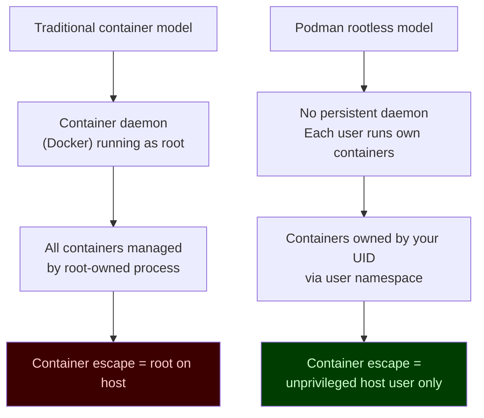
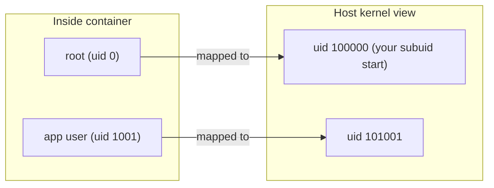

# Module 0: Setup (Fedora/RHEL + systemd)
[](../LICENSE.md)
[](https://access.redhat.com/products/red-hat-enterprise-linux)
[](https://podman.io)

<a id="table-of-contents"></a>

## Table of Contents

- [Learning Goals](#learning-goals)
- [Why Fedora/RHEL and Why Rootless](#why-fedorarhel-and-why-rootless)
- [Install](#install)
- [cgroups v2 Check (Required)](#cgroups-v2-check-required)
- [Rootless Prereqs](#rootless-prereqs)
- [Understanding the User Namespace Setup](#understanding-the-user-namespace-setup)
- [SELinux Quick Check (Fedora/RHEL)](#selinux-quick-check-fedorarhel)
- [First Container](#first-container)
- [Where Things Live (Rootless)](#where-things-live-rootless)
- [Create a Course Workspace](#create-a-course-workspace)
- [Recommended Shell Safety](#recommended-shell-safety)
- [Linger — Boot Safety for User Services](#linger--boot-safety-for-user-services)
- [Version Matrix and Compatibility Notes](#version-matrix-and-compatibility-notes)
- [Checkpoint](#checkpoint)
- [Quick Quiz](#quick-quiz)
- [Further Reading](#further-reading)

This course targets Fedora/RHEL-like systems with systemd, using rootless Podman.


[↑ Go to TOC](#table-of-contents)

## Learning Goals

- Install Podman and verify basic functionality.
- Confirm your system supports rootless containers (subuid/subgid).
- Know where logs and state live for rootless Podman.
- Confirm cgroups v2 is enabled (required for Quadlet).
- Set up a lab workspace and a few safety defaults.
- Enable lingering for boot-safe user services.


[↑ Go to TOC](#table-of-contents)

## Why Fedora/RHEL and Why Rootless

This course makes three deliberate choices:

1. **Fedora/RHEL** — because they ship a production-grade Podman, cgroups v2 by default, and SELinux enforcement. The security model is coherent out of the box.

2. **Rootless Podman** — because running containers as an unprivileged user means a container escape does not give the attacker root on the host. It is the right default for servers and developer machines alike.

3. **systemd (Quadlet)** — because systemd is already the init system on RHEL/Fedora. Using it for container lifecycle means you get restart policies, log aggregation, and boot integration for free, without a container daemon running as root.




[↑ Go to TOC](#table-of-contents)

## Install

**Fedora:**

```bash
sudo dnf install -y podman  # install Podman package
```

**RHEL 10 (package availability depends on subscription/repos):**

```bash
sudo dnf install -y podman  # install Podman package
```

**Verify the installation:**

```bash
podman --version  # print Podman version
podman info       # print Podman host configuration (storage, runtime, cgroups)
```

**Record your exact versions** — useful for debugging and for searching release notes:

```bash
podman --version                        # Podman version string
rpm -q podman 2>/dev/null || true       # RPM package version
rpm -q crun 2>/dev/null || true         # OCI runtime version
uname -r                                # kernel version
```

Minimum versions for this course:
- Podman ≥ 4.4 (for Quadlet support)
- cgroups v2 (kernel ≥ 5.2, all RHEL 9/10, Fedora 31+)


[↑ Go to TOC](#table-of-contents)

## cgroups v2 Check (Required)

**Quadlet requires cgroups v2.** Without it, `systemctl --user daemon-reload` generates units that may fail to enforce resource limits.

**Check:**

```bash
podman info --format '{{.Host.CgroupsVersion}}'  # expected: v2
```

Expected output: `v2`

If you see `v1`:
- On RHEL 8 or older kernels, cgroups v2 may not be the default.
- You can enable it: add `systemd.unified_cgroup_hierarchy=1` to the kernel command line in GRUB and reboot.
- For this course, upgrading to RHEL 9/10 or Fedora ≥ 31 is the easier path.

**Verify at the kernel level:**

```bash
stat -fc %T /sys/fs/cgroup  # should print: cgroup2fs
```


[↑ Go to TOC](#table-of-contents)

## Rootless Prereqs

Rootless Podman uses Linux **user namespaces** to map UIDs inside containers to unprivileged UIDs on the host. This requires `/etc/subuid` and `/etc/subgid` entries for your user.

**Check your subuids/subgids:**

```bash
grep "^$USER:" /etc/subuid /etc/subgid  # show subuid and subgid entries for current user
```

Expected output (example):

```
/etc/subuid:myuser:100000:65536
/etc/subgid:myuser:100000:65536
```

If those are missing, create them (coordinate the range with your admin policy):

```bash
sudo usermod --add-subuids 100000-165535 --add-subgids 100000-165535 "$USER"  # grant subuid/subgid range
```

**Log out and back in** after updating subuids/subgids — the kernel only reads these at session start.

Verify the mapping is active:

```bash
podman unshare cat /proc/self/uid_map  # show UID mapping inside user namespace
```


[↑ Go to TOC](#table-of-contents)

## Understanding the User Namespace Setup

When you run `podman run` as a non-root user:



The container's `root (uid 0)` is mapped to your first subuid (e.g., 100000) on the host. This means:
- The container process has "root" privileges inside its namespace.
- On the host, it runs as an unprivileged user (uid 100000).
- Even if the container escapes, the attacker has only uid 100000 — not real root.

This is why `/etc/subuid` and `/etc/subgid` are security-critical configuration, not just administrative overhead.


[↑ Go to TOC](#table-of-contents)

## SELinux Quick Check (Fedora/RHEL)

SELinux is usually enforcing on RHEL/Fedora. You do not need to understand the full policy model now, but you should be able to recognize when it affects your containers.

**Check SELinux mode:**

```bash
getenforce  # print SELinux mode: Enforcing, Permissive, or Disabled
```

**What this means for containers:**

| Mode | Effect on containers |
|---|---|
| Enforcing | SELinux labels are checked. Bind mounts need `:Z` or `:z`. |
| Permissive | SELinux denials are logged but not enforced. Containers work but you miss real denials. |
| Disabled | No SELinux. Not recommended in production. |

**Golden rules for this course:**

- Prefer **named volumes** over bind mounts — volumes are automatically labelled correctly.
- If you must use a bind mount, always add `:Z` (private) or `:z` (shared).
- Never disable SELinux to fix a container issue.

If you see `permission denied` errors that seem wrong, check for SELinux denials:

```bash
ausearch -m avc -ts recent 2>/dev/null || journalctl -b -t kernel -g denied  # check SELinux denials
```


[↑ Go to TOC](#table-of-contents)

## First Container

Run a simple container to verify everything is working:

```bash
podman run --rm docker.io/library/alpine:latest uname -a  # run container, print kernel info
```

If this works, you have:

- Network access to pull images from Docker Hub.
- A working storage backend (`overlay` or `vfs`).
- A working OCI runtime (`crun` on RHEL/Fedora).
- A working user namespace setup.

**Verify the storage driver in use:**

```bash
podman info --format '{{.Store.GraphDriverName}}'  # should print: overlay
```

`overlay` is the preferred driver. `vfs` works but is slower and uses more disk space.

**Verify the OCI runtime:**

```bash
podman info --format '{{.Host.OCIRuntime.Name}}'  # should print: crun
```


[↑ Go to TOC](#table-of-contents)

## Where Things Live (Rootless)

Understanding the directory layout helps you debug storage problems and know what to back up.

| Purpose | Path |
|---|---|
| Container image storage | `~/.local/share/containers/storage/` |
| Container runtime files | `/run/user/<uid>/containers/` |
| Quadlet unit files | `~/.config/containers/systemd/` |
| Podman secrets store | `~/.local/share/containers/storage/secrets/` |
| Podman config | `~/.config/containers/` |
| Registry auth cache | `${XDG_RUNTIME_DIR}/containers/auth.json` |

**Logs:**

```bash
podman logs <name>                           # container stdout/stderr logs
journalctl --user -u <service>.service       # Quadlet/systemd-managed container logs
journalctl --user -b -n 100 --no-pager       # all user-session log entries this boot
```

**Check disk usage for container storage:**

```bash
podman system df  # show disk usage: images, containers, volumes
```


[↑ Go to TOC](#table-of-contents)

## Create a Course Workspace

Pick a stable working directory for lab files:

```bash
mkdir -p ~/podman-labs  # create lab workspace
```

Set up a simple alias for the course repo (if cloned locally):

```bash
# Optional: keep a reference to your course repo
COURSE_REPO=~/course_podman   # path to the course git repo
```

You'll run most labs from this directory. Keep it tidy — label or prefix experiment containers so you can clean them up easily.


[↑ Go to TOC](#table-of-contents)

## Recommended Shell Safety

These reduce accidents in lab environments:

```bash
set -o noclobber   # prevent overwriting existing files with > redirect
```

Use `set -euo pipefail` in lab scripts:

```bash
#!/usr/bin/env bash
set -euo pipefail  # exit on error, unset variable, or pipe failure
```

- `-e`: exit immediately on error (prevents silently continuing after a failure).
- `-u`: treat unset variables as errors.
- `-o pipefail`: catch failures inside pipelines (e.g., `cmd1 | cmd2`).

Do not apply `set -e` interactively — it can cause confusing session exits.


[↑ Go to TOC](#table-of-contents)

## Linger — Boot Safety for User Services

Systemd user sessions normally only run while a user is logged in. For a server that should run containers at boot (before login), enable **lingering**:

```bash
sudo loginctl enable-linger "$USER"  # allow user services to start at boot, without login
```

**Verify linger is enabled:**

```bash
loginctl show-user "$USER" | grep Linger  # expected: Linger=yes
```

Without linger: your Quadlet services start only when you SSH in.
With linger: your Quadlet services start at boot, before any login.

This is a one-time setup per user on each machine.


[↑ Go to TOC](#table-of-contents)

## Version Matrix and Compatibility Notes

Different RHEL/Fedora versions ship different Podman versions. Key feature availability:

| Feature | Minimum Podman version |
|---|---|
| Quadlet (`.container` units) | 4.4 |
| `podman secret` | 3.1 |
| `podman play kube` | 3.0 |
| `podman auto-update` | 3.2 |
| `podman pod` | 1.0 |
| Build secrets (`--secret`) | 3.0 (via Buildah) |
| Health checks in Quadlet | 4.5 |

Check your version:

```bash
podman --version  # print Podman version
```

If a lab step fails unexpectedly, check whether your version supports the feature before debugging further.


[↑ Go to TOC](#table-of-contents)

## Checkpoint

- `podman info` runs without errors.
- `podman run --rm docker.io/library/alpine:latest uname -a` works rootless.
- `podman info --format '{{.Host.CgroupsVersion}}'` prints `v2`.
- `/etc/subuid` and `/etc/subgid` have entries for your user.
- `getenforce` prints `Enforcing` or `Permissive` (not Disabled).
- You know where container images are stored (`~/.local/share/containers/storage/`).


[↑ Go to TOC](#table-of-contents)

## Quick Quiz

1) What does `podman unshare` do, and when would you use it?

2) You run `podman run --rm alpine echo hello` and get `permission denied` on a bind-mounted directory. What is the first thing to check on an RHEL system?

3) What two things must be true for Quadlet services to start at boot without a login?

4) Why is cgroups v2 required for Quadlet? What breaks with cgroups v1?

5) Your colleague says "I disabled SELinux so my containers work". What security risk did they introduce?


[↑ Go to TOC](#table-of-contents)

## Further Reading

- Podman install docs: https://podman.io/docs/installation
- Rootless Podman tutorial: https://github.com/containers/podman/blob/main/docs/tutorials/rootless_tutorial.md
- cgroups v2 (kernel docs): https://www.kernel.org/doc/html/latest/admin-guide/cgroup-v2.html
- `loginctl` (linger for user services): https://www.freedesktop.org/software/systemd/man/latest/loginctl.html
- SELinux with containers (RHEL docs): https://docs.redhat.com/en/documentation/red_hat_enterprise_linux/9/html/using_selinux/assembly_using-selinux-with-containers_using-selinux
- `subuid(5)` man page: https://man7.org/linux/man-pages/man5/subuid.5.html


[↑ Go to TOC](#table-of-contents)

© 2026 UncleJS — Licensed under CC BY-NC-SA 4.0
