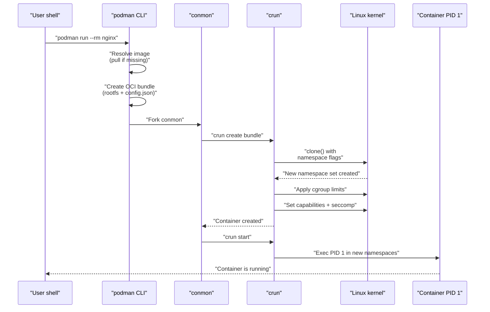
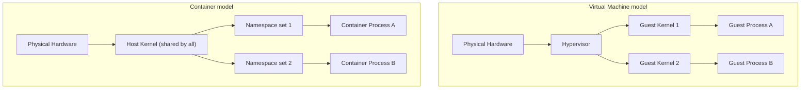
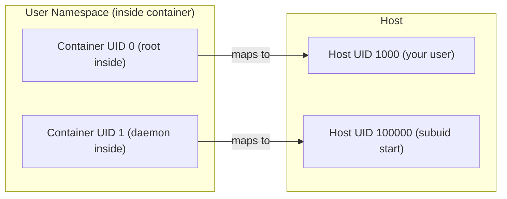
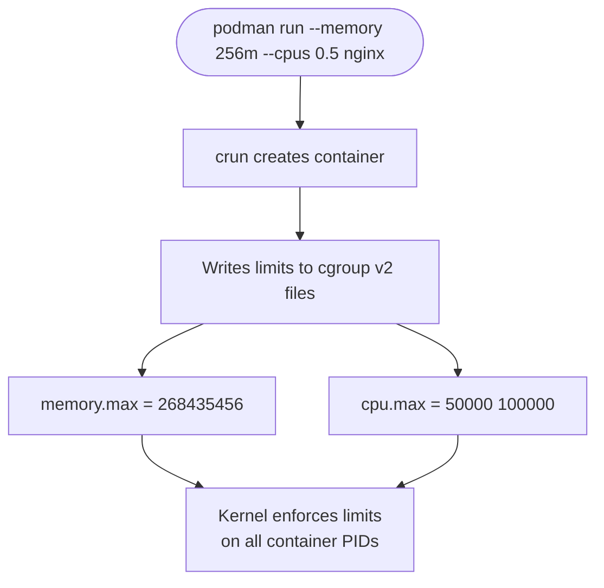
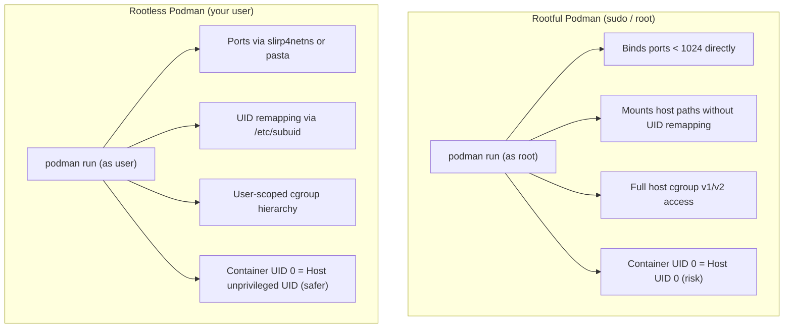

# Module 1: Containers 101
[](../LICENSE.md)
[](https://access.redhat.com/products/red-hat-enterprise-linux)
[](https://podman.io)

<a id="table-of-contents"></a>

## Table of Contents

- [Learning Goals](#learning-goals)
- [What Is a Container, Really?](#what-is-a-container-really)
- [The Three Things To Get Right](#the-three-things-to-get-right)
- [How `podman run` Works — Step by Step](#how-podman-run-works--step-by-step)
- [Containers Are Not VMs](#containers-are-not-vms)
- [Linux Namespaces — The Isolation Mechanism](#linux-namespaces--the-isolation-mechanism)
- [cgroups — The Resource Accounting Mechanism](#cgroups--the-resource-accounting-mechanism)
- [The OCI Standards](#the-oci-standards)
- [Rootless vs Rootful](#rootless-vs-rootful)
- [Terminology You Will See](#terminology-you-will-see)
- [Lab: Compare Host vs Container](#lab-compare-host-vs-container)
- [Lab: Namespace Exploration](#lab-namespace-exploration)
- [Checkpoint](#checkpoint)
- [Quick Quiz (Answer Without Running Commands)](#quick-quiz-answer-without-running-commands)
- [Further Reading](#further-reading)

---

## Learning Goals

By the end of this module you will be able to:

- Explain what a container is in terms of kernel mechanisms (namespaces + cgroups), not just analogy.
- Distinguish an **image** from a **container**.
- Trace the lifecycle of `podman run` from CLI invocation to PID 1 inside the container.
- Articulate why containers are not VMs and what that means for security.
- Choose rootless Podman by default and explain the tradeoff.
- Use correct OCI terminology in conversation.

[↑ Go to TOC](#table-of-contents)

---

## What Is a Container, Really?

A container is **a normal Linux process (or process tree) with extra kernel-enforced restrictions applied at launch time**.

That is all it is. There is no container hypervisor. There is no container kernel. Your container's PID 1 is just a process on the same Linux kernel as everything else on the machine — it simply has a restricted view of the world.

Those restrictions come from two kernel features:

1. **Namespaces** — limit what the process can *see* (other processes, network interfaces, filesystem mounts, hostnames, user IDs).
2. **cgroups** — limit what the process can *use* (CPU, memory, disk I/O, number of PIDs).

An image is the read-only recipe: a stack of filesystem layers plus metadata (entrypoint, environment variables, exposed ports, labels). A container is a *running instance* of an image — the image layers are used read-only, and a thin writable layer is placed on top for the lifetime of the container.

> **Analogy:** An image is a class definition. A container is an object instance. You can spin up a hundred containers from the same image, each with its own writable state, without modifying the image.

[↑ Go to TOC](#table-of-contents)

---

## The Three Things To Get Right

### 1. Image — the immutable template

- Built from a `Containerfile` (or pulled from a registry).
- Composed of ordered, read-only layers.
- Identified by a **tag** (mutable pointer) or a **digest** (immutable SHA256 hash).
- Never changes when you run it — all writes go to the container's writable layer.

### 2. Container — the running (or stopped) instance

A container adds to the image:

- A **process** (PID 1 and its children).
- A thin **writable layer** on top of the image layers (copy-on-write).
- **Mounts** — volumes, bind mounts, tmpfs, or secret files layered in.
- **Network settings** — IP address, DNS, published ports.
- **Environment variables** and runtime configuration.
- A **state machine**: `created → running → paused → exited → removed`.

### 3. Runtime boundaries

The container runtime (in Podman's case: `crun` by default) sets up:

- **Namespaces** — isolates the process's view of PIDs, network, mounts, UTS, IPC, users.
- **cgroups** — enforces resource limits.
- **seccomp** — filters which kernel syscalls are allowed (optional but recommended).
- **capabilities** — drops Linux capabilities the process does not need.
- **SELinux/AppArmor labels** — mandatory access control on Fedora/RHEL.

> **Critical mental model:** The kernel is always shared. A kernel exploit inside a container is a host exploit. Container security is about *reducing blast radius*, not achieving VM-grade isolation.

[↑ Go to TOC](#table-of-contents)

---

## How `podman run` Works — Step by Step

Understanding the lifecycle from CLI to PID 1 prevents a huge class of "why is my container doing this?" confusion.



**Key insight:** `podman` itself does not stay running while your container runs. It forks `conmon` (container monitor) and exits. `conmon` is the long-lived process that holds the container's stdio and watches for exit. This is why Podman is daemonless — unlike Docker, there is no central `dockerd` that must stay healthy for your containers to keep running.

If `dockerd` crashes, all Docker containers lose their stdio management. If `podman` exits (which it does immediately after launch), your containers are completely unaffected.

[↑ Go to TOC](#table-of-contents)

---

## Containers Are Not VMs

This is the most important conceptual distinction in this course. Getting it wrong leads to both operational mistakes and security blind spots.



| Property | VM | Container |
|---|---|---|
| Kernel | Each VM has its own | Shared host kernel |
| Boot time | Seconds to minutes | Milliseconds |
| Memory overhead | Hundreds of MB per VM | Tens of MB per container |
| Isolation level | Strong (hypervisor boundary) | Moderate (namespace boundary) |
| Kernel CVE impact | Guest kernel only | All containers on host |
| File system | Full virtual disk | Layered image + thin writable layer |
| Portability | Image includes kernel | Image includes only userspace |

**What this means practically:**

- You cannot run a Windows container on a Linux kernel (the container shares the host kernel).
- A kernel vulnerability that lets a process escape a namespace affects all containers on that host.
- Containers start in milliseconds because there is no kernel to boot.
- Containers are small because they do not need to ship a kernel.

[↑ Go to TOC](#table-of-contents)

---

## Linux Namespaces — The Isolation Mechanism

A **namespace** wraps a global system resource so that processes inside the namespace see their own isolated copy. The kernel tracks which namespace each process belongs to.

Podman uses these isolation namespaces by default. A `/proc/<pid>/ns` listing also shows `cgroup` (the cgroup namespace). That one is real, and this chapter treats it as out of scope beyond "resource limits live there":

| Namespace | Kernel flag | What it isolates | Effect in container |
|---|---|---|---|
| **PID** | `CLONE_NEWPID` | Process IDs | Container sees its own PID 1; cannot see host PIDs |
| **Network** | `CLONE_NEWNET` | Network interfaces, routing, ports | Container gets its own `eth0`; cannot see host `eth0` |
| **Mount** | `CLONE_NEWNS` | Filesystem mount points | Container sees its own root filesystem |
| **UTS** | `CLONE_NEWUTS` | Hostname, domain name | Container can have a different hostname |
| **IPC** | `CLONE_NEWIPC` | SysV IPC, POSIX message queues | Containers cannot IPC with each other by default |
| **User** | `CLONE_NEWUSER` | User and group IDs | Container's root (UID 0) maps to an unprivileged UID on the host |

The **User namespace** is the one that makes rootless containers secure. When you run Podman without `sudo`, your container's UID 0 (root) is mapped to your own unprivileged UID on the host. If the container process escapes every other namespace, it is still just your unprivileged user on the host.



Container UID 0 is your UID. Container UID 1 is the first subordinate UID from `/etc/subuid` (100000 in this example), not 100001. Container UID N (for N ≥ 1) maps to `subuid_start + N - 1`. The same numbers are in Module 0's `uid_map` example.

> **Why this matters:** Without user namespaces, a container running as root would be running as root on the host too. User namespaces are why rootless Podman is meaningfully more secure than rootful Docker for most workloads.

[↑ Go to TOC](#table-of-contents)

---

## cgroups — The Resource Accounting Mechanism

**Control groups (cgroups)** let the kernel track and limit the resources a process tree can consume. Without cgroups, a single runaway container could OOM the entire host.

Podman uses **cgroups v2** (the unified hierarchy) on modern RHEL 10 / Fedora systems.

Key cgroup controllers used by containers:

| Controller | What it limits |
|---|---|
| `memory` | Maximum RAM + swap; triggers OOM kill when exceeded |
| `cpu` | CPU share / quota (e.g., "max 0.5 cores") |
| `pids` | Maximum number of processes/threads (prevents fork bombs) |
| `io` | Block device I/O bandwidth and IOPS |
| `cpuset` | Which CPU cores and NUMA nodes are allowed |



`--memory 256m` writes `memory.max`. `--cpus 0.5` writes `cpu.max`. Neither flag sets `pids.max`. The default process limit comes from `containers.conf` (`pids_limit`, often 1024) unless you pass `--pids-limit`.

> **Practical note:** cgroups v2 requires a systemd user session when running rootless. This is why the course targets RHEL 10 / Fedora with `loginctl enable-linger` — it keeps your user session and cgroup hierarchy alive even when you are logged out.

[↑ Go to TOC](#table-of-contents)

---

## The OCI Standards

**OCI** stands for the Open Container Initiative. It defines three standards that make container tooling interoperable:

| Standard | What it specifies | Why it matters |
|---|---|---|
| **Image Spec** | How image layers and manifests are structured | You can build with Podman, push to a registry, pull with containerd |
| **Runtime Spec** | The `config.json` format that runtimes consume | `crun`, `runc`, `kata-containers` all accept the same bundle |
| **Distribution Spec** | The HTTP API for pushing/pulling images | Every major registry (quay.io, ghcr.io, docker.io) speaks the same protocol |

This is why the course uses `Containerfile` rather than `Dockerfile` — both produce OCI images, but `Containerfile` is the name used by Podman/Buildah and makes the OCI-first intent explicit.

> **Practical implication:** Any image you build with Podman will run on Kubernetes, containerd, or any other OCI-compliant runtime. The ecosystem is genuinely interoperable at the image and distribution layers.

[↑ Go to TOC](#table-of-contents)

---

## Rootless vs Rootful



**When to use rootful:**
- You genuinely need to bind a port < 1024 without OS-level workarounds.
- You need `macvlan` or `ipvlan` network drivers.
- You are running a CI agent that itself orchestrates containers.
- You are explicitly told by an ops team that rootful is required for the workload.

**Default choice: rootless.** This course uses rootless Podman throughout. Every lab assumes you are running as an ordinary user, not root.

> **Warning:** Running containers rootful on a multi-user system means a container escape is a root escape. Always question whether you truly need it.

[↑ Go to TOC](#table-of-contents)

---

## Terminology You Will See

| Term | Definition |
|---|---|
| **Image** | Read-only layer stack + metadata. The "recipe". |
| **Container** | Running (or stopped) instance of an image. Has state. |
| **Registry** | HTTP server that stores and serves images (quay.io, ghcr.io, docker.io). |
| **Tag** | Mutable human-readable pointer to an image (e.g. `nginx:1.27`). Can be moved. |
| **Digest** | Immutable SHA256 content hash of an image manifest (e.g. `sha256:abc123…`). |
| **OCI** | Open Container Initiative — the standards body for image/runtime/distribution specs. |
| **Containerfile** | The build recipe (Podman's name for what Docker calls a Dockerfile). |
| **Layer** | A diff of filesystem changes. Layers are stacked to form the image rootfs. |
| **crun** | The default OCI runtime used by Podman (written in C; faster and smaller than runc). |
| **conmon** | Container monitor process — manages stdio and exit detection per container. |
| **rootless** | Running Podman (and containers) as an unprivileged user, using user namespaces. |
| **rootful** | Running Podman as root. Required for some advanced networking and capabilities. |
| **pasta** | Default rootless network helper on Podman 5 / RHEL 10. Connects the rootless network namespace to the host. |
| **slirp4netns** | Previous default rootless network helper. Still used when `default_rootless_network_cmd` is set to it. |

[↑ Go to TOC](#table-of-contents)

---

## Lab: Compare Host vs Container

This lab makes the namespace isolation concrete. You will run the same commands on the host and inside a container and compare the output.

**Step 1 — Check process isolation (PID namespace)**

On the host, list processes:

```bash
ps aux | head -20  # list running processes on the host
```

You will see dozens of processes with various PIDs. Now run the same command inside a container:

```bash
podman run --rm docker.io/library/alpine:latest ps aux  # run a container and list its processes
```

You should see one process line: `ps` itself. There is no shell. The container has a completely separate PID namespace — it cannot see the host's processes.

**Step 2 — Check network isolation (network namespace)**

On the host:

```bash
ip addr show  # show network interfaces on the host
```

You will see your real `eth0` or `enpXs0`. Inside a container:

```bash
podman run --rm registry.fedoraproject.org/fedora:latest ip addr show  # alpine has no ip; fedora does
```

The container sees only `lo` (loopback) and `eth0` inside its own network namespace. The `eth0` inside is a virtual ethernet device — not the host's real interface.

**Step 3 — Check hostname isolation (UTS namespace)**

```bash
hostname  # show current hostname on the host
podman run --rm docker.io/library/alpine:latest hostname  # run a container and show its hostname
```

The container gets an auto-generated hostname (the container ID prefix) by default.

**Step 4 — Observe the UID mapping (user namespace)**

```bash
id  # show your user and group IDs on the host
podman run --rm docker.io/library/alpine:latest id  # run a container and show its uid/gid
```

Inside the container you are `uid=0(root)`. But from the host's perspective:

```bash
podman run -d --name uid-check docker.io/library/alpine:latest sleep 60  # run a container in background
sleep 1
ps aux | grep "sleep 60"  # check what UID the sleep process has on the host
podman rm -f uid-check  # clean up
```

You will see it running as your own UID on the host — not as root. This is the user namespace mapping in action.

**What just happened?**

Each `podman run` call set up a fresh set of namespaces. The container got its own PID tree, its own network stack, its own hostname, and a user namespace that remapped root to your unprivileged UID. All of these are kernel features — no special container software was needed beyond the runtime that called `clone()` with the right flags.

[↑ Go to TOC](#table-of-contents)

---

## Lab: Namespace Exploration

This lab looks directly at the namespace file descriptors to make the abstraction tangible.

**Step 1 — Start a long-running container**

```bash
podman run -d --name ns-demo docker.io/library/alpine:latest sleep 300  # run a detached container
```

**Step 2 — Find the PID of the container's main process on the host**

```bash
CPID=$(podman inspect ns-demo --format '{{.State.Pid}}')  # get the container's host PID
echo "Container PID on host: $CPID"
```

**Step 3 — List the namespace symlinks**

```bash
ls -la /proc/$CPID/ns/  # list the namespace file descriptors for this PID
```

You will see entries like:

```
lrwxrwxrwx ... cgroup -> cgroup:[4026531835]
lrwxrwxrwx ... ipc    -> ipc:[4026532768]
lrwxrwxrwx ... mnt    -> mnt:[4026532766]
lrwxrwxrwx ... net    -> net:[4026532771]
lrwxrwxrwx ... pid    -> pid:[4026532769]
lrwxrwxrwx ... user   -> user:[4026532765]
lrwxrwxrwx ... uts    -> uts:[4026532767]
```

`cgroup` is in the listing too. The table earlier in this module covers the six isolation namespaces; the cgroup namespace is where resource limits attach, and Module 0 already required cgroups v2.

Each inode number (the number after the colon) is the unique identity of that namespace. Compare these to your shell's namespaces:

```bash
ls -la /proc/self/ns/  # list your own shell's namespace file descriptors
```

The inode numbers for `net`, `pid`, `mnt`, and `user` will be different — confirming the container is truly in separate namespaces.

**Step 4 — Clean up**

```bash
podman stop ns-demo && podman rm ns-demo  # stop and remove the container
```

[↑ Go to TOC](#table-of-contents)

---

## Checkpoint

Before moving on, confirm you can answer these without referring to notes:

- [ ] I can explain the difference between an image and a container.
- [ ] I know that containers share the host kernel and why that matters for security.
- [ ] I can name the isolation namespaces Podman uses and what each one isolates.
- [ ] I understand that rootless Podman maps container UID 0 to an unprivileged host UID.
- [ ] I can explain what cgroups do and why they matter.
- [ ] I know what OCI stands for and why the standard matters for portability.
- [ ] I have run the host vs container comparison lab and seen namespace isolation with my own eyes.

[↑ Go to TOC](#table-of-contents)

---

## Quick Quiz (Answer Without Running Commands)

1. You run `podman run --rm docker.io/library/alpine:latest ps aux` and see only one process line (`ps` itself). Why does the container not see the hundreds of processes running on the host?

2. A coworker says "just run it as root, it's fine, it's in a container." What is the specific risk they are dismissing?

3. What is the difference between a tag like `nginx:1.27` and a digest like `sha256:abc123…`? When would you prefer each?

4. Why does Podman not have a daemon that must keep running for your containers to stay alive?

5. A container is using 512 MB of RAM but you set `--memory 256m`. What does the kernel do?

[↑ Go to TOC](#table-of-contents)

---

## Further Reading

- OCI image spec: https://github.com/opencontainers/image-spec
- OCI runtime spec: https://github.com/opencontainers/runtime-spec
- Linux namespaces man page: https://man7.org/linux/man-pages/man7/namespaces.7.html
- Linux cgroups man page: https://man7.org/linux/man-pages/man7/cgroups.7.html
- User namespaces man page: https://man7.org/linux/man-pages/man7/user_namespaces.7.html
- crun (OCI runtime): https://github.com/containers/crun
- conmon (container monitor): https://github.com/containers/conmon
- Podman rootless overview: https://github.com/containers/podman/blob/main/docs/tutorials/rootless_tutorial.md
- pasta (network tool): https://passt.top
- Podman overview docs: https://podman.io/docs

[↑ Go to TOC](#table-of-contents)

© 2026 UncleJS — Licensed under CC BY-NC-SA 4.0
