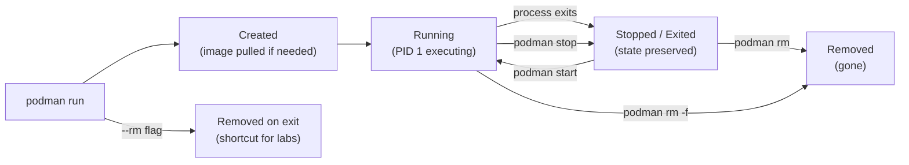

# Module 2: Everyday Podman Commands
[](../LICENSE.md)
[](https://access.redhat.com/products/red-hat-enterprise-linux)
[](https://podman.io)

<a id="table-of-contents"></a>

## Table of Contents

- [Learning Goals](#learning-goals)
- [The Container Lifecycle](#the-container-lifecycle)
- [Core Commands](#core-commands)
- [Useful Flags (Learn These Early)](#useful-flags-learn-these-early)
- [Inspecting and Debugging](#inspecting-and-debugging)
- [Lab: The Writable Layer Is Not Persistence](#lab-the-writable-layer-is-not-persistence)
- [Lab: Name Your Containers](#lab-name-your-containers)
- [Lab: Exit Codes and Restart Behavior](#lab-exit-codes-and-restart-behavior)
- [Formatting Output](#formatting-output)
- [Cleaning Up Without Nuking Your System](#cleaning-up-without-nuking-your-system)
- [Checkpoint](#checkpoint)
- [Quick Quiz](#quick-quiz)
- [Further Reading](#further-reading)


[↑ Go to TOC](#table-of-contents)

## Learning Goals

- Run containers interactively and in the background.
- Use `logs` and `exec` to debug running containers.
- Understand the container lifecycle (create → start → running → stopped → removed).
- Clean up containers and images safely.
- Understand naming, exit codes, and restart behavior.
- Format `podman ps` and `podman inspect` output for scripts.


[↑ Go to TOC](#table-of-contents)

## The Container Lifecycle

Understanding the lifecycle prevents a common confusion: the difference between a container that "exists" and one that is "running".



Key states:

| State | `podman ps` shows it | Container data exists | Process running |
|---|---|---|---|
| Running | Yes (default) | Yes | Yes |
| Stopped/Exited | Only with `-a` | Yes | No |
| Removed | Never | No | No |

This is why `podman ps` without `-a` shows nothing after a container exits — the state still exists, just stopped. Use `podman ps -a` to see all containers.


[↑ Go to TOC](#table-of-contents)

## Core Commands

**Run and remove when done** (good default for experiments):

```bash
podman run --rm docker.io/library/alpine:latest echo hello  # run, then auto-remove on exit
```

**Run a long-lived container in the background:**

```bash
podman run -d --name sleep1 docker.io/library/alpine:latest sleep 600  # detached, named container
podman ps                                                                # list running containers
```

**List all containers** (including stopped):

```bash
podman ps -a  # list all containers regardless of state
```

**View container logs:**

```bash
podman logs sleep1           # print all logs since container start
podman logs -f sleep1        # follow/tail logs in real time
podman logs --tail 20 sleep1 # show only last 20 lines
```

**Execute a command in a running container:**

```bash
podman exec -it sleep1 sh  # interactive shell inside running container
```

Tip: if the image doesn't have `sh`, try `bash`. For minimal images (Alpine uses `ash`), `sh` works. For distroless images, you may need an ephemeral debug container.

**Stop, start, and remove:**

```bash
podman stop sleep1    # graceful stop (SIGTERM, then SIGKILL after timeout)
podman start sleep1   # restart a stopped container (reuses same writable layer)
podman rm sleep1      # remove a stopped container
podman rm -f sleep1   # force-remove (stops if running, then removes)
```

**Wait for a container to exit:**

```bash
podman wait sleep1   # blocks until container exits, prints exit code
```

**Inspect exit code:**

```bash
podman inspect sleep1 --format '{{.State.ExitCode}}'  # get last exit code
```


[↑ Go to TOC](#table-of-contents)

## Useful Flags (Learn These Early)

| Flag | Purpose | Example |
|---|---|---|
| `--name <name>` | Stable name for scripts and `exec` | `--name mydb` |
| `-d` | Detached (background) | `podman run -d ...` |
| `--rm` | Auto-remove on exit | For experiments only |
| `-it` | Interactive + TTY | `podman run -it alpine sh` |
| `-e KEY=VALUE` | Environment variable | Avoid for secrets |
| `-v name:/path` | Mount named volume | `--v dbdata:/var/lib/mysql` |
| `-p host:container` | Publish port | `-p 8080:80` |
| `--network <net>` | Join a network | `--network mynet` |
| `--user <uid[:gid]>` | Run as specific user | `--user 1001:1001` |
| `--secret <name>` | Mount a Podman secret | `--secret db_password` |
| `--read-only` | Read-only root FS | Security hardening |
| `--tmpfs /path` | In-memory writable directory | `--tmpfs /tmp` |
| `--memory 256m` | Memory limit | Resource limiting |
| `--restart on-failure` | Restart policy | For `podman run`, not Quadlet |

Mnemonic: **"D-NAME-IT: Detach, Name, Interactive, Env, Volume, Publish, Network, User, Secret"**


[↑ Go to TOC](#table-of-contents)

## Inspecting and Debugging

**Quick status overview:**

```bash
podman ps -a --format 'table {{.Names}}\t{{.Status}}\t{{.Ports}}'  # formatted container list
```

**Inspect all metadata as JSON:**

```bash
podman inspect sleep1  # full JSON metadata: config, state, mounts, network, etc.
```

**Extract a specific field:**

```bash
podman inspect sleep1 --format '{{.State.Status}}'         # running / exited
podman inspect sleep1 --format '{{.State.ExitCode}}'       # exit code
podman inspect sleep1 --format '{{.NetworkSettings.IPAddress}}'  # container IP
podman inspect sleep1 --format '{{json .HostConfig}}'      # host config as JSON
```

**Check what ports are published:**

```bash
podman port sleep1  # list all port mappings for a container
```

**Inspect a running process list inside the container:**

```bash
podman top sleep1  # show running processes inside container
```

**View resource usage:**

```bash
podman stats --no-stream  # single snapshot of CPU/memory/IO usage for all running containers
```

**Debug a minimal image without a shell:**

If your production image is distroless or has no shell, use `podman debug`:

```bash
podman debug sleep1  # attach a debug container to an existing container's namespaces
```

Or use an ephemeral container on the same network:

```bash
podman run --rm --network container:sleep1 docker.io/library/busybox:latest netstat -tlnp  # share network namespace
```


[↑ Go to TOC](#table-of-contents)

## Lab: The Writable Layer Is Not Persistence

Every container has a **writable layer** on top of its image. Writes go there, not into the image. When the container is removed, the writable layer is gone.

**Step 1: Create a file inside a container:**

```bash
podman run -it --name scratch docker.io/library/alpine:latest sh  # run interactive container
```

Inside the container:

```sh
echo "I was here" > /tmp/hello.txt  # write a file to the writable layer
cat /tmp/hello.txt                   # confirm it's there
exit
```

**Step 2: The container stopped. The file still exists in the stopped container:**

```bash
podman ps -a                         # scratch is stopped but exists
podman start scratch                 # restart the same container
podman exec scratch cat /tmp/hello.txt  # file is still there (same writable layer)
podman stop scratch
```

**Step 3: Remove the container and recreate it — file is gone:**

```bash
podman rm scratch                                                     # destroy the writable layer
podman run -it --name scratch docker.io/library/alpine:latest sh     # fresh writable layer
```

Inside:

```sh
ls /tmp/hello.txt  # file is gone — expected!
exit
```

**Cleanup:**

```bash
podman rm scratch  # clean up
```

**The lesson**: `podman stop` preserves state; `podman rm` destroys it. To persist data across container replacements, use **named volumes** (Module 5).


[↑ Go to TOC](#table-of-contents)

## Lab: Name Your Containers

Unnamed containers get random two-word names (`romantic_currie`, `busy_wozniak`). These are fine for experiments but break automation.

**Step 1: Run two containers with explicit names:**

```bash
podman run -d --name worker-a docker.io/library/alpine:latest sleep 300  # named container A
podman run -d --name worker-b docker.io/library/alpine:latest sleep 300  # named container B
podman ps  # both should be listed
```

**Step 2: Reference by name in exec:**

```bash
podman exec worker-a hostname  # prints worker-a (container hostname defaults to container name)
podman exec worker-b hostname  # prints worker-b
```

**Step 3: Try to reuse a name and observe the error:**

```bash
podman run -d --name worker-a docker.io/library/alpine:latest sleep 300  # should fail
```

Expected: `Error: container name "worker-a" is already in use`

This teaches you to clean up before re-running scripts, or use `podman rm -f worker-a` first.

**Cleanup:**

```bash
podman rm -f worker-a worker-b  # stop and remove both
```


[↑ Go to TOC](#table-of-contents)

## Lab: Exit Codes and Restart Behavior

Exit codes tell you why a container stopped. Knowing them speeds up debugging.

| Exit code | Meaning |
|---|---|
| 0 | Clean exit (process finished normally) |
| 1 | General error (check logs) |
| 125 | Podman itself errored (not the container) |
| 126 | Command found but not executable |
| 127 | Command not found |
| 130 | Killed by Ctrl+C (SIGINT) |
| 137 | Killed by SIGKILL (OOM killer, or `podman kill`) |
| 143 | Killed by SIGTERM (`podman stop`) |

**Step 1: Observe a clean exit (code 0):**

```bash
podman run --name exit0 docker.io/library/alpine:latest echo hello  # exits with code 0
podman inspect exit0 --format '{{.State.ExitCode}}'                  # should print: 0
podman rm exit0
```

**Step 2: Observe an error exit (code 1):**

```bash
podman run --name exit1 docker.io/library/alpine:latest sh -c 'exit 1'  # exits with code 1
podman inspect exit1 --format '{{.State.ExitCode}}'                      # should print: 1
podman rm exit1
```

**Step 3: Observe command-not-found (code 127):**

```bash
podman run --rm docker.io/library/alpine:latest notacommand  # should fail with 127
echo "Exit code: $?"  # print the exit code
```

**Step 4: Observe OOM kill (code 137) — safe with a memory limit:**

```bash
podman run --rm --memory 4m docker.io/library/alpine:latest sh -c 'dd if=/dev/zero of=/tmp/x bs=1M count=10'
echo "Exit code: $?"  # 137 if OOM-killed, or the dd may just fail
```


[↑ Go to TOC](#table-of-contents)

## Formatting Output

`podman ps`, `podman images`, and `podman inspect` all support Go template formatting.

**Common ps formats:**

```bash
podman ps --format '{{.Names}}'                                          # just names
podman ps --format '{{.Names}}\t{{.Status}}'                             # names and status
podman ps --format 'table {{.Names}}\t{{.Status}}\t{{.Ports}}'          # table with headers
podman ps -a --format json                                                # full JSON output
```

**Inspect with templates:**

```bash
podman inspect mycontainer --format '{{.State.Status}}'                  # status string
podman inspect mycontainer --format '{{.Config.Image}}'                  # image used
podman inspect mycontainer --format '{{range .Mounts}}{{.Destination}} {{end}}'  # list mount paths
```

**Images:**

```bash
podman images --format '{{.Repository}}:{{.Tag}}\t{{.Size}}'            # name:tag and size
podman images --digests --format '{{.Repository}}\t{{.Digest}}'         # show digests
```


[↑ Go to TOC](#table-of-contents)

## Cleaning Up Without Nuking Your System

**See what you have:**

```bash
podman ps -a                  # all containers (running and stopped)
podman images                 # all images
podman volume ls              # all named volumes
podman network ls             # all networks
```

**Safe cleanup — stopped containers only:**

```bash
podman container prune -f     # remove all stopped containers (leaves running ones alone)
```

**Safe cleanup — dangling images (untagged, not used by any container):**

```bash
podman image prune -f         # remove dangling images only
```

**More aggressive — all unused images (not used by any container, running or stopped):**

```bash
podman image prune -a -f      # removes ALL images not referenced by a container
```

⚠️ This will force a re-pull next time you run a container. On slow connections, be selective.

**System-wide prune (containers + networks + images, no volumes):**

```bash
podman system prune -f        # remove stopped containers, unused networks, dangling images
```

**Check disk usage before pruning:**

```bash
podman system df              # show disk usage breakdown: images, containers, volumes
```

Rule of thumb: `container prune` is safe to run daily. `image prune -a` should be deliberate.


[↑ Go to TOC](#table-of-contents)

## Checkpoint

- You can use `podman logs` and `podman exec` without guessing.
- You understand why `podman ps` vs `podman ps -a` give different results.
- You understand why volumes exist — the writable layer is not persistence.
- You can read a container exit code and know what it means.
- You can format `podman ps` output for scripts.


[↑ Go to TOC](#table-of-contents)

## Quick Quiz

1) What is the difference between `podman run` and `podman start`?

2) A container exits immediately after you start it. Where do you look first?

3) `podman ps` shows nothing. Does that mean no containers exist? How do you check?

4) You run the same `podman run --name myapp ...` command twice. The second run fails. Why, and how do you fix it?

5) Exit code 137 — what likely happened?

6) How would you get the IP address of a running container without using `podman exec`?


[↑ Go to TOC](#table-of-contents)

## Further Reading

- `podman-run(1)`: https://docs.podman.io/en/latest/markdown/podman-run.1.html
- `podman-ps(1)`: https://docs.podman.io/en/latest/markdown/podman-ps.1.html
- `podman-logs(1)`: https://docs.podman.io/en/latest/markdown/podman-logs.1.html
- `podman-exec(1)`: https://docs.podman.io/en/latest/markdown/podman-exec.1.html
- `podman-inspect(1)`: https://docs.podman.io/en/latest/markdown/podman-inspect.1.html
- Go template formatting: https://pkg.go.dev/text/template


[↑ Go to TOC](#table-of-contents)

© 2026 UncleJS — Licensed under CC BY-NC-SA 4.0
