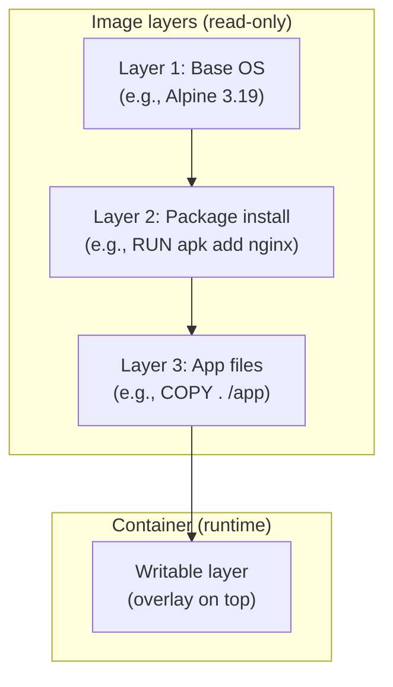
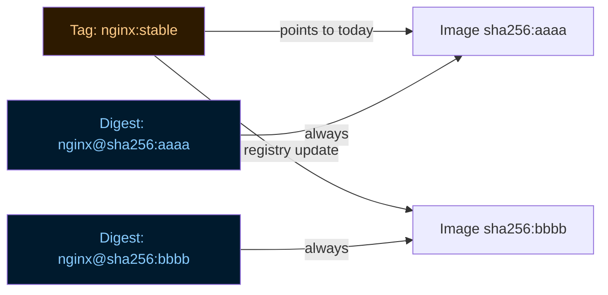

# Module 3: Images and Registries
[](../LICENSE.md)
[](https://access.redhat.com/products/red-hat-enterprise-linux)
[](https://podman.io)

<a id="table-of-contents"></a>

## Table of Contents

- [Learning Goals](#learning-goals)
- [What Is an Image](#what-is-an-image)
- [Tags vs Digests](#tags-vs-digests)
- [Fully Qualified Image Names](#fully-qualified-image-names)
- [Short-Name Resolution and registries.conf](#short-name-resolution-and-registriesconf)
- [Lab: Pull by Tag, Record Digest](#lab-pull-by-tag-record-digest)
- [Registry Authentication](#registry-authentication)
- [Image Metadata: ENTRYPOINT vs CMD](#image-metadata-entrypoint-vs-cmd)
- [Inspecting Image Layers](#inspecting-image-layers)
- [Lab: Local Tagging](#lab-local-tagging)
- [Lab (Optional): Push to a Local Registry](#lab-optional-push-to-a-local-registry)
- [Lab (Optional): Save and Load](#lab-optional-save-and-load)
- [Image Storage on Disk](#image-storage-on-disk)
- [Checkpoint](#checkpoint)
- [Quick Quiz](#quick-quiz)
- [Further Reading](#further-reading)


[↑ Go to TOC](#table-of-contents)

## Learning Goals

- Understand what a container image is and how it is structured in layers.
- Pull images by tag and by digest.
- Explain why digests are safer than tags for production.
- Inspect image metadata (entrypoint, CMD, exposed ports, labels).
- Understand short-name resolution and why fully qualified names matter.
- Authenticate to a registry without leaking credentials to shell history.


[↑ Go to TOC](#table-of-contents)

## What Is an Image

A container image is a **stack of read-only filesystem layers** plus metadata. Each layer represents a filesystem diff from the layer below it.



Key properties:

- **Layers are content-addressed** by SHA256 digest. Two images sharing a layer share the same data on disk.
- **Layers are immutable** — once built, they never change. A new `podman build` creates new layers.
- **The writable layer** is added per-container at runtime. It is discarded on `podman rm`.
- **The image digest** is a SHA256 of the image manifest (which includes all layer digests). It is globally unique and immutable.


[↑ Go to TOC](#table-of-contents)

## Tags vs Digests

A **tag** (like `:latest`, `:stable`, `:3.19`) is a mutable human-readable pointer. The registry can move a tag to point to a different image at any time.

A **digest** (like `@sha256:abc123...`) is a content-addressed, immutable identifier. It always refers to the exact same bytes.



**Practical consequences:**

| Scenario | Tag | Digest |
|---|---|---|
| Reproduce a bug | ❌ Tag may have moved | ✅ Exact bytes |
| Audit what ran in production | ❌ Tag is ambiguous | ✅ Exact bytes |
| Auto-update to latest patch | ✅ Tag moves forward | ❌ Must update manually |
| Incident response: "what version is running?" | ❌ Need to check digest at time of deploy | ✅ Digest is the version |

**For production**: pin by digest. Record it. Upgrade by explicitly choosing a new digest.


[↑ Go to TOC](#table-of-contents)

## Fully Qualified Image Names

Always use the full registry + namespace + image + tag/digest form:

```
docker.io/library/nginx:stable
^^^^^^^   ^^^^^^^  ^^^^^  ^^^^^^
registry  namespace image  tag
```

Avoid relying on short names:

```
nginx:stable        # short name — Podman must guess the registry
alpine              # even shorter — registry AND tag are guessed
```

**Why it matters**: short-name resolution depends on `/etc/containers/registries.conf`. On different systems, `alpine` might resolve to `docker.io/library/alpine` or `registry.access.redhat.com/ubi9-minimal` depending on search order. This makes automation unpredictable.

Short names in labs are fine for exploration. Short names in scripts, Containerfiles, and Quadlet units should be replaced with fully qualified names.


[↑ Go to TOC](#table-of-contents)

## Short-Name Resolution and registries.conf

Podman's short-name resolution is configured in `/etc/containers/registries.conf` (system-wide) and `~/.config/containers/registries.conf` (per-user).

**View system config:**

```bash
cat /etc/containers/registries.conf  # show registry search order and aliases
```

**Common settings:**

```toml
# Ordered list of registries to search for short names:
unqualified-search-registries = ["docker.io", "registry.access.redhat.com"]

# Alias: "fedora" → fully qualified name:
[[registry.aliases]]
"fedora" = "registry.fedoraproject.org/fedora"
```

On RHEL systems, the `registries.conf` is often configured to prompt for registry selection interactively when a short name is used. This is intentional — it prevents silently pulling from the wrong registry.

In automation (scripts, CIs, Containerfiles), always use fully qualified names to avoid this prompt.


[↑ Go to TOC](#table-of-contents)

## Lab: Pull by Tag, Record Digest

**Step 1: Pull by tag:**

```bash
podman pull docker.io/library/alpine:latest  # pull Alpine latest tag
podman images | grep alpine                  # confirm image is stored locally
```

**Step 2: Inspect the image to get the digest:**

```bash
podman images --digests | grep alpine                                           # show digest column
podman inspect docker.io/library/alpine:latest --format '{{.Digest}}'          # print digest only
```

Record the digest — it looks like `sha256:abc123...`

**Step 3: Pull the exact same image by digest:**

```bash
# Replace <digest> with your actual digest from step 2:
podman pull docker.io/library/alpine@sha256:<digest>  # pull by immutable digest
podman images --digests | grep alpine                  # now you see both entries (same layers, different ref)
```

**Step 4: Run by digest:**

```bash
podman run --rm docker.io/library/alpine@sha256:<digest> uname -a  # run pinned image
```

**Step 5: Verify layer sharing:**

```bash
podman system df  # images section — pinned and tag-based share the same layers
```


[↑ Go to TOC](#table-of-contents)

## Registry Authentication

**Login to a registry:**

```bash
podman login docker.io         # prompts for username and password interactively
podman login registry.example.com  # login to a private registry
```

Credentials are stored in: `${XDG_RUNTIME_DIR}/containers/auth.json`

**Logout:**

```bash
podman logout docker.io  # remove stored credentials for this registry
```

**Do not put credentials in shell history.** Always let `podman login` prompt interactively, or use a credentials file:

```bash
podman login --username myuser --password-stdin docker.io < /run/secrets/registry_password  # read password from file
```

For CI environments, use environment variables supported by your registry or pass a pre-created `auth.json` via `--authfile`.


[↑ Go to TOC](#table-of-contents)

## Image Metadata: ENTRYPOINT vs CMD

Every image has two pieces of default execution config:

- **ENTRYPOINT**: the program that always runs. Cannot be overridden by arguments.
- **CMD**: the default arguments to pass to ENTRYPOINT (or the default command if ENTRYPOINT is not set).

**How they combine:**

| ENTRYPOINT | CMD | `podman run myimage` runs | `podman run myimage foo` runs |
|---|---|---|---|
| `["/app"]` | `["--help"]` | `/app --help` | `/app foo` |
| (none) | `["sh"]` | `sh` | `foo` |
| `["sh", "-c"]` | `["echo hi"]` | `sh -c 'echo hi'` | `sh -c 'foo'` |

**Inspect these fields:**

```bash
podman image inspect docker.io/library/nginx:stable \
  --format '{{.Config.Entrypoint}} | {{.Config.Cmd}}'  # show ENTRYPOINT and CMD
```

**Override CMD at runtime:**

```bash
podman run --rm docker.io/library/nginx:stable nginx -v  # override CMD: run nginx -v instead of default
```

**Override ENTRYPOINT at runtime:**

```bash
podman run --rm --entrypoint sh docker.io/library/nginx:stable -c 'echo hello'  # replace ENTRYPOINT entirely
```

**Inspect exposed ports:**

```bash
podman image inspect docker.io/library/nginx:stable --format '{{.Config.ExposedPorts}}'  # what ports the image documents
```

Note: `ExposedPorts` is documentation — it does not automatically publish ports. You must use `-p host:container` to publish.


[↑ Go to TOC](#table-of-contents)

## Inspecting Image Layers

**List layers (history):**

```bash
podman history docker.io/library/nginx:stable  # show image layer history with sizes and commands
```

This shows each layer, when it was created, what command produced it, and how large it is.

**Why this matters for security**: if a `RUN` step accidentally includes a secret (even if a later step tries to "delete" it), the secret is still in the intermediate layer and visible via `podman history`.

**Inspect image manifest:**

```bash
podman manifest inspect docker.io/library/nginx:stable  # show OCI manifest (multi-arch info)
```

**Diff two containers' filesystems:**

```bash
podman diff mycontainer  # show what changed in the writable layer vs the image
```

This is useful after running a container to see what it wrote.


[↑ Go to TOC](#table-of-contents)

## Lab: Local Tagging

Tags are just aliases. You can create local aliases for any image.

**Step 1: Pull an image:**

```bash
podman pull docker.io/library/nginx:stable  # pull nginx stable
```

**Step 2: Tag it with a local alias:**

```bash
podman tag docker.io/library/nginx:stable localhost/nginx:course  # create a local alias
podman images | grep nginx                                          # both entries exist, same image ID
```

**Step 3: Run using the local alias:**

```bash
podman run --rm localhost/nginx:course nginx -v  # run using the local tag
```

**Step 4: Remove the local alias (does not remove the original):**

```bash
podman rmi localhost/nginx:course  # untag (removes the alias, not the image if other tags exist)
podman images | grep nginx         # original docker.io tag still exists
```


[↑ Go to TOC](#table-of-contents)

## Lab (Optional): Push to a Local Registry

This teaches the full pull → build → tag → push flow without needing a real external registry.

**Step 1: Start a local registry:**

```bash
podman run -d --name registry -p 5000:5000 docker.io/library/registry:2  # start local registry
```

**Step 2: Tag and push to the local registry:**

```bash
podman pull docker.io/library/alpine:latest                          # pull base image
podman tag docker.io/library/alpine:latest localhost:5000/alpine:course  # tag for local registry
podman push --tls-verify=false localhost:5000/alpine:course          # push to local registry (HTTP, lab only)
```

Note: `--tls-verify=false` is acceptable for a local lab registry on loopback. Never use it for production.

**Step 3: Pull from the local registry:**

```bash
podman rmi localhost:5000/alpine:course                     # remove local copy
podman pull --tls-verify=false localhost:5000/alpine:course # pull from local registry
```

**Step 4: Cleanup:**

```bash
podman rm -f registry  # stop and remove the local registry container
```

For a production-grade local registry with TLS, use certificates and a proper configuration. The Registry v2 API documentation in Further Reading explains how.


[↑ Go to TOC](#table-of-contents)

## Lab (Optional): Save and Load

`podman save` and `podman load` transfer images as tar archives — useful for air-gapped environments.

```bash
podman save -o nginx.tar docker.io/library/nginx:stable   # export image to tar file
ls -lh nginx.tar                                           # check file size
podman rmi docker.io/library/nginx:stable                  # remove local image
podman load -i nginx.tar                                   # import from tar file
podman images | grep nginx                                 # confirm restored
```

Note:
- `save/load` are file-based transport, not a registry.
- The digest of a saved/loaded image is preserved — it is still content-addressed.
- Multiple images can be saved in one tar: `podman save -o multi.tar image1 image2`.


[↑ Go to TOC](#table-of-contents)

## Image Storage on Disk

Rootless Podman stores images at:

```
~/.local/share/containers/storage/overlay/
```

Each layer is a directory of filesystem diffs. The overlay driver stacks them at runtime.

**Disk usage:**

```bash
podman system df  # summarized view: images, containers, volumes
du -sh ~/.local/share/containers/storage/  # raw disk usage of the storage root
```

**Remove all locally cached images** (aggressive — forces re-pull everything):

```bash
podman image prune -a -f  # remove all images not used by any container
```

**Remove a specific image:**

```bash
podman rmi docker.io/library/nginx:stable  # remove by tag
podman rmi sha256:<digest>                  # remove by digest
```


[↑ Go to TOC](#table-of-contents)

## Checkpoint

- You can explain the difference between a tag and a digest.
- You can explain why `:latest` is risky in production.
- You can find and record an image digest.
- You can explain what ENTRYPOINT and CMD do and how to override them.
- You understand why fully qualified image names matter in automation.


[↑ Go to TOC](#table-of-contents)

## Quick Quiz

1) If you deploy by tag (e.g., `:stable`), what can change without you changing your config?

2) What is the advantage of a digest during incident response?

3) You run `podman run myimage mycommand`. The image has ENTRYPOINT `["/app"]` and CMD `["--help"]`. What actually runs?

4) A colleague says `alpine` and `docker.io/library/alpine:latest` are the same. When might they not be?

5) You run `podman history myimage` and see that a `RUN` step near the bottom has a very large size and a secret-looking value in the command. What is the security implication?


[↑ Go to TOC](#table-of-contents)

## Further Reading

- OCI image spec (tags vs digests context): https://github.com/opencontainers/image-spec
- `podman-pull(1)`: https://docs.podman.io/en/latest/markdown/podman-pull.1.html
- `podman-image(1)`: https://docs.podman.io/en/latest/markdown/podman-image.1.html
- Registries config (`registries.conf`): https://github.com/containers/image/blob/main/docs/containers-registries.conf.5.md
- Docker Registry HTTP API V2: https://distribution.github.io/distribution/spec/api/


[↑ Go to TOC](#table-of-contents)

© 2026 UncleJS — Licensed under CC BY-NC-SA 4.0
