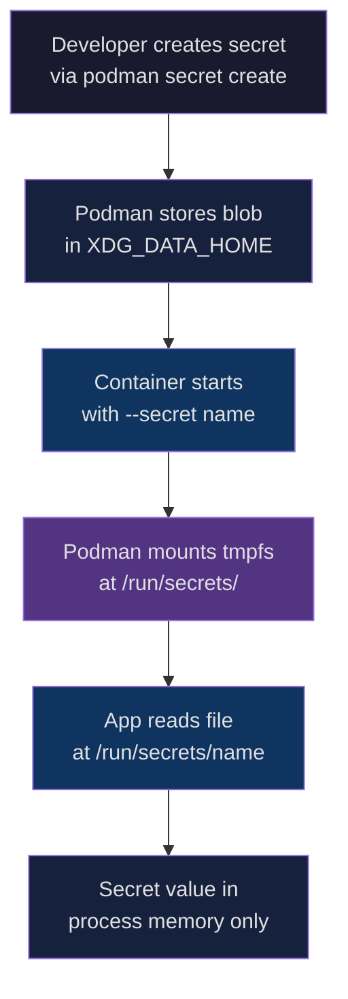
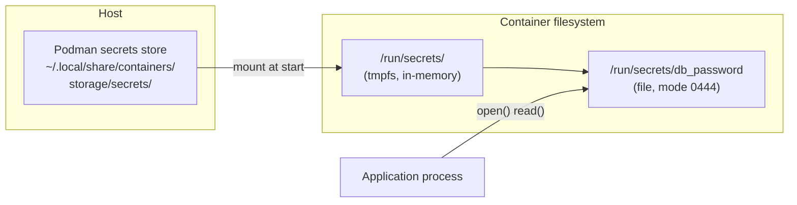
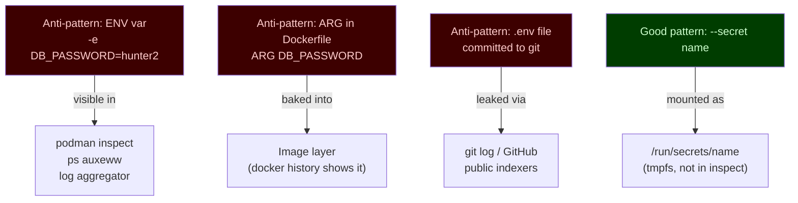
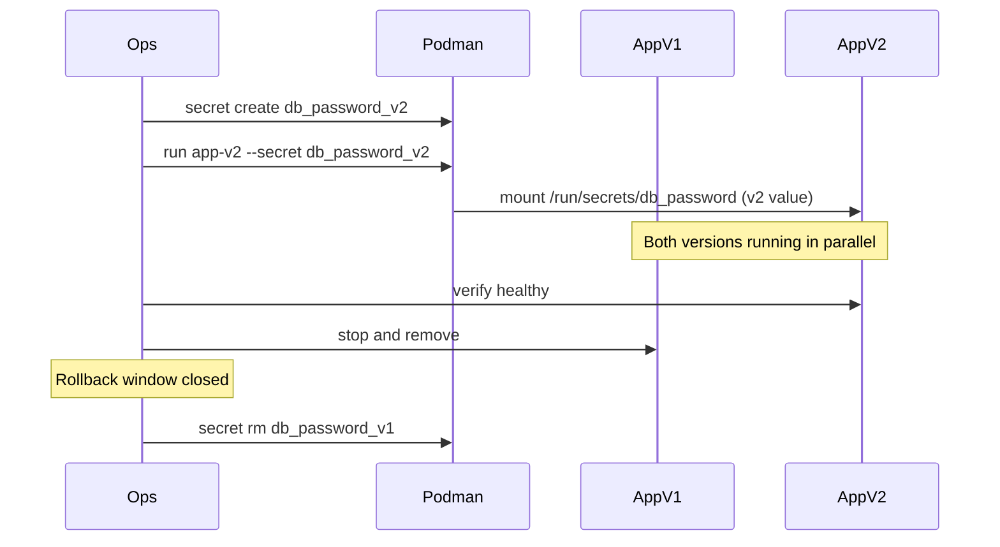
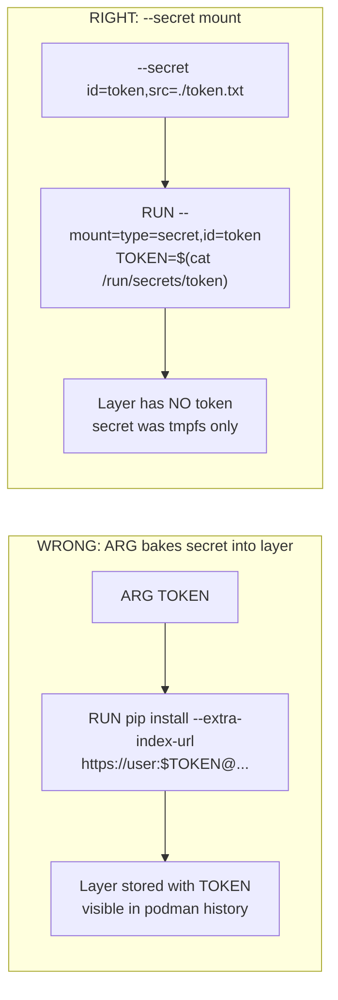

# Module 4: Secrets (Local-First)
[](../LICENSE.md)
[](https://access.redhat.com/products/red-hat-enterprise-linux)
[](https://podman.io)

<a id="table-of-contents"></a>

## Table of Contents

- [Learning Goals](#learning-goals)
- [Why Secrets Matter — The Threat Model](#why-secrets-matter--the-threat-model)
- [Mental Model: Secret as a Mounted File](#mental-model-secret-as-a-mounted-file)
- [How Podman Secrets Work Internally](#how-podman-secrets-work-internally)
- [Common Anti-Patterns](#common-anti-patterns)
- [Commands Reference](#commands-reference)
- [Lab A: Create and Mount a Secret](#lab-a-create-and-mount-a-secret)
- [Lab A2: Prove It Is Not an Env Var](#lab-a2-prove-it-is-not-an-env-var)
- [Lab B: Rotation Pattern (Versioned Secrets)](#lab-b-rotation-pattern-versioned-secrets)
- [Lab C: Custom Mount Target](#lab-c-custom-mount-target)
- [Advanced: Build-Time Secrets (Optional)](#advanced-build-time-secrets-optional)
- [File Permissions and App Compatibility](#file-permissions-and-app-compatibility)
- [What Podman Secrets Do NOT Solve](#what-podman-secrets-do-not-solve)
- [Common Failure Modes](#common-failure-modes)
- [Checkpoint](#checkpoint)
- [Quick Quiz](#quick-quiz)
- [Further Reading](#further-reading)

This module replaces the common beginner pattern of putting passwords in `.env` files and environment variables.


[↑ Go to TOC](#table-of-contents)

## Learning Goals

- Explain why environment variables are not a good secret transport.
- Create and use Podman secrets in rootless mode.
- Mount secrets as files and consume them safely.
- Rotate a secret with minimal downtime.
- Build a "no-secrets-in-logs" habit.


[↑ Go to TOC](#table-of-contents)

## Why Secrets Matter — The Threat Model

Before choosing a mechanism, you need to understand what you are actually protecting against. Secrets are credentials — database passwords, API keys, TLS private keys, OAuth tokens. The risk is **accidental disclosure** through these vectors:

| Exposure vector | How it happens |
|---|---|
| Shell history | `export DB_PASSWORD=hunter2` is stored in `~/.bash_history` |
| Process listing | `ps auxeww` shows env vars of running processes on many Linux systems |
| Container inspect | `podman inspect <container>` reveals all env vars in plain text |
| Image layers | `ARG`/`ENV` instructions bake values into image layers permanently |
| Log aggregation | App or framework logs the full env at startup (Spring Boot, Next.js, etc.) |
| Committed `.env` files | `.env` accidentally committed, pushed, and publicly indexed |
| Core dumps | A crashing process can dump env vars into a core file |

The goal of **secrets as files** is to reduce the surface area of every row in that table.



The secret value never appears in:
- The image layer
- `podman inspect` env output
- `ps auxeww`
- Shell history (if the value was never typed as a literal argument — see the `read -rs` pattern below)


[↑ Go to TOC](#table-of-contents)

## Mental Model: Secret as a Mounted File

Think of a Podman secret as a **named slot** that holds an opaque blob. When a container starts with `--secret name`, Podman:

1. Looks up the blob by name in the local secrets store.
2. Writes it to an in-memory `tmpfs` mount at `/run/secrets/` inside the container.
3. The file disappears when the container stops — it is never written to the writable container layer.



Key insight: the secret exists as a file for the lifetime of the container process and is gone when the container exits. It is never persisted in the container's writable layer.


[↑ Go to TOC](#table-of-contents)

## How Podman Secrets Work Internally

Podman's local secrets driver stores blobs at:

```
~/.local/share/containers/storage/secrets/
```

Each secret is a JSON metadata record plus the encrypted (or plain, depending on driver) blob. The default driver is `file`, which stores blobs base64-encoded on disk. This means:

- Secrets are local to the machine.
- They are only as secure as the filesystem permissions on `~/.local/share/containers/`.
- There is no built-in encryption at rest with the default driver (though you can add one via a custom driver).

The `podman secret inspect` command shows metadata (name, ID, driver, timestamps) but never the value.

```bash
podman secret inspect db_password  # shows metadata, not value
```

For multi-host or encrypted-at-rest requirements, see Module 90 (External Secrets Survey).


[↑ Go to TOC](#table-of-contents)

## Common Anti-Patterns

These patterns are common in tutorials and dangerous in real environments:



Summary of what to avoid:

- `export DB_PASSWORD=...` in your shell
- putting passwords in `.env` and committing it
- `podman run -e DB_PASSWORD=...` for anything beyond a throwaway lab
- `--secret name,type=env` — that option copies the value into the container environment and undoes the file-mount default (`type=mount`)
- `ARG`/`ENV` in a `Containerfile` for secret material
- logging connection strings that contain credentials


[↑ Go to TOC](#table-of-contents)

## Commands Reference

**Create a secret without putting the value in shell history.** `printf '%s' 'literal' | podman secret create` avoids a trailing newline, but Bash still records the whole command line, password included. `printf` keeps the value out of `podman`'s argv. It does not keep it out of history.

```bash
umask 077
read -rs PASSWORD  # type the value; it is not echoed and not stored as a command argument
printf '%s' "$PASSWORD" > ./db_password.txt  # no trailing newline
unset PASSWORD
podman secret create db_password ./db_password.txt
rm -f ./db_password.txt
```

`printf '%s'` is still the right way to avoid the newline that `echo` adds. Use it on a variable or a file, not on a quoted password in the command you type.

**Create a secret from a file** you already wrote with an editor (`umask 077` first):

```bash
chmod 600 ./db_password.txt                          # restrict read to owner only
podman secret create db_password ./db_password.txt   # create secret from file
```

**List secrets** (metadata only, no values):

```bash
podman secret ls  # list all secrets with metadata
```

**Inspect a secret** (shows driver, creation time — never the value):

```bash
podman secret inspect db_password  # inspect secret metadata
```

**Remove a secret**:

```bash
podman secret rm db_password  # delete the secret by name
```

**Use a secret at runtime** (default mount path `/run/secrets/<name>`):

```bash
podman run --rm --secret db_password docker.io/library/busybox:latest \
  sh -lc 'test -f /run/secrets/db_password && echo "secret file present"'  # verify secret is mounted
```

**Override the mount target** inside the container:

```bash
podman run --rm --secret db_password,target=/etc/myapp/db.pass \
  docker.io/library/busybox:latest \
  sh -lc 'test -f /etc/myapp/db.pass && echo OK'  # custom mount path
```

**Change uid/gid/mode** on the mounted file:

```bash
podman run --rm --secret db_password,uid=1000,gid=1000,mode=0400 \
  docker.io/library/busybox:latest \
  sh -lc 'ls -la /run/secrets/db_password'  # inspect ownership and permissions
```

Notes:

- Keep the secret value out of your shell history. Use `read -rs` into a variable, or a mode `0600` file. `printf '%s'` only fixes the trailing newline.
- Never print secret contents in logs.
- Do not pass `--secret name,type=env`. The default is `type=mount`. `type=env` puts the value in the container environment.


[↑ Go to TOC](#table-of-contents)

## Lab A: Create and Mount a Secret

1) Create a secret (example password — do not use in production). When prompted, type `correct-horse-battery-staple` so the inspect check in step 4 can search for that value. The password is not part of the command line:

```bash
umask 077
read -rs PASSWORD
printf '%s' "$PASSWORD" > ./db_password.txt
unset PASSWORD
podman secret create db_password ./db_password.txt
rm -f ./db_password.txt
```

2) Confirm the secret appears in the list:

```bash
podman secret ls  # list secrets, expect db_password
```

3) Run a container that confirms the secret file exists (without printing the value):

```bash
podman run --rm --secret db_password docker.io/library/busybox:latest \
  sh -lc 'test -f /run/secrets/db_password && echo OK'  # run a container, secret as file
```

4) Confirm the secret is NOT visible via `podman inspect`:

```bash
podman run -d --name secret-demo --secret db_password docker.io/library/busybox:latest sleep 600  # run container
podman inspect secret-demo --format '{{.Config.Env}}'  # environment only; the value is not here
podman inspect secret-demo | grep -F 'correct-horse-battery-staple' || echo "value not in inspect output"  # expected: value not in inspect output
podman rm -f secret-demo  # cleanup
```

Checkpoint:

- Secret appears as a file at `/run/secrets/db_password`.
- You never printed the secret value.
- `podman inspect` does not expose the value.


[↑ Go to TOC](#table-of-contents)

## Lab A2: Prove It Is Not an Env Var

This lab builds the "prove it" habit — always verify your security assumptions experimentally.

1) Start a long-lived container with the secret:

```bash
podman run -d --name secret-demo --secret db_password docker.io/library/busybox:latest sleep 600  # run a container
```

2) Check environment does not contain the secret:

```bash
podman exec secret-demo sh -lc 'env | grep -i password || echo "no password in env"'  # verify secret not in environment
```

Expected output: `no password in env`

3) Confirm the file exists with restricted permissions:

```bash
podman exec secret-demo sh -lc 'ls -la /run/secrets'  # list secret files
```

Expected: file owned by root (uid 0) inside the container, mode `0444` by default.

4) Read the file (confirm you can):

```bash
podman exec secret-demo sh -lc 'wc -c /run/secrets/db_password'  # count bytes, don't print value
```

5) Cleanup:

```bash
podman rm -f secret-demo  # stop and remove the demo container
podman secret rm db_password  # Lab C creates this name again
```


[↑ Go to TOC](#table-of-contents)

## Lab B: Rotation Pattern (Versioned Secrets)

Use versioned names so you can run old and new versions in parallel during a deploy window.

1) Create two versions of the secret:

```bash
umask 077
read -rs PASSWORD   # type v1-value
printf '%s' "$PASSWORD" > ./v1.txt
read -rs PASSWORD   # type v2-value
printf '%s' "$PASSWORD" > ./v2.txt
unset PASSWORD
podman secret create db_password_v1 ./v1.txt
podman secret create db_password_v2 ./v2.txt
rm -f ./v1.txt ./v2.txt
```

2) Start v1 service:

```bash
podman run -d --name app-v1 \
  --secret db_password_v1,target=db_password \
  docker.io/library/busybox:latest \
  sh -lc 'echo started-v1; sleep 3600'  # run v1 with secret mounted as db_password
```

3) Verify v1 is using its secret:

```bash
podman exec app-v1 sh -lc 'test -f /run/secrets/db_password && echo v1-secret-present'  # verify
```

4) Roll out v2 (new container, new secret name, same mount target):

```bash
podman run -d --name app-v2 \
  --secret db_password_v2,target=db_password \
  docker.io/library/busybox:latest \
  sh -lc 'echo started-v2; sleep 3600'  # run v2 with new secret mounted at same path
```

5) Verify v2 is healthy, then stop v1:

```bash
podman logs app-v2          # confirm started
podman rm -f app-v1         # stop old version
```

6) Only now remove the old secret:

```bash
podman secret rm db_password_v1  # delete old secret after rollback window has passed
```

7) Cleanup:

```bash
podman rm -f app-v2
podman secret rm db_password_v2
```



Guideline:

- Keep the old secret around until rollback is no longer needed.
- Many apps only read secrets on startup — rotation means deploying a new container.
- In Quadlet-managed services, this means updating `Secret=` in the unit file and restarting.


[↑ Go to TOC](#table-of-contents)

## Lab C: Custom Mount Target

Some apps expect credentials at a specific path (e.g., `/etc/app/config/db.pass`). Use the `target=` option.

1) Create the secret:

```bash
podman secret rm -f db_password  # Lab A may have left this name
umask 077
read -rs PASSWORD  # type mydbpass
printf '%s' "$PASSWORD" > ./db_password.txt
unset PASSWORD
podman secret create db_password ./db_password.txt
rm -f ./db_password.txt
```

2) Mount at a custom path:

```bash
podman run --rm \
  --secret db_password,target=/etc/myapp/db.pass \
  docker.io/library/busybox:latest \
  sh -lc 'ls -la /etc/myapp/db.pass && echo mounted'  # verify custom path
```

3) Mount with specific ownership (for apps running as non-root UID inside container):

```bash
podman run --rm \
  --secret db_password,target=/etc/myapp/db.pass,uid=1001,mode=0400 \
  docker.io/library/busybox:latest \
  sh -lc 'ls -la /etc/myapp/db.pass'  # verify ownership and mode
```

Cleanup:

```bash
podman secret rm db_password  # remove secret
```


[↑ Go to TOC](#table-of-contents)

## Advanced: Build-Time Secrets (Optional)

**Goal**: authenticate to a private resource during image build without leaking tokens into image layers.

The key rule: **never use `ARG` or `ENV` for secret material** — both are baked into image layers and visible via `podman history`.



If your Podman/Buildah supports build secrets, use `--mount=type=secret`:

```dockerfile
# In your Containerfile:
RUN --mount=type=secret,id=pip_token \
    pip install --extra-index-url \
    "https://user:$(cat /run/secrets/pip_token)@pypi.internal/" \
    my-private-package
```

Build command:

```bash
podman build --secret id=pip_token,src=./pip_token.txt -t myapp .  # build with secret, token not in layer
```

If your version does not support build secrets:

- Do NOT work around it by embedding secrets with `ARG`.
- Fetch private dependencies in CI and copy artifacts into the build context instead.
- Use a multi-stage build to discard intermediate layers.

Check your Podman version supports it:

```bash
podman build --help | grep secret  # check if --secret flag is available
```


[↑ Go to TOC](#table-of-contents)

## File Permissions and App Compatibility

The default secret mount is:
- Path: `/run/secrets/<name>`
- Owner: `root:root` (uid 0, gid 0) inside the container
- Mode: `0444` (world-readable)

**If your app runs as a non-root user**, it can still read a `0444` file. But if it needs `0400` (only owner can read), you must explicitly set uid and mode:

```bash
podman run --secret db_password,uid=1001,mode=0400 ...  # restrict to uid 1001 only
```

**If your app expects an env var** (legacy app you cannot modify), you can read the file in your entrypoint:

```bash
#!/bin/sh
# entrypoint.sh — bridge from file to env var (last resort)
export DB_PASSWORD=$(cat /run/secrets/db_password)
exec "$@"
```

This is a last resort. If you control the app, prefer native file reads.

**Common app secret file conventions:**

| Stack | How to read a secret file |
|---|---|
| Node.js | `fs.readFileSync('/run/secrets/db_password', 'utf8').trim()` |
| Python | `open('/run/secrets/db_password').read().strip()` |
| Go | `os.ReadFile("/run/secrets/db_password")` |
| Shell script | Read the file in the process that needs it. `DB_PASS=$(cat /run/secrets/db_password)` puts the value in that process's environment. |
| Java / Spring | `spring.config.import=configtree:/run/secrets/` (or read the file in code). `spring.datasource.password=file:...` is not Spring syntax. |


[↑ Go to TOC](#table-of-contents)

## What Podman Secrets Do NOT Solve

Be honest about the limitations to avoid false confidence:

| Problem | Does Podman secrets help? |
|---|---|
| Accidental env var exposure | ✅ Yes — keeps secret out of env |
| Leaking to image layers | ✅ Yes — secrets are runtime-only |
| Shell history exposure | ✅ Yes — if the value is read with `read -rs` or from a file, not typed as a command argument |
| Encryption at rest on disk | ❌ No — default driver stores base64 on disk |
| Multi-host secret distribution | ❌ No — secrets are per-machine |
| Automatic rotation | ❌ No — you must manually rotate |
| Access control between users | ❌ No — relies on filesystem permissions |
| Audit logging of secret reads | ❌ No — no built-in audit trail |

For the ❌ rows, see Module 90 (External Secrets Survey) for HashiCorp Vault, AWS SSM, and systemd credentials patterns.


[↑ Go to TOC](#table-of-contents)

## Common Failure Modes

**App expects an env var but you mounted a file.**
- Fix: update the app to read from a file, or use an entrypoint bridge script.

**File permissions don't match what the app's UID needs.**
- Symptom: `Permission denied` reading `/run/secrets/name`.
- Fix: add `uid=<UID>,mode=0400` to the `--secret` flag.

**Trailing newline in the secret value breaks passwords.**
- Symptom: authentication fails with correct-looking password.
- Cause: `echo 'value' | podman secret create ...` adds a newline.
- Fix: `printf '%s' "$VALUE"` (no newline). `echo` adds one. Do not put `$VALUE` in the command as a quoted literal if you care about shell history.

**Secret not available because name was misspelled.**
- Symptom: container fails to start with "secret not found".
- Fix: `podman secret ls` to verify the name, check `Secret=` spelling in Quadlet unit.

**You accidentally log the secret during debugging.**
- Habit: never `cat /run/secrets/...` in a script that runs in production. Use `wc -c` to verify presence/size without printing.

**Build-time secret leaked into image layer via ARG.**
- Fix: switch to `--mount=type=secret` in the `RUN` step, never `ARG` for secrets.


[↑ Go to TOC](#table-of-contents)

## Checkpoint

- You can create a secret without the value appearing in shell history.
- You can mount a secret as a file and verify it is present without printing it.
- You can explain why `--secret` is safer than `-e`.
- You can describe a versioned rotation plan with rollback.
- You understand what Podman secrets do and do not protect against.


[↑ Go to TOC](#table-of-contents)

## Quick Quiz

1) A colleague runs `podman run -e DB_PASSWORD=hunter2 myapp`. What are three ways this value could be exposed accidentally?

2) You have an app that only reads credentials on startup. You rotate `db_password_v1` → `db_password_v2`. What must you do to the running container?

3) You run `echo 'mypass' | podman secret create db_password -`. Later the app fails to authenticate even though the password looks correct. What is the likely cause?

4) What does `podman secret inspect db_password` show, and what does it NOT show?

5) Your app runs as UID 1001 inside the container and needs to read the secret. The default mount uses UID 0 / mode 0444. Can the app read it? Why?


[↑ Go to TOC](#table-of-contents)

## Further Reading

- `podman-secret(1)`: https://docs.podman.io/en/latest/markdown/podman-secret.1.html
- OWASP Secrets Management Cheat Sheet: https://cheatsheetseries.owasp.org/cheatsheets/Secrets_Management_Cheat_Sheet.html
- systemd credentials (service-provisioned files): https://www.freedesktop.org/software/systemd/man/latest/systemd.exec.html#Credentials
- Kubernetes Secrets (base64 caveat context): https://kubernetes.io/docs/concepts/configuration/secret/
- Buildah build secrets: https://buildah.io/blogs/2018/09/14/new-stream-builds.html
- Module 90: External Secrets Survey (HashiCorp Vault, AWS SSM)


[↑ Go to TOC](#table-of-contents)

© 2026 UncleJS — Licensed under CC BY-NC-SA 4.0
