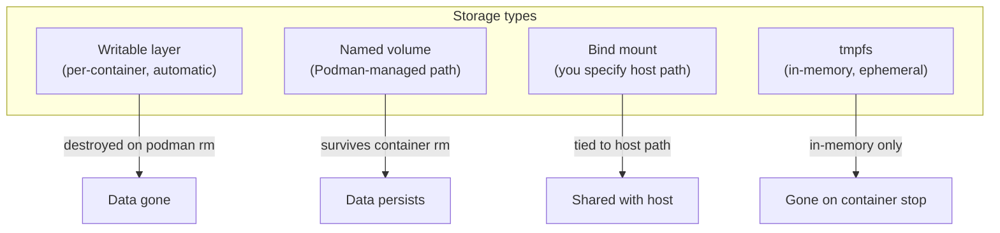
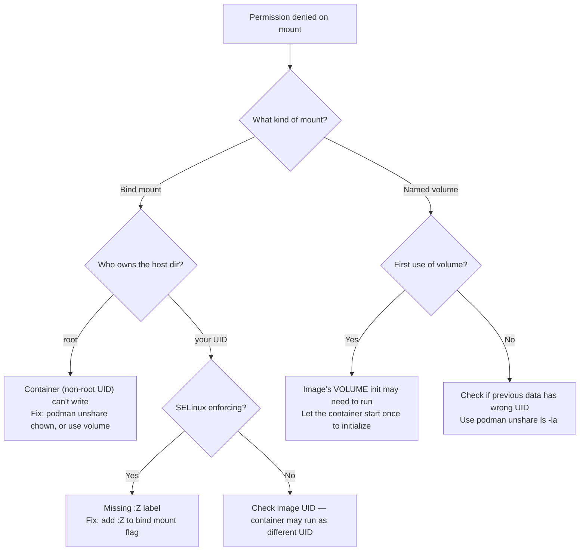

# Module 5: Storage (Volumes, Bind Mounts, Permissions)
[](../LICENSE.md)
[](https://access.redhat.com/products/red-hat-enterprise-linux)
[](https://podman.io)

<a id="table-of-contents"></a>

## Table of Contents

- [Learning Goals](#learning-goals)
- [The Three Storage Types](#the-three-storage-types)
- [Volumes](#volumes)
- [Bind Mounts](#bind-mounts)
- [tmpfs Mounts](#tmpfs-mounts)
- [Inspect Mounts](#inspect-mounts)
- [Rootless Permission Pitfalls](#rootless-permission-pitfalls)
- [podman unshare — Your Permission Debugging Tool](#podman-unshare--your-permission-debugging-tool)
- [SELinux Drill (Fedora/RHEL)](#selinux-drill-fedorarhel)
- [Lab: Persistent DB Data](#lab-persistent-db-data)
- [Volume Backup and Restore Pattern](#volume-backup-and-restore-pattern)
- [Checkpoint](#checkpoint)
- [Quick Quiz](#quick-quiz)
- [Further Reading](#further-reading)


[↑ Go to TOC](#table-of-contents)

## Learning Goals

- Choose between volumes, bind mounts, and tmpfs for the right use case.
- Use volumes for persistent state across container replacements.
- Debug rootless permission issues using `podman unshare`.
- Understand SELinux labeling (`:Z` vs `:z`) on Fedora/RHEL.
- Back up and restore named volumes.


[↑ Go to TOC](#table-of-contents)

## The Three Storage Types



**Decision guide:**

| Need | Use |
|---|---|
| Database data, state that must survive container replacement | Named volume |
| Config file, certificate, source code (dev) | Bind mount |
| Scratch space that must not persist (tmp, cache, PID files) | `--tmpfs` |
| Read-only root FS with writable exceptions | `--read-only --tmpfs /path` |
| Quick experiment, throwaway data | Writable layer (accept data loss) |

**The core rule**: Never store important data in the writable layer. Use a volume.


[↑ Go to TOC](#table-of-contents)

## Volumes

Named volumes are managed by Podman. You do not need to know or care where they live on disk. Podman handles permissions correctly for rootless use.

**Create and inspect:**

```bash
podman volume create dbdata             # create a named volume
podman volume ls                        # list all volumes
podman volume inspect dbdata            # show metadata: mountpoint, driver, labels
```

**Use a volume:**

```bash
podman run --rm -v dbdata:/data docker.io/library/alpine:latest \
  sh -lc 'echo hi > /data/x && echo wrote'  # write to volume
podman run --rm -v dbdata:/data docker.io/library/alpine:latest \
  sh -lc 'cat /data/x'                       # read from same volume
```

**Volume survives container removal:**

```bash
podman run --name writer -v dbdata:/data docker.io/library/alpine:latest \
  sh -lc 'echo persistent > /data/hello'   # write
podman rm writer                            # remove container
podman run --rm -v dbdata:/data docker.io/library/alpine:latest \
  cat /data/hello                           # data is still there
```

**Remove a volume (⚠️ DATA LOSS):**

```bash
podman volume rm dbdata   # delete the volume and all its data
```

**Where volumes live on disk** (rootless):

```bash
podman volume inspect dbdata --format '{{.Mountpoint}}'  # typically ~/.local/share/containers/storage/volumes/dbdata/_data
```


[↑ Go to TOC](#table-of-contents)

## Bind Mounts

A bind mount maps a **host filesystem path** into the container. The container sees and modifies real host files.

**When to use:**

- Passing configuration files into a container.
- Development mode — mounting source code so the container sees changes live.
- Passing certificates or read-only data that lives in a known host location.

**Basic bind mount:**

```bash
mkdir -p ./mnt-demo                         # create host directory
echo "hello from host" > ./mnt-demo/hi.txt  # create a test file
podman run --rm -v ./mnt-demo:/mnt:Z \
  docker.io/library/alpine:latest cat /mnt/hi.txt  # :Z required on SELinux systems
```

**Read-only bind mount:**

```bash
podman run --rm -v ./mnt-demo:/mnt:Z,ro \
  docker.io/library/alpine:latest \
  sh -lc 'cat /mnt/hi.txt; echo nope > /mnt/x || echo "write blocked"'  # write attempt fails
```

**SELinux mount options (Fedora/RHEL):**

| Option | Meaning | Use when |
|---|---|---|
| `:Z` | Relabel for private use (this container only) | Single container accessing the path |
| `:z` | Relabel for shared use (multiple containers) | Multiple containers sharing the same path |
| (none) | No relabelling | Volume mounts (handled automatically) |

**When NOT to use bind mounts:**

- Long-running services in production (use volumes instead).
- When you need Podman to manage permissions (volumes handle rootless UID mapping).
- When portability matters — bind mounts require the host path to exist.

See Module 11 for the rule: **always ask before using bind mounts in production Quadlet units**.


[↑ Go to TOC](#table-of-contents)

## tmpfs Mounts

`tmpfs` mounts provide in-memory, ephemeral writable directories inside a container. They are gone when the container stops — no data persists.

**Use cases:**

- `/tmp` for scratch space (prevents writing to read-only root FS).
- `/var/run` for PID files (nginx, databases write here at startup).
- `/var/cache/nginx` for nginx's cache directory.
- Any directory an app writes to transiently, that you do not want persisted.

```bash
podman run --rm \
  --read-only \
  --tmpfs /tmp \
  --tmpfs /var/run \
  docker.io/library/alpine:latest \
  sh -lc 'touch /tmp/scratch && echo ok'  # /tmp is writable, root FS is not
```

**Size limit on tmpfs:**

```bash
podman run --rm --tmpfs /tmp:size=64m \
  docker.io/library/alpine:latest \
  sh -lc 'df -h /tmp'  # tmpfs with 64 MB limit
```


[↑ Go to TOC](#table-of-contents)

## Inspect Mounts

**View mounts on a running container:**

```bash
podman run -d --name mount1 \
  -v dbdata:/data \
  -v ./mnt-demo:/mnt:Z \
  --tmpfs /tmp \
  docker.io/library/alpine:latest sleep 300  # start container with multiple mounts
```

```bash
podman inspect mount1 --format '{{json .Mounts}}'  # show all mount definitions as JSON
```

**Simpler view:**

```bash
podman inspect mount1 \
  --format '{{range .Mounts}}Type={{.Type}} Source={{.Source}} Dest={{.Destination}} Mode={{.Mode}}{{"\n"}}{{end}}'
```

**Cleanup:**

```bash
podman rm -f mount1  # remove the container
```


[↑ Go to TOC](#table-of-contents)

## Rootless Permission Pitfalls

The most common storage problem in rootless Podman is **permission denied** when a container tries to write to a mounted path.



**Check what UID the container process runs as:**

```bash
podman run --rm docker.io/library/alpine:latest id  # show UID inside container
```

**Check what that UID maps to on the host:**

```bash
podman unshare id  # show UID as the user namespace sees it on the host
```


[↑ Go to TOC](#table-of-contents)

## podman unshare — Your Permission Debugging Tool

`podman unshare` runs a command inside your **user namespace** — the same UID mapping that container processes use. This lets you see and fix filesystem ownership from the container's perspective.

**See UID mapping:**

```bash
podman unshare id             # shows uid/gid as rootless container sees it
podman unshare cat /proc/self/uid_map  # full UID map table
```

**Inspect a directory as the container sees it:**

```bash
podman unshare ls -la ~/.local/share/containers/storage/volumes/dbdata/_data  # check volume ownership
```

**Fix ownership for a bind-mounted path:**

```bash
podman unshare chown -R 1000:1000 ./mnt-demo  # set ownership inside user namespace
```

Warning: `chown -R` on a large directory takes time. And the numbers `1000:1000` are container UIDs, not host UIDs. Use `podman unshare` to run the command in the correct namespace.

**Do not blindly `chmod 777`** — this grants access to everyone on the host. Fix the ownership instead.


[↑ Go to TOC](#table-of-contents)

## SELinux Drill (Fedora/RHEL)

SELinux enforces label-based access control independent of Unix permissions. A container process has label `container_t` and can only access files labelled `container_file_t` or `svirt_sandbox_file_t`.

Named volumes are automatically labelled correctly. Bind mounts are not — you must tell Podman to relabel them.

**Step 1: Try a bind mount WITHOUT labels (expected: fail on SELinux enforcing):**

```bash
mkdir -p ./selinux-test
echo "test" > ./selinux-test/data.txt
podman run --rm -v ./selinux-test:/mnt \
  docker.io/library/alpine:latest cat /mnt/data.txt  # may get permission denied
```

**Step 2: Fix it with `:Z`:**

```bash
podman run --rm -v ./selinux-test:/mnt:Z \
  docker.io/library/alpine:latest cat /mnt/data.txt  # should work now
```

**Step 3: Check what `:Z` did to the host path's label:**

```bash
ls -laZ ./selinux-test/  # show SELinux context (requires `ls` with -Z flag)
```

The label should now be `svirt_sandbox_file_t` — the type that containers are allowed to access.

**Step 4: Check for SELinux denial messages:**

```bash
ausearch -m avc -ts recent 2>/dev/null | head -20  # show recent SELinux denials
```

**Cleanup:**

```bash
rm -rf ./selinux-test  # remove test directory
```


[↑ Go to TOC](#table-of-contents)

## Lab: Persistent DB Data

**Goal**: demonstrate that container data survives container replacement when using a named volume.

**Step 1: Create a named volume:**

```bash
podman volume create mariadb-lab  # create persistent volume
```

**Step 2: Start MariaDB with the volume:**

```bash
printf '%s' 'labpass123' | podman secret create lab_db_pass -  # create secret for password
podman run -d \
  --name mariadb-lab \
  -v mariadb-lab:/var/lib/mysql \
  --secret lab_db_pass \
  -e MARIADB_ROOT_PASSWORD_FILE="/run/secrets/lab_db_pass" \
  docker.io/library/mariadb:11  # start MariaDB with persistent volume
```

**Step 3: Wait for the DB to initialise (watch logs):**

```bash
podman logs -f mariadb-lab  # watch logs; wait for "ready for connections"
```

Press Ctrl+C when ready.

**Step 4: Create a test record:**

```bash
podman exec mariadb-lab mariadb -uroot -p"labpass123" \
  -e "CREATE DATABASE lab; USE lab; CREATE TABLE test (id INT PRIMARY KEY, name VARCHAR(50)); INSERT INTO test VALUES (1, 'persistent');"  # create DB and insert data
```

**Step 5: Remove the container:**

```bash
podman rm -f mariadb-lab  # destroy the container (writable layer gone)
podman volume ls | grep mariadb-lab  # volume still exists!
```

**Step 6: Start a NEW container with the same volume:**

```bash
podman run -d \
  --name mariadb-lab2 \
  -v mariadb-lab:/var/lib/mysql \
  --secret lab_db_pass \
  -e MARIADB_ROOT_PASSWORD_FILE="/run/secrets/lab_db_pass" \
  docker.io/library/mariadb:11  # start fresh container with the same volume
podman logs -f mariadb-lab2  # wait for ready
```

**Step 7: Verify the data is still there:**

```bash
podman exec mariadb-lab2 mariadb -uroot -p"labpass123" \
  -e "SELECT * FROM lab.test;"  # should return: 1 | persistent
```

**Cleanup:**

```bash
podman rm -f mariadb-lab2
podman volume rm mariadb-lab   # DATA LOSS — remove the volume
podman secret rm lab_db_pass
```


[↑ Go to TOC](#table-of-contents)

## Volume Backup and Restore Pattern

Named volumes can be backed up by running a helper container that reads from the volume and writes a tar file.

**Backup:**

```bash
podman run --rm \
  -v mariadb-lab:/data:ro \
  -v ./backups:/backup \
  docker.io/library/alpine:latest \
  tar czf /backup/mariadb-lab-$(date +%Y%m%d).tar.gz -C /data .  # backup volume to tar
```

**Restore** (to a fresh volume):

```bash
podman volume create mariadb-lab-restore  # create destination volume
podman run --rm \
  -v mariadb-lab-restore:/data \
  -v ./backups:/backup:ro \
  docker.io/library/alpine:latest \
  tar xzf /backup/mariadb-lab-20260326.tar.gz -C /data  # restore from tar
```

This is a **logical backup** at the filesystem level. For database-consistent backups, prefer `mysqldump` / `mariadb-dump` over raw volume backups — they handle transactions correctly.


[↑ Go to TOC](#table-of-contents)

## Checkpoint

- You can choose volume vs bind mount vs tmpfs intentionally.
- You can explain when `:Z` is required on Fedora/RHEL.
- You can use `podman unshare` to inspect and fix permission issues.
- You can demonstrate that volume data survives `podman rm`.
- You know the basic backup/restore pattern for volumes.


[↑ Go to TOC](#table-of-contents)

## Quick Quiz

1) Your container writes to `/var/lib/myapp` but you want the data to survive `podman rm`. What do you do?

2) You get `permission denied` reading a bind-mounted directory even though the host permissions look correct. You are on RHEL. What is the likely cause?

3) What does `podman unshare ls -la /path` tell you that a plain `ls -la /path` does not?

4) You use a named volume for your database and later need to move to a new server. Describe the volume backup/restore workflow.

5) `--tmpfs /tmp` and `-v tmpdata:/tmp` both make `/tmp` writable inside the container. What is the key difference?

6) You want a config file to be read-only inside the container and the bind mount path must not be modified. What mount option do you add?


[↑ Go to TOC](#table-of-contents)

## Further Reading

- `podman-volume(1)`: https://docs.podman.io/en/latest/markdown/podman-volume.1.html
- Rootless storage and UID mapping: https://github.com/containers/podman/blob/main/docs/tutorials/rootless_tutorial.md
- SELinux mount labeling for containers (RHEL docs): https://docs.redhat.com/en/documentation/red_hat_enterprise_linux/9/html/using_selinux/assembly_using-selinux-with-containers_using-selinux
- `subuid(5)` and `subgid(5)` (man7): https://man7.org/linux/man-pages/man5/subuid.5.html
- `podman-unshare(1)`: https://docs.podman.io/en/latest/markdown/podman-unshare.1.html


[↑ Go to TOC](#table-of-contents)

© 2026 UncleJS — Licensed under CC BY-NC-SA 4.0
