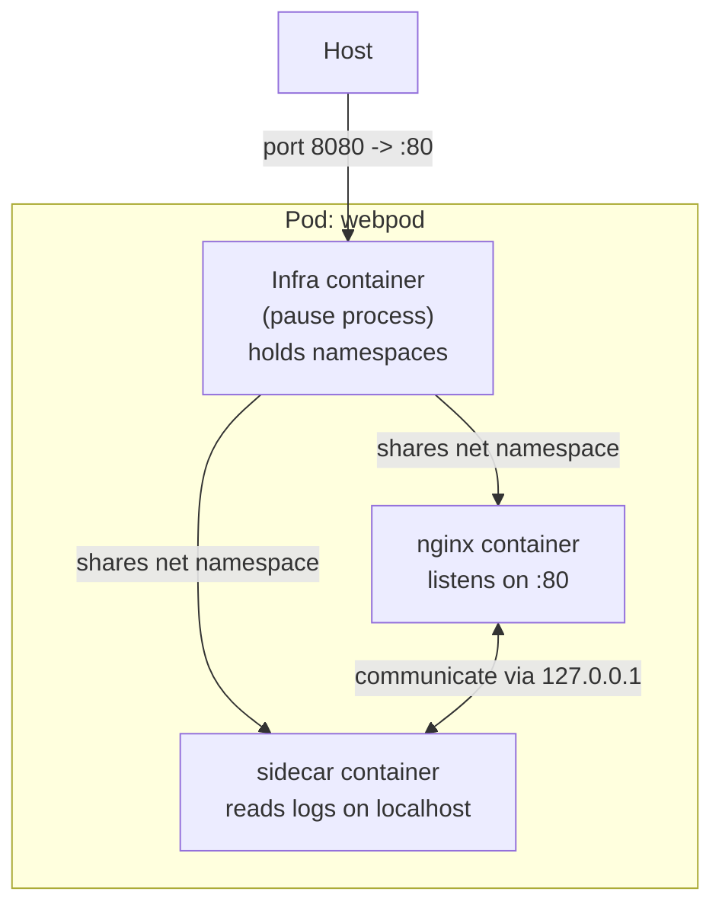
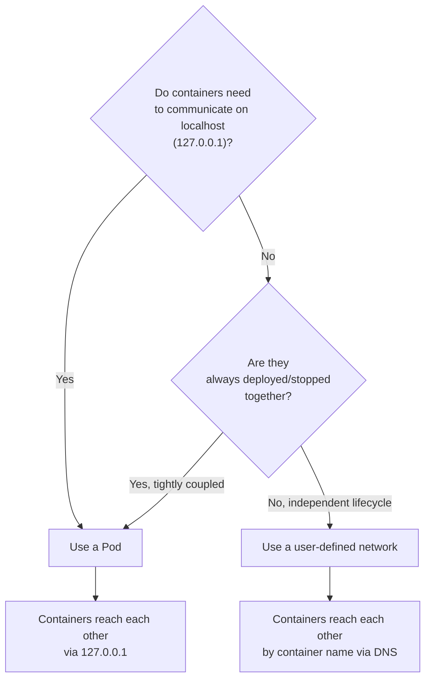
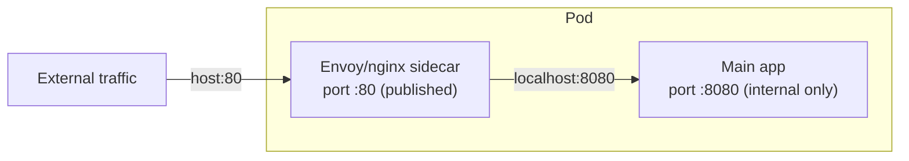

# Module 7: Pods and Sidecars
[](../LICENSE.md)
[](https://access.redhat.com/products/red-hat-enterprise-linux)
[](https://podman.io)

<a id="table-of-contents"></a>

## Table of Contents

- [Learning Goals](#learning-goals)
- [What Is a Pod?](#what-is-a-pod)
- [Why Pods — The Use Cases](#why-pods--the-use-cases)
- [The Infra Container](#the-infra-container)
- [Pod vs User-Defined Network — When To Use Each](#pod-vs-user-defined-network--when-to-use-each)
- [The Sidecar Pattern](#the-sidecar-pattern)
- [Pod Lifecycle and Commands](#pod-lifecycle-and-commands)
- [Lab: Two Containers, One Pod](#lab-two-containers-one-pod)
- [Lab: Log-Shipping Sidecar Pattern](#lab-log-shipping-sidecar-pattern)
- [Pods and Quadlet](#pods-and-quadlet)
- [Pods vs Kubernetes Pods](#pods-vs-kubernetes-pods)
- [Pod Lifecycle Notes](#pod-lifecycle-notes)
- [Checkpoint](#checkpoint)
- [Quick Quiz](#quick-quiz)
- [Further Reading](#further-reading)

---

Podman pods group multiple containers so they share certain namespaces — most importantly the **network namespace**. Understanding pods unlocks the sidecar pattern and is the conceptual bridge to Kubernetes.

[↑ Go to TOC](#table-of-contents)

---

## Learning Goals

By the end of this module you will be able to:

- Explain what a Podman pod is and how it differs from a user-defined network.
- Describe what the infra container is and why it exists.
- Run a pod with multiple containers sharing localhost.
- Implement a basic sidecar pattern.
- Decide when to use a pod vs when to use a shared network.
- Know how Podman pods relate to Kubernetes pods.

[↑ Go to TOC](#table-of-contents)

---

## What Is a Pod?

A **pod** is a group of containers that share a set of namespaces. In Podman's implementation, the most important shared namespace is the **network namespace**: every container in the pod sees the same network interfaces, the same IP address, and can reach each other on `localhost`.



The key insight: **port publishing is attached to the pod, not to individual containers**. When you publish `-p 8080:80`, that binding lives on the infra container. Any container in the pod that listens on port 80 is reachable at `127.0.0.1:8080` from outside.

[↑ Go to TOC](#table-of-contents)

---

## Why Pods — The Use Cases

Pods are useful when:

1. **Sidecar agents need to reach the main process on localhost** — log shippers (Filebeat, Fluent Bit), service mesh proxies (Envoy), metrics exporters, and TLS terminators all benefit from localhost access. They do not need their own published port; they just connect to `127.0.0.1:<service-port>`.

2. **You want a single unit of deployment for a tightly-coupled pair** — if two containers are always deployed together, always stopped together, and always communicate on localhost, a pod models that relationship explicitly.

3. **You are bridging to Kubernetes YAML** — Podman's pod model is intentionally similar to Kubernetes pods. If you plan to export your workload to a cluster, designing with pods now makes the `podman generate kube` output meaningful.

They are **not required** for most workloads. If two services just need to talk to each other over a network and are independently scaled/deployed, a user-defined network is simpler and more flexible.

[↑ Go to TOC](#table-of-contents)

---

## The Infra Container

Every Podman pod contains an **infra container** — a minimal container that does almost nothing (runs a `pause` equivalent process) but exists solely to **hold the shared namespaces**.

Why is this necessary? Linux namespaces are owned by processes. If all containers in a pod shared namespaces directly, the first container to exit would destroy the namespace, killing the network for all other containers. The infra container solves this: it holds the namespace open for the lifetime of the pod, regardless of which application containers start or stop.

```bash
podman pod create --name webpod -p 8080:80  # create a pod
podman pod ps  # list pods — shows 1 container (the infra container)
podman ps --pod  # show all containers including the infra container
```

You will see a container named something like `webpod-infra`. It is always present and should be left alone. When you `podman pod rm`, the infra container is removed automatically.

> **Note:** The infra container uses a very small image (`k8s.gcr.io/pause` or a Podman equivalent). It consumes almost no resources. Do not be alarmed by seeing it.

[↑ Go to TOC](#table-of-contents)

---

## Pod vs User-Defined Network — When To Use Each

This is a common confusion point. Here is the mental model:



**User-defined network is better when:**
- Services have independent scaling or lifecycle.
- Services are run by different teams or deployed at different times.
- You need more than a handful of containers (pods with 10 containers get unwieldy).
- Service-to-service communication by DNS name is cleaner than localhost.

**Pod is better when:**
- A sidecar needs to proxy, observe, or augment the main process with localhost access.
- You are targeting Kubernetes and want YAML that maps cleanly.
- You want a single `podman pod rm` to clean up everything atomically.

[↑ Go to TOC](#table-of-contents)

---

## The Sidecar Pattern

A **sidecar** is an auxiliary container that runs alongside a main application container inside the same pod. Because they share a network namespace, the sidecar can:

- Read the main app's logs from a shared volume.
- Proxy traffic to/from the main app on localhost.
- Scrape metrics from the main app's internal port without publishing it externally.
- Perform health checks or certificate rotation.



Common sidecar examples:

| Sidecar type | What it does |
|---|---|
| Log forwarder | Reads log files written by the main app, ships to a central log store |
| Service mesh proxy | Intercepts all network traffic in/out of the pod |
| Metrics exporter | Scrapes app metrics and exposes them on a Prometheus endpoint |
| TLS terminator | Handles TLS, forwards plain HTTP to the app on localhost |
| Init sidecar | Runs a one-time setup step before the main container starts |

[↑ Go to TOC](#table-of-contents)

---

## Pod Lifecycle and Commands

```bash
# Create a pod with a published port
podman pod create --name mypod -p 8080:80  # create a pod

# Add containers to an existing pod
podman run -d --pod mypod --name web docker.io/library/nginx:stable  # run a container in a pod
podman run -d --pod mypod --name sidecar docker.io/library/alpine:latest sleep 3600  # run a sidecar container

# Inspect the pod
podman pod ps  # list pods with container counts
podman pod inspect mypod  # detailed pod info including all containers
podman ps --pod  # list all containers showing their pod membership

# Control the pod
podman pod stop mypod  # stop all containers in the pod
podman pod start mypod  # start all containers in the pod
podman pod restart mypod  # restart all containers in the pod

# Remove the pod (stops and removes all containers including infra)
podman pod rm -f mypod  # force stop and remove pod and all its containers
```

> **Key lifecycle rule:** Stopping a pod stops all containers. Removing a pod removes all containers including the infra container. You cannot remove a pod's infra container independently.

[↑ Go to TOC](#table-of-contents)

---

## Lab: Two Containers, One Pod

In this lab you will see localhost networking between two containers inside a pod.

**Step 1 — Create a pod and publish a port**

```bash
podman pod create --name webpod -p 8080:80  # create a pod
```

Confirm the infra container was created:

```bash
podman ps --pod  # list containers showing pod membership
```

You will see the infra container already running even though you have not added application containers yet.

**Step 2 — Run an HTTP server inside the pod**

```bash
podman run -d --pod webpod --name nginx docker.io/library/nginx:stable  # run nginx inside the pod
```

Verify it is reachable from the host:

```bash
podman port webpod-infra  # podman port takes a container; the infra container owns the publish
```

From the host (or inside a debug shell):

```bash
podman run --rm --pod webpod docker.io/library/alpine:latest sh -lc 'wget -qO- http://127.0.0.1:80/ | head -5'  # verify nginx is reachable on localhost
```

**What just happened?** The Alpine container ran inside the same pod as nginx. Because they share a network namespace, `127.0.0.1:80` inside the Alpine container is nginx's port — exactly as if both processes were running on the same machine.

**Step 3 — Add a persistent sidecar for debugging**

```bash
podman run -d --pod webpod --name debug docker.io/library/alpine:latest sleep 3600  # run a debug sidecar
```

Exec into the sidecar and probe nginx without publishing any new ports:

```bash
podman exec -it debug sh  # exec into the sidecar
```

Inside:

```sh
# Nginx is accessible via localhost — no new port needed
wget -qO- http://127.0.0.1:80/ | head -5  # fetch nginx on localhost
# Check what is listening on port 80
netstat -tlnp 2>/dev/null || ss -tlnp  # show listening ports
exit  # exit the shell
```

**Step 4 — Inspect the shared network**

```bash
podman inspect nginx --format '{{.NetworkSettings.SandboxKey}}'  # show nginx's network namespace path
podman inspect debug --format '{{.NetworkSettings.SandboxKey}}'  # show sidecar's network namespace path
```

Both containers will show the **same network namespace** — confirming they share it via the infra container.

**Step 5 — Cleanup**

```bash
podman pod rm -f webpod  # stop and remove the pod and all its containers
```

[↑ Go to TOC](#table-of-contents)

---

## Lab: Log-Shipping Sidecar Pattern

This lab simulates a real-world pattern: the main app writes logs to a shared volume, and a sidecar reads them.

**Step 1 — Create the pod with a shared volume**

```bash
podman volume create logvol  # create a shared log volume
podman pod create --name logpod -p 8081:80  # create the pod
```

**Step 2 — Start the app (nginx writing access logs)**

```bash
podman run -d --pod logpod --name app \
  -v logvol:/var/log/nginx \
  docker.io/library/nginx:stable  # named volume; no :Z (that label is private)
```

The image turns an empty log directory into symlinks to stdout and stderr. Replace them with real files so the sidecar can see access lines:

```bash
podman exec app sh -lc 'rm -f /var/log/nginx/access.log /var/log/nginx/error.log && touch /var/log/nginx/access.log /var/log/nginx/error.log && nginx -s reopen'
```

**Step 3 — Start the "log shipper" sidecar**

```bash
podman run -d --pod logpod --name log-shipper \
  -v logvol:/logs \
  docker.io/library/alpine:latest \
  sh -lc 'while true; do echo "--- log snapshot ---"; ls -la /logs/; sleep 5; done'  # run a log-reading sidecar
```

**Step 4 — Generate some traffic and watch the sidecar**

```bash
# Generate traffic
for i in 1 2 3 4 5; do
  podman run --rm --pod logpod docker.io/library/alpine:latest wget -qO /dev/null http://127.0.0.1:80/ 2>&1
done

# Watch sidecar output
podman logs -f log-shipper  # follow the sidecar's log output
```

Press `Ctrl+C` to stop following logs.

**Step 5 — Cleanup**

```bash
podman pod rm -f logpod  # remove the pod and all containers
podman volume rm logvol  # remove the log volume
```

[↑ Go to TOC](#table-of-contents)

---

## Pods and Quadlet

You can manage a pod with Quadlet using a `.pod` unit. Containers in the pod reference it with `Pod=`:

```ini
# ~/.config/containers/systemd/mypod.pod
[Pod]
PodName=mypod
PublishPort=8080:80
```

```ini
# ~/.config/containers/systemd/web.container
[Unit]
Description=Web container in mypod
After=mypod-pod.service

[Container]
Image=docker.io/library/nginx:stable
Pod=mypod.pod

[Service]
Restart=always

[Install]
WantedBy=default.target
```

The generated service for the pod is `mypod-pod.service`. Container units declare `After=` and `Requires=` on it automatically when using `Pod=`.

> See Module 11 for full Quadlet details.

[↑ Go to TOC](#table-of-contents)

---

## Pods vs Kubernetes Pods

Podman's pod model is deliberately modeled after Kubernetes pods. The key similarities:

| Feature | Podman Pod | Kubernetes Pod |
|---|---|---|
| Shared network namespace | ✅ | ✅ |
| Shared IPC namespace | ✅ (optional) | ✅ |
| Infra/pause container | ✅ | ✅ |
| Sidecar pattern | ✅ | ✅ |
| Port published on pod | ✅ | ✅ |
| Scheduling across nodes | ❌ | ✅ |
| Liveness/readiness probes | Limited | ✅ |
| Pod auto-restart policies | Via systemd | Via kubelet |

The critical difference: **Podman pods run on a single machine**. Kubernetes pods can be scheduled to any node in the cluster. But because the interface is similar, a `podman generate kube mypod` can produce YAML that Kubernetes understands — making Podman pods a useful local prototyping tool.

[↑ Go to TOC](#table-of-contents)

---

## Pod Lifecycle Notes

- **Creating a pod does not start application containers** — only the infra container starts automatically.
- **Stopping a pod stops all containers** — including the infra container.
- **Removing a pod removes the infra container** — you cannot remove the infra container independently.
- **A stopped pod retains its containers** — they can be started again with `podman pod start`.
- **Exiting a container does not stop the pod** — other containers keep running; the pod remains in a degraded but not stopped state.
- **Port conflicts are detected at pod creation time** — not at container start.

[↑ Go to TOC](#table-of-contents)

---

## Checkpoint

Before moving on, confirm you can answer these:

- [ ] I know that all containers in a pod share the same network namespace.
- [ ] I understand why the infra container exists and what happens if it exits.
- [ ] I can describe the sidecar pattern and give two real-world examples.
- [ ] I know when to prefer a user-defined network over a pod.
- [ ] I have run the two-container pod lab and confirmed localhost access between containers.
- [ ] I understand how Podman pods relate to Kubernetes pods.

[↑ Go to TOC](#table-of-contents)

---

## Quick Quiz

1. Why does a pod show an extra container you did not explicitly run?

2. You have nginx running in a pod and want to add a Prometheus metrics exporter sidecar that scrapes nginx's internal `/metrics` endpoint (not published to the host). How does the sidecar reach nginx?

3. When would you prefer a user-defined network over a pod for two communicating services?

4. What happens to the other containers in a pod when one container exits?

[↑ Go to TOC](#table-of-contents)

---

## Further Reading

- `podman-pod(1)`: https://docs.podman.io/en/latest/markdown/podman-pod.1.html
- `podman-generate-kube(1)`: https://docs.podman.io/en/latest/markdown/podman-generate-kube.1.html
- Kubernetes Pods concept: https://kubernetes.io/docs/concepts/workloads/pods/
- Sidecar containers (Kubernetes): https://kubernetes.io/docs/concepts/workloads/pods/sidecar-containers/
- Quadlet pod units: https://docs.podman.io/en/latest/markdown/podman-systemd.unit.5.html

[↑ Go to TOC](#table-of-contents)

© 2026 UncleJS — Licensed under CC BY-NC-SA 4.0
