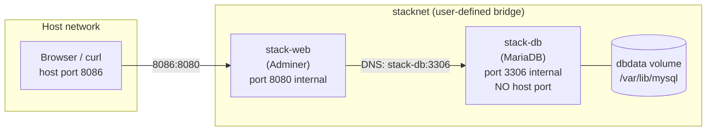
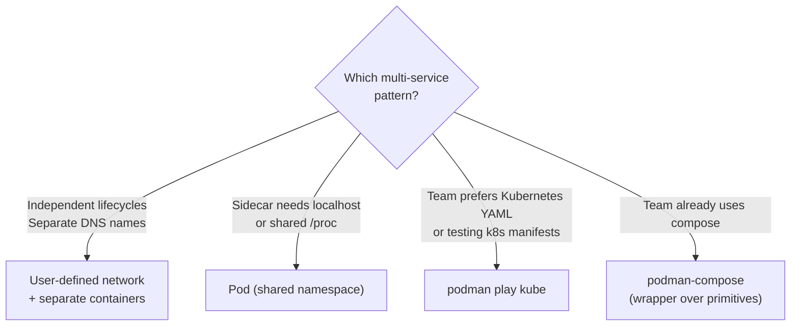
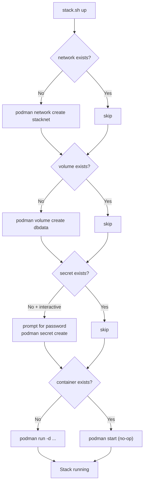
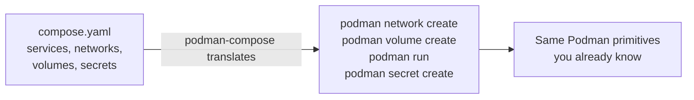

# Module 9: Multi-Service Workflows
[](../LICENSE.md)
[](https://access.redhat.com/products/red-hat-enterprise-linux)
[](https://podman.io)

<a id="table-of-contents"></a>

## Table of Contents

- [Learning Goals](#learning-goals)
- [The Multi-Service Problem](#the-multi-service-problem)
- [Three Patterns Compared](#three-patterns-compared)
- [Pattern 1: User-Defined Network + Separate Containers](#pattern-1-user-defined-network--separate-containers)
- [Pattern 2: Pod (Shared localhost)](#pattern-2-pod-shared-localhost)
- [Pattern 3: podman play kube](#pattern-3-podman-play-kube)
- [Lab: A Two-Service Stack (MariaDB + Adminer)](#lab-a-two-service-stack-mariadb--adminer)
- [Make It Repeatable (Script)](#make-it-repeatable-script)
- [Idempotency — What It Means and Why It Matters](#idempotency--what-it-means-and-why-it-matters)
- [From Script to Quadlet](#from-script-to-quadlet)
- [Compose-ish Tooling (Context)](#compose-ish-tooling-context)
- [Checkpoint](#checkpoint)
- [Quick Quiz](#quick-quiz)
- [Further Reading](#further-reading)

This module teaches patterns for running a small stack without jumping straight to a full orchestrator.


[↑ Go to TOC](#table-of-contents)

## Learning Goals

- Choose the right multi-service pattern for your workload.
- Build a repeatable "stack up / stack down" workflow.
- Explain how service discovery works via container names on a user-defined network.
- Understand why database containers should not publish ports.
- Know the tradeoffs of compose-style tooling vs Quadlet.


[↑ Go to TOC](#table-of-contents)

## The Multi-Service Problem

A web application typically needs at least two processes: the application server and the database. These must:

1. **Find each other** — service discovery.
2. **Be isolated** from unrelated services.
3. **Have independent lifecycles** — you restart the app without restarting the DB.
4. **Persist data** — the DB volume survives container restarts.
5. **Not expose internal services** — the DB should never have a port published to the host in production.



Key insight: **containers on the same user-defined network can reach each other by name**. `stack-web` connects to MariaDB via `stack-db:3306` — the container name resolves automatically via Podman's embedded DNS.


[↑ Go to TOC](#table-of-contents)

## Three Patterns Compared

| Pattern | Service discovery | Use case | Isolation |
|---|---|---|---|
| User-defined network + separate containers | DNS by container name | Default for small stacks | Good |
| Pod (shared localhost) | `127.0.0.1` | Sidecar patterns, tight coupling | Shared network namespace |
| `podman play kube` (Kube YAML) | DNS by container/pod name | Teams that prefer YAML config | Good |




[↑ Go to TOC](#table-of-contents)

## Pattern 1: User-Defined Network + Separate Containers

This is the **default choice** for a small multi-service stack. The network provides:

- **DNS-based service discovery**: containers find each other by name.
- **Isolation**: containers on `stacknet` cannot reach containers on other networks.
- **Flexible lifecycle**: start/stop/restart containers independently.

Create network and connect containers:

```bash
podman network create stacknet                     # create isolated bridge network
podman run -d --name db --network stacknet mydb    # DB on stacknet, no published port
podman run -d --name app --network stacknet -p 8080:8080 myapp  # app on stacknet, port published
```

Inside `app`, the DB is reachable at `db:5432` (or whatever port the DB listens on). No IP addresses needed.

```bash
podman network inspect stacknet  # show containers attached and their IPs
```


[↑ Go to TOC](#table-of-contents)

## Pattern 2: Pod (Shared localhost)

A Pod groups containers so they share the same **network namespace** — meaning `127.0.0.1` inside any container in the pod reaches any other container in the same pod.

When to use a pod:
- A sidecar proxy (e.g., Envoy, Nginx) fronts the main app and must bind `127.0.0.1`.
- A log shipper must read from a Unix socket shared with the main process.
- You want to run Kubernetes-compatible workloads locally.

When NOT to use a pod:
- You want independent restart policies per container (pod restart restarts all).
- Containers need strong network isolation from each other.

```bash
podman pod create --name mypod -p 8080:8080     # create pod, publish port via infra container
podman run -d --pod mypod --name app myapp       # app joins pod's network namespace
podman run -d --pod mypod --name sidecar mysidecar  # sidecar also on 127.0.0.1
```

See Module 7 (Pods) for a deep-dive on the infra container and sidecar patterns.


[↑ Go to TOC](#table-of-contents)

## Pattern 3: podman play kube

`podman play kube` applies a Kubernetes-flavoured YAML file to create containers, pods, volumes, and secrets. It is useful when:

- Your team wants to maintain infrastructure as YAML (GitOps-friendly).
- You are building something that will eventually run in Kubernetes.
- You want to test Kubernetes manifests locally without a cluster.

```bash
podman play kube stack.yaml   # create resources from Kubernetes YAML
podman kube down stack.yaml  # tear down resources; same idea as Module 10
```

See Module 10 (play kube) for the full lab.


[↑ Go to TOC](#table-of-contents)

## Lab: A Two-Service Stack (MariaDB + Adminer)

**Goal**: run MariaDB (private, persistent) and Adminer (web UI, published port) on a shared network.

**Stack layout:**

| Container | Image | Role | Ports |
|---|---|---|---|
| `stack-db` | `docker.io/library/mariadb:11` | Database (private) | None published |
| `stack-web` | `docker.io/library/adminer:4` | Web UI (public) | 8086:8080 |

**Step 1: Create infrastructure objects:**

```bash
podman network create stacknet                                    # create isolated network
podman volume create dbdata                                       # create persistent DB volume
```

**Step 2: Create the database password secret:**

```bash
printf '%s' 'choose-a-lab-password' | podman secret create stack_mariadb_root_password -  # create secret, no trailing newline
```

**Step 3: Start the database (no published port):**

```bash
podman run -d \
  --name stack-db \
  --network stacknet \
  -v dbdata:/var/lib/mysql \
  --secret stack_mariadb_root_password \
  -e MARIADB_ROOT_PASSWORD_FILE="/run/secrets/stack_mariadb_root_password" \
  docker.io/library/mariadb:11  # start MariaDB with persistent storage, secret password
```

Note: `MARIADB_ROOT_PASSWORD_FILE` tells MariaDB to read its password from a file — this is the correct pattern for secret-as-file.

**Step 4: Start the web UI (published port):**

```bash
podman run -d \
  --name stack-web \
  --network stacknet \
  -p 8086:8080 \
  -e ADMINER_DEFAULT_SERVER="stack-db" \
  docker.io/library/adminer:4  # start Adminer, pointing at stack-db by name
```

**Step 5: Verify both containers are running:**

```bash
podman ps --format 'table {{.Names}}\t{{.Status}}\t{{.Ports}}'  # show running containers with ports
```

**Step 6: Verify network topology:**

```bash
podman network inspect stacknet  # show network details: both containers should appear
```

**Step 7: Verify DB has no host ports:**

```bash
podman port stack-db  # should print nothing — no published ports
podman port stack-web  # should print: 8080/tcp -> 0.0.0.0:8086
```

**Step 8: Verify service discovery (web can reach DB by name):**

```bash
podman exec stack-web sh -lc 'nc -z stack-db 3306 && echo "DB reachable"'  # test name resolution
```

**Step 9: Access the web UI:**

Open `http://127.0.0.1:8086` in a browser, or:

```bash
podman exec stack-web sh -lc 'wget -qO- http://127.0.0.1:8080 | head -5'  # test locally inside container
```

**Cleanup:**

```bash
podman rm -f stack-web stack-db                   # stop and remove containers
podman network rm stacknet                         # remove network
podman volume rm dbdata                            # remove volume (DATA LOSS)
podman secret rm stack_mariadb_root_password       # remove secret
```


[↑ Go to TOC](#table-of-contents)

## Make It Repeatable (Script)

The `examples/stack/stack.sh` script in the course repo implements an idempotent `up / down / status` workflow for exactly this stack.

```bash
bash examples/stack/stack.sh up      # create infra, start containers (idempotent)
bash examples/stack/stack.sh status  # show running containers
bash examples/stack/stack.sh down    # stop and remove containers (leaves volume/network/secret)
```

Key patterns demonstrated in the script:

**Idempotent infrastructure creation:**
```bash
if ! podman network exists "$NET"; then
  podman network create "$NET"
fi
```

**Idempotent container start:**
```bash
if ! podman container exists "$DB_NAME"; then
  podman run -d --name "$DB_NAME" ...
fi
podman start "$DB_NAME"  # no-op if already running
```

**Secure password handling:**
```bash
# If running interactively and secret doesn't exist, prompt for it:
read -r -s -p 'MariaDB root password: ' p
printf '%s' "$p" | podman secret create "$SECRET_NAME" -
```

This is a **learning tool**, not a production deploy mechanism. For production, use Quadlet units (Module 11).


[↑ Go to TOC](#table-of-contents)

## Idempotency — What It Means and Why It Matters

An idempotent operation produces the same result whether you run it once or ten times. For stack management, this means:

- Running `stack.sh up` twice does not create duplicate containers or fail on "network already exists".
- Running `stack.sh up` after a crash picks up where it left off.



The key primitives:
- `podman network exists $NET` — returns 0 if network exists
- `podman volume exists $VOL` — returns 0 if volume exists
- `podman secret exists $NAME` — returns 0 if secret exists
- `podman container exists $NAME` — returns 0 if container exists


[↑ Go to TOC](#table-of-contents)

## From Script to Quadlet

The stack script is a useful learning tool, but for a long-running server you want systemd managing the containers. The Quadlet equivalent of the stack script is:

- `~/.config/containers/systemd/stacknet.network` — defines the `stacknet` network
- `~/.config/containers/systemd/dbdata.volume` — defines the `dbdata` volume
- `~/.config/containers/systemd/stack-db.container` — MariaDB service
- `~/.config/containers/systemd/stack-web.container` — Adminer service with `After=stack-db.service`

Benefits of Quadlet over the script:

| Feature | Script | Quadlet |
|---|---|---|
| Restart on failure | ❌ Manual | ✅ `Restart=on-failure` |
| Boot survival | ❌ Need cron/rc | ✅ `WantedBy=default.target` + linger |
| Dependency ordering | Partial (sequential) | ✅ `After=` / `Requires=` |
| Log integration | ❌ Container logs only | ✅ journald |
| Upgrade/rollback | Manual | ✅ Digest pin + restart |

See Module 11 for the Quadlet labs.


[↑ Go to TOC](#table-of-contents)

## Compose-ish Tooling (Context)

If your team already uses Docker Compose files, you may encounter `podman-compose` or `docker-compose` (via the Docker-compatible socket). These are convenience wrappers that translate `compose.yaml` into `podman` commands.

**Key rule for this course**: learn the primitives first (networks, volumes, pods, Quadlet). Compose tools are a thin layer on top of these primitives. If you understand the primitives, you can debug any compose problem.

If your organisation has already standardised on compose files:
- Use compose for developer local environments.
- Use Quadlet for production/server deployments.
- Understand the mapping: `services:` → containers, `networks:` → `podman network`, `volumes:` → `podman volume`, `secrets:` → `podman secret`.




[↑ Go to TOC](#table-of-contents)

## Checkpoint

- You can stand up and tear down a two-service stack (DB + app) predictably.
- You can explain why the DB should not publish a port.
- You can describe how DNS-based service discovery works on a user-defined network.
- You can make a stack script idempotent using `podman network exists` etc.
- You can explain when to use a pod vs a user-defined network.
- You can explain the path from a stack script to Quadlet for production.


[↑ Go to TOC](#table-of-contents)

## Quick Quiz

1) Why should your DB container usually not publish a port to the host?

2) Container `stack-web` is on `stacknet`. It tries to connect to `stack-db:3306`. How does `stack-db` resolve to an IP address?

3) What makes a stack script "safe" to run repeatedly? Name two techniques used in `stack.sh`.

4) You run `stack.sh up` twice. The second run should not fail. What prevents duplicate containers?

5) Your app container starts before the DB is ready and crashes. In the `stack.sh` approach, what must the app do? In Quadlet, what can you add?

6) What is one concrete reason to prefer Quadlet over a stack script for a server deployment?


[↑ Go to TOC](#table-of-contents)

## Further Reading

- `podman-network(1)`: https://docs.podman.io/en/latest/markdown/podman-network.1.html
- `podman-pod(1)`: https://docs.podman.io/en/latest/markdown/podman-pod.1.html
- `podman-play-kube(1)`: https://docs.podman.io/en/latest/markdown/podman-play-kube.1.html
- Compose Specification (for mapping concepts): https://compose-spec.io/
- Module 11: Production Baseline (Quadlet) — systemd-managed multi-service stacks


[↑ Go to TOC](#table-of-contents)

© 2026 UncleJS — Licensed under CC BY-NC-SA 4.0
