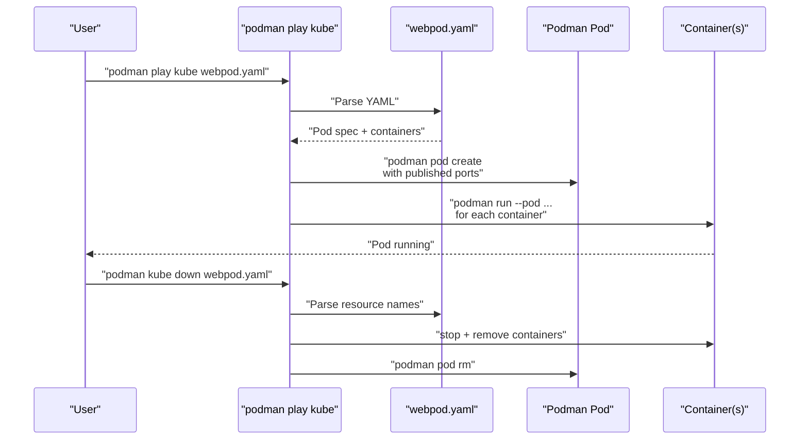
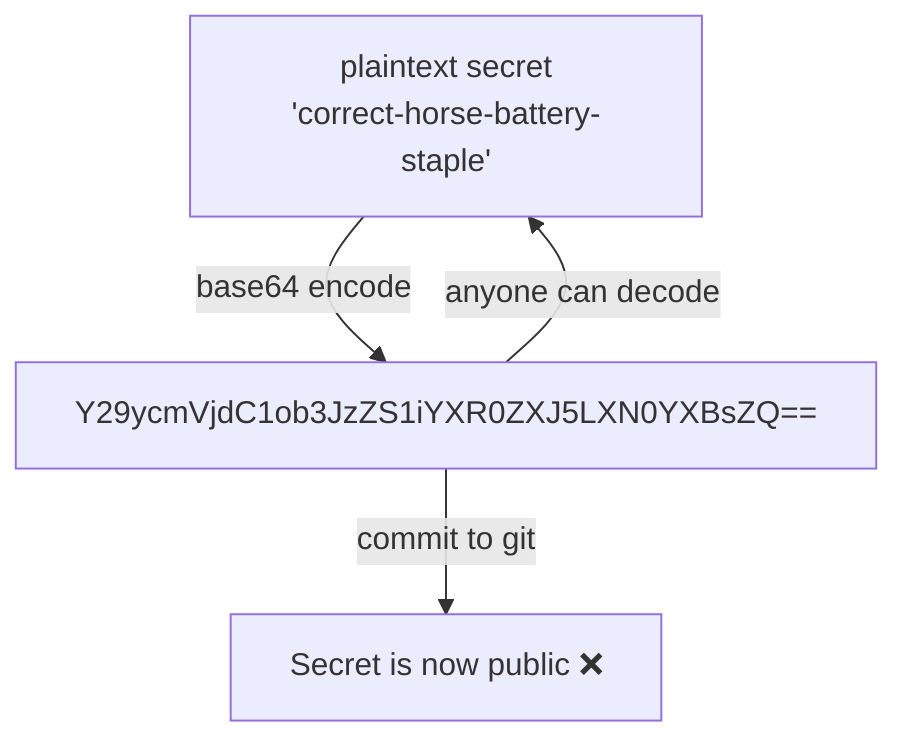

# Module 10: `podman play kube`
[](../LICENSE.md)
[](https://access.redhat.com/products/red-hat-enterprise-linux)
[](https://podman.io)

<a id="table-of-contents"></a>

## Table of Contents

- [Learning Goals](#learning-goals)
- [What Is `podman play kube`?](#what-is-podman-play-kube)
- [What YAML Resources Are Supported?](#what-yaml-resources-are-supported)
- [The YAML-to-Podman Mapping](#the-yaml-to-podman-mapping)
- [Lab: Run a Pod from YAML](#lab-run-a-pod-from-yaml)
- [Examining the Generated Resources](#examining-the-generated-resources)
- [Generating YAML from Existing Containers](#generating-yaml-from-existing-containers)
- [Production Note: Quadlet `.kube` Units](#production-note-quadlet-kube-units)
- [Secrets Note — Base64 Is Not Encryption](#secrets-note--base64-is-not-encryption)
- [Limitations To Know](#limitations-to-know)
- [Teardown — Always Use `podman kube down`](#teardown--always-use-podman-kube-down)
- [Checkpoint](#checkpoint)
- [Quick Quiz](#quick-quiz)
- [Further Reading](#further-reading)

---

`podman play kube` lets you run a subset of Kubernetes YAML locally — without a Kubernetes cluster. It is the bridge between Podman primitives and the Kubernetes resource model.

[↑ Go to TOC](#table-of-contents)

---

## Learning Goals

By the end of this module you will be able to:

- Explain what `podman play kube` does and what it cannot do.
- Run a Pod from Kubernetes YAML locally.
- Understand the mapping between YAML fields and Podman objects.
- Generate YAML from an existing Podman pod.
- Use a Quadlet `.kube` unit to manage a YAML-defined pod with systemd.
- Explain why base64 in YAML `Secret` objects is not encryption.
- Tear down YAML-created resources cleanly.

[↑ Go to TOC](#table-of-contents)

---

## What Is `podman play kube`?

`podman play kube` reads a Kubernetes YAML file and creates the corresponding Podman objects:

- A `Pod` YAML spec → a Podman pod with its containers.
- A `Deployment` YAML spec → multiple Podman pods (limited support).
- A `PersistentVolumeClaim` YAML spec → a Podman named volume.
- A `ConfigMap` YAML spec → environment variables or mounted files.
- A `Secret` YAML spec → mounted files (with important caveats — see below).



The key value proposition: **YAML is a repeatable, reviewable definition**. You can commit it to git, share it with your team, and re-run it identically on any machine with Podman — no `docker-compose.yml` required.

[↑ Go to TOC](#table-of-contents)

---

## What YAML Resources Are Supported?

Podman's `play kube` supports a practical subset of the Kubernetes API, not the full API surface.

| Resource kind | Support level | Notes |
|---|---|---|
| `Pod` | Full | The primary use case |
| `Deployment` | Partial | Creates pods but no rolling update controller |
| `PersistentVolumeClaim` | Yes | Creates a named volume |
| `ConfigMap` | Yes | Env vars or mounted files |
| `Secret` | Yes (with caveats) | See secrets section below |
| `Service` | No | No load balancer or ClusterIP |
| `Ingress` | No | No ingress controller |
| `StatefulSet` | No | Use Quadlet for stateful services |
| `DaemonSet` | No | |

> **Rule of thumb:** Use `play kube` for `Pod` specs. Anything more complex — use Quadlet (Module 11) or your CI/CD tooling.

[↑ Go to TOC](#table-of-contents)

---

## The YAML-to-Podman Mapping

Understanding the mapping prevents surprises when you inspect resources after `play kube`.

| Kubernetes YAML field | Maps to Podman |
|---|---|
| `metadata.name` of Pod | Pod name and container name prefix |
| `spec.containers[].image` | Image used for `podman run` |
| `spec.containers[].ports[].containerPort` | Not published automatically (use `hostPort`) |
| `spec.containers[].ports[].hostPort` | Published port (`-p hostPort:containerPort`) |
| `spec.volumes[].name` + `persistentVolumeClaim` | Named volume |
| `spec.volumes[].name` + `configMap` | ConfigMap data mounted as files |
| `spec.containers[].env` | Environment variables |
| `spec.containers[].command` + `args` | Override entrypoint/cmd |
| `spec.containers[].resources.limits` | `--memory`, `--cpus` limits |
| `spec.containers[].securityContext.runAsUser` | `--user` |
| `spec.containers[].securityContext.readOnlyRootFilesystem` | `--read-only` |

[↑ Go to TOC](#table-of-contents)

---

## Lab: Run a Pod from YAML

Use the example file included in this course:

**File:** `examples/kube/webpod.yaml`

**Step 1 — Examine the YAML first**

```bash
cat examples/kube/webpod.yaml  # read the pod spec before running it
```

Take a moment to understand the structure: the pod name, container name, image, and any published ports.

**Step 2 — Apply the YAML**

```bash
podman play kube examples/kube/webpod.yaml  # create resources from YAML
```

You will see output like:
```
Pod:
webpod
Container:
webpod-nginx
```

**Step 3 — Inspect the created resources**

```bash
podman pod ps  # list pods — should show webpod
podman ps --pod  # list containers showing pod membership
podman pod inspect webpod  # detailed pod info
```

Notice that the resources are named based on the YAML `metadata.name` field.

**Step 4 — Verify the service**

```bash
# Get the published port from the pod
podman port webpod  # show published ports
```

Then test it:

```bash
podman run --rm docker.io/library/alpine:latest sh -lc "wget -qO- http://host.containers.internal:8080/ | head -5" 2>/dev/null || \
  echo "Try: curl http://127.0.0.1:8080/ from the host"
```

**Step 5 — Tear down cleanly**

```bash
podman kube down examples/kube/webpod.yaml  # tear down all resources created by this YAML
```

Verify cleanup:

```bash
podman pod ps  # should be empty (or not show webpod)
podman ps -a --pod  # verify containers are gone
```

> **Important:** Always use `podman kube down <yaml>` to tear down resources created by `play kube`. It reads the YAML to determine what to remove and handles cleanup in the correct order. Using `podman pod rm` directly works too, but you risk missing volumes or other resources.

[↑ Go to TOC](#table-of-contents)

---

## Examining the Generated Resources

After `play kube`, you can inspect every generated object:

```bash
# Inspect the pod
podman pod inspect webpod | less  # detailed pod state

# Inspect a specific container (name pattern: podname-containername)
podman inspect webpod-nginx  # container details

# Check logs
podman logs webpod-nginx  # container logs

# Check events for what happened during creation
podman events --filter pod=webpod  # events for this pod
```

[↑ Go to TOC](#table-of-contents)

---

## Generating YAML from Existing Containers

`podman generate kube` does the reverse: it takes a running pod and produces Kubernetes YAML.

```bash
# Create a pod manually
podman pod create --name demo-pod -p 9090:80  # create a pod to export
podman run -d --pod demo-pod --name demo-nginx docker.io/library/nginx:stable  # add nginx

# Export it to YAML
podman generate kube demo-pod  # generate Kubernetes YAML from the pod
podman generate kube demo-pod > demo-pod.yaml  # save it to a file

# Inspect the generated YAML
cat demo-pod.yaml  # read the generated spec

# Clean up
podman pod rm -f demo-pod  # remove the pod
```

This workflow is useful for:

- Capturing a working local setup as YAML for repeatability.
- Providing a starting point for Kubernetes manifests.
- Documenting your stack in a structured format.

> **Note:** The generated YAML may need some cleanup before using in Kubernetes — generated specs often include Podman-specific annotations or fields that Kubernetes ignores or rejects.

[↑ Go to TOC](#table-of-contents)

---

## Production Note: Quadlet `.kube` Units

For production use on RHEL/Fedora, combine `play kube` with Quadlet using a `.kube` unit. This gives you systemd lifecycle management (auto-restart, boot start, journald logs) over a YAML-defined pod.

**Example `.kube` unit:**

```ini
# ~/.config/containers/systemd/webpod.kube
[Kube]
Yaml=webpod.yaml

[Service]
Restart=always

[Install]
WantedBy=default.target
```

Install and start:

```bash
mkdir -p ~/.config/containers/systemd  # create Quadlet directory
cp examples/quadlet/webpod.kube ~/.config/containers/systemd/  # install the kube unit
cp examples/quadlet/webpod.yaml ~/.config/containers/systemd/  # install the YAML spec
systemctl --user daemon-reload  # regenerate units from Quadlet files
systemctl --user start webpod.service  # start the YAML-defined pod
systemctl --user status webpod.service  # show status
```

> **Note:** `examples/quadlet/webpod.yaml` publishes on host port **8084**, not 8080 like `examples/kube/webpod.yaml` from the earlier lab — intentionally, so you can run both versions side by side without a port conflict.

Verify:

```bash
podman port webpod 2>/dev/null || podman pod ps  # confirm pod is running
```

Stop and clean up:

```bash
systemctl --user stop webpod.service  # stop the service
```

> **When to use this:** If you want the YAML definition workflow but need systemd reliability and reboot persistence. See Module 11 for full Quadlet details.

[↑ Go to TOC](#table-of-contents)

---

## Secrets Note — Base64 Is Not Encryption

Kubernetes `Secret` objects encode their values in base64:

```yaml
apiVersion: v1
kind: Secret
metadata:
  name: my-secret
data:
  password: Y29ycmVjdC1ob3JzZS1iYXR0ZXJ5LXN0YXBsZQ==  # base64 of "correct-horse-battery-staple"
```

**Base64 is encoding, not encryption.** Anyone who can read the YAML file can decode it in seconds:

```bash
echo 'Y29ycmVjdC1ob3JzZS1iYXR0ZXJ5LXN0YXBsZQ==' | base64 -d  # decodes to plaintext instantly
```



**Never commit YAML with base64-encoded secrets to a git repository unless:**
- The repository is fully private AND
- You have audited all access AND
- You accept that anyone with repo access can decode the secrets instantly.

**Better alternatives for dev/local use:**

- **Podman secrets** — store via `podman secret create`, reference by name in YAML (not the value).
- **SOPS** — encrypts the values in the YAML file using real cryptography.
- **Out-of-band provisioning** — create Podman secrets ahead of time; the YAML just references names.

[↑ Go to TOC](#table-of-contents)

---

## Limitations To Know

`podman play kube` is not a Kubernetes cluster. The following limitations are important to understand before designing around it:

**Not supported or limited:**
- `Service` resources (no ClusterIP, no load balancer, no service discovery across pods).
- `Ingress` resources (no ingress controller).
- `StatefulSet`, `DaemonSet`, `Job`, `CronJob` controllers.
- Rolling updates (no Deployment controller tracking replica state).
- Namespace isolation (Kubernetes namespaces, not Linux namespaces).
- Resource quotas and admission controllers.

**Behavioral differences from Kubernetes:**
- Liveness/readiness probes are honored for the container but have no pod rescheduling effect.
- `hostPort` semantics work but `containerPort` alone does not publish.
- Volume claims create Podman named volumes, not Kubernetes PVs.

> **Practical rule:** Use `podman play kube` for local development and testing of Pod specs. Use a real Kubernetes cluster (or at minimum `minikube`/`kind`) for testing Deployment/Service/Ingress resources.

[↑ Go to TOC](#table-of-contents)

---

## Teardown — Always Use `podman kube down`

When you create resources with `podman play kube`, use the matching teardown command:

```bash
podman kube down examples/kube/webpod.yaml  # tear down all resources created by this YAML
```

Why `kube down` instead of `podman pod rm`:

- It reads the YAML to determine the exact resources that were created.
- It removes containers, the pod, and optionally volumes in the correct order.
- It handles ConfigMaps, multiple pods (if the YAML defines several), and associated volumes.

If you want to also remove volumes created by PersistentVolumeClaims in the YAML:

```bash
podman kube down --force examples/kube/webpod.yaml  # tear down and remove associated volumes
```

> **Warning:** `--force` deletes volumes and their data. Only use it in labs or when you have verified the data is not needed.

[↑ Go to TOC](#table-of-contents)

---

## Checkpoint

Before moving on, confirm you can answer these:

- [ ] I can run a pod from a Kubernetes YAML file and confirm it is working.
- [ ] I know the right command to tear down resources created by `play kube`.
- [ ] I can explain why base64 in a YAML `Secret` is not encryption.
- [ ] I can generate YAML from an existing Podman pod with `podman generate kube`.
- [ ] I understand the key limitations: no Service, no Ingress, no rolling updates.
- [ ] I know how to use a Quadlet `.kube` unit for production YAML-defined services.

[↑ Go to TOC](#table-of-contents)

---

## Quick Quiz

1. Why is base64 not a secret storage mechanism?

2. What is the safest teardown command for resources created by `podman play kube`?

3. You have a Kubernetes `Deployment` YAML that you want to run locally with `podman play kube`. It uses a `Service` for internal DNS. What will not work?

4. What is the advantage of using a Quadlet `.kube` unit over running `podman play kube` directly?

[↑ Go to TOC](#table-of-contents)

---

## Further Reading

- `podman-play-kube(1)`: https://docs.podman.io/en/latest/markdown/podman-play-kube.1.html
- `podman-kube-down(1)`: https://docs.podman.io/en/latest/markdown/podman-kube-down.1.html
- `podman-generate-kube(1)`: https://docs.podman.io/en/latest/markdown/podman-generate-kube.1.html
- Quadlet `.kube` units: https://docs.podman.io/en/latest/markdown/podman-systemd.unit.5.html
- Kubernetes objects overview: https://kubernetes.io/docs/concepts/overview/working-with-objects/kubernetes-objects/
- Kubernetes Secrets (base64 caveat): https://kubernetes.io/docs/concepts/configuration/secret/
- SOPS (encrypted secrets in git): https://github.com/getsops/sops

[↑ Go to TOC](#table-of-contents)

© 2026 UncleJS — Licensed under CC BY-NC-SA 4.0
