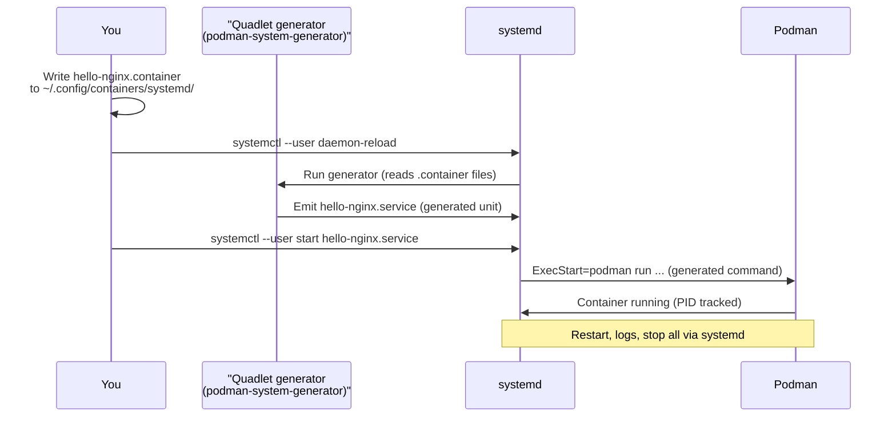
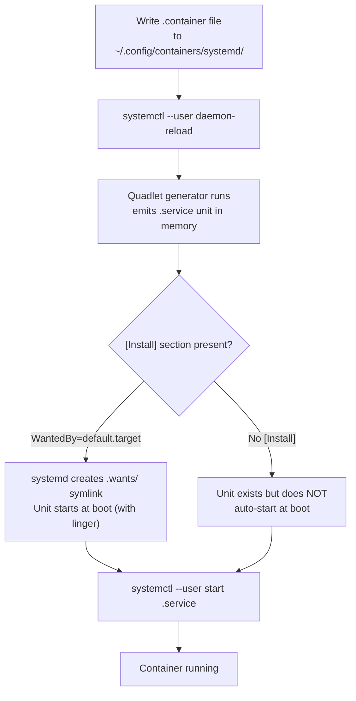
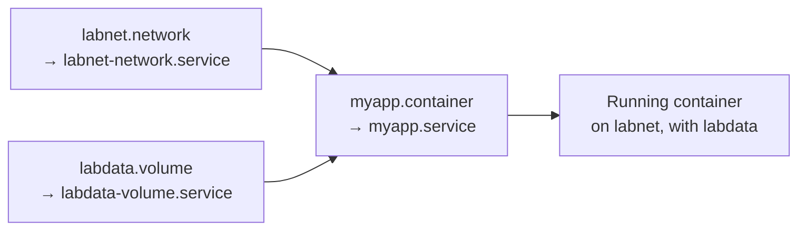
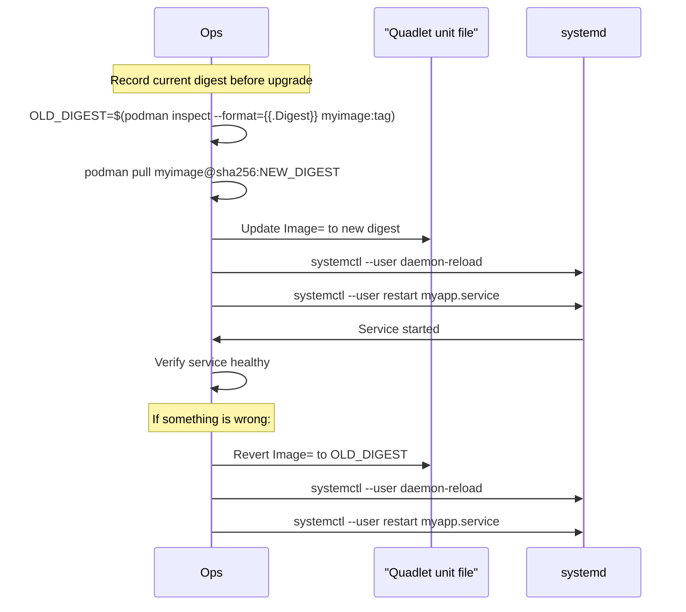

# Module 11: Production Baseline (systemd + Quadlet)
[](../LICENSE.md)
[](https://access.redhat.com/products/red-hat-enterprise-linux)
[](https://podman.io)

<a id="table-of-contents"></a>

## Table of Contents

- [Learning Goals](#learning-goals)
- [Why Quadlet](#why-quadlet)
- [Mental Model: Quadlet as a Generator](#mental-model-quadlet-as-a-generator)
- [Boot Safety (Rootless)](#boot-safety-rootless)
- [Where Quadlet Files Live](#where-quadlet-files-live)
- [Unit File Types](#unit-file-types)
- [Anatomy of a .container Unit](#anatomy-of-a-container-unit)
- [How "Enable" Works for Quadlet](#how-enable-works-for-quadlet)
- [Helpful Podman Commands](#helpful-podman-commands)
- [Lab: Your First Quadlet Container](#lab-your-first-quadlet-container)
- [Lab: Pre-Create a Network and Volume (Quadlet)](#lab-pre-create-a-network-and-volume-quadlet)
- [Debugging Quadlet Syntax](#debugging-quadlet-syntax)
- [Dependencies Between Quadlets](#dependencies-between-quadlets)
- [Upgrades and Rollback](#upgrades-and-rollback)
- [Restart Policies](#restart-policies)
- [Secrets](#secrets)
- [Checkpoint](#checkpoint)
- [Quick Quiz](#quick-quiz)
- [Further Reading](#further-reading)

Quadlet lets you define containers, pods, networks, and volumes as declarative unit files that systemd manages.


[↑ Go to TOC](#table-of-contents)

## Learning Goals

- Explain what Quadlet is and how it differs from `podman run` + a shell script.
- Manage containers with systemd user services.
- Use Quadlet `.container`, `.pod`, `.network`, and `.volume` units.
- Make services reboot-safe with predictable restarts.
- Debug generator failures quickly.
- Wire up dependencies so containers start in the right order.


[↑ Go to TOC](#table-of-contents)

## Why Quadlet

Before Quadlet, the common approach was `podman generate systemd` — which produced a fragile, auto-generated unit file that embedded the full `podman run` command. It was hard to maintain and broke on container name changes.

Quadlet is a **systemd generator** built into Podman. You write a small, human-readable `.container` file. Quadlet translates it to a `.service` unit at daemon-reload time. Advantages:

| Approach | Maintainability | Restart safety | systemd integration |
|---|---|---|---|
| Shell script | Low | None | None |
| `podman generate systemd` | Low (auto-generated) | ✅ | Partial |
| Quadlet | ✅ High | ✅ | ✅ Full |
| Kubernetes | Very high but heavy | ✅ | ❌ Not systemd |

Quadlet gives you:
- **Restart policies** — `on-failure`, `always`, etc.
- **Boot integration** — services survive reboots automatically.
- **Dependency ordering** — `After=` / `Requires=` between units.
- **journald logs** — all container output routed to `journalctl`.
- **No docker-compose dependency** — pure systemd + Podman.


[↑ Go to TOC](#table-of-contents)

## Mental Model: Quadlet as a Generator



The key insight: **you write declarative config; Quadlet writes the systemd unit; systemd manages the container lifecycle**. You never maintain the generated `.service` file directly.


[↑ Go to TOC](#table-of-contents)

## Boot Safety (Rootless)

By default, user systemd sessions only start when a user logs in. For a server where you want services to start at boot (before login), enable **lingering**:

```bash
sudo loginctl enable-linger "$USER"  # allow user services to start at boot
```

Check linger status:

```bash
loginctl show-user "$USER" | grep Linger  # Linger=yes means boot-safe
```

Without linger, your Quadlet services will not start until you log in — which defeats the purpose of a server.


[↑ Go to TOC](#table-of-contents)

## Where Quadlet Files Live

| Scope | Path | Notes |
|---|---|---|
| User (rootless) | `~/.config/containers/systemd/` | Most common for this course |
| System-wide | `/etc/containers/systemd/` | Requires root; maps to system units |
| Vendor / package | `/usr/share/containers/systemd/` | Read-only; for distribution packages |

For rootless development and production on a single-user server, use `~/.config/containers/systemd/`.

```bash
mkdir -p ~/.config/containers/systemd  # ensure the directory exists
```


[↑ Go to TOC](#table-of-contents)

## Unit File Types

Quadlet recognizes these file extensions:

| Extension | Purpose | Generated unit type |
|---|---|---|
| `.container` | Run a container | `.service` |
| `.volume` | Create a named volume | `.service` |
| `.network` | Create a named network | `.service` |
| `.pod` | Create a pod (shared namespace) | `.service` |
| `.kube` | Apply a Kubernetes YAML | `.service` |
| `.image` | Pull an image | `.service` |

Each generates a `<name>-<type>.service` or `<name>.service` unit that systemd can manage.


[↑ Go to TOC](#table-of-contents)

## Anatomy of a .container Unit

A `.container` file has INI-style sections. Here is a fully annotated example:

```ini
[Unit]
# Standard systemd [Unit] section — metadata and dependencies
Description=Hello nginx demo
# Wait for network and for the labnet network to be created:
After=network-online.target labnet-network.service
Requires=labnet-network.service

[Container]
# The image to run (pin by digest in production):
Image=docker.io/library/nginx:stable
# Port mapping (host:container):
PublishPort=8081:80
# Named network defined in labnet.network:
Network=labnet.network
# Named volume defined in labdata.volume:
Volume=labdata.volume:/data
# Secret defined via `podman secret create`:
Secret=db_password
# Drop all capabilities (security hardening):
CapDrop=ALL
# Prevent setuid escalation:
SecurityLabelDisable=false
NoNewPrivileges=true
# Read-only root filesystem:
ReadOnly=true
# tmpfs for nginx writable paths:
Tmpfs=/var/cache/nginx
Tmpfs=/var/run
# Run as UID 1001:
User=1001:1001
# Memory and PID limits:
Memory=128m
PidsLimit=50
# Optional: override container name (default is systemd-<unit>):
ContainerName=hello-nginx

[Service]
# Restart policy:
Restart=on-failure
RestartSec=5s
# Timeout before systemd considers start failed:
TimeoutStartSec=30

[Install]
# Start when the user's default target is reached (boot-safe with linger):
WantedBy=default.target
```

Key `[Container]` fields map to `podman run` flags:

| Quadlet key | Equivalent podman run flag |
|---|---|
| `Image=` | positional image argument |
| `PublishPort=` | `-p host:container` |
| `Network=` | `--network` |
| `Volume=` | `-v` |
| `Secret=` | `--secret` |
| `CapDrop=` | `--cap-drop` |
| `CapAdd=` | `--cap-add` |
| `ReadOnly=true` | `--read-only` |
| `Tmpfs=` | `--tmpfs` |
| `User=` | `--user` |
| `Memory=` | `--memory` |
| `NoNewPrivileges=true` | `--security-opt no-new-privileges` |
| `Environment=` | `-e KEY=VALUE` |
| `Exec=` | command override (like CMD) |


[↑ Go to TOC](#table-of-contents)

## How "Enable" Works for Quadlet

Quadlet units are generated at **daemon-reload** time, not at `systemctl enable` time. The lifecycle is:



Important:
- You generally do **not** need to run `systemctl enable` manually for Quadlet units. The `[Install]` section + `daemon-reload` is sufficient.
- If you remove a Quadlet file, run `daemon-reload` again — the generated unit disappears.
- If you edit a Quadlet file, run `daemon-reload` then `restart` the service.


[↑ Go to TOC](#table-of-contents)

## Helpful Podman Commands

List all Quadlet definitions discovered by Podman:

```bash
podman quadlet list  # list discovered Quadlet definitions
```

Print the resolved Quadlet file (shows defaults filled in):

```bash
podman quadlet print hello-nginx.container  # show resolved Quadlet file with defaults
```

Dry-run the generator (shows what units would be generated):

```bash
/usr/lib/systemd/system-generators/podman-system-generator --user --dryrun  # dry-run generator
```

Show the generated service unit:

```bash
systemctl --user cat hello-nginx.service  # show generated .service unit content
```


[↑ Go to TOC](#table-of-contents)

## Lab: Your First Quadlet Container

Use the example unit from the course repo:

- `examples/quadlet/hello-nginx.container`

**Install:**

```bash
mkdir -p ~/.config/containers/systemd                                          # ensure Quadlet search path exists
cp examples/quadlet/hello-nginx.container ~/.config/containers/systemd/       # install Quadlet unit
systemctl --user daemon-reload                                                 # regenerate units from Quadlet files
systemctl --user start hello-nginx.service                                     # start the service
systemctl --user status hello-nginx.service                                    # show status
```

**Verify HTTP response:**

```bash
podman exec -it systemd-hello-nginx sh -lc 'wget -qO- http://127.0.0.1:80 | head -5'  # verify nginx responds
```

Or from the host (if PublishPort=8081:80):

```bash
podman port systemd-hello-nginx  # show published ports
```

**View logs:**

```bash
journalctl --user -u hello-nginx.service -n 50 --no-pager  # view container logs via journald
```

**Stop and clean up:**

```bash
systemctl --user stop hello-nginx.service                                      # stop the service
rm -f ~/.config/containers/systemd/hello-nginx.container                      # remove the Quadlet definition file
systemctl --user daemon-reload                                                 # remove generated unit from systemd
```

Notes:

- The running container name is `systemd-<unit>` by default unless you set `ContainerName=` in the unit.
- Quadlet supports the majority of `podman run` flags via `[Container]` keys — see the Podman docs for the full list.


[↑ Go to TOC](#table-of-contents)

## Lab: Pre-Create a Network and Volume (Quadlet)

Using `.network` and `.volume` units decouples infrastructure objects from containers. This allows:
- Clean `Requires=` / `After=` dependency chains.
- Volumes and networks survive container restarts.
- Safe cleanup (stop units, then remove objects).

Use the example units:

- `examples/quadlet/labnet.network`
- `examples/quadlet/labdata.volume`

**Install:**

```bash
mkdir -p ~/.config/containers/systemd                                          # ensure Quadlet search path exists
cp examples/quadlet/labnet.network ~/.config/containers/systemd/               # install network unit
cp examples/quadlet/labdata.volume ~/.config/containers/systemd/               # install volume unit
systemctl --user daemon-reload                                                 # regenerate units
systemctl --user start labnet-network.service                                  # create network
systemctl --user start labdata-volume.service                                  # create volume
```

**Verify objects exist:**

```bash
podman network ls | grep labnet   # list networks, expect labnet
podman volume ls | grep labdata   # list volumes, expect labdata
```

**View logs for a network/volume unit (useful for debugging):**

```bash
journalctl --user -u labnet-network.service -n 20 --no-pager  # view network unit logs
```

**Cleanup:**

```bash
systemctl --user stop labnet-network.service || true           # stop network unit
systemctl --user stop labdata-volume.service || true           # stop volume unit
rm -f ~/.config/containers/systemd/labnet.network              # remove network Quadlet file
rm -f ~/.config/containers/systemd/labdata.volume              # remove volume Quadlet file
systemctl --user daemon-reload                                 # regenerate units (removes generated services)
podman network rm labnet 2>/dev/null || true                   # remove network object
podman volume rm labdata 2>/dev/null || true                   # remove volume object (data loss!)
```


[↑ Go to TOC](#table-of-contents)

## Debugging Quadlet Syntax

If `systemctl --user daemon-reload` succeeds but your service is not found, the generator likely failed silently.

**Step 1: Run the generator in dry-run mode to see errors:**

```bash
/usr/lib/systemd/system-generators/podman-system-generator --user --dryrun  # dry-run generator, shows errors
```

**Step 2: Analyze the generated unit:**

```bash
systemd-analyze --user --generators=true verify hello-nginx.service  # verify unit syntax
```

**Step 3: Check journal for generator errors:**

```bash
journalctl --user -b -p err -n 50 --no-pager  # show boot errors for this session
```

**Common mistakes:**

| Mistake | Symptom | Fix |
|---|---|---|
| Unknown `[Container]` key | Service not generated at all | Check spelling, consult `podman-systemd.unit.5` |
| Wrong network reference | Container fails to start | Use `Network=labnet.network` (with extension) |
| Wrong volume reference | Container fails to start | Use `Volume=labdata.volume:/path` |
| Missing `daemon-reload` after edit | Old version still running | Always `daemon-reload` after editing |
| File in wrong directory | Generator ignores file | Confirm it is in `~/.config/containers/systemd/` |
| Extra whitespace in value | Silent parse failure | No trailing spaces in INI values |

**Minimal debugging workflow:**

1. Start with the smallest possible `.container` file (just `Image=`).
2. `daemon-reload` and `start` — does it work?
3. Add one option at a time until you find the failing key.


[↑ Go to TOC](#table-of-contents)

## Dependencies Between Quadlets

Quadlet translates symbolic references between `.container`, `.network`, `.volume` files into proper systemd `After=` / `Requires=` relationships.

**Pattern:**

```ini
# In your .container file:
[Unit]
After=labnet-network.service labdata-volume.service
Requires=labnet-network.service labdata-volume.service

[Container]
Network=labnet.network
Volume=labdata.volume:/data
```



This prevents race conditions on boot where the container starts before its network or volume exists.

**Multi-container chains** (e.g., database before app):

```ini
# app.container — depends on db.container
[Unit]
After=db.service
Requires=db.service
```

Note: Quadlet does not have a "wait for healthy" mechanism like Docker Compose `depends_on: condition: service_healthy`. You must handle startup retries in your app or use a readiness loop in the entrypoint.


[↑ Go to TOC](#table-of-contents)

## Upgrades and Rollback

The Quadlet upgrade pattern is designed to be **safe and reversible**:



**Rule: always record the previous digest before upgrading.**

```bash
# Before upgrade:
OLD=$(podman inspect --format='{{.Digest}}' docker.io/library/nginx:stable)
echo "Rollback digest: $OLD"  # save this

# After pull and test:
podman pull docker.io/library/nginx:stable         # pull new version
NEW=$(podman inspect --format='{{.Digest}}' docker.io/library/nginx:stable)
# Update unit: Image=docker.io/library/nginx@sha256:<NEW>
```


[↑ Go to TOC](#table-of-contents)

## Restart Policies

Quadlet `[Service]` section accepts all standard systemd restart directives:

| `Restart=` value | When it restarts |
|---|---|
| `no` | Never (manual restart only) |
| `on-failure` | Only on non-zero exit codes |
| `on-abnormal` | On signal/timeout/watchdog failure |
| `always` | Always, including clean exits |
| `unless-stopped` | Always, unless explicitly stopped |

For long-running services, `on-failure` is the safest default — it won't loop-restart if your container exits cleanly during shutdown.

Pair with `RestartSec=` to add a backoff delay:

```ini
[Service]
Restart=on-failure
RestartSec=5s     # wait 5 seconds before restarting after a failure
```


[↑ Go to TOC](#table-of-contents)

## Secrets

Do not store secret material in unit files — not in `Environment=` lines, not in `Exec=` commands, not anywhere in the unit.

The correct pattern:

1. Create a Podman secret: `printf '%s' 'value' | podman secret create myapp_db_password -`
2. Reference it by name in the unit: `Secret=myapp_db_password`
3. The container reads from `/run/secrets/myapp_db_password`.

```ini
[Container]
Secret=myapp_db_password
# App reads: open('/run/secrets/myapp_db_password').read().strip()
```

See `modules/11-quadlet-secrets.md` for the full lab with rotation.

For distributed or encrypted-at-rest secrets, see `modules/90-external-secrets-survey.md`.


[↑ Go to TOC](#table-of-contents)

## Checkpoint

- You can write a `.container` Quadlet unit from scratch.
- You can start/stop a container via systemd user services.
- You can find logs in journald with `journalctl --user`.
- You can debug why a unit did not generate (dry-run generator).
- You can wire up `After=` / `Requires=` dependencies between Quadlet units.
- You understand the upgrade/rollback pattern with digest pinning.


[↑ Go to TOC](#table-of-contents)

## Quick Quiz

1) What is the Quadlet generator, and when does it run?

2) You edit a `.container` file. What two commands must you run for the change to take effect?

3) Your app container keeps starting before the database container is ready. What Quadlet `[Unit]` directives should you add?

4) What is the default container name when using Quadlet, and how do you override it?

5) Why is `Restart=always` potentially dangerous for a container that exits cleanly on shutdown?

6) You run `systemctl --user start myapp.service` and get "Unit not found". What is the most likely cause and how do you diagnose it?


[↑ Go to TOC](#table-of-contents)

## Further Reading

- Quadlet and Podman systemd integration: https://docs.podman.io/en/latest/markdown/podman-systemd.unit.5.html
- `podman-quadlet(1)`: https://docs.podman.io/en/latest/markdown/podman-quadlet.1.html
- systemd unit basics: https://www.freedesktop.org/software/systemd/man/latest/systemd.unit.html
- systemd user services: https://www.freedesktop.org/software/systemd/man/latest/systemd.service.html
- journald: https://www.freedesktop.org/software/systemd/man/latest/journald.html
- loginctl enable-linger: https://www.freedesktop.org/software/systemd/man/latest/loginctl.html


[↑ Go to TOC](#table-of-contents)

© 2026 UncleJS — Licensed under CC BY-NC-SA 4.0
