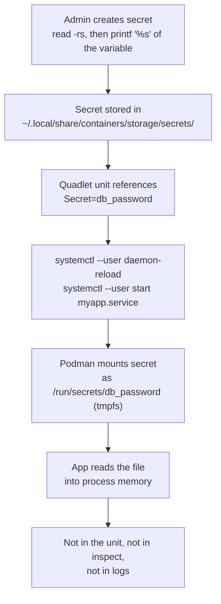
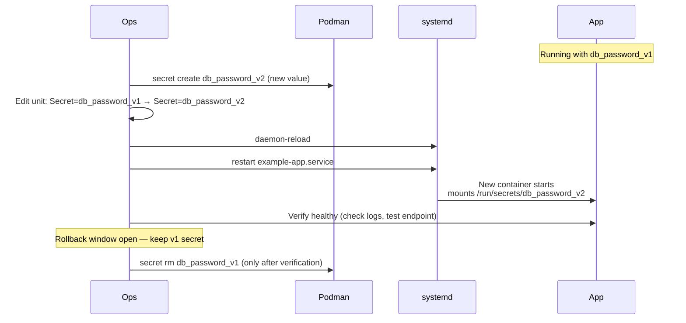

# Module 11a: Secrets with Quadlet + systemd (Rootless)
[](../LICENSE.md)
[](https://access.redhat.com/products/red-hat-enterprise-linux)
[](https://podman.io)

<a id="table-of-contents"></a>

## Table of Contents

- [Learning Goals](#learning-goals)
- [Why This Matters at the systemd Level](#why-this-matters-at-the-systemd-level)
- [Recommended Pattern](#recommended-pattern)
- [Where Secrets Are Stored](#where-secrets-are-stored)
- [The Three Levels of "Not in the Unit File"](#the-three-levels-of-not-in-the-unit-file)
- [Lab: Quadlet Unit Consuming a Secret](#lab-quadlet-unit-consuming-a-secret)
- [Reading the Secret Inside Your App](#reading-the-secret-inside-your-app)
- [Rotation](#rotation)
- [Multi-Secret Services](#multi-secret-services)
- [systemd Credentials as an Alternative](#systemd-credentials-as-an-alternative)
- [What This Does NOT Solve](#what-this-does-not-solve)
- [Checkpoint](#checkpoint)
- [Quick Quiz](#quick-quiz)
- [Further Reading](#further-reading)

This add-on to Module 11 shows how to run reboot-safe services while keeping secret material out of unit files and environment variables.


[↑ Go to TOC](#table-of-contents)

## Learning Goals

- Run a rootless systemd user service that consumes a secret as a file.
- Keep secret material out of:
  - unit files (`.container` files)
  - `Environment=` lines
  - shell history
  - `journalctl` output
- Rotate secrets safely with a rollback window.
- Know when to use systemd credentials vs Podman secrets.


[↑ Go to TOC](#table-of-contents)

## Why This Matters at the systemd Level

At the `podman run` level, secrets are a runtime flag. At the Quadlet/systemd level, they become part of your **deployment configuration** — a thing that must be managed, versioned, and auditable.

The most common mistake when moving from `podman run` to Quadlet is putting the secret value directly in the unit file:

```ini
# WRONG — value visible in unit file, journald, podman inspect
[Container]
Environment=DB_PASSWORD=hunter2
```

This is visible in:
- The `.container` file committed to git (accidental exposure).
- `systemctl --user cat myapp.service` (anyone with read access can see it).
- `journalctl --user` if the app logs its environment.
- `podman inspect` on the running container.

The correct pattern uses `Secret=` and a pre-created Podman secret:

```ini
# CORRECT — value is in the secrets store, not the unit file
[Container]
Secret=db_password
```


[↑ Go to TOC](#table-of-contents)

## Recommended Pattern



Guidelines:

- Treat secret names as part of your deployment config (document them).
- Prefer versioned secret names for rotation: `db_password_v1`, `db_password_v2`.
- Assume many apps only read secrets at startup — rotation requires a restart.
- Never use `Environment=DB_PASSWORD=...` for secret material.


[↑ Go to TOC](#table-of-contents)

## Where Secrets Are Stored

Podman stores secrets locally at:

```
~/.local/share/containers/storage/secrets/
```

Contents:
- `secrets.json` — metadata (names, IDs, driver, timestamps)
- `filedriver/` — blobs (base64-encoded by default)

The default driver (`file`) stores blobs on disk with filesystem permissions restricted to the owner. This means:

- **Encryption at rest**: not provided by default. The blob is base64-encoded but not encrypted.
- **Per-machine**: secrets are local to the host. They are not replicated.
- **Scoped to the user**: rootless secrets belong to the creating user.

For encrypted-at-rest or multi-host distribution, see Module 90.


[↑ Go to TOC](#table-of-contents)

## The Three Levels of "Not in the Unit File"

There are three levels of secret hygiene. Be explicit about which level you are operating at:

| Level | What is hidden | What is still exposed |
|---|---|---|
| **Level 0: env var in unit** | Nothing — value is in the unit file | Value in file, in `systemctl cat`, in `podman inspect` |
| **Level 1: Podman secret** | Value is in secrets store, not unit file | Name of secret is in unit file (acceptable) |
| **Level 2: systemd credentials** | Value injected by systemd at start | Value not visible even in Podman tooling |

Most workloads need Level 1. Level 2 (systemd credentials) is useful for bootstrapping secrets into containers without even a local secrets store.


[↑ Go to TOC](#table-of-contents)

## Lab: Quadlet Unit Consuming a Secret

**Prerequisites:**
- Rootless Podman installed.
- systemd user session available.

**Step 1: Enable lingering** (for boot-safe service):

```bash
sudo loginctl enable-linger "$USER"  # allow user services to start at boot
loginctl show-user "$USER" | grep Linger  # verify Linger=yes
```

**Step 2: Create the secret** (example only — do not use this value):

```bash
umask 077
read -rs PASSWORD  # type example-password; the literal is not in shell history
printf '%s' "$PASSWORD" > ./db_password.txt
unset PASSWORD
podman secret create db_password ./db_password.txt
rm -f ./db_password.txt
podman secret ls  # confirm secret exists
```

`printf '%s'` avoids the trailing newline that `echo` adds. Typing the password as an argument still records it in shell history. `read -rs` does not.

**Step 3: Write the Quadlet unit:**

```bash
mkdir -p ~/.config/containers/systemd  # ensure directory exists
```

Create `~/.config/containers/systemd/example-app.container`:

```ini
[Unit]
Description=Example app with Podman secret

[Container]
Image=docker.io/library/busybox:latest
Secret=db_password
Exec=sh -lc 'while true; do echo heartbeat; sleep 30; done'
NoNewPrivileges=true
ReadOnly=true
Tmpfs=/tmp

[Service]
Restart=on-failure
RestartSec=5s

[Install]
WantedBy=default.target
```

**Step 4: Reload and start:**

```bash
systemctl --user daemon-reload                        # regenerate units from Quadlet files
systemctl --user start example-app.service            # start the service
systemctl --user status example-app.service           # show status
```

**Step 5: Verify the secret is mounted as a file:**

```bash
podman exec systemd-example-app sh -lc 'ls -la /run/secrets'           # list secret files
podman exec systemd-example-app sh -lc 'wc -c /run/secrets/db_password'  # verify size without printing value
```

**Step 6: Verify the secret is NOT in the environment:**

```bash
podman exec systemd-example-app sh -lc 'env | grep -i password || echo "not in env"'  # should print: not in env
```

**Step 7: Verify logs do not contain the secret value:**

```bash
journalctl --user -u example-app.service -n 50 --no-pager  # inspect logs — no secret value should appear
```

**Cleanup:**

```bash
systemctl --user stop example-app.service                        # stop the service
systemctl --user disable example-app.service 2>/dev/null || true  # disable if enabled
rm -f ~/.config/containers/systemd/example-app.container         # remove Quadlet file
systemctl --user daemon-reload                                    # remove generated unit
podman secret rm db_password                                      # remove the secret
```


[↑ Go to TOC](#table-of-contents)

## Reading the Secret Inside Your App

The secret is mounted as a file. Here is how to read it in common languages:

```javascript
// Node.js
const fs = require('fs');
const dbPassword = fs.readFileSync('/run/secrets/db_password', 'utf8').trim();
```

```python
# Python
with open('/run/secrets/db_password') as f:
    db_password = f.read().strip()
```

```go
// Go
import "os"
data, err := os.ReadFile("/run/secrets/db_password")
dbPassword := strings.TrimSpace(string(data))
```

```bash
# Shell — this exports the value into that process's environment.
# Prefer the app reading the file itself. Use this only as a last resort.
DB_PASSWORD=$(cat /run/secrets/db_password)
```

```properties
# Spring Boot — application.properties
spring.config.import=configtree:/run/secrets/
```

`#{T(java.nio.file.Files)...}` is not evaluated in `application.properties`.

**Important**: trim the value. `echo 'value' | podman secret create` adds a newline. `printf '%s' "$VALUE"` does not. Do not put the literal value on the `printf` command line.


[↑ Go to TOC](#table-of-contents)

## Rotation

Use versioned secret names. This allows parallel running of old and new versions during the rollback window.



### Rotation Procedure

**Step 1: Create the new secret version:**

```bash
umask 077
read -rs PASSWORD  # type the new value
printf '%s' "$PASSWORD" > ./db_password_v2.txt
unset PASSWORD
podman secret create db_password_v2 ./db_password_v2.txt
rm -f ./db_password_v2.txt
```

**Step 2: Update the Quadlet file** — change `Secret=db_password_v1` to `Secret=db_password_v2`.

**Step 3: Reload and restart:**

```bash
systemctl --user daemon-reload                         # pick up Quadlet changes
systemctl --user restart example-app.service           # restart to use new secret
```

**Step 4: Verify:**

```bash
systemctl --user status example-app.service                          # check running status
journalctl --user -u example-app.service -n 100 --no-pager           # check logs for errors
podman exec systemd-example-app sh -lc 'wc -c /run/secrets/db_password_v2'  # confirm new secret mounted
```

**Step 5: Remove old secret only after rollback window closes:**

```bash
podman secret rm db_password_v1  # delete old secret — rollback no longer possible after this
```

**Rule**: never remove the old secret before the new deployment is verified and the rollback window has passed.


[↑ Go to TOC](#table-of-contents)

## Multi-Secret Services

A single container can consume multiple secrets. Declare each one on a separate `Secret=` line:

```ini
[Container]
Secret=db_password
Secret=api_key
Secret=tls_cert
```

Inside the container, these appear as:
- `/run/secrets/db_password`
- `/run/secrets/api_key`
- `/run/secrets/tls_cert`

Each can have independent options (target path, uid, mode):

```ini
[Container]
Secret=db_password,target=/etc/myapp/db.pass,mode=0400,uid=1001
Secret=api_key,target=/etc/myapp/api.key,mode=0400,uid=1001
```

You can change one `Secret=` name without touching the others. A new name or a new value is visible only after that container restarts. The mount is created when the container starts.


[↑ Go to TOC](#table-of-contents)

## systemd Credentials as an Alternative

systemd 250+ supports **credentials** — a way to pass secret material to a service via systemd itself, without using Podman secrets at all. This is useful when you want the secret to be managed entirely outside of Podman.

```ini
[Service]
LoadCredential=db_password:/etc/myapp/secrets/db_password
# Lands in the systemd service environment: $CREDENTIALS_DIRECTORY/db_password
# That directory is on the host side of the Podman service, not inside the container.
```

`LoadCredential=` does not mount the file into the container. To get it there, bind-mount that path (with `:Z` on enforcing SELinux) or copy it into a Podman secret from an `ExecStartPre=` script before the container starts. The container still reads a file.

The systemd credentials approach is more appropriate for:
- Secrets provisioned by configuration management (Ansible, Puppet).
- Secrets that must survive Podman being reinstalled.
- Environments where the secrets store itself needs to be audited.

See the systemd documentation linked in Further Reading for details.


[↑ Go to TOC](#table-of-contents)

## What This Does NOT Solve

Podman secrets + Quadlet solves local-machine secret hygiene. It does not solve:

| Problem | Solution |
|---|---|
| Distributing secrets to many hosts | HashiCorp Vault, AWS SSM, etc. (see Module 90) |
| Encryption at rest for secrets on disk | Custom Podman secret driver, or external secrets manager |
| Automatic rotation without restart | Requires external rotation agent or app-level hot reload |
| Secret access control between users | OS-level filesystem permissions only |
| Audit trail of who read which secret | External secrets manager with audit logging |


[↑ Go to TOC](#table-of-contents)

## Checkpoint

- You can write a Quadlet unit that references a secret by name without embedding the value.
- You can create a Podman secret safely (no shell history leakage).
- You can verify that the secret is mounted as a file and NOT present in the environment or logs.
- You can execute the full rotation procedure: create v2 → update unit → reload → restart → verify → remove v1.
- You can explain what Podman secrets do NOT protect against.


[↑ Go to TOC](#table-of-contents)

## Quick Quiz

1) Why is it safer to mount secrets as files rather than pass them in environment variables?

2) You run `echo 'mysecret' | podman secret create db_password -`. The app fails to authenticate. What is the likely cause?

3) You have `Environment=DB_PASSWORD=hunter2` in your Quadlet unit and you check it into git. What are two vectors through which the value can leak?

4) Why should you keep the old secret version around until after the new deployment is verified?

5) A colleague says "I'll just put the secret in `ExecStartPre=` as a shell variable". What is wrong with this?

6) What does the `mode=0400,uid=1001` option on `Secret=` control?


[↑ Go to TOC](#table-of-contents)

## Further Reading

- `podman-secret(1)`: https://docs.podman.io/en/latest/markdown/podman-secret.1.html
- Quadlet and Podman systemd integration: https://docs.podman.io/en/latest/markdown/podman-systemd.unit.5.html
- systemd credentials (service-provisioned files): https://www.freedesktop.org/software/systemd/man/latest/systemd.exec.html#Credentials
- OWASP Secrets Management Cheat Sheet: https://cheatsheetseries.owasp.org/cheatsheets/Secrets_Management_Cheat_Sheet.html
- Module 04: Secrets (Local-First) — podman secret commands
- Module 90: External Secrets Survey — HashiCorp Vault, AWS SSM


[↑ Go to TOC](#table-of-contents)

© 2026 UncleJS — Licensed under CC BY-NC-SA 4.0
