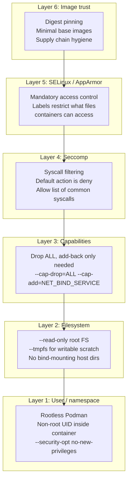
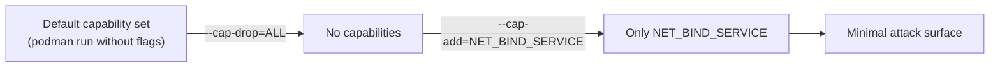
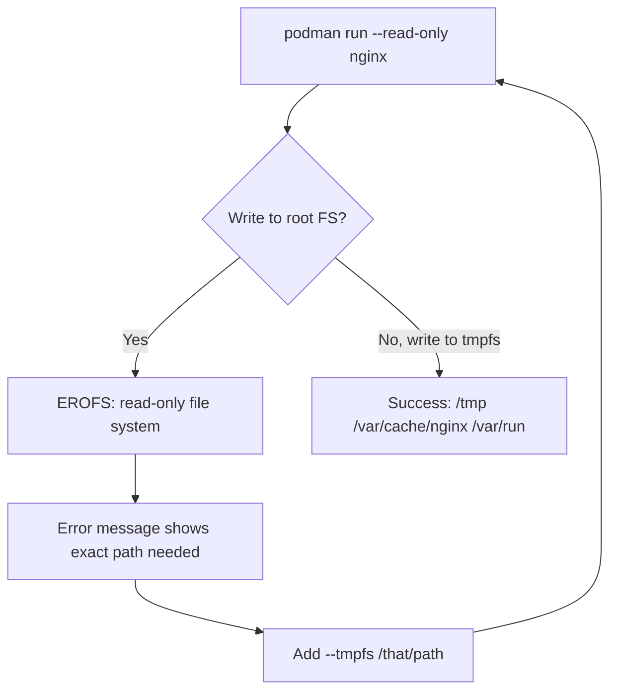
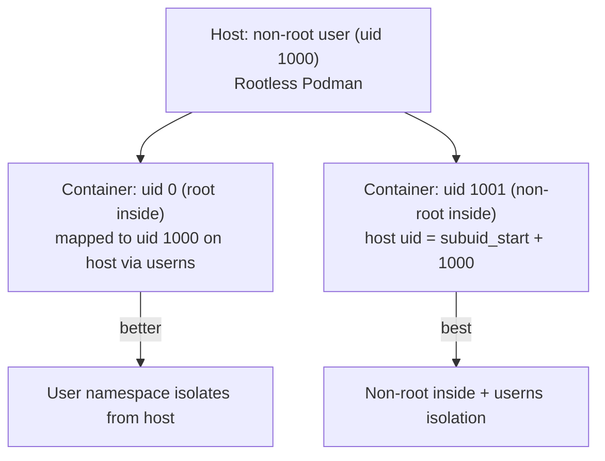
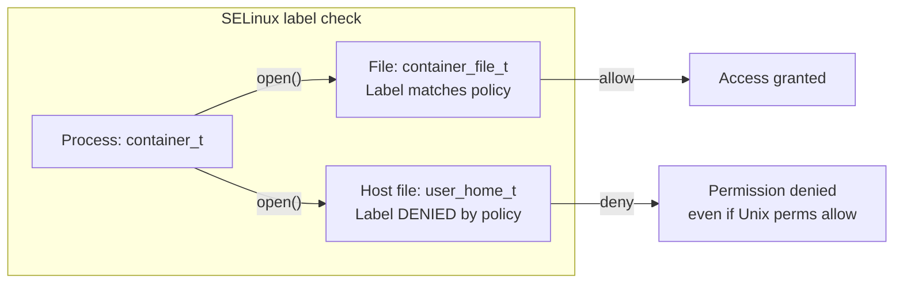
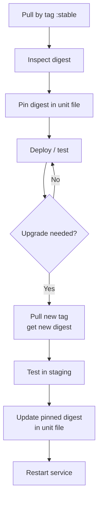

# Module 12: Security Deep Dive
[](../LICENSE.md)
[](https://access.redhat.com/products/red-hat-enterprise-linux)
[](https://podman.io)

<a id="table-of-contents"></a>

## Table of Contents

- [Learning Goals](#learning-goals)
- [The Defence-in-Depth Model](#the-defence-in-depth-model)
- [Baseline Hardening Checklist](#baseline-hardening-checklist)
- [Linux Capabilities — What They Are](#linux-capabilities--what-they-are)
- [Lab: Drop Capabilities](#lab-drop-capabilities)
- [Resource Limits — Why They Matter](#resource-limits--why-they-matter)
- [Lab: Resource Limits](#lab-resource-limits)
- [Lab: No-New-Privileges](#lab-no-new-privileges)
- [Lab: Read-Only Root FS](#lab-read-only-root-fs)
- [User Namespace and Non-Root Inside Container](#user-namespace-and-non-root-inside-container)
- [SELinux (Fedora/RHEL)](#selinux-fedorarhel)
- [Seccomp Profiles](#seccomp-profiles)
- [Image Trust (Practical)](#image-trust-practical)
- [Putting It Together: Hardened Run Template](#putting-it-together-hardened-run-template)
- [Checkpoint](#checkpoint)
- [Quick Quiz](#quick-quiz)
- [Further Reading](#further-reading)

This module focuses on reducing blast radius and making your container posture auditable.


[↑ Go to TOC](#table-of-contents)

## Learning Goals

- Apply least privilege inside and outside containers.
- Use read-only filesystems and drop capabilities.
- Understand the difference between rootless (on the host) and non-root (inside the container).
- Understand SELinux labels and why they matter on Fedora/RHEL.
- Apply resource limits to contain runaway or compromised workloads.
- Understand image trust at a practical level.
- Build a secure-by-default run configuration you can reuse.


[↑ Go to TOC](#table-of-contents)

## The Defence-in-Depth Model

Container security is not one setting — it is a stack of independent layers. If one layer fails, the others still limit damage.



The closer a layer is to the kernel, the harder it is to bypass. Layer 1 (user namespace + no-new-privileges) is your last line of defence if everything else fails.


[↑ Go to TOC](#table-of-contents)

## Baseline Hardening Checklist

Apply these for every long-running service container:

| Control | Flag / setting | Why |
|---|---|---|
| Rootless Podman | (run as non-root user on host) | Limits kernel attack surface |
| Non-root inside container | `User=1001` in Containerfile or `--user 1001` | The process is not UID 0 inside the container. A namespace escape still lands on a subordinate UID, not host root |
| No new privileges | `--security-opt no-new-privileges` | Prevents `setuid` escalation inside container |
| Drop all capabilities | `--cap-drop=ALL` | Removes almost all kernel privileges from PID 1 |
| Add back only what's needed | `--cap-add=NET_BIND_SERVICE` etc. | Least privilege |
| Read-only root FS | `--read-only` | Prevents code injection into app files |
| tmpfs for writable scratch | `--tmpfs /tmp` | Controlled, in-memory, not persistent |
| Memory limit | `--memory 256m` | Contain memory bombs / OOM blast radius |
| PID limit | `--pids-limit 200` | Contain fork bombs |
| No host network | (default — do not use `--network=host`) | Keeps container off host network stack |
| No privileged | (never use `--privileged` in prod) | Hands over the whole kernel |
| Avoid Docker socket equivalent | (never mount Podman socket into container) | Container-escape risk |


[↑ Go to TOC](#table-of-contents)

## Linux Capabilities — What They Are

Traditional Unix had one privilege boundary: root (UID 0) vs non-root. Linux **capabilities** split root's privileges into ~40 independent tokens. A process can hold some capabilities without being UID 0.

Key capabilities relevant to containers:

| Capability | What it allows | Typical need |
|---|---|---|
| `NET_BIND_SERVICE` | Bind ports < 1024 | Web servers on port 80/443 |
| `CHOWN` | Change file ownership arbitrarily | Init scripts, entrypoints |
| `DAC_OVERRIDE` | Bypass file permission checks | Package managers |
| `SETUID` / `SETGID` | Change process UID/GID | `su`, `sudo`, `sshd` |
| `SYS_ADMIN` | Huge catch-all: mount, sethostname, etc. | Almost never needed |
| `SYS_PTRACE` | Attach debuggers to processes | Debuggers only |
| `NET_ADMIN` | Configure network interfaces | Network tools |
| `KILL` | Send signals to other processes | Process managers |

Podman's default capability set is narrower than Docker's. Even so, always drop ALL and add back only what you've verified.




[↑ Go to TOC](#table-of-contents)

## Lab: Drop Capabilities

1) Run with the default capability set and list active caps:

```bash
podman run --rm docker.io/library/alpine:latest sh -lc 'cat /proc/1/status | grep Cap'  # show capability bitmask
```

2) Drop all capabilities and verify:

```bash
podman run --rm --cap-drop=ALL docker.io/library/alpine:latest sh -lc 'cat /proc/1/status | grep Cap'  # all zeros expected
```

3) Attempt an operation that needs a dropped capability:

```bash
podman run --rm --cap-drop=ALL docker.io/library/alpine:latest sh -lc 'chown 0 /tmp && echo ok || echo blocked'  # CHOWN is dropped
```

Expected: `blocked` (operation not permitted).

4) Add back only what you need:

```bash
podman run --rm --cap-drop=ALL --cap-add=CHOWN docker.io/library/alpine:latest \
  sh -lc 'chown 0 /tmp && echo ok'  # only CHOWN added back
```

5) The wrong answer — do not do this in production:

```bash
# WRONG: --privileged gives ALL capabilities plus more
# podman run --privileged ...
echo "Do not use --privileged — it defeats all capability controls"
```

Notes:

- Prefer `--cap-drop=ALL` as baseline, then add specific capabilities as errors reveal requirements.
- Document which capabilities your service needs and why.


[↑ Go to TOC](#table-of-contents)

## Resource Limits — Why They Matter

Resource limits serve two purposes:

1. **Blast radius containment**: a compromised or buggy container cannot take down the whole host by consuming all memory/CPU.
2. **Denial-of-service mitigation**: fork bombs and memory bombs are bounded.

Key limits:

| Flag | What it limits | Example |
|---|---|---|
| `--memory` | Max RAM | `--memory 256m` |
| `--memory-swap` | RAM + swap total | `--memory-swap 256m` (no swap) |
| `--cpus` | CPU cores (fractional) | `--cpus 0.5` |
| `--pids-limit` | Max PIDs / threads | `--pids-limit 200` |
| `--ulimit nofile` | Open file descriptors | `--ulimit nofile=1024:1024` |


[↑ Go to TOC](#table-of-contents)

## Lab: Resource Limits

1) Run with memory and PID limits:

```bash
podman run --rm --memory 256m --pids-limit 200 docker.io/library/alpine:latest \
  sh -lc 'echo "memory and pids limited"'  # run a container with limits
```

2) Attempt a fork bomb (safe — will be contained):

```bash
podman run --rm --pids-limit 20 docker.io/library/alpine:latest \
  sh -lc ':(){ :|:& };: || echo "fork bomb contained"'  # fork bomb blocked by pids-limit
```

The container will be killed or the shell will error — it cannot escape the PID limit.

3) Verify memory limit with a big allocation attempt:

```bash
podman run --rm --memory 32m docker.io/library/alpine:latest \
  sh -lc 'dd if=/dev/zero of=/dev/null bs=1M count=64 || echo OOM-killed'  # dd into /dev/null is fine — no actual allocation
```

Note: `dd` to `/dev/null` does not actually allocate memory; this just illustrates the pattern. Use `stress` or `python` for real OOM testing.


[↑ Go to TOC](#table-of-contents)

## Lab: No-New-Privileges

`--security-opt no-new-privileges` prevents a process inside the container from gaining new capabilities through `setuid` binaries or capability-setting file attributes.

Without this flag, a `setuid root` binary inside the container can elevate privileges. With it, the kernel ignores `setuid` bits.

1) Baseline — verify current UID:

```bash
podman run --rm docker.io/library/alpine:latest id  # show current uid/gid
```

2) Apply no-new-privileges:

```bash
podman run --rm --security-opt no-new-privileges docker.io/library/alpine:latest id  # id does not change
```

`id` does not show the flag working. The flag changes `execve` of setuid binaries and file capabilities. Alpine's `id` is not setuid, so this step only confirms the container still starts.

3) Combine with drop-all and non-root:

```bash
podman run --rm \
  --cap-drop=ALL \
  --security-opt no-new-privileges \
  --user 1001:1001 \
  docker.io/library/alpine:latest \
  id  # running as 1001, no capabilities, no setuid escalation possible
```


[↑ Go to TOC](#table-of-contents)

## Lab: Read-Only Root FS

A read-only root filesystem means a compromised process cannot modify application code, replace binaries, or install backdoors. Writes are only possible to explicitly mounted `tmpfs` or volumes.

1) Attempt to write to the root FS:

```bash
podman run --rm --read-only docker.io/library/alpine:latest \
  sh -lc 'touch /etc/pwned || echo "read-only blocked write"'  # write attempt fails
```

2) Provide writable tmpfs for scratch space:

```bash
podman run --rm --read-only \
  --tmpfs /tmp \
  --tmpfs /var/run \
  docker.io/library/alpine:latest \
  sh -lc 'touch /tmp/scratch && echo ok'  # tmpfs is writable
```

3) Run nginx with read-only root and appropriate tmpfs mounts:

```bash
podman run --rm -p 8080:80 \
  --read-only \
  --tmpfs /var/cache/nginx \
  --tmpfs /var/run \
  --tmpfs /tmp \
  docker.io/library/nginx:stable  # run nginx read-only
```

If it fails, read the error message — it is a map of which paths nginx needs to write. Add a targeted `--tmpfs` for each.

4) Combine everything:

```bash
podman run --rm -p 8080:80 \
  --read-only \
  --cap-drop=ALL \
  --cap-add=NET_BIND_SERVICE \
  --security-opt no-new-privileges \
  --memory 128m \
  --pids-limit 50 \
  --tmpfs /var/cache/nginx \
  --tmpfs /var/run \
  --tmpfs /tmp \
  docker.io/library/nginx:stable  # nginx still binds container port 80, so NET_BIND_SERVICE stays
```



Debugging read-only failures:

- Read the error message — it tells you the exact path.
- Add `--tmpfs <path>` for each path the app needs to write.
- Prefer small, targeted tmpfs mounts over giving up and removing `--read-only`.


[↑ Go to TOC](#table-of-contents)

## User Namespace and Non-Root Inside Container

There are two distinct concepts students often confuse:

| Concept | What it means |
|---|---|
| **Rootless Podman** | Podman itself runs as a non-root user on the host. The container's UID 0 maps to an unprivileged host UID via user namespace. |
| **Non-root inside container** | The process inside the container runs as UID != 0, e.g., UID 1001. Even if the user namespace map gives UID 0 inside the container, the app process itself doesn't use it. |

Both are desirable. They are independent:



Best practice: use `USER 1001` in your `Containerfile` or `--user 1001:1001` at runtime.

Check the UID mapping on a running container:

```bash
podman run --rm docker.io/library/alpine:latest \
  sh -lc 'cat /proc/self/uid_map'  # show uid_map (how container UIDs map to host UIDs)
```


[↑ Go to TOC](#table-of-contents)

## SELinux (Fedora/RHEL)

SELinux is a **Mandatory Access Control (MAC)** system baked into the RHEL/Fedora kernel. Unlike standard Unix permissions (which the process owner controls), SELinux policies are set by the system administrator and cannot be overridden by root.

For containers, SELinux adds a type label to every process and file. By default:

- Containers run with label `container_t`.
- Container processes can only access files labelled `container_file_t` or `svirt_sandbox_file_t`.
- Host files have labels like `user_home_t`, `etc_t` — containers cannot access them even if permissions allow it.



**Practical rules:**

- Prefer named volumes over bind mounts — volumes are automatically labelled correctly.
- If you must use a bind mount, add `:Z` for private relabelling:
  ```bash
  podman run --rm -v /host/data:/app/data:Z myimage  # :Z relabels for this container only
  ```
- Use `:z` (lowercase) for shared bind mounts accessed by multiple containers.
- **Never disable SELinux to fix container issues** — that removes protection for the entire host.

Check if SELinux is enforcing:

```bash
getenforce  # show SELinux mode: Enforcing / Permissive / Disabled
```

Check SELinux denials:

```bash
sudo ausearch -m avc -ts recent  # audit log is not readable rootless
```


[↑ Go to TOC](#table-of-contents)

## Seccomp Profiles

Seccomp (Secure Computing Mode) filters which Linux **syscalls** a container process can make. The default profile's default action is **deny**. An allow list of a few hundred common syscalls is what gets through. `reboot`, `kexec_load`, and `create_module` stay denied. The allow list is not a list of 300 blocked calls.

You rarely need to change the default. But knowing it exists matters:

- If a container fails with `EPERM` doing something unusual (e.g., using `ptrace`, unusual socket types), seccomp may be blocking it.
- You can disable seccomp with `--security-opt seccomp=unconfined` — avoid this in production.
- Custom profiles allow you to allow or deny specific syscalls.

Check that the default profile is active:

```bash
podman run --rm docker.io/library/alpine:latest \
  sh -lc 'cat /proc/1/status | grep Seccomp'  # 2 = SECCOMP_MODE_FILTER (active)
```

Expected: `Seccomp: 2`


[↑ Go to TOC](#table-of-contents)

## Image Trust (Practical)

A container is only as trustworthy as its image. The image supply chain is a real attack vector (typosquatting, compromised upstream, malicious layer injection).

**Digest pinning**: instead of a mutable tag like `:latest`, pin to an immutable digest:

```bash
# Mutable — can change without warning:
podman pull docker.io/library/nginx:stable

# Immutable — always the exact same bytes:
podman pull docker.io/library/nginx@sha256:abc123...  # pin by digest
```

Workflow:

1. Pull by tag to get the current digest.
2. Record the digest in your Quadlet unit or Containerfile.
3. Upgrades are explicit: pull new digest, test, update the pinned value.

```bash
podman pull docker.io/library/nginx:stable        # pull by tag
podman inspect --format='{{.Digest}}' docker.io/library/nginx:stable  # get digest
```

**Minimal base images:**

| Base | Approximate size | Notes |
|---|---|---|
| `ubuntu:22.04` | ~70 MB | Many packages, large attack surface |
| `debian:slim` | ~30 MB | Smaller, still apt available |
| `alpine:latest` | ~7 MB | musl libc, common for small images |
| `ubi10-minimal` | ~30 MB | RHEL-based, supported by Red Hat |
| `scratch` | 0 MB | No OS — statically compiled binaries only |

**Supply chain habits:**

- Prefer official images or your organization's curated base images.
- Avoid running `curl | sh` installer scripts inside builds.
- Use reproducible builds — identical inputs should produce identical digests.
- Scan images for known CVEs (`trivy`, `grype`, `podman image scan` depending on availability).




[↑ Go to TOC](#table-of-contents)

## Putting It Together: Hardened Run Template

A template combining all controls. Start here and remove only what your workload genuinely cannot function with:

```bash
podman run -d \
  --name myservice \
  --read-only \
  --cap-drop=ALL \
  --security-opt no-new-privileges \
  --user 1001:1001 \
  --memory 256m \
  --memory-swap 256m \
  --pids-limit 200 \
  --tmpfs /tmp \
  --secret db_password \
  --network app_net \
  docker.io/library/myapp@sha256:<digest>  # hardened container run template
```

As a Quadlet unit (production):

```ini
[Unit]
Description=Hardened application service

[Container]
Image=docker.io/library/myapp@sha256:<digest>
ReadOnly=true
DropCapability=ALL
# AddCapability=NET_BIND_SERVICE only if this process binds a port below 1024
SecurityLabelDisable=false
NoNewPrivileges=true
User=1001:1001
Memory=256m
PidsLimit=200
Tmpfs=/tmp
Secret=db_password
Network=app_net.network

[Service]
Restart=on-failure
RestartSec=5s

[Install]
WantedBy=default.target
```


[↑ Go to TOC](#table-of-contents)

## Checkpoint

- You can explain the difference between rootless Podman and non-root inside the container — and why both matter.
- You can explain why `--privileged` is almost always the wrong answer.
- You can apply the full hardening stack: drop capabilities, read-only FS, no-new-privileges, resource limits.
- You can explain what SELinux does and when to use `:Z`.
- You can make a service run read-only, or explain exactly why it cannot.


[↑ Go to TOC](#table-of-contents)

## Quick Quiz

1) What is the difference between `--cap-drop=ALL` and `--privileged`? Which one should you never use in production?

2) A container writes to `/run/app.pid` at startup. You add `--read-only`. It fails. What is the correct fix?

3) You bind-mount `/home/user/data` into a container and get `Permission denied` even though Unix permissions look correct. What is the likely cause on RHEL?

4) Why is digest pinning useful even if you fully trust the upstream image maintainer?

5) What does `Seccomp: 2` in `/proc/1/status` tell you about the container?

6) Your app needs to bind port 80. You've dropped all capabilities. What single capability must you add back?


[↑ Go to TOC](#table-of-contents)

## Further Reading

- Linux capabilities (man7): https://man7.org/linux/man-pages/man7/capabilities.7.html
- `seccomp(2)` (man7): https://man7.org/linux/man-pages/man2/seccomp.2.html
- SELinux with containers (RHEL docs): https://docs.redhat.com/en/documentation/red_hat_enterprise_linux/9/html/using_selinux/assembly_using-selinux-with-containers_using-selinux
- Podman security docs: https://github.com/containers/podman/blob/main/docs/tutorials/security.md
- Rootless containers (rootlesscontainers.org): https://rootlesscontainers.org/
- Trivy image scanner: https://aquasecurity.github.io/trivy/


[↑ Go to TOC](#table-of-contents)

© 2026 UncleJS — Licensed under CC BY-NC-SA 4.0
