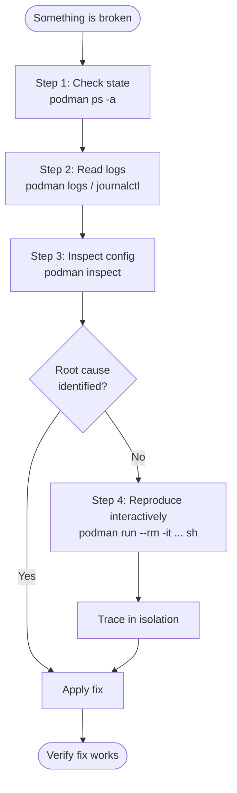
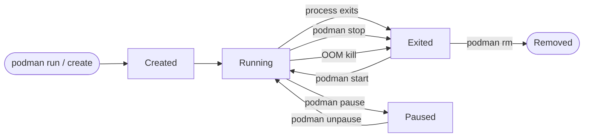
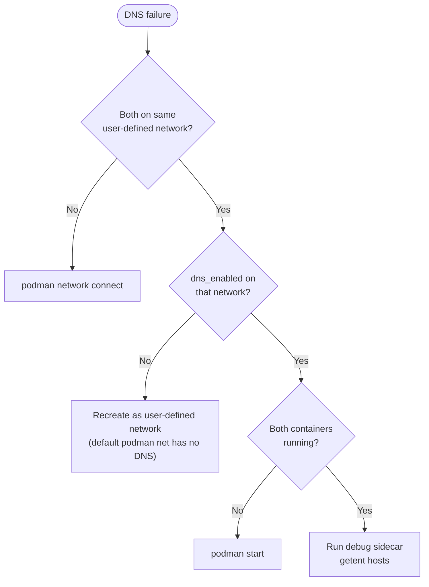
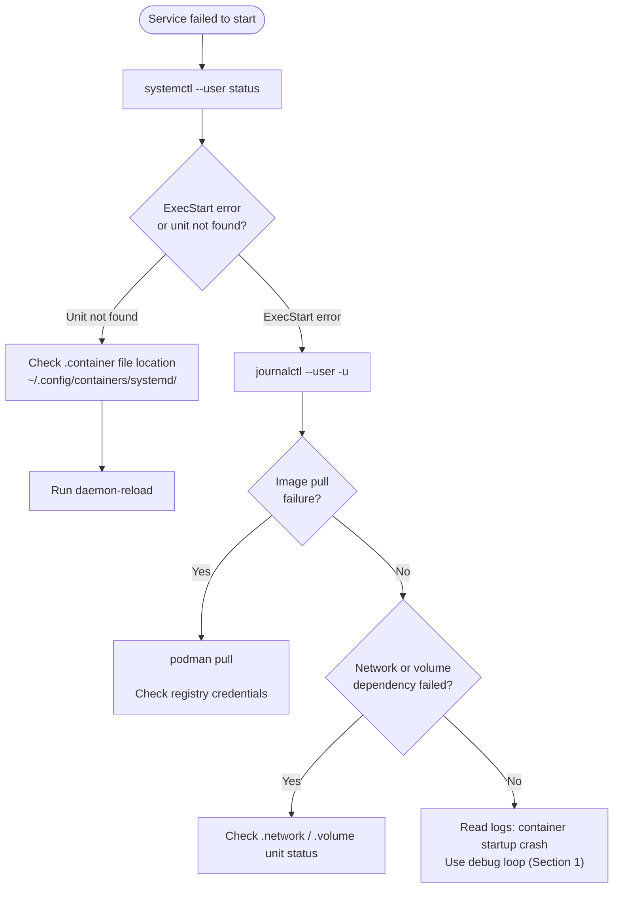

# Module 13: Troubleshooting and Ops
[](../LICENSE.md)
[](https://access.redhat.com/products/red-hat-enterprise-linux)
[](https://podman.io)

<a id="table-of-contents"></a>

## Table of Contents

- [Learning Goals](#learning-goals)
- [Minimum Path (If You Are Short on Time)](#minimum-path-if-you-are-short-on-time)
- [1  The Debug Loop (Mental Model)](#1-the-debug-loop-mental-model)
- [2  Container State and Lifecycle Commands](#2-container-state-and-lifecycle-commands)
- [3  Reading Logs](#3-reading-logs)
- [4  Deep Inspection with `podman inspect`](#4-deep-inspection-with-podman-inspect)
- [5  Interactive Debugging](#5-interactive-debugging)
- [6  Events and Timeline](#6-events-and-timeline)
- [7  Resource Monitoring](#7-resource-monitoring)
- [8  Networking Troubleshooting](#8-networking-troubleshooting)
- [9  Storage Troubleshooting](#9-storage-troubleshooting)
- [10  systemd and Quadlet Troubleshooting](#10-systemd-and-quadlet-troubleshooting)
- [11  SELinux Troubleshooting](#11-selinux-troubleshooting)
- [12  Failure Drills (Do These in Practice)](#12-failure-drills-do-these-in-practice)
- [13  Recovery Playbooks](#13-recovery-playbooks)
- [Checkpoint](#checkpoint)
- [Quick Quiz](#quick-quiz)
- [Further Reading](#further-reading)

This module is about turning "it doesn't work" into a short, repeatable checklist. Diagnosis before action — do not restart blindly.

---


[↑ Go to TOC](#table-of-contents)

## Learning Goals

By the end of this module you will be able to:

- Apply a structured debug loop instead of guessing.
- Locate container logs, events, and inspection data efficiently.
- Debug networking and storage issues methodically.
- Troubleshoot Quadlet + systemd service failures.
- Diagnose and resolve SELinux label problems.
- Perform failure drills so you are fast under pressure.
- Build repeatable recovery playbooks for common incidents.


[↑ Go to TOC](#table-of-contents)

## Minimum Path (If You Are Short on Time)

- Master the four-step debug loop (Section 1) — use it every time.
- Run the port-conflict and DNS failure drills (Section 12).
- Know the three journalctl commands for Quadlet failures (Section 10).

---


[↑ Go to TOC](#table-of-contents)

## 1 The Debug Loop (Mental Model)

Before reaching for a restart, follow this loop exactly once:



The goal is always to **understand before acting**. Random restarts hide real problems.

### 1.1 The Four Steps

**Step 1 — State check:**

```bash
podman ps -a  # list all containers (running and stopped)
```

Look for: status (`Exited`, `Up`, `Created`), uptime, exit codes.

**Step 2 — Logs:**

```bash
podman logs <name>           # full log output
podman logs --tail 50 <name> # last 50 lines
podman logs -f <name>        # follow live
```

**Step 3 — Inspect config:**

```bash
podman inspect <name> | less  # full JSON: ports, mounts, env, entrypoint
```

**Step 4 — Interactive reproduction:**

```bash
podman run --rm -it <same-image> sh  # shell into a fresh container
```

If the container exits too fast to exec into, override the entrypoint:

```bash
podman run --rm -it --entrypoint sh <image>  # bypass the app entrypoint
```

---


[↑ Go to TOC](#table-of-contents)

## 2 Container State and Lifecycle Commands

### 2.1 Exit Codes Matter

| Exit code | Common meaning |
|-----------|---------------|
| `0` | Clean exit (process ran to completion or was stopped cleanly) |
| `1` | Application error |
| `125` | Podman/OCI runtime error (before app started) |
| `126` | Command found but not executable |
| `127` | Command not found |
| `137` | Killed by SIGKILL (OOM, manual `kill -9`, resource limit) |
| `143` | Killed by SIGTERM (normal shutdown, timeout) |

```bash
podman inspect <name> --format '{{.State.ExitCode}}'  # get exit code
podman inspect <name> --format '{{.State.Error}}'     # get runtime error string
```

### 2.2 Container State Transitions



### 2.3 Useful State Commands

```bash
podman ps -a                                  # all containers with status
podman ps --filter status=exited              # only exited containers
podman ps --filter name=myapp                 # filter by name pattern
podman ps --format "table {{.Names}}\t{{.Status}}\t{{.Ports}}"  # custom table
```

---


[↑ Go to TOC](#table-of-contents)

## 3 Reading Logs

### 3.1 Basic Log Commands

```bash
podman logs <name>              # full output since container start
podman logs --tail 100 <name>   # last N lines
podman logs --since 30m <name>  # logs from last 30 minutes
podman logs -f <name>           # follow live (Ctrl+C to stop)
podman logs --timestamps <name> # include timestamps
```

### 3.2 Multiple Containers (Quick Scan)

```bash
for name in app db proxy; do
  echo "=== $name ===" && podman logs --tail 10 "$name" 2>&1
done  # scan logs for multiple containers
```

### 3.3 When the Container Is Gone

If the container was removed with `--rm`, its logs are gone. This is why ephemeral containers are not suitable for debugging production services.

For Quadlet/systemd services, logs survive in journald even after the container restarts:

```bash
journalctl --user -u cap-mariadb.service -n 200 --no-pager  # retrieve logs from journald
```

### 3.4 Log Verbosity Tricks

Some images respect `DEBUG=1` or `LOG_LEVEL=debug`:

```bash
podman run --rm -e DEBUG=1 <image>  # enable debug logging if app supports it
```

---


[↑ Go to TOC](#table-of-contents)

## 4 Deep Inspection with `podman inspect`

### 4.1 Full Dump

```bash
podman inspect <name> | less  # full JSON
```

### 4.2 Targeted Extractions

```bash
# What ports are published?
podman inspect <name> --format '{{json .NetworkSettings.Ports}}'  # inspect ports

# What networks is it on?
podman inspect <name> --format '{{json .NetworkSettings.Networks}}'  # inspect networks

# What mounts does it have?
podman inspect <name> --format '{{json .Mounts}}'  # inspect mounts

# What is the effective command?
podman inspect <name> --format '{{.Config.Cmd}}'  # inspect command

# What user is it running as?
podman inspect <name> --format '{{.Config.User}}'  # inspect user

# What is the current exit code?
podman inspect <name> --format '{{.State.ExitCode}} {{.State.Error}}'  # inspect state

# What environment variables are set?
podman inspect <name> --format '{{range .Config.Env}}{{println .}}{{end}}'  # inspect env
```

### 4.3 Image Inspection

```bash
podman image inspect <image>:<tag> | less  # full image metadata
podman image history <image>:<tag>         # layer history + sizes
podman image inspect <image>:<tag> --format '{{.Os}}/{{.Architecture}}'  # check arch
```

---


[↑ Go to TOC](#table-of-contents)

## 5 Interactive Debugging

### 5.1 Exec Into a Running Container

```bash
podman exec -it <name> sh          # open a shell
podman exec -it <name> bash        # if bash is available
podman exec -it <name> env         # print environment
podman exec <name> cat /proc/net/tcp  # ss is not in Alpine or official nginx
podman exec -it <name> cat /etc/resolv.conf  # check DNS config
```

### 5.2 Debug a Failing Container (Override Entrypoint)

```bash
podman run --rm -it --entrypoint sh <image>:<tag>  # bypass CMD/ENTRYPOINT
```

Now you have a shell inside the image and can:
- check if files exist at expected paths
- check permissions
- run the app command manually to see the real error

### 5.3 Debug with a Sidecar on the Same Network

```bash
podman run --rm -it --network <same-net> docker.io/library/alpine:latest sh  # network debug sidecar
```

From here you can `getent hosts <name>`, `nc -zv <name> <port>`, etc.

### 5.4 netshoot — When You Need More Tools

```bash
podman run --rm -it --network <net> docker.io/nicolaka/netshoot:latest  # network diagnostics image
```

`netshoot` contains: `curl`, `dig`, `nmap`, `tcpdump`, `ss`, `iftop`, `mtr`, and more.

---


[↑ Go to TOC](#table-of-contents)

## 6 Events and Timeline

`podman events` gives you a chronological record of Podman operations — starts, stops, network connects, volume mounts, errors.

```bash
podman events                            # stream live events
podman events --filter type=container    # only container events
podman events --filter container=<name>  # events for a specific container
podman events --filter event=die         # only death events
podman events --since 1h                 # last hour of events
podman events --until 30m               # events before 30 min ago (relative)
```

Useful for answering: "when did this container restart, and why?"

```bash
podman events --filter container=<name> --filter event=die --since 24h  # find crashes in last day
```

---


[↑ Go to TOC](#table-of-contents)

## 7 Resource Monitoring

### 7.1 Live Stats

```bash
podman stats           # live CPU/mem/net/io for all running containers
podman stats <name>    # single container
podman stats --no-stream <name>  # one snapshot, then exit
```

### 7.2 Process Table

```bash
podman top <name>           # show processes (like `ps aux` inside)
podman top <name> pid,user,comm,args  # custom columns
```

### 7.3 Disk Usage Summary

```bash
podman system df         # disk usage: images, containers, volumes
podman system df -v      # verbose (per-item)
```

### 7.4 OOM Kills

If a container exits with code 137, it was OOM killed. Check:

```bash
journalctl --user -u <service> --since "1 hour ago" | grep -i oom  # find OOM kills in journald
podman inspect <name> --format '{{.State.ExitCode}}'                 # 137 means SIGKILL, often OOM
```

Remedy: add `--memory` limit or fix a memory leak.

---


[↑ Go to TOC](#table-of-contents)

## 8 Networking Troubleshooting

This section summarizes the networking debug flows. See Module 6 (Section 13) for the full flowchart.

### 8.1 Checklist: Container Cannot Reach Another by Name



Quick commands:

```bash
# Are they on the same network?
podman inspect <name> --format '{{json .NetworkSettings.Networks}}'  # inspect networks

# Is DNS enabled?
podman network inspect <net> --format '{{.DNSEnabled}}'  # check DNS flag

# Live resolution test
podman run --rm --network <net> docker.io/library/alpine:latest sh -lc 'getent hosts <target>'  # test DNS
```

### 8.2 Checklist: Port Reachable from Host

```bash
# Is the port mapped?
podman port <name>  # list port mappings

# Is the container actually listening?
podman exec <name> cat /proc/net/tcp  # portable; ss is often missing

# Is the host binding correct (0.0.0.0 vs 127.0.0.1)?
podman inspect <name> --format '{{json .NetworkSettings.Ports}}'  # check HostIp field

# Is the host firewall blocking?
sudo firewall-cmd --list-all   # firewalld rules
sudo nft list ruleset          # nftables rules
```

### 8.3 Checklist: Container Cannot Reach the Internet

```bash
# Is the network marked internal?
podman network inspect <net> --format '{{.Internal}}'  # check internal flag

# Can it ping a known IP (skips DNS)?
podman exec <name> ping -c 3 8.8.8.8  # test raw IP connectivity

# DNS works?
podman exec <name> sh -lc 'getent hosts example.com'  # test DNS resolution

# Check resolv.conf
podman exec <name> cat /etc/resolv.conf  # view DNS config
```

---


[↑ Go to TOC](#table-of-contents)

## 9 Storage Troubleshooting

### 9.1 Checklist: Permission Denied on a Volume

Common causes:
1. Container runs as a non-root UID that does not own the volume data.
2. SELinux label mismatch (RHEL/Fedora — see Section 11).
3. Bind mount ownership set by the host user, not the container user.

```bash
# What mounts does the container have?
podman inspect <name> --format '{{json .Mounts}}'  # list mounts

# Check UID inside the container
podman exec <name> id  # effective UID/GID

# Check ownership inside the volume
podman run --rm -v <volname>:/data:ro docker.io/library/alpine:latest ls -lan /data  # view ownership
```

Fix: set volume data ownership before starting the service, or use `podman unshare`:

```bash
podman unshare chown 1000:1000 ~/.local/share/containers/storage/volumes/<volname>/_data  # fix ownership in user namespace
```

### 9.2 Checklist: Volume Data Missing After Restart

Verify you named the volume correctly and the unit references it:

```bash
podman volume ls                      # list volumes
podman volume inspect <volname>       # check mount point and driver
podman inspect <name> --format '{{json .Mounts}}'  # confirm mount
```

Named volumes survive `podman rm` and `podman rm -v`. Anonymous volumes (no name) also survive `podman rm`. `podman rm -v` removes anonymous volumes and leaves named volumes in place.

### 9.3 Volume Disk Usage

```bash
podman system df -v  # per-volume disk usage
podman volume inspect <volname> --format '{{.Mountpoint}}'  # find physical path
```

---


[↑ Go to TOC](#table-of-contents)

## 10 systemd and Quadlet Troubleshooting

### 10.1 The Three Commands You Always Need

```bash
# 1. Is the service running?
systemctl --user status <service>  # shows active/failed + last log lines

# 2. Full log output
journalctl --user -u <service> -n 200 --no-pager  # last 200 log lines

# 3. After changing unit files, reload and restart
systemctl --user daemon-reload && systemctl --user restart <service>  # apply unit changes
```

### 10.2 Quadlet Unit Errors

Quadlet translates `.container`, `.network`, `.volume`, `.kube` files into systemd units. If it fails silently, run:

```bash
/usr/lib/systemd/system-generators/podman-system-generator --user --dryrun  # same dry-run as Module 11
```

Do not pass `~/.config/containers/systemd` as the generator's output directory. That path is the source of your unit files. The command above prints the generated units and does not write them there.

Or check the systemd generator log:

```bash
journalctl --user -b --grep quadlet  # search boot log for Quadlet errors
```

### 10.3 Dependency Failures

If a container service fails because a network or volume unit failed first:

```bash
systemctl --user status capnet-network.service  # generated name is <name>-network.service
systemctl --user status mariadb-data-volume.service  # generated name is <name>-volume.service
journalctl --user -u capnet-network.service  # read network unit logs
```

Quadlet auto-generates `After=` and `Requires=` dependencies when you use `Network=` and `Volume=` in `.container` units. If those dependencies are misconfigured, fix the unit name references.

### 10.4 Service Does Not Start at Boot

Quadlet units are transient. `systemctl --user enable` does not persist them. The generator applies `[Install] WantedBy=default.target` at `daemon-reload`. Boot start is linger plus that `[Install]` section.

```bash
loginctl show-user "$USER" | grep Linger  # expected: Linger=yes
sudo loginctl enable-linger "$USER"
grep -n WantedBy ~/.config/containers/systemd/<name>.container
systemctl --user daemon-reload
```

### 10.5 Common Quadlet Troubleshooting Flow



---


[↑ Go to TOC](#table-of-contents)

## 11 SELinux Troubleshooting

On RHEL 10 and Fedora, SELinux adds a second layer of access control on top of Unix permissions. Container workloads interact with SELinux primarily through **file labels**.

### 11.1 Most Common Symptom

A container exits with `permission denied` even though Unix permissions look correct.

### 11.2 Check the Denial

```bash
sudo ausearch -m avc -ts recent | tail -30  # show recent SELinux denials
sudo journalctl -k --grep avc | tail -30    # kernel AVC denials
```

### 11.3 The `:Z` Fix for Bind Mounts

For bind mounts (host paths mounted into containers), SELinux requires the correct label:

```bash
# Apply private label (owned by this one container only)
podman run -v /host/path:/container/path:Z <image>  # relabel for single container

# Apply shared label (readable by multiple containers)
podman run -v /host/path:/container/path:z <image>  # relabel for shared use
```

> `:Z` relabels the **entire host directory** — use with caution on important paths. Named volumes (not bind mounts) are automatically labeled correctly by Podman.

### 11.4 Check Current Labels

```bash
ls -laZ /host/path  # show SELinux context
podman exec <name> ls -laZ /container/path  # show label inside container
```

### 11.5 When in Doubt: Prefer Named Volumes

Named volumes (`podman volume create`) are managed by Podman and automatically receive correct SELinux labels. Bind mounts require manual label management.

---


[↑ Go to TOC](#table-of-contents)

## 12 Failure Drills (Do These in Practice)

Do these deliberately. Running scenarios on purpose makes you significantly faster during real incidents.

### Drill 1 — Port Conflict

```bash
# Start a service on 8080
podman run -d --name svc1 -p 8080:80 docker.io/library/nginx:stable  # start first service

# Try to start a second on the same port. The client fails before a container named svc2 exists.
podman run -d --name svc2 -p 8080:80 docker.io/library/nginx:stable

# Read the podman run error above. podman logs svc2 has nothing to show.

# Fix: change port
podman run -d --name svc2 -p 8081:80 docker.io/library/nginx:stable  # use different port

# Cleanup
podman rm -f svc1 svc2  # cleanup
```

Expected observation: Podman reports `address already in use` or similar.

### Drill 2 — Bad Command (Immediate Exit)

```bash
podman run -d --name badcmd docker.io/library/alpine:latest /bin/nonexistent  # bad command

# Observe
podman ps -a  # status: Exited(127)
podman logs badcmd  # "not found"
podman inspect badcmd --format '{{.State.ExitCode}}'  # should be 127

# Cleanup
podman rm badcmd  # cleanup
```

### Drill 3 — DNS Failure (Wrong Network)

```bash
podman network create net-a  # create network
podman network create net-b  # create another network

podman run -d --name server-a --network net-a docker.io/library/alpine:latest sleep 600  # start server
podman run -d --name client-b --network net-b docker.io/library/alpine:latest sleep 600  # wrong network!

# DNS fails
podman exec client-b sh -lc 'getent hosts server-a || echo DNS FAILED'  # this should fail

# Fix: connect to correct network
podman network connect net-a client-b  # attach to same network
podman exec client-b sh -lc 'getent hosts server-a && echo DNS OK'  # now works

# Cleanup
podman rm -f server-a client-b  # cleanup containers
podman network rm net-a net-b    # cleanup networks
```

### Drill 4 — Permission Denied on Volume

```bash
podman volume create drill-vol  # create volume

# Write as root (uid 0)
podman run --rm -v drill-vol:/data docker.io/library/alpine:latest sh -lc 'echo data > /data/file.txt && ls -lan /data'  # write as root

# Try to write as a different user
podman run --rm -v drill-vol:/data --user 1000:1000 docker.io/library/alpine:latest sh -lc 'echo fail > /data/file2.txt'  # should fail with permission denied

# Fix: correct ownership
podman run --rm -v drill-vol:/data docker.io/library/alpine:latest chown -R 1000:1000 /data  # fix ownership
podman run --rm -v drill-vol:/data --user 1000:1000 docker.io/library/alpine:latest sh -lc 'echo ok > /data/file2.txt && cat /data/file2.txt'  # now works

# Cleanup
podman volume rm drill-vol  # cleanup
```

---


[↑ Go to TOC](#table-of-contents)

## 13 Recovery Playbooks

Keep short, tested playbooks for common incidents. Copy these and adapt to your services.

### Playbook: Service Not Starting

1. `systemctl --user status <service>` — check status
2. `journalctl --user -u <service> -n 100` — read logs
3. `podman inspect <name>` — check config (command, mounts, ports)
4. `podman events --filter container=<name> --since 1h` — check event timeline
5. Fix root cause (image, config, resource)
6. `systemctl --user daemon-reload && systemctl --user restart <service>` — apply fix
7. Verify: `systemctl --user status <service>`

### Playbook: Service Crashing in a Loop

1. `systemctl --user status <service>` — note restart count
2. `journalctl --user -u <service> --since "10 min ago"` — get crash context
3. `podman run --rm -it --entrypoint sh <image>` — reproduce in isolation
4. Fix the crash cause (binary, config, env, permissions)
5. Reload + restart, watch logs: `journalctl --user -fu <service>`

### Playbook: Data Volume Issue

1. `podman inspect <name> --format '{{json .Mounts}}'` — verify mount
2. `podman run --rm -v <vol>:/data:ro alpine ls -lan /data` — check contents
3. `podman volume inspect <vol>` — check driver and mount point
4. Fix permissions / label / volume name
5. Restart container

---


[↑ Go to TOC](#table-of-contents)

## Checkpoint

You should be able to answer the following without looking at commands:

- What are the four steps of the debug loop, in order?
- What exit code means "command not found"?
- What is the difference between `podman logs` and `journalctl --user -u`?
- What does `:Z` do on a bind mount, and why might you prefer a named volume?
- How do you check whether SELinux is blocking a container?
- What is the first command you run when a Quadlet service fails?
- How do you find the crash timestamp of a container that already restarted?


[↑ Go to TOC](#table-of-contents)

## Quick Quiz

1. A container exits immediately with code `127`. What does this mean and where do you look first?

2. You have a running container that you cannot exec into because the shell is not installed. What alternative debugging technique gives you the most information?

3. `podman logs` shows nothing but the service is crashing. Why might this happen and where else do you look?

4. Your Quadlet `.container` unit was edited. What two commands must you run in order for the change to take effect?

5. A container can ping `8.8.8.8` but cannot resolve `my-service`. What does this tell you, and what is the most likely fix?

6. A volume write fails with `permission denied`. You confirm SELinux is not the issue and Unix permissions look correct. What else could cause this?


[↑ Go to TOC](#table-of-contents)

## Further Reading

- `podman-events(1)`: https://docs.podman.io/en/latest/markdown/podman-events.1.html
- `podman-stats(1)`: https://docs.podman.io/en/latest/markdown/podman-stats.1.html
- `podman-inspect(1)`: https://docs.podman.io/en/latest/markdown/podman-inspect.1.html
- systemd journalctl: https://www.freedesktop.org/software/systemd/man/latest/journalctl.html
- `systemd-analyze(1)` (verify, generators): https://www.freedesktop.org/software/systemd/man/latest/systemd-analyze.html
- SELinux container troubleshooting: https://docs.redhat.com/en/documentation/red_hat_enterprise_linux/9/html/using_selinux/index
- netshoot debug image: https://github.com/nicolaka/netshoot


[↑ Go to TOC](#table-of-contents)

© 2026 UncleJS — Licensed under CC BY-NC-SA 4.0
