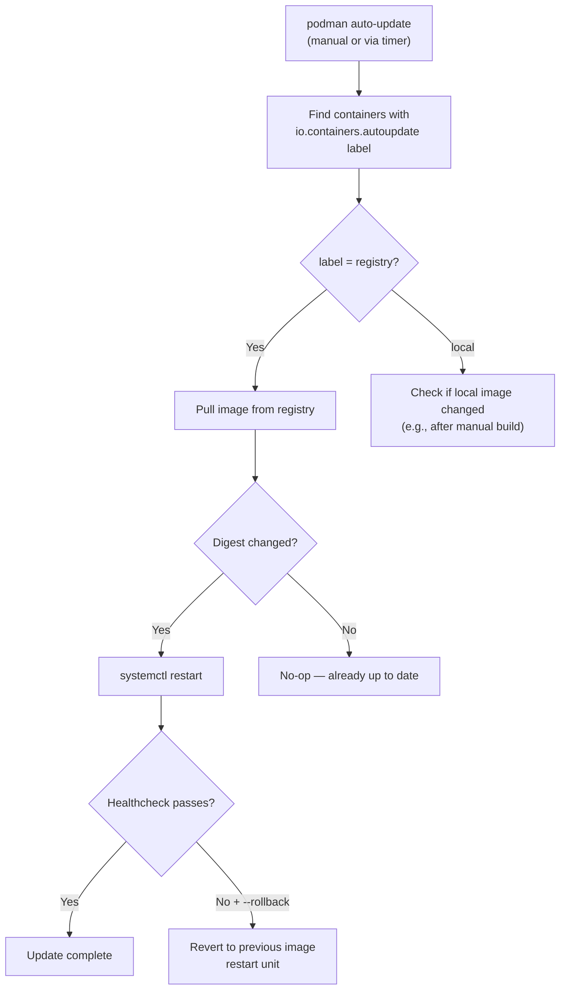
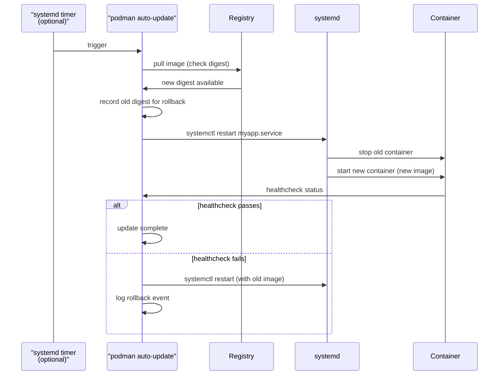
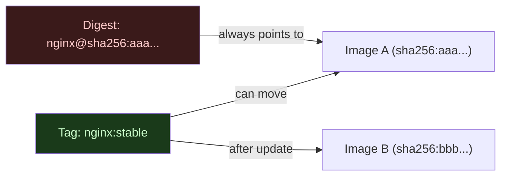
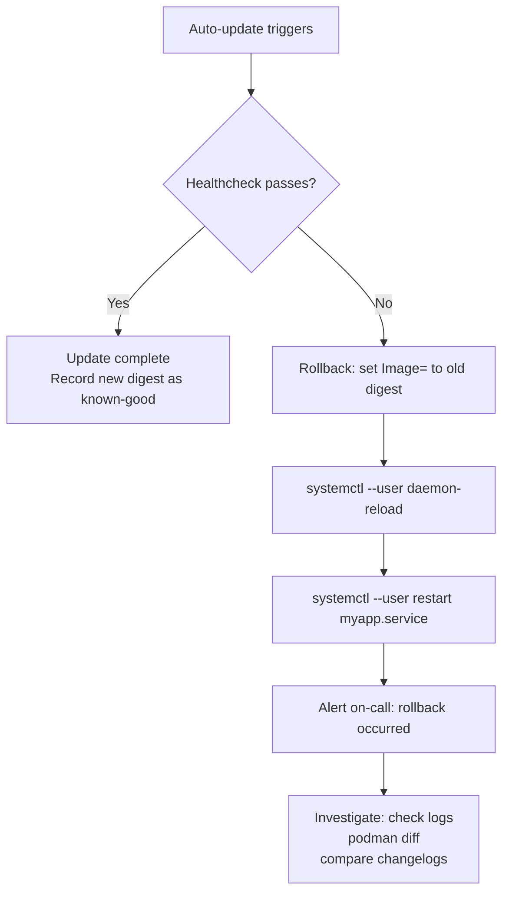

# Module 14: Maintenance and Auto-Updates
[](../LICENSE.md)
[](https://access.redhat.com/products/red-hat-enterprise-linux)
[](https://podman.io)

<a id="table-of-contents"></a>

## Table of Contents

- [Learning Goals](#learning-goals)
- [What Auto-Update Is](#what-auto-update-is)
- [How It Works — Internals](#how-it-works--internals)
- [Tags, Digests, and Policy](#tags-digests-and-policy)
- [The io.containers.autoupdate Label](#the-iocontainersautoupdate-label)
- [Lab: Enable Registry Auto-Update (Single Service)](#lab-enable-registry-auto-update-single-service)
- [Healthchecks and Auto-Rollback](#healthchecks-and-auto-rollback)
- [Automating Auto-Update with a systemd Timer](#automating-auto-update-with-a-systemd-timer)
- [Rollback Plan (Required If You Auto-Update)](#rollback-plan-required-if-you-auto-update)
- [Safe Rollout Rules](#safe-rollout-rules)
- [Routine Maintenance Tasks](#routine-maintenance-tasks)
- [Checkpoint](#checkpoint)
- [Quick Quiz](#quick-quiz)
- [Further Reading](#further-reading)

Auto-updates can be useful, but they are a policy decision — not a default.


[↑ Go to TOC](#table-of-contents)

## Learning Goals

- Explain what Podman auto-update does and what it does not do.
- Configure a Quadlet-managed container for registry-based auto-update.
- Understand the `io.containers.autoupdate` label and its values.
- Build a safe rollout + rollback plan.
- Understand when digest pinning is safer than tag-based auto-update.
- Know the routine maintenance tasks for a Podman host.


[↑ Go to TOC](#table-of-contents)

## What Auto-Update Is

`podman auto-update` is a command that:

1. Finds all running containers labeled with `io.containers.autoupdate`.
2. Checks if a newer image is available (by pulling from the registry).
3. If yes: restarts the systemd unit that manages the container.



What it **cannot** do by itself:

- Perform multi-step database migrations before restarting.
- Coordinate updates across multiple hosts simultaneously.
- Guarantee backward compatibility between versions.
- Drain connections before restarting.


[↑ Go to TOC](#table-of-contents)

## How It Works — Internals

When `podman auto-update` detects a new image and restarts a unit:

1. It pulls the new image and records the old image digest.
2. It calls `systemctl restart <unit>` — the unit stops the old container and starts a new one with the new image.
3. If the container has a healthcheck and the `--rollback` flag was passed (or the unit has `AutoUpdatePolicy=registry` with rollback configured), Podman waits for the healthcheck to pass.
4. If the healthcheck fails, it reverts to the old image and restarts.

The unit must be a Quadlet-generated service for this to work. Auto-update does not manage containers started with bare `podman run`.




[↑ Go to TOC](#table-of-contents)

## Tags, Digests, and Policy

Auto-update works with **tags** (mutable pointers like `:stable`, `:latest`, `:3.2`). Tags can move — `:stable` today may point to a different image tomorrow. This is what enables auto-update to detect changes.

Digest pinning (e.g., `@sha256:abc123...`) is **immutable** — it always refers to the exact same bytes. Auto-update cannot move a digest — there is nothing to update.



**Choose intentionally:**

| Strategy | Tag | Digest pinned |
|---|---|---|
| Always latest patch automatically | ✅ Use tag + auto-update | ❌ Cannot auto-update |
| Reproducible, audited upgrades | ❌ Tags drift | ✅ Explicit digest bump |
| Regulated environment | Only if you have monitoring + rollback | Default choice |
| Development server | Acceptable | Overkill |

In regulated or production environments, **digest pinning is the default**. Auto-update with tags is an operational choice that requires monitoring, rollback readiness, and health checks.


[↑ Go to TOC](#table-of-contents)

## The io.containers.autoupdate Label

For `podman auto-update` to manage a container, the container (or its image) must have the label:

```
io.containers.autoupdate=registry
```

In a Quadlet `.container` file, set it with:

```ini
[Container]
AutoUpdate=registry
```

This translates to `--label io.containers.autoupdate=registry` on the `podman run` command.

Possible values:

| Value | Behaviour |
|---|---|
| `registry` | Pull from registry, compare digest, restart if changed |
| `local` | Only check local image store — useful after a local `podman build` |
| (absent) | Container is ignored by `podman auto-update` |

For the `local` policy, this is useful when you build images locally with a CI step and want systemd to restart on a new local build.


[↑ Go to TOC](#table-of-contents)

## Lab: Enable Registry Auto-Update (Single Service)

Use the provided example unit:

- `examples/quadlet/autoupdate-nginx.container`

**Step 1: Install the unit:**

```bash
mkdir -p ~/.config/containers/systemd                                          # ensure path exists
cp examples/quadlet/autoupdate-nginx.container ~/.config/containers/systemd/  # install unit
systemctl --user daemon-reload                                                 # regenerate units
systemctl --user start autoupdate-nginx.service                                # start service
systemctl --user status autoupdate-nginx.service                               # verify running
```

**Step 2: Inspect the label on the running container:**

```bash
podman inspect systemd-autoupdate-nginx --format='{{index .Config.Labels "io.containers.autoupdate"}}'  # should print: registry
```

**Step 3: Trigger auto-update manually:**

```bash
podman auto-update  # check registry for updates, restart labeled units if changed
```

Expected output: shows which containers were checked and whether any were updated.

**Step 4: Trigger with verbose output:**

```bash
podman auto-update --dry-run  # show what WOULD be updated without actually restarting
```

**Step 5: Observe via journald:**

```bash
journalctl --user -u autoupdate-nginx.service -n 100 --no-pager  # view container logs and restarts
```

**Step 6: Check for a systemd timer (if available on your distro):**

```bash
systemctl --user list-unit-files | grep auto-update  # look for podman-auto-update.timer
```

If present, you can enable it to run auto-update on a schedule.

**Cleanup:**

```bash
systemctl --user stop autoupdate-nginx.service                                         # stop
rm -f ~/.config/containers/systemd/autoupdate-nginx.container                         # remove unit
systemctl --user daemon-reload                                                         # remove generated service
```


[↑ Go to TOC](#table-of-contents)

## Healthchecks and Auto-Rollback

Auto-update's rollback feature only works if:

1. The container has a healthcheck (`HEALTHCHECK` instruction in `Containerfile`, or `HealthCmd=` in the Quadlet unit).
2. The `podman auto-update` command is run with `--rollback` (or rollback is configured in the unit).

**Adding a healthcheck in a Quadlet unit:**

```ini
[Container]
Image=docker.io/library/nginx:stable
AutoUpdate=registry
HealthCmd=CMD-SHELL curl -f http://localhost/ || exit 1
HealthInterval=10s
HealthTimeout=3s
HealthRetries=3
HealthStartPeriod=5s
```

**Running auto-update with rollback:**

```bash
podman auto-update --rollback  # update and rollback automatically if healthcheck fails
```

If the new image starts but the healthcheck fails within the startup period, Podman reverts to the previous image and restarts the unit.

**Check rollback events:**

```bash
podman auto-update --rollback 2>&1  # stderr shows rollback events
journalctl --user -b -n 100 --no-pager | grep -i autoupdate  # look for auto-update log entries
```


[↑ Go to TOC](#table-of-contents)

## Automating Auto-Update with a systemd Timer

Rather than a cron job, use a systemd user timer. Create two files:

`~/.config/systemd/user/podman-auto-update.service`:

```ini
[Unit]
Description=Podman auto-update containers
Documentation=man:podman-auto-update(1)

[Service]
Type=oneshot
ExecStart=/usr/bin/podman auto-update --rollback
```

`~/.config/systemd/user/podman-auto-update.timer`:

```ini
[Unit]
Description=Podman auto-update timer

[Timer]
# Run at 3:00 AM daily:
OnCalendar=*-*-* 03:00:00
RandomizedDelaySec=600
Persistent=true

[Install]
WantedBy=timers.target
```

Enable and start:

```bash
mkdir -p ~/.config/systemd/user                              # ensure directory exists
# (write the files above)
systemctl --user daemon-reload                               # pick up new units
systemctl --user enable --now podman-auto-update.timer       # enable timer to start at boot
systemctl --user list-timers podman-auto-update.timer        # verify timer is scheduled
```

Note: on some distributions (Fedora, RHEL), Podman ships a pre-built `podman-auto-update.timer` you can simply enable. Check first:

```bash
systemctl --user list-unit-files | grep podman-auto-update  # check if pre-built timer exists
```


[↑ Go to TOC](#table-of-contents)

## Rollback Plan (Required If You Auto-Update)

**You must have a rollback plan before enabling auto-update in production.** This is not optional.

Minimum rollback plan:

1. **Record the previous working digest** before updating (or have a way to retrieve it from the registry).
2. **Pin and restart**: update the Quadlet unit with the previous digest and restart.
3. **Monitoring**: detect restart loops quickly (alert on `systemd unit restarted >3 times in 5 minutes`).



If you rely on tags (mutable), your rollback procedure needs to:

- Pin to the specific old digest (record it before the update).
- Or maintain a local image cache/registry with the previous version.

```bash
# Record the current digest BEFORE auto-update runs:
PREV=$(podman inspect --format='{{.Image}}' systemd-myapp)
echo "Rollback image: $PREV"   # save this somewhere

# To rollback manually:
# Edit unit: Image=docker.io/library/nginx@sha256:<PREV_DIGEST>
# Then:
systemctl --user daemon-reload && systemctl --user restart myapp.service
```


[↑ Go to TOC](#table-of-contents)

## Safe Rollout Rules

1. **Prefer digest-pinned images for production** unless you explicitly accept the risk of tag-based updates.
2. **Always have healthchecks** before enabling auto-update. Without them, a broken image will restart successfully and you won't know until users report errors.
3. **Test in staging first**: auto-update staging, verify, then allow production.
4. **Alert on restart loops**: a container restarting 5 times in 2 minutes is a signal.
5. **Coordinate with DB migrations**: if your update includes a DB schema migration, auto-update is not the right tool — use a controlled deploy.
6. **Document which services have auto-update enabled**: make it visible in your runbook.

Treat auto-update as an **operational feature**, not a convenience hack.


[↑ Go to TOC](#table-of-contents)

## Routine Maintenance Tasks

Beyond auto-update, here are the routine Podman maintenance tasks you should schedule:

**Prune unused images** (safe to run regularly — only removes images with no running containers):

```bash
podman image prune -f  # remove dangling (untagged) images
podman image prune -a -f  # remove ALL images not used by any container (more aggressive)
```

**Prune stopped containers:**

```bash
podman container prune -f  # remove all stopped containers
```

**Prune unused volumes** (⚠️ DATA LOSS — only run if you are sure):

```bash
podman volume prune -f  # remove volumes not used by any container
```

**Prune everything unused at once:**

```bash
podman system prune -f  # remove stopped containers, unused images, unused networks
podman system prune -a -f  # also removes unused volumes (destructive!)
```

**Check disk usage:**

```bash
podman system df  # show disk usage by images, containers, volumes
```

**Recommended maintenance schedule:**

| Task | Frequency | Risk |
|---|---|---|
| `podman image prune -f` | Weekly | Low |
| `podman container prune -f` | Daily | Low |
| `podman system df` | Weekly (just observing) | None |
| `podman auto-update` | Daily (if enabled) | Medium — requires rollback plan |
| `podman volume prune` | Manual only | High — DATA LOSS |


[↑ Go to TOC](#table-of-contents)

## Checkpoint

- You can explain what `podman auto-update` does and what it requires (Quadlet-managed + label).
- You can explain the difference between tag-based auto-update and digest pinning.
- You can enable auto-update for a single service using `AutoUpdate=registry` in a Quadlet unit.
- You can articulate a minimum rollback plan.
- You can set up a systemd timer to run auto-update on a schedule.
- You know the routine maintenance commands (`image prune`, `container prune`, `system df`).


[↑ Go to TOC](#table-of-contents)

## Quick Quiz

1) Why can auto-update increase risk for stateful services (e.g., a database)?

2) What must exist before you turn on auto-update in production?

3) You have `Image=docker.io/library/nginx@sha256:abc123` in your Quadlet unit. Will `podman auto-update` do anything? Why?

4) Auto-update runs but the new container immediately fails its healthcheck. What happens if you passed `--rollback`?

5) What is the difference between `podman image prune -f` and `podman image prune -a -f`?

6) A container is restarting every 30 seconds. How do you tell if this is caused by auto-update or a bad restart policy?


[↑ Go to TOC](#table-of-contents)

## Further Reading

- `podman-auto-update(1)`: https://docs.podman.io/en/latest/markdown/podman-auto-update.1.html
- systemd timers: https://www.freedesktop.org/software/systemd/man/latest/systemd.timer.html
- systemd service restart policies: https://www.freedesktop.org/software/systemd/man/latest/systemd.service.html
- `podman-system-prune(1)`: https://docs.podman.io/en/latest/markdown/podman-system-prune.1.html


[↑ Go to TOC](#table-of-contents)

© 2026 UncleJS — Licensed under CC BY-NC-SA 4.0
