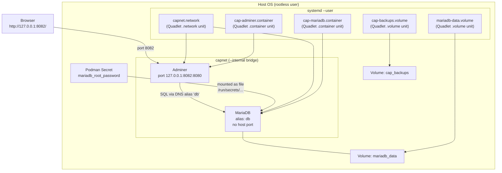
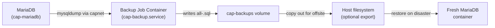
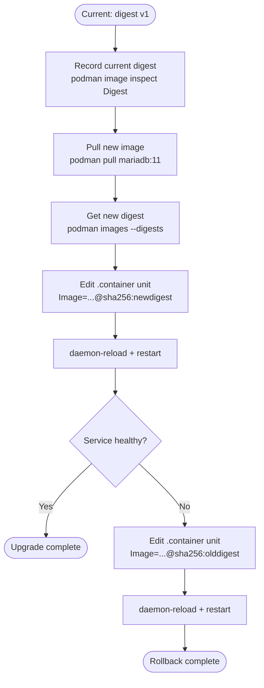
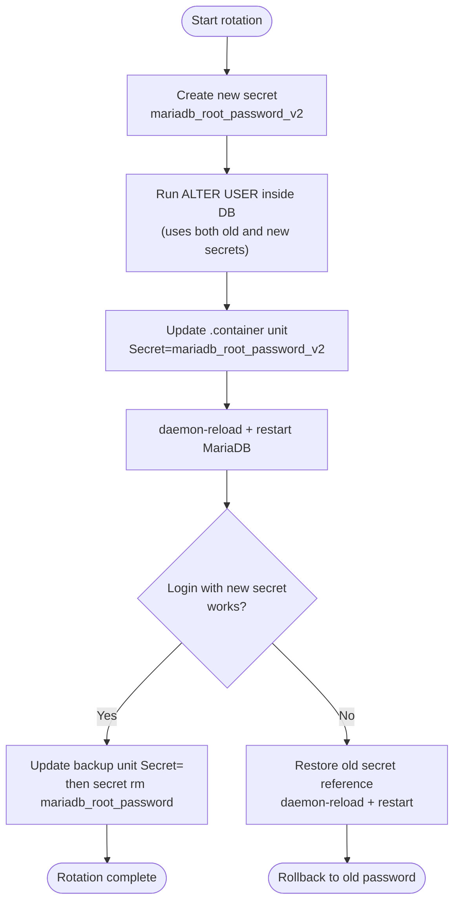

# Capstone: Reboot-Safe Local Stack with Secrets, Backups, and Upgrades
[](../LICENSE.md)
[](https://access.redhat.com/products/red-hat-enterprise-linux)
[](https://podman.io)

<a id="table-of-contents"></a>

## Table of Contents

- [Goal](#goal)
- [Reference Stack](#reference-stack)
- [Deliverables](#deliverables)
- [Architecture Overview](#architecture-overview)
- [Build It](#build-it)
- [First Data (Required)](#first-data-required)
- [Optional: Scheduled Backups](#optional-scheduled-backups)
- [Backup and Restore (Required)](#backup-and-restore-required)
- [Upgrade and Rollback (Required)](#upgrade-and-rollback-required)
- [Password Rotation (Required)](#password-rotation-required)
- [Operations Runbook](#operations-runbook)
- [Notes](#notes)
- [Checkpoint](#checkpoint)
- [Quick Quiz](#quick-quiz)
- [Further Reading](#further-reading)

This capstone focuses on **operational excellence**, not app development. You have all the individual skills — now wire them together into a production-grade pattern.

---


[↑ Go to TOC](#table-of-contents)

## Goal

Run a small stack as rootless systemd user services (Quadlet-first) that:

- survives reboot without manual intervention
- keeps state in named volumes (never in container layers)
- uses secrets as mounted files (never as environment variables)
- has a tested backup + restore flow
- has an upgrade + rollback flow using digest-pinned images

**Success criteria:**

- After a full system reboot, both services come back automatically.
- You can produce a backup file and prove you can restore it to a clean volume.
- You can upgrade MariaDB and Adminer versions with a documented rollback to previous digests.
- DB has **no published host ports**.


[↑ Go to TOC](#table-of-contents)

## Reference Stack

- **DB**: MariaDB 11 — stateful, password-protected, no published ports
- **UI**: Adminer — web DB admin, published to localhost only

This gives you a realistic stateful service without writing any application code. Every pattern here applies directly to production app stacks.


[↑ Go to TOC](#table-of-contents)

## Deliverables

At the end of this capstone you should have:

**Quadlet unit files (in `~/.config/containers/systemd/`):**
- `capnet.network` — private bridge, DNS enabled, internal
- `mariadb-data.volume` — persistent DB volume
- `cap-backups.volume` — backup output volume
- `cap-mariadb.container` — DB service, digest-pinned
- `cap-adminer.container` — UI service, digest-pinned
- `cap-backup.container` — backup job container (required; only the timer is optional)

**Written runbook covering:**
- First deploy procedure
- DB password rotation
- Manual backup + restore
- Upgrade procedure (change digest → reload → restart)
- Rollback procedure (restore previous digest → reload → restart)


[↑ Go to TOC](#table-of-contents)

## Architecture Overview



Key design decisions:
- The `capnet` network is `--internal`: DB cannot make outbound connections.
- The DB secret is a **Podman secret** mounted as a file — never passed as an env var.
- Both containers are managed by systemd with `WantedBy=default.target` for boot start.
- Adminer does not mount the secret. You type the password in the browser.
- The shipped units start on tags. The upgrade section records digests with `podman image inspect` and pins `Image=` before you change anything.


[↑ Go to TOC](#table-of-contents)

## Build It

Use the provided example units:

- `examples/quadlet/capnet.network`
- `examples/quadlet/mariadb-data.volume`
- `examples/quadlet/cap-backups.volume`
- `examples/quadlet/cap-mariadb.container`
- `examples/quadlet/cap-adminer.container`
- `examples/quadlet/cap-backup.container`

### Step 1 — Create the DB Root Password Secret

Choose a password without quotes or newlines to avoid shell/SQL escaping issues.

```bash
read -s -p 'MariaDB root password: ' P  # prompt for password input
printf '\n'  # print newline after silent input
printf '%s' "$P" | podman secret create mariadb_root_password -  # create secret from stdin
unset P  # clear password from shell memory
```

Verify the secret exists (value is never shown):

```bash
podman secret ls  # list secrets
```

### Step 2 — Install Quadlet Units

```bash
mkdir -p ~/.config/containers/systemd  # create Quadlet unit directory
cp examples/quadlet/capnet.network ~/.config/containers/systemd/  # copy network unit
cp examples/quadlet/mariadb-data.volume ~/.config/containers/systemd/  # copy DB volume unit
cp examples/quadlet/cap-backups.volume ~/.config/containers/systemd/  # copy backup volume unit
cp examples/quadlet/cap-mariadb.container ~/.config/containers/systemd/  # copy DB container unit
cp examples/quadlet/cap-adminer.container ~/.config/containers/systemd/  # copy UI container unit
cp examples/quadlet/cap-backup.container ~/.config/containers/systemd/  # required backup job
```

### Step 3 — Enable Linger (Boot Start Without Login)

```bash
sudo loginctl enable-linger "$USER"  # allow user services to start at boot without a login session
```

Verify:

```bash
loginctl show-user "$USER" | grep Linger  # should show Linger=yes
```

### Step 4 — Start Services

```bash
systemctl --user daemon-reload              # regenerate systemd units from Quadlet files
systemctl --user start cap-mariadb.service  # start DB first
systemctl --user start cap-adminer.service  # start UI
```

### Step 5 — Validate

Check service status:

```bash
systemctl --user status cap-mariadb.service  # DB status
systemctl --user status cap-adminer.service  # UI status
```

Adminer should be available at `http://127.0.0.1:8082/`

Verify DB has **no published host ports**:

```bash
podman port cap-mariadb || true  # expected: no output (no published ports)
```

Wait until MariaDB accepts connections, then test connectivity inside the stack:

```bash
podman run --rm --network capnet --secret mariadb_root_password \
  docker.io/library/mariadb:11 sh -lc '
    umask 077
    printf "[client]\nuser=root\npassword=%s\n" "$(cat /run/secrets/mariadb_root_password)" > /tmp/client.cnf
    for i in $(seq 1 60); do
      mysqladmin --defaults-extra-file=/tmp/client.cnf ping -h db --silent && exit 0
      sleep 2
    done
    echo "db did not accept connections" >&2
    exit 1
  '

podman run --rm --network capnet --secret mariadb_root_password \
  docker.io/library/mariadb:11 sh -lc \
  'umask 077; printf "[client]\nuser=root\npassword=%s\n" "$(cat /run/secrets/mariadb_root_password)" > /tmp/client.cnf; mysql --defaults-extra-file=/tmp/client.cnf -h db -u root -e "SHOW DATABASES;"'  # verify DB is reachable by DNS alias
```

Expected: list of databases including `information_schema`.


[↑ Go to TOC](#table-of-contents)

## First Data (Required)

Create test data so you have something meaningful to back up and restore.

```bash
podman run --rm --network capnet --secret mariadb_root_password \
  docker.io/library/mariadb:11 sh -lc \
  'umask 077; printf "[client]\nuser=root\npassword=%s\n" "$(cat /run/secrets/mariadb_root_password)" > /tmp/client.cnf; \
   mysql --defaults-extra-file=/tmp/client.cnf -h db -u root -e "
     CREATE DATABASE IF NOT EXISTS cap;
     CREATE TABLE IF NOT EXISTS cap.t1 (id INT PRIMARY KEY, label VARCHAR(80));
     INSERT IGNORE INTO cap.t1 VALUES (1, '"'"'first row'"'"');
     INSERT IGNORE INTO cap.t1 VALUES (2, '"'"'second row'"'"');
     SELECT * FROM cap.t1;
   "'  # create and populate test table
```

Expected: a two-row result set.


[↑ Go to TOC](#table-of-contents)

## Optional: Scheduled Backups

The backup **container** unit is installed in Build It. Only the timer is optional. A hand-written timer under `~/.config/systemd/user/` is a normal unit, so `systemctl enable` is correct for it. Quadlet container units are not enabled that way.

```bash
mkdir -p ~/.config/systemd/user
cp examples/systemd-user/cap-backup.timer ~/.config/systemd/user/
systemctl --user daemon-reload
systemctl --user enable --now cap-backup.timer
```

Run the required backup section once before you trust the timer. The timer runs daily; edit `OnCalendar=` to change that.


[↑ Go to TOC](#table-of-contents)

## Backup and Restore (Required)

### The Backup Lifecycle



### Backup (Manual)

Trigger a backup immediately:

```bash
systemctl --user start cap-backup.service  # run backup job
systemctl --user status cap-backup.service  # oneshot success is "inactive (dead)" with exit status 0
```

`inactive (dead)` after a successful oneshot is success. `RemainAfterExit` is unset so the timer can start the job again. A failed dump shows a non-zero exit in that status.

Find the newest backup file:

```bash
podman run --rm -v cap_backups:/backups docker.io/library/alpine:latest sh -lc 'ls -1t /backups | head -5'  # list newest backup files
```

Export a backup file to the host (optional):

```bash
BACKUP_FILE="all-$(date +%Y%m%d%H%M%S).sql"
podman run --rm -v cap_backups:/backups docker.io/library/alpine:latest \
  sh -lc "cat /backups/\$(ls -1t /backups | head -1)" > "/tmp/${BACKUP_FILE}"  # export backup to host
echo "Saved: /tmp/${BACKUP_FILE}"  # confirm export
```

### Restore (Manual)

Pick the backup file name from the list above, then restore:

```bash
BACKUP_FILE=all-<timestamp>.sql  # replace with actual filename

podman run --rm --network capnet -v cap_backups:/backups --secret mariadb_root_password \
  docker.io/library/mariadb:11 sh -lc \
  'umask 077; printf "[client]\nuser=root\npassword=%s\n" "$(cat /run/secrets/mariadb_root_password)" > /tmp/client.cnf; \
   mysql --defaults-extra-file=/tmp/client.cnf -h db -u root < "/backups/'"$BACKUP_FILE"'"'  # restore from backup file
```

Verify the data is present after restore:

```bash
podman run --rm --network capnet --secret mariadb_root_password \
  docker.io/library/mariadb:11 sh -lc \
  'umask 077; printf "[client]\nuser=root\npassword=%s\n" "$(cat /run/secrets/mariadb_root_password)" > /tmp/client.cnf; \
   mysql --defaults-extra-file=/tmp/client.cnf -h db -u root -e "SELECT * FROM cap.t1;"'  # verify restored data
```

### Testing Restore on a Clean Volume (Advanced)

For a true restore test, create a fresh volume, start a temporary DB on it, restore the backup, verify the data, then discard the test volume:

```bash
podman volume create cap-restore-test  # create a clean volume for restore testing

# Start a temporary DB on the clean volume
podman run -d --name test-db --network capnet \
  -v cap-restore-test:/var/lib/mysql \
  --secret mariadb_root_password \
  -e MARIADB_ROOT_PASSWORD_FILE=/run/secrets/mariadb_root_password \
  docker.io/library/mariadb:11  # start temporary test DB

podman run --rm --network capnet --secret mariadb_root_password \
  docker.io/library/mariadb:11 sh -lc '
    umask 077
    printf "[client]\nuser=root\npassword=%s\n" "$(cat /run/secrets/mariadb_root_password)" > /tmp/client.cnf
    for i in $(seq 1 60); do
      mysqladmin --defaults-extra-file=/tmp/client.cnf ping -h test-db --silent && exit 0
      sleep 2
    done
    echo "test-db did not accept connections" >&2
    exit 1
  '

# Restore the backup into test-db
BACKUP_FILE=all-<timestamp>.sql
podman run --rm --network capnet -v cap_backups:/backups --secret mariadb_root_password \
  docker.io/library/mariadb:11 sh -lc \
  'umask 077; printf "[client]\nuser=root\npassword=%s\n" "$(cat /run/secrets/mariadb_root_password)" > /tmp/client.cnf; \
   mysql --defaults-extra-file=/tmp/client.cnf -h test-db -u root < "/backups/'"$BACKUP_FILE"'"'  # restore into test DB

# Verify
podman run --rm --network capnet --secret mariadb_root_password \
  docker.io/library/mariadb:11 sh -lc \
  'umask 077; printf "[client]\nuser=root\npassword=%s\n" "$(cat /run/secrets/mariadb_root_password)" > /tmp/client.cnf; \
   mysql --defaults-extra-file=/tmp/client.cnf -h test-db -u root -e "SELECT * FROM cap.t1;"'  # verify test DB data

# Cleanup test resources
podman rm -f test-db  # remove test container
podman volume rm cap-restore-test  # remove test volume
```

This pattern is called **restore-to-alternate** and proves your backup is actually usable before you ever need it in production.


[↑ Go to TOC](#table-of-contents)

## Upgrade and Rollback (Required)

### The Upgrade/Rollback Lifecycle



### Record Current Image Digests (Before Any Upgrade)

`podman inspect` on the container prints the tag you started (`docker.io/library/mariadb:11`), not a manifest digest. Inspect the image:

```bash
DB_DIGEST=$(podman image inspect docker.io/library/mariadb:11 --format '{{.Digest}}')
UI_DIGEST=$(podman image inspect docker.io/library/adminer:4 --format '{{.Digest}}')
printf 'mariadb %s\nadminer %s\n' "$DB_DIGEST" "$UI_DIGEST" | tee /tmp/current-digests.txt
```

`{{.Digest}}` already includes the `sha256:` prefix. Do this before you change the tag.

### Pin by Digest in Quadlet Units

In your `.container` files, replace tag-based references with digest-pinned ones:

```ini
# Before (mutable tag — can change without warning)
Image=docker.io/library/mariadb:11

# After. Paste {{.Digest}} once. It already starts with sha256:.
Image=docker.io/library/mariadb@sha256:<hex>
```

Same change in `cap-adminer.container` for `docker.io/library/adminer`.

Then apply:

```bash
systemctl --user daemon-reload                # regenerate units after edits
systemctl --user restart cap-mariadb.service  # restart DB with new image
systemctl --user restart cap-adminer.service  # restart UI with new image
```

### Rollback

Simply restore the old digest values in the `.container` files and repeat the same two commands:

```bash
# Edit unit files to restore previous digests, then:
systemctl --user daemon-reload
systemctl --user restart cap-mariadb.service
systemctl --user restart cap-adminer.service
```

Verify the rollback:

```bash
podman image inspect docker.io/library/mariadb:11 --format '{{.Digest}}'  # tag digest; the unit line is the pin that rolled back
```


[↑ Go to TOC](#table-of-contents)

## Password Rotation (Required)

Password rotation is a two-phase operation: you change the password in the DB engine first, then update the secret reference, then restart the service. Never delete the old secret until the new one is proven.

### Rotation Flow



### Step 1 — Create New Secret

```bash
read -s -p 'New MariaDB root password: ' P  # prompt for new password
printf '\n'  # print newline
printf '%s' "$P" | podman secret create mariadb_root_password_v2 -  # create new versioned secret
unset P  # clear from memory
```

### Step 2 — Change the Password in MariaDB (While Old One Is Still Active)

```bash
podman run --rm --network capnet \
  --secret mariadb_root_password \
  --secret mariadb_root_password_v2 \
  docker.io/library/mariadb:11 sh -lc '
    umask 077
    printf "[client]\nuser=root\npassword=%s\n" "$(cat /run/secrets/mariadb_root_password)" > /tmp/client.cnf
    new=$(cat /run/secrets/mariadb_root_password_v2)
    mysql --defaults-extra-file=/tmp/client.cnf -h db -u root -e "ALTER USER \"root\"@\"%\" IDENTIFIED BY \"${new}\"; FLUSH PRIVILEGES;"
  '  # change password in DB using both old and new secrets
```

### Step 3 — Update Both Quadlet Units to Reference the New Secret

Edit `Secret=` in `cap-mariadb.container` and in `cap-backup.container` before you delete the old secret. The backup job still mounts `mariadb_root_password` until you change it.

```ini
# Old
Secret=mariadb_root_password

# New
Secret=mariadb_root_password_v2
```

### Step 4 — Reload and Restart

```bash
systemctl --user daemon-reload                # reload unit changes
systemctl --user restart cap-mariadb.service  # restart with new secret
```

The backup unit picks up `Secret=` on its next start. It is a oneshot, so you do not restart it now.

### Step 5 — Verify Login with New Secret

```bash
podman run --rm --network capnet --secret mariadb_root_password_v2 \
  docker.io/library/mariadb:11 sh -lc \
  'umask 077; printf "[client]\nuser=root\npassword=%s\n" "$(cat /run/secrets/mariadb_root_password_v2)" > /tmp/client.cnf; \
   mysql --defaults-extra-file=/tmp/client.cnf -h db -u root -e "SELECT 1;"'  # verify new password works
```

### Step 6 — Remove Old Secret Only After Verification

```bash
podman secret rm mariadb_root_password  # remove old secret after confirmed rotation
```


[↑ Go to TOC](#table-of-contents)

## Operations Runbook

Keep this as a living document for your stack. A runbook that is never tested is not a runbook.

| Operation | Commands | Validation |
|-----------|----------|------------|
| **First deploy** | Copy units, `systemctl --user daemon-reload`, `systemctl --user start` | `systemctl --user status`, `curl 127.0.0.1:8082` |
| **After reboot** | Automatic (linger + `WantedBy=default.target`) | `systemctl --user status`, check data |
| **Tail logs** | `journalctl --user -fu cap-mariadb.service` | — |
| **Manual backup** | `systemctl --user start cap-backup.service` | `ls` in `cap_backups` volume |
| **Restore backup** | See "Restore" section | `SELECT *` to confirm row count |
| **Upgrade image** | Edit digest in unit, `systemctl --user daemon-reload`, `systemctl --user restart` | `podman image inspect --format '{{.Digest}}'` |
| **Rollback image** | Restore old digest, `systemctl --user daemon-reload`, `systemctl --user restart` | unit `Image=` matches the saved digest |
| **Rotate password** | 6-step rotation procedure above | `mysql -u root` with new secret |
| **Full teardown** | `systemctl --user stop` + `podman volume rm` | — |


[↑ Go to TOC](#table-of-contents)

## Notes

- Password rotation often implies updating both the Podman secret and the DB user credentials in the correct order.
- Keep the old password available until the new one is verified.
- `WantedBy=default.target` (set in the `[Install]` section of `.container` units) is what causes systemd to auto-start the service on boot.
- The backup container uses `mysqldump` — it is a logical backup (SQL text). It is suitable for small-to-medium databases. For large databases, consider volume-level snapshots.
- Always test restore on a **separate volume** before you need it in an emergency.


[↑ Go to TOC](#table-of-contents)

## Checkpoint

You have completed the capstone when:

- [ ] `systemctl --user status cap-mariadb.service` shows `active (running)` after a reboot.
- [ ] `podman port cap-mariadb` returns nothing (no published host ports).
- [ ] You can produce a `.sql` backup file and restore it to a clean volume successfully.
- [ ] You can upgrade the MariaDB digest, verify the service works, and roll back to the previous digest.
- [ ] You have completed a full password rotation and confirmed login with the new password.


[↑ Go to TOC](#table-of-contents)

## Quick Quiz

1. Why is it important to test restore, not just backup?

2. What is the operational advantage of deploying by digest rather than by tag?

3. Why must you change the password inside MariaDB *before* updating the Quadlet unit during rotation?

4. What would happen if you deleted the old secret before verifying the new password works?

5. A teammate says "I'll back up the volume directory directly using `cp -r`." What problem might arise with this approach for a running database?


[↑ Go to TOC](#table-of-contents)

## Further Reading

- `podman-secret(1)`: https://docs.podman.io/en/latest/markdown/podman-secret.1.html
- Quadlet and Podman systemd integration: https://docs.podman.io/en/latest/markdown/podman-systemd.unit.5.html
- MariaDB logical backup (`mysqldump`): https://mariadb.com/kb/en/mysqldump/
- Adminer project docs: https://www.adminer.org/
- systemd timers: https://www.freedesktop.org/software/systemd/man/latest/systemd.timer.html
- `loginctl enable-linger`: https://www.freedesktop.org/software/systemd/man/latest/loginctl.html


[↑ Go to TOC](#table-of-contents)

© 2026 UncleJS — Licensed under CC BY-NC-SA 4.0
