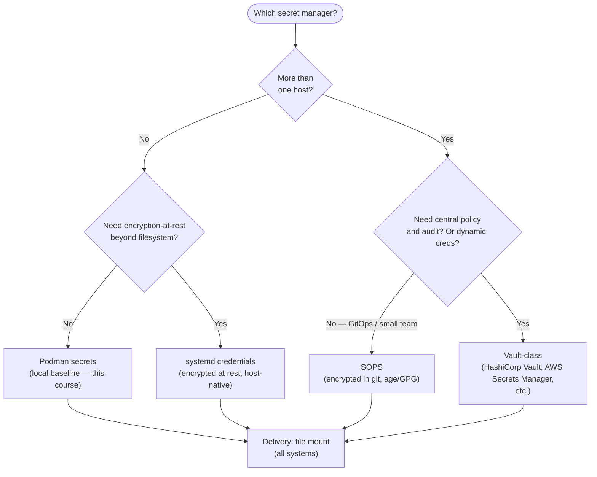
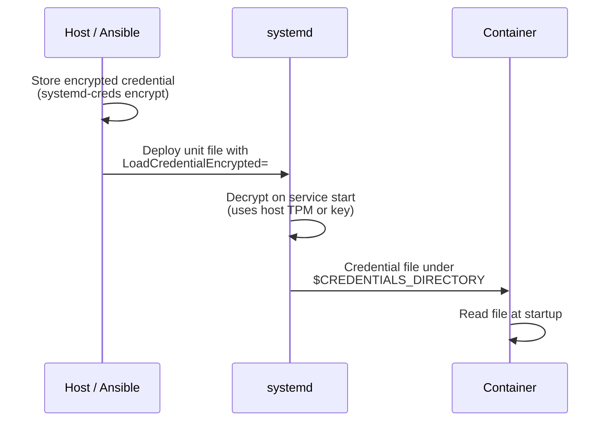
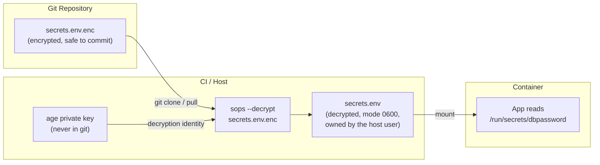
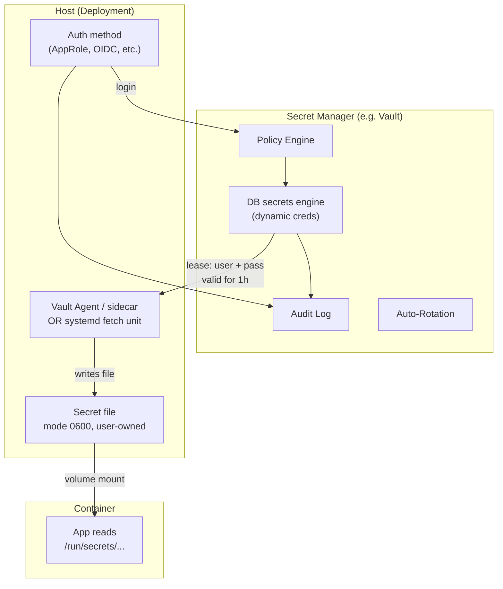
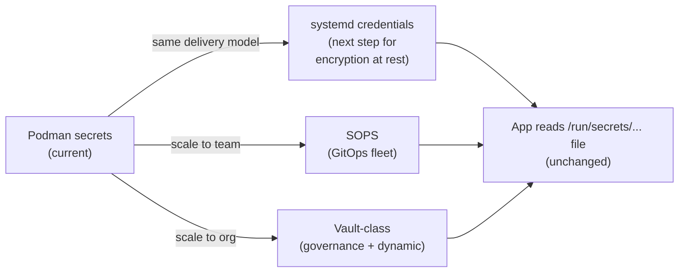

# External Secrets Survey (Thorough Intro, Optional Implementation)
[](../LICENSE.md)
[](https://access.redhat.com/products/red-hat-enterprise-linux)
[](https://podman.io)

<a id="table-of-contents"></a>

## Table of Contents

- [Why This Module Exists](#why-this-module-exists)
- [What You Are Optimizing For](#what-you-are-optimizing-for)
- [The Decision Tree](#the-decision-tree)
- [Option 1: systemd Credentials (Host-Native)](#option-1-systemd-credentials-host-native)
- [Option 2: SOPS (GitOps-Friendly Encrypted Files)](#option-2-sops-gitops-friendly-encrypted-files)
- [Option 3: Vault-Class Secret Managers (Centralized)](#option-3-vault-class-secret-managers-centralized)
- [Comparison Table](#comparison-table)
- [What Does Not Change](#what-does-not-change)
- [Migration Path from Podman Secrets](#migration-path-from-podman-secrets)
- [Anti-Patterns to Avoid](#anti-patterns-to-avoid)
- [Checkpoint](#checkpoint)
- [Quick Quiz](#quick-quiz)
- [Further Reading](#further-reading)

Podman secrets are a good local-first baseline. But most teams eventually need one or more of:

- encryption-at-rest on the host
- multi-host distribution
- automated rotation
- auditing and access policy

This module teaches the landscape so you can choose an external approach confidently. It is intentionally **not** a single "do this" recipe — external secrets are an architecture and operations decision.

---


[↑ Go to TOC](#table-of-contents)

## Why This Module Exists

When you move from a single dev machine to production, the question is no longer _"how do I use a secret?"_ but _"how do I get the secret onto the host, keep it fresh, and revoke it when needed?"_

Podman secrets (`podman secret create`) answer the first question. They do **not** answer:

- How does a brand new host get the secret material?
- How does a secret get rotated across 10 hosts automatically?
- Who approved this secret being read by this service?
- Was there an unauthorized read of this secret last Tuesday?

This module surveys three families of answers. You apply the right one for your context.

---


[↑ Go to TOC](#table-of-contents)

## What You Are Optimizing For

Use this checklist before choosing a system:

**Scale and distribution:**
- How many hosts need the secret?
- Does it need to rotate without touching every host manually?

**Policy and governance:**
- Who/what is allowed to read the secret (policy)?
- Do you need audit logs of every read?
- How do you revoke access?

**Availability and bootstrapping:**
- What happens when the secrets system is down during a deploy or reboot?
- How does a brand new host bootstrap its ability to decrypt/fetch?
- How do you handle break-glass scenarios (on-call, secrets system itself is broken)?

**Credential type:**
- Static long-lived secret (database password, API key) — any system works.
- Dynamic short-lived credential (Vault-leased DB creds) — requires a Vault-class system.

---


[↑ Go to TOC](#table-of-contents)

## The Decision Tree



All paths converge on the same delivery model: **a file** the container reads at runtime. This keeps your application code unchanged regardless of which secrets backend you use.

---


[↑ Go to TOC](#table-of-contents)

## Option 1: systemd Credentials (Host-Native)

### What It Is

systemd can provision credentials to services as files at runtime. Credentials can be stored **encrypted at rest** on the host and are decrypted by systemd when the service starts.

### How It Fits This Course

The production baseline already uses systemd user services (Quadlet-first). systemd credentials are a natural next step:

- Delivery model: a file under `$CREDENTIALS_DIRECTORY`. For a user service that is typically `/run/user/$UID/credentials/<unit>/dbpassword`. `/run/credentials/<unit>/` is the system-service path.
- Container consumes: a volume mount or `--secret` pointing to that path
- Application code: unchanged — it still reads a file

### Typical Pattern



### Operational Notes

- Works entirely within the systemd + Podman stack — no extra services needed.
- Policy is: "who can run this systemd service on this host".
- You still need a story for distributing the encrypted credential material to new hosts (typically via your config management tool: Ansible, Salt, etc.).
- Encryption uses the host's TPM or a host-derived key — decryption only works on the provisioned host.

### When to Choose It

- Single host or small fleet you manage directly.
- You want minimal moving parts (no extra services to run).
- You already use systemd for everything.


[↑ Go to TOC](#table-of-contents)

## Option 2: SOPS (GitOps-Friendly Encrypted Files)

### What It Is

SOPS (Secrets OPerationS) lets you store **encrypted secrets in git**. The secret file is committed to your repository in encrypted form. Decryption happens on the host (or in CI) using an identity: an `age` key, a GPG key, or a cloud KMS key.

### Architecture



### Benefits

- **Change history**: every secret rotation is a git commit with author and timestamp.
- **Reviews**: secret changes can go through pull requests.
- **Bootstrapping**: provisioning a new host means deploying its age key (or granting KMS access).

### Tradeoffs

- Rotation is a manual process: edit, encrypt, commit, deploy.
- You must carefully secure decryption keys — if an age key leaks, all secrets encrypted to it are compromised.
- Not suitable for dynamic/leased credentials (see Option 3).

### Best-Fit Pattern with Containers

```bash
# Decrypt to a user-owned file. A rootless user cannot create /run/secrets.
umask 077
sops --decrypt secrets/db.yaml > ./dbpassword.txt
podman secret create dbpassword ./dbpassword.txt
rm -f ./dbpassword.txt

# --secret looks up a Podman secret by name. It does not mount that host path.
podman run --rm --secret dbpassword docker.io/library/busybox:latest \
  sh -lc 'test -f /run/secrets/dbpassword && echo mounted'
```

The alternative is a read-only bind of the mode `0600` file, with `:Z` when SELinux is enforcing. This survey does not turn that into a SOPS lab. Podman secret mounts default to mode `0444` and container UID 0, which is your host user under rootless.

Never persist decrypted files into images or build contexts.


[↑ Go to TOC](#table-of-contents)

## Option 3: Vault-Class Secret Managers (Centralized)

### What It Is

A centralized secret manager — HashiCorp Vault, AWS Secrets Manager, GCP Secret Manager, Azure Key Vault, Infisical, etc. — provides:

- Central policy and auth (who is allowed to read what)
- Audit logs (who read what and when)
- Automated rotation (the manager rotates DB passwords, API keys on a schedule)
- **Dynamic credentials** (leased credentials that expire automatically)

### Architecture



### Benefits

- Strong governance: every read is audited, every identity is explicit.
- Short-lived credentials reduce blast radius when a secret leaks.
- Scales to hundreds of services and multiple teams.

### Costs

- **Operational overhead**: Vault is another service to run, maintain, back up, and HA-ize.
- **Availability dependency**: if Vault is unreachable at boot, services that need a fresh credential cannot start. You must design for this.
- **Bootstrap complexity**: how does the first container on a fresh host authenticate to Vault?

### Recommended Bridge Patterns for Containers

Do not call Vault from inside your app. Instead:

1. **Sidecar/agent writes a file**: a `vault-agent` container shares a volume with your app; it writes the secret to a file; your app reads the file.
2. **systemd fetch unit**: a systemd `ExecStartPre=` step fetches the secret and writes it to a protected tmpfs path before the container starts.

Both approaches keep the delivery model consistent: **the container reads a file**.

### When to Choose It

- Multiple teams sharing secrets infrastructure.
- Compliance requirements (audit every read, enforce rotation policies).
- Dynamic credentials (DB leases, ephemeral API tokens).


[↑ Go to TOC](#table-of-contents)

## Comparison Table

| Dimension | Podman Secrets | systemd Credentials | SOPS | Vault-class |
|-----------|---------------|---------------------|------|-------------|
| **Encryption at rest** | No (base64 on disk) | Yes (TPM/host key) | Yes (age/GPG/KMS) | Yes (seal and storage backend) |
| **Multi-host** | No | Needs config management | Yes (git) | Yes (native) |
| **Audit logs** | No | No | Git history of changes, not of reads | Yes (full) |
| **Auto rotation** | No | No | Manual | Yes |
| **Dynamic creds** | No | No | No | Yes |
| **Operational cost** | Minimal | Low | Low-medium | High |
| **Bootstrap story** | Manual | Config management | Key distribution | Auth method |
| **Best fit** | Dev / single host | Single host + systemd | Small-medium fleet, GitOps | Org-scale / compliance |

---


[↑ Go to TOC](#table-of-contents)

## What Does Not Change

**Regardless of which external system you choose**, the container interface stays the same:

1. The secret arrives on the host as a **file** (decrypted, mode `0600`, owned by the user who runs rootless Podman).
2. The container reads it via a **mount** or Podman `--secret` (which is itself a file mount).
3. The application code reads a file path — it does not know or care which backend provided it.

This is the most important design insight in this module:

> **Standardize on file delivery. Swap the backend without changing application code.**

---


[↑ Go to TOC](#table-of-contents)

## Migration Path from Podman Secrets

If you start with Podman secrets (local-first, this course) and later need to migrate:



Clean migration path:
1. External manager writes/refreshes a **file** to a well-known path.
2. Your `.container` unit mounts that file (or the directory containing it).
3. The service consumes it as it always has.

This avoids rewriting applications that already expect file-based secrets.

---


[↑ Go to TOC](#table-of-contents)

## Anti-Patterns to Avoid

These are the most common secret management mistakes, regardless of which system you use:

| Anti-pattern | Why it is dangerous | Correct alternative |
|---|---|---|
| Secret in `ENV` in Containerfile | Baked into image layers, visible in `history` | Runtime file mount |
| Secret in `-e MY_SECRET=value` on CLI | Visible in process list and shell history | Podman `--secret`, type=mount |
| Secret in `.env` committed to git | Leaked to anyone with repo access | SOPS-encrypted file or git-ignored |
| Base64-encoded "secret" | Base64 is encoding, not encryption — trivial to decode | Actual encryption at rest |
| App reads `$SECRET_ENV_VAR` | Env vars can leak via `/proc`, subprocesses, logs | File read via explicit path |
| Deleting old secret before verifying new | Locks you out if new secret is wrong | Keep both during rotation window |

---


[↑ Go to TOC](#table-of-contents)

## Checkpoint

You should be able to:

- Explain the tradeoffs between systemd credentials, SOPS, and Vault-class secret managers in one paragraph each.
- Describe a bootstrap story for a new host under each approach (how it gets the ability to decrypt/fetch).
- Describe a file-based delivery pattern that keeps application code unchanged across all backends.
- Identify at least three anti-patterns and explain why they are dangerous.
- Choose the right option given a simple scenario: single host, small fleet with GitOps, compliance-heavy org.


[↑ Go to TOC](#table-of-contents)

## Quick Quiz

1. In one sentence: why is base64 not encryption?

2. What question best distinguishes SOPS-style encrypted files from Vault-style leased secrets?

3. A teammate proposes storing the age private key in the git repo alongside the SOPS-encrypted secrets. What is wrong with this?

4. You are using Vault for dynamic DB credentials. The credential has a 1-hour lease. The container has been running for 2 hours without renewal. What happens, and how should you handle lease renewal?

5. A new engineer says: "I'll just pass all secrets as environment variables — it's simpler." Name three specific ways this can lead to a secret leak.


[↑ Go to TOC](#table-of-contents)

## Further Reading

- systemd credentials (service-provisioned files): https://www.freedesktop.org/software/systemd/man/latest/systemd.exec.html#Credentials
- `systemd-creds` man page: https://www.freedesktop.org/software/systemd/man/latest/systemd-creds.html
- Mozilla SOPS: https://github.com/getsops/sops
- age (file encryption tool often used with SOPS): https://github.com/FiloSottile/age
- HashiCorp Vault: https://www.vaultproject.io/
- Vault Agent for file-based delivery: https://developer.hashicorp.com/vault/docs/agent-and-proxy/agent
- Infisical (open-source Vault alternative): https://infisical.com/
- Kubernetes Secrets (baseline for comparison): https://kubernetes.io/docs/concepts/configuration/secret/


[↑ Go to TOC](#table-of-contents)

© 2026 UncleJS — Licensed under CC BY-NC-SA 4.0
